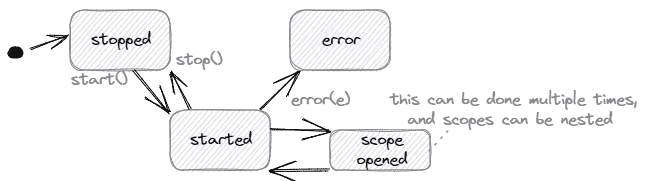
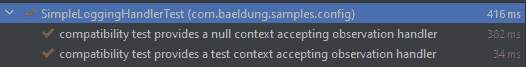

# Spring Boot 3 的可观测性

> 原文:[https://web . archive . org/web/20220930061024/https://www . bael dung . com/spring-boot-3-observability](https://web.archive.org/web/20220930061024/https://www.baeldung.com/spring-boot-3-observability)

## 1.概观

在这篇文章中，我们将学习如何配置 Spring Boot 3 的可观测性。**可观测性是仅通过外部输出测量系统内部状态的能力**。(日志、度量和跟踪)我们可以在[“分布式系统中的可观察性”](/web/20221231082811/https://www.baeldung.com/distributed-systems-observability)中了解基础知识。此外，我们必须意识到 Spring Boot 新协议和新协议之间有重大变化。

我们将只捕捉 Spring Boot 3 号的细节。在从 Spring Boot 2 迁移的情况下，我们可以找到[详细说明](https://web.archive.org/web/20221231082811/https://github.com/micrometer-metrics/micrometer/wiki/Migrating-to-new-1.10.0-Observation-API)。

## 2.千分尺观察 API

[Micrometer](https://web.archive.org/web/20221231082811/https://micrometer.io/) 是一个提供厂商中立的应用度量门面的项目。它定义了[概念，如计量器、速率聚合、计数器、计量器和定时器](https://web.archive.org/web/20221231082811/https://micrometer.io/docs/concepts)，每个供应商都可以根据自己的概念和工具进行调整。一个核心部分是[观察 API](https://web.archive.org/web/20221231082811/https://micrometer.io/docs/observation) ，它允许对代码进行一次检测，并且有多种好处。

它是作为 Spring 框架的几个部分的依赖项包含进来的，所以我们需要知道这个 API 来理解观察在 Spring Boot 是如何工作的。我们可以用一个简单的例子来说明。

### 2.1.`Observation` 和`ObservationRegistry`

从[dictionary.com](https://web.archive.org/web/20221231082811/https://www.dictionary.com/browse/observation)开始，观察是“为了某种科学或其他特殊目的，观察或记录一个事实或事件的行为或实例”。在我们的代码中，我们可以观察单个操作或完整的 HTTP 请求处理。在这些观察中，我们可以进行测量，为分布式跟踪创建跨度，或者只是记录附加信息。

为了创建一个观察，我们需要一个`ObservationRegistry`。

```
ObservationRegistry observationRegistry = ObservationRegistry.create();
Observation observation = Observation.createNotStarted("sample", observationRegistry);
```

观察的生命周期非常简单，如下图所示:



我们可以这样使用`Observation`类型:

```
observation.start();
try (Observation.Scope scope = observation.openScope()) {
    // ... the observed action
} catch (Exception e) {
    observation.error(e);
    // further exception handling
} finally {
    observation.stop();
}
```

或者只是

```
observation.observe(() -> {
    // ... the observed action
});
```

### 2.2.`ObservationHandler`

数据收集代码实现为一个`ObservationHandler`。这个处理程序得到关于`Observation`的生命周期事件的通知，因此提供回调方法。可以这样实现一个简单的处理程序，它只是打印出事件:

```
public class SimpleLoggingHandler implements ObservationHandler<Observation.Context> {

    private static final Logger log = LoggerFactory.getLogger(SimpleLoggingHandler.class);

    @Override
    public boolean supportsContext(Observation.Context context) {
        return true;
    }

    @Override
    public void onStart(Observation.Context context) {
        log.info("Starting");
    }

    @Override
    public void onScopeOpened(Observation.Context context) {
        log.info("Scope opened");
    }

    @Override
    public void onScopeClosed(Observation.Context context) {
        log.info("Scope closed");
    }

    @Override
    public void onStop(Observation.Context context) {
        log.info("Stopping");
    }

    @Override
    public void onError(Observation.Context context) {
        log.info("Error");
    }
}
```

然后，在创建`Observation:`之前，我们在`ObservationRegistry`注册`ObservationHandler`

```
observationRegistry
  .observationConfig()
  .observationHandler(new SimpleLoggingHandler());
```

对于简单的日志记录，已经有了一个实现。例如，为了简单地将事件记录到控制台，我们可以使用:

```
observationRegistry
  .observationConfig()
  .observationHandler(new ObservationTextPublisher(System.out::println));
```

要使用定时器样本和计数器，我们可以这样配置:

```
MeterRegistry meterRegistry = new SimpleMeterRegistry();
observationRegistry
  .observationConfig()
  .observationHandler(new DefaultMeterObservationHandler(meterRegistry));

// ... observe using Observation with name "sample"

// fetch maximum duration of the named observation
Optional<Double> maximumDuration = meterRegistry.getMeters().stream()
  .filter(m -> "sample".equals(m.getId().getName()))
  .flatMap(m -> StreamSupport.stream(m.measure().spliterator(), false))
  .filter(ms -> ms.getStatistic() == Statistic.MAX)
  .findFirst()
  .map(Measurement::getValue); 
```

## 3.弹簧集成

### 3.1.执行机构

我们在 Spring Boot 应用中获得了与[致动器](/web/20221231082811/https://www.baeldung.com/spring-boot-actuators)相关性的最佳集成:

```
<dependency>
    <groupId>org.springframework.boot</groupId>
    <artifactId>spring-boot-starter-actuator</artifactId>
</dependency>
```

它包含一个`ObservationAutoConfiguratio` n，提供一个`ObservationRegistry`的可注入实例(如果它还不存在的话)，并配置`ObservationHandlers`来收集度量和跟踪。

例如，我们可以使用注册表在服务中创建自定义观察:

```
@Service
public class GreetingService {

    private ObservationRegistry observationRegistry;

    // constructor

    public String sayHello() {
        return Observation
          .createNotStarted("greetingService", observationRegistry)
          .observe(this::sayHelloNoObs);
    }

    private String sayHelloNoObs() {
        return "Hello World!";
    }
}
```

此外，它在`ObservationRegistry`处注册`ObservationHandler`bean。我们只需要提供 beans:

```
@Configuration
public class ObservationTextPublisherConfiguration {

    private static final Logger log = LoggerFactory.getLogger(ObservationTextPublisherConfiguration.class);

    @Bean
    public ObservationHandler<Observation.Context> observationTextPublisher() {
        return new ObservationTextPublisher(log::info);
    }
}
```

### 3.2.网

对于 MVC 和 WebFlux，有一些过滤器可用于 HTTP 服务器观察:

*   `org.springframework.web.filter.ServerHttpObservationFilter`对于 Spring MVC
*   `org.springframework.web.filter.reactive.ServerHttpObservationFilter`对于 WebFlux

当 Actuator 是我们的应用程序的一部分时，这些过滤器已经注册并处于活动状态。如果没有，我们需要配置它们:

```
@Configuration
public class ObservationFilterConfiguration {

    // if an ObservationRegistry is configured
    @ConditionalOnBean(ObservationRegistry.class)
    // if we do not use Actuator
    @ConditionalOnMissingBean(ServerHttpObservationFilter.class)
    @Bean
    public ServerHttpObservationFilter observationFilter(ObservationRegistry registry) {
        return new ServerHttpObservationFilter(registry);
    }
}
```

我们可以在[文档](https://web.archive.org/web/20221231082811/https://github.com/spring-projects/spring-framework/wiki/What%27s-New-in-Spring-Framework-6.x#observability)中找到关于 Spring Web 中可观察性集成的更多细节。

### 3.3.面向切面编程

Micrometer Observation API 还用基于 AspectJ 的方面实现声明了一个`@Observed`注释。为了完成这项工作，我们需要将 AOP 依赖性添加到我们的项目中:

```
<dependency>
    <groupId>org.springframework.boot</groupId>
    <artifactId>spring-boot-starter-aop</artifactId>
</dependency>
```

然后，我们将方面实现注册为一个 Spring 管理的 bean:

```
@Configuration
public class ObservedAspectConfiguration {

    @Bean
    public ObservedAspect observedAspect(ObservationRegistry observationRegistry) {
        return new ObservedAspect(observationRegistry);
    }
}
```

现在，我们不用在代码中创建一个`Observation`，而是简单地写下`GreetingService`:

```
@Observed(name = "greetingService")
@Service
public class GreetingService {

    public String sayHello() {
        return "Hello World!";
    }
} 
```

结合 Actuator，我们可以使用`http://localhost:8080/actuator/metrics/greetingService`读取预先配置的指标(在我们至少调用服务一次之后),并将得到如下结果:

```
{
    "name": "greetingService",
    "baseUnit": "seconds",
    "measurements": [
        {
            "statistic": "COUNT",
            "value": 15
        },
        {
            "statistic": "TOTAL_TIME",
            "value": 0.0237577
        },
        {
            "statistic": "MAX",
            "value": 0.0035475
        }
    ],
    ...
}
```

## 4.测试观察

千分尺可观察性 API 提供了一个允许编写测试的模块。为此，我们需要添加这种依赖性:

```
<dependency>
    <groupId>io.micrometer</groupId>
    <artifactId>micrometer-observation-test</artifactId>
    <scope>test</scope>
</dependency>
```

`micrometer-bom`是 Spring Boot 托管依赖项的一部分，所以我们不需要指定任何版本。

因为整个可观察性自动配置在默认情况下对于测试是禁用的，所以每当我们想要测试默认观察时，我们需要使用`@AutoConfigureObservability`来重新启用它。

### 4.1.`TestObservationRegistry`

我们可以使用允许基于 AssertJ 的断言的`TestObservationRegistry`。因此，我们必须用`TestObservationRegistry`实例替换已经在上下文中的`ObservationRegistry`。

所以，举例来说，如果我们想测试`GreetingService`的观测值，我们可以使用这个测试设置:

```
@ExtendWith(SpringExtension.class)
@ComponentScan(basePackageClasses = GreetingService.class)
@EnableAutoConfiguration
@Import(ObservedAspectConfiguration.class)
@AutoConfigureObservability
class GreetingServiceObservationTest {

    @Autowired
    GreetingService service;
    @Autowired
    TestObservationRegistry registry;

    @TestConfiguration
    static class ObservationTestConfiguration {

        @Bean
        TestObservationRegistry observationRegistry() {
            return TestObservationRegistry.create();
        }
    }

    // ...
}
```

我们还可以使用 JUnit 元注释对此进行配置:

```
@Documented
@Inherited
@Retention(RetentionPolicy.RUNTIME)
@Target(ElementType.TYPE)
@Import({
  ObservedAspectConfiguration.class,
  EnableTestObservation.ObservationTestConfiguration.class
})
@AutoConfigureObservability
public @interface EnableTestObservation {

    @TestConfiguration
    class ObservationTestConfiguration {

        @Bean
        TestObservationRegistry observationRegistry() {
            return TestObservationRegistry.create();
        }
    }
}
```

然后，我们只需要向我们的测试类添加注释:

```
@ExtendWith(SpringExtension.class)
@ComponentScan(basePackageClasses = GreetingService.class)
@EnableAutoConfiguration
@EnableTestObservation
class GreetingServiceObservationTest {

    @Autowired
    GreetingService service;
    @Autowired
    TestObservationRegistry registry;

    // ...
}
```

然后，我们可以调用服务并检查观察是否完成:

```
import static io.micrometer.observation.tck.TestObservationRegistryAssert.assertThat;

// ...

@Test
void testObservation() {
    // invoke service
    service.sayHello();
    assertThat(registry)
      .hasObservationWithNameEqualTo("greetingService")
      .that()
      .hasBeenStarted()
      .hasBeenStopped();
}
```

### 4.2.观察处理器兼容性套件

为了测试我们的`ObservationHandler`实现，我们可以在测试中继承几个基类(所谓的`Compatibility Kits`):

*   `NullContextObservationHandlerCompatibilityKit`测试观察处理器在`null`值参数的情况下是否正常工作。
*   在未指定测试上下文参数的情况下，测试观察处理程序是否正常工作。这也包括了`NullContextObservationHandlerCompatibilityKit`。
*   测试观察处理器在测试上下文的情况下是否能正常工作。

实现很简单:

```
public class SimpleLoggingHandlerTest
  extends AnyContextObservationHandlerCompatibilityKit {

    SimpleLoggingHandler handler = new SimpleLoggingHandler();

    @Override
    public ObservationHandler<Observation.Context> handler() {
        return handler;
    }
} 
```

这将导致以下输出:



## 5.千分尺跟踪

从前的 Spring Cloud Sleuth 项目已经移动到微米，核心从 Spring Boot 3 开始到微米追踪。我们可以在[文档](https://web.archive.org/web/20221231082811/https://micrometer.io/docs/tracing)中找到测微计跟踪的定义:

> `Micrometer Tracing provides a simple facade for the most popular tracer libraries, letting you instrument your JVM-based application code without vendor lock-in. It is designed to add little to no overhead to your tracing collection activity while maximizing the portability of your tracing effort.`

我们可以单独使用它，但是它也可以通过提供`ObservationHandler`扩展与观察 API 集成。

### 5.1.集成到观察 API 中

要使用测微计跟踪，我们需要将以下依赖项添加到我们的项目中——该版本由 Spring Boot 管理:

```
<dependency>
    <groupId>io.micrometer</groupId>
    <artifactId>micrometer-tracing</artifactId>
</dependency>
```

然后，我们需要一个[支持的跟踪器](https://web.archive.org/web/20221231082811/https://micrometer.io/docs/tracing#_supported_tracers)(目前是 [OpenZipkin Brave](https://web.archive.org/web/20221231082811/https://github.com/openzipkin/brave) 或 [OpenTelemetry](https://web.archive.org/web/20221231082811/https://opentelemetry.io/) )。然后，我们必须将特定于供应商的依赖项添加到微米跟踪中:

```
<dependency>
    <groupId>io.micrometer</groupId>
    <artifactId>micrometer-tracing-bridge-brave</artifactId>
</dependency>
```

或者

```
<dependency>
    <groupId>io.micrometer</groupId>
    <artifactId>micrometer-tracing-bridge-otel</artifactId>
</dependency>
```

**Spring Actuator 对两个跟踪器**进行自动配置，即它注册供应商特定的对象和千分尺跟踪`ObservationHandler`实现，将这些对象委托给应用程序上下文。因此，不需要进一步的配置步骤。

### 5.2.测试支持

出于测试目的，我们需要将以下依赖项添加到我们的项目中——该版本由 Spring Boot 管理:

```
<dependency>
    <groupId>io.micrometer</groupId>
    <artifactId>micrometer-tracing-test</artifactId>
    <scope>test</scope>
</dependency>
```

然后，我们可以使用`SimpleTracer`类在测试期间收集和验证跟踪数据。为了让它工作，我们在应用程序上下文中用`SimpleTracer`替换了最初的、特定于供应商的`Tracer`。我们还必须记住使用`@AutoConfigureObservability`来启用跟踪的自动配置。

因此，跟踪的最小测试配置如下所示:

```
@ExtendWith(SpringExtension.class)
@EnableAutoConfiguration
@AutoConfigureObservability
public class GreetingServiceTracingTest {

    @TestConfiguration
    static class ObservationTestConfiguration {
        @Bean
        TestObservationRegistry observationRegistry() {
            return TestObservationRegistry.create();
        }
        @Bean
        SimpleTracer simpleTracer() {
            return new SimpleTracer();
        }
    }

    @Test
    void shouldTrace() {
        // test
    }
}
```

或者，在使用 JUnit 元注释的情况下:

```
@Documented
@Inherited
@Retention(RetentionPolicy.RUNTIME)
@Target(ElementType.TYPE)
@AutoConfigureObservability
@Import({
  ObservedAspectConfiguration.class,
  EnableTestObservation.ObservationTestConfiguration.class
})
public @interface EnableTestObservation {

    @TestConfiguration
    class ObservationTestConfiguration {

        @Bean
        TestObservationRegistry observationRegistry() {
            return TestObservationRegistry.create();
        }

        @Bean
        SimpleTracer simpleTracer() {
            return new SimpleTracer();
        }
    }
}
```

然后，我们可以通过下面的示例测试来测试我们的欢迎服务:

```
import static io.micrometer.tracing.test.simple.TracerAssert.assertThat;

// ...

@Autowired
GreetingService service;
@Autowired
SimpleTracer tracer;

// ...

@Test
void testTracingForGreeting() {
    service.sayHello();
    assertThat(tracer)
      .onlySpan()
      .hasNameEqualTo("greeting-service#say-hello")
      .isEnded();
}
```

## 6.结论

在本教程中，我们探索了`Micrometer Observation API`和集成到 Spring Boot 3。我们已经知道`Micrometer`是一个独立于厂商的工具的 API，而`Micrometer Tracing`是一个扩展。我们已经了解到`Actuator`有一组预先配置的观察和跟踪，默认情况下测试的可观察性自动配置是禁用的。

像往常一样，所有的代码实现都可以在 GitHub 上获得[。](https://web.archive.org/web/20221231082811/https://github.com/eugenp/tutorials/tree/master/spring-boot-modules/spring-boot-3-observation)