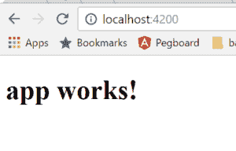
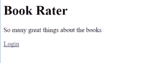
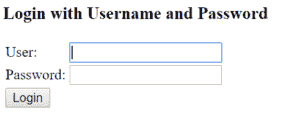

# 春云–添加角度 4

> 原文：<https://web.archive.org/web/20220930061024/https://www.baeldung.com/spring-cloud-angular>

## **1。概述**

在我们上一篇 Spring Cloud 文章中，我们在应用程序中添加了对 Zipkin 的支持。在本文中，我们将向堆栈中添加一个前端应用程序。

到目前为止，我们一直完全在后端工作来构建我们的云应用程序。但是如果没有 UI，web 应用程序有什么用呢？在本文中，我们将通过将单页面应用程序集成到我们的项目中来解决这个问题。

我们将使用`Angular`和`Bootstrap`编写这个应用程序。Angular 4 代码的风格感觉很像编写一个 Spring 应用程序，这对 Spring 开发者来说是一个自然的交叉！虽然前端代码将使用 Angular，但本文的内容可以轻松地扩展到任何前端框架。

在本文中，我们将构建一个 Angular 4 应用程序，并将其连接到我们的云服务。我们将演示如何在 SPA 和 Spring Security 之间集成登录。我们还将展示如何使用 Angular 对 HTTP 通信的支持来访问应用程序的数据。

## **2。网关变更**

前端就绪后，我们将切换到基于表单的登录，并为特权用户提供安全的用户界面。这需要对我们的网关安全配置进行更改。

### **2.1。`HttpSecurity`更新**

首先，让我们更新网关`SecurityConfig.java`类中的`configure(HttpSecurity http)`方法:

[PRE0]

首先，我们添加一个默认的成功 URL 指向`/home/index.html`，因为这将是我们的 Angular 应用程序所在的位置。接下来，我们配置 ant 匹配器，允许除了`Eureka`资源之外的任何请求通过网关。这将把所有安全检查委托给后端服务。

接下来，我们删除了注销成功 URL，因为默认重定向回登录页面也可以。

### **2.2。添加一个主要端点**

接下来，让我们添加一个端点来返回经过身份验证的用户。这将在我们的 Angular 应用程序中使用，以登录和识别我们的用户的角色。这将有助于我们控制他们可以在我们的网站上做什么。

在 gateway 项目中，添加一个`AuthenticationController`类:

[PRE1]

控制器将当前登录的用户对象返回给调用者。这为我们提供了控制 Angular 应用程序所需的所有信息。

### **2.3。添加登陆页面**

让我们添加一个非常简单的登录页面，以便用户在进入应用程序的根目录时可以看到一些内容。

在`src/main/resources/static,`中，让我们添加一个带有登录页面链接的`index.html`文件:

[PRE2]

## **3。Angular CLI 和启动项目**

在开始一个新的 Angular 项目之前，确保安装最新版本的 [Node.js 和 npm](https://web.archive.org/web/20220626203939/https://nodejs.org/en/download/) 。

### **3.1。安装角度指示器**

首先，我们需要使用`npm`下载并安装 Angular 命令行界面。打开终端并运行:

[PRE3]

这将全局下载并安装 CLI。

### **3.2。安装新项目**

仍然在终端中，导航到 gateway 项目并进入 gateway/src/main 文件夹。创建一个名为“angular”的目录并导航到它。从这里开始运行:

[PRE4]

要有耐心；CLI 正在建立一个全新的项目，并下载 npm 的所有 JavaScript 依赖项。这一过程通常需要几分钟时间。

`ng`命令是 Angular CLI 的快捷方式，`new`参数指示 CLI 创建一个新项目，`ui`命令为我们的项目命名。

### **3.3。运行项目**

一旦`new`命令完成。导航到创建并运行的`ui`文件夹:

[PRE5]

项目构建完成后，导航到 http://localhost:4200。我们应该会在浏览器中看到:

恭喜你！我们刚刚建立了一个有角度的应用程序！

### **3.4。安装引导程序**

让我们使用 npm 来安装 bootstrap。从 ui 目录运行以下命令:

[PRE6]

这会将引导程序下载到 node_modules 文件夹中。

在`ui`目录中，打开`.angular-cli.json`文件。这是配置我们项目的一些属性的文件。找到`apps > styles`属性并添加我们的引导 CSS 类的文件位置:

[PRE7]

这将指示 Angular 将 Bootstrap 包含在与项目一起编译的 CSS 文件中。

### **3.5。设置构建输出目录**

接下来，我们需要告诉 Angular 将构建文件放在哪里，以便我们的 spring boot 应用程序可以为它们服务。Spring Boot 可以提供资源文件夹中两个位置的文件:

*   src/main/资源/静态
*   src/main/资源/公共

因为我们已经在使用静态文件夹为 Eureka 提供一些资源，并且 Angular 在每次运行构建时都会删除这个文件夹，所以让我们将 Angular 应用程序构建到 public 文件夹中。

再次打开`.angular-cli.json`文件，找到`apps > outDir`属性。更新那个`string:`

[PRE8]

如果 Angular 项目位于 src/main/angular/ui 中，那么它将构建到 src/main/resources/public 文件夹中。如果应用程序在另一个文件夹中，则需要修改该字符串以正确设置位置。

### 3.6。用 Maven 自动构建

最后，我们将设置一个在编译代码时运行的自动化构建。每当“mvn 编译”运行时，该 ant 任务将运行 Angular CLI 构建任务。将这一步添加到网关的 POM.xml 中，以确保我们每次编译时都能获得最新的 ui 更改:

[PRE9]

我们应该注意，这种设置要求 Angular CLI 在类路径中可用。将该脚本推送到没有这种依赖性的环境中会导致构建失败。

现在让我们开始构建我们的 Angular 应用程序！

## **4。角度**

在本节教程中，我们将在页面中构建一个身份验证机制。我们使用基本身份验证，并遵循一个简单的流程来实现它。

用户有一个登录表单，可以在其中输入用户名和密码。

接下来，我们使用他们的凭证创建一个 base64 身份验证令牌并请求`“/me”`端点。端点返回一个包含该用户角色的`Principal`对象。

最后，我们将在客户机上存储凭证和主体，以便在后续请求中使用。

让我们看看这是怎么做到的！

### **4.1。模板**

在网关项目中，导航到`src/main/angular/ui/src/app`并打开`app.component.html`文件。这是角度加载的第一个模板，也是用户登录后登陆的地方。

在这里，我们将添加一些代码来显示带有登录表单的导航栏:

[PRE10]

这段代码用引导类建立了一个导航栏。嵌入该栏的是一个内嵌的登录表单。Angular 使用这种标记来动态地与 JavaScript 交互，以呈现页面的各个部分，并控制表单提交之类的事情。

像 `(ngSubmit)=”onLogin(f)”`这样的语句只是表明当表单被提交时，调用方法`“onLogin(f)”`并将表单传递给那个函数。在`jumbotron` div 中，我们有段落标签，它将根据主体对象的状态动态显示。

接下来，让我们编写支持这个模板的 Typescript 文件。

### **4.2。打字稿**

从同一目录中打开 app.component.ts 文件。在这个文件中，我们将添加所有的 typescript 属性和方法，使我们的模板函数:

[PRE11]

这个类与角度生命周期方法`ngOnInit()`挂钩。在这个方法中，我们调用`/me`端点来获取用户的当前角色和状态。这决定了用户在主页上看到的内容。每当这个组件被创建时，这个方法将被触发，这是检查用户在我们的应用程序中的权限属性的好时机。

我们还有一个`onLogout()`方法，可以让我们的用户退出，并将这个页面的状态恢复到原来的设置。

尽管这里有一些魔法。在构造函数中声明的`httpService`属性。Angular 在运行时将这个属性注入到我们的类中。Angular 管理服务类的单例实例，并使用构造函数注入来注入它们，就像 Spring 一样！

接下来，我们需要定义`HttpService`类。

### **4.3。`HttpService`**

在同一个目录下创建一个名为`“http.service.ts”`的文件。在该文件中添加以下代码以支持登录和注销方法:

[PRE12]

在这个类中，我们将使用 Angular 的 DI 构造注入另一个依赖项。这次是`Http`班。这个类处理所有的 HTTP 通信，并由框架提供给我们。

这些方法都使用 angular 的 HTTP 库执行 HTTP 请求。每个请求还在头中指定一个内容类型。

现在我们需要再做一件事来让`HttpService`在依赖注入系统中注册。打开`app.module.ts`文件并找到 providers 属性。将`HttpService`添加到数组中。结果应该是这样的:

[PRE13]

### 4.4。添加本金

接下来，让我们在我们的类型脚本代码中添加我们的主要 DTO 对象。在同一个目录中，添加一个名为“principal.ts”的文件，并添加以下代码:

[PRE14]

我们添加了`Principal`类和一个`Authority`类。这是两个 DTO 类，很像 Spring 应用程序中的 POJOs。因此，我们不需要在 angular 中向 DI 系统注册这些类。

接下来，让我们配置一个重定向规则，将未知请求重定向到应用程序的根目录。

### **4.5。404 处理**

让我们回到网关服务的 Java 代码。在`GatewayApplication` 类所在的位置添加一个名为`ErrorPageConfig`的新类:

[PRE15]

这个类将识别任何 404 响应，并将用户重定向到`“/home/index.html”`。在单页应用程序中，这是我们处理所有流量的方式，而不是专用资源，因为客户端应该处理所有可导航的路线。

现在我们准备启动这个应用程序，看看我们构建了什么！

### 4.6。构建和查看

现在从网关文件夹运行“`mvn compile`”。这将编译我们的 java 源代码，并将 Angular 应用程序构建到 public 文件夹中。让我们启动其他云应用程序:`config`、`discovery`和`zipkin`。然后运行网关项目。服务启动后，导航到`http://localhost:8080`查看我们的应用程序。我们应该看到这样的内容:

接下来，让我们跟随链接进入登录页面:

使用用户/密码凭据登录。点击“登录”，我们应该被重定向到/home/index.html，在那里我们的单页应用程序被加载。

看起来我们的`jumbotron`表明我们作为用户登录了！现在点击右上角的链接退出，这次使用`admin/admin`凭证登录。

看起来不错！现在我们以管理员身份登录。

## **5。结论**

在本文中，我们看到了将单页面应用程序集成到我们的云系统中是多么容易。我们采用了一个现代化的框架，并将一个有效的安全配置集成到我们的应用程序中。

使用这些例子，尝试编写一些代码来调用`book-service`或`rating-service`。既然我们现在已经有了进行 HTTP 调用和将数据连接到模板的例子，这应该相对容易。

如果你想知道网站的其余部分是如何构建的，你可以在 Github 上找到源代码[。](https://web.archive.org/web/20220626203939/https://github.com/eugenp/tutorials/tree/master/spring-cloud-modules/spring-cloud-bootstrap)