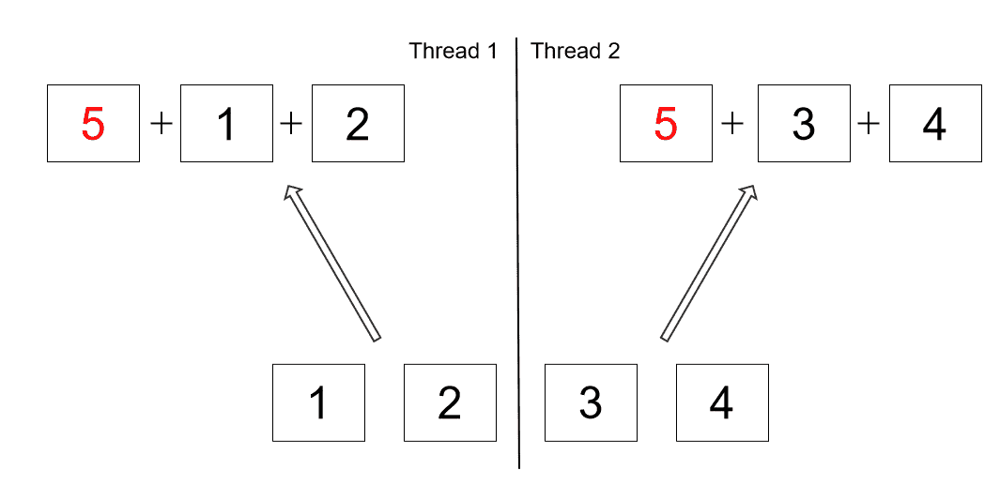

# 在 Java 中何时使用并行流

> 原文:[https://web . archive . org/web/20220930061024/https://www . bael dung . com/Java-when-to-use-parallel-stream](https://web.archive.org/web/20220930061024/https://www.baeldung.com/java-when-to-use-parallel-stream)

## 1.概观

Java 8 引入了 [Stream API](/web/20221208143859/https://www.baeldung.com/java-8-streams) ,使得迭代集合成为数据流变得容易。创建并行执行的流并利用多个处理器内核也非常**。**

我们可能认为将工作分配到更多的内核上会更快。但事实往往并非如此。

在本教程中，我们将探索顺序流和并行流之间的区别。我们首先来看看并行流使用的默认 fork-join 池。

我们还将考虑使用并行流的性能影响，包括内存局部性和拆分/合并成本。

最后，我们将推荐何时将顺序流转换成并行流是有意义的。

## 延伸阅读:

## [Java 8 Stream API 教程](/web/20221208143859/https://www.baeldung.com/java-8-streams)

The article is an example-heavy introduction of the possibilities and operations offered by the Java 8 Stream API.[Read more](/web/20221208143859/https://www.baeldung.com/java-8-streams) →

## [Java 并行收集器库指南](/web/20221208143859/https://www.baeldung.com/java-parallel-collectors)

Learn how to use Parallel Collectors, a library of Java Stream API collectors designed to overcome limitations of standard Parallel Streams.[Read more](/web/20221208143859/https://www.baeldung.com/java-parallel-collectors) →

## [将 Java 流收集到一个不可变的集合中](/web/20221208143859/https://www.baeldung.com/java-stream-immutable-collection)

Learn how to collect Java Streams to immutable Collections.[Read more](/web/20221208143859/https://www.baeldung.com/java-stream-immutable-collection) →

## 2.Java 中的流

Java 中的[流](/web/20221208143859/https://www.baeldung.com/java-8-streams-introduction)只是一个数据源的包装器，允许我们以一种方便的方式对数据执行批量操作。

它不存储数据，也不对底层数据源进行任何更改。相反，它增加了对数据管道上函数式操作的支持。

### 2.1.顺序流

默认情况下，**Java 中的任何流操作都是顺序处理的，除非明确指定为并行。**

顺序流使用单个线程来处理管道:

```
List<Integer> listOfNumbers = Arrays.asList(1, 2, 3, 4);
listOfNumbers.stream().forEach(number ->
    System.out.println(number + " " + Thread.currentThread().getName())
);
```

这个顺序流的输出是可预测的。列表元素将始终按有序顺序打印:

```
1 main
2 main
3 main
4 main
```

### 2.2.平行流

Java 中的任何流都可以很容易地从顺序转换成并行。

我们可以通过**将`parallel`方法添加到顺序流中，或者通过使用集合**的`parallelStream` 方法创建一个流来实现这一点:

```
List<Integer> listOfNumbers = Arrays.asList(1, 2, 3, 4);
listOfNumbers.parallelStream().forEach(number ->
    System.out.println(number + " " + Thread.currentThread().getName())
);
```

并行流使我们能够在不同的内核上并行执行代码。最终结果是每个单独结果的组合。

然而，执行的顺序不在我们的控制范围内。每次我们运行程序时，它都可能改变:

```
4 ForkJoinPool.commonPool-worker-3
2 ForkJoinPool.commonPool-worker-5
1 ForkJoinPool.commonPool-worker-7
3 main
```

## 3.分叉连接框架

并行流利用了 [fork-join](/web/20221208143859/https://www.baeldung.com/java-fork-join) 框架及其公共工作线程池。

在 Java 7 中，fork-join 框架被添加到`java.util.concurrent`中，以处理多线程之间的任务管理。

### 3.1.分裂源

fork-join 框架负责在工作线程之间分割源数据，并在任务完成时处理回调。

我们来看一个并行计算整数和的例子。

我们将使用 [`reduce`](/web/20221208143859/https://www.baeldung.com/java-stream-reduce) 方法，将起始和加 5，而不是从零开始:

```
List<Integer> listOfNumbers = Arrays.asList(1, 2, 3, 4);
int sum = listOfNumbers.parallelStream().reduce(5, Integer::sum);
assertThat(sum).isNotEqualTo(15);
```

在顺序流中，此操作的结果将是 15。

但是由于`reduce`操作是并行处理的，数字 5 实际上是在每个工作线程中累加的:

[](/web/20221208143859/https://www.baeldung.com/wp-content/uploads/2021/05/java_stream_reduce2.png)

根据公共 fork-join 池中使用的线程数量，实际结果可能会有所不同。

为了解决这个问题，应该在并行流之外添加数字 5:

```
List<Integer> listOfNumbers = Arrays.asList(1, 2, 3, 4);
int sum = listOfNumbers.parallelStream().reduce(0, Integer::sum) + 5;
assertThat(sum).isEqualTo(15);
```

因此，我们需要注意哪些操作可以并行运行。

### 3.2.公共线程池

公共池中线程的数量等于处理器内核的数量。

然而，API 允许我们通过传递一个 JVM 参数来指定它将使用的线程数量:

```
-D java.util.concurrent.ForkJoinPool.common.parallelism=4
```

重要的是要记住这是一个全局设置，并且**它将影响所有并行流和任何其他使用公共池的 fork-join 任务。** 我们强烈建议不要修改此参数，除非我们有非常充分的理由让 这么做。

### 3.3.自定义线程池

除了在默认的公共线程池中，还可以在[自定义线程池](/web/20221208143859/https://www.baeldung.com/java-8-parallel-streams-custom-threadpool)中运行并行流:

```
List<Integer> listOfNumbers = Arrays.asList(1, 2, 3, 4);
ForkJoinPool customThreadPool = new ForkJoinPool(4);
int sum = customThreadPool.submit(
    () -> listOfNumbers.parallelStream().reduce(0, Integer::sum)).get();
customThreadPool.shutdown();
assertThat(sum).isEqualTo(10);
```

请注意，Oracle 建议使用公共线程池。我们应该有一个很好的理由在定制线程池中运行并行流。

## 4.性能影响

并行处理可能有利于充分利用多核。但是我们还需要考虑管理多线程、内存局部性、分割源代码和合并结果的开销。

### 4.1.开销

让我们来看一个整数流的例子。

我们将对顺序和并行缩减操作运行基准测试:

```
IntStream.rangeClosed(1, 100).reduce(0, Integer::sum);
IntStream.rangeClosed(1, 100).parallel().reduce(0, Integer::sum);
```

在这种简单的求和缩减中，将顺序流转换为并行流会导致更差的性能:

```
Benchmark                                                     Mode  Cnt        Score        Error  Units
SplittingCosts.sourceSplittingIntStreamParallel               avgt   25      35476,283 ±     204,446  ns/op
SplittingCosts.sourceSplittingIntStreamSequential             avgt   25         68,274 ±       0,963  ns/op
```

这背后的原因是，有时管理线程、资源和结果的开销是比实际工作更昂贵的操作。

### 4.2.分割成本

平均分割数据源是实现并行执行的必要成本，但是有些数据源比其他数据源分割得更好。

让我们用一个 [`ArrayList`](/web/20221208143859/https://www.baeldung.com/java-arraylist) 和一个 [`LinkedList`](/web/20221208143859/https://www.baeldung.com/java-linkedlist) 来演示一下:

```
private static final List<Integer> arrayListOfNumbers = new ArrayList<>();
private static final List<Integer> linkedListOfNumbers = new LinkedList<>();

static {
    IntStream.rangeClosed(1, 1_000_000).forEach(i -> {
        arrayListOfNumbers.add(i);
        linkedListOfNumbers.add(i);
    });
}
```

我们将对两种类型的列表的顺序和并行归约操作运行基准测试:

```
arrayListOfNumbers.stream().reduce(0, Integer::sum)
arrayListOfNumbers.parallelStream().reduce(0, Integer::sum);
linkedListOfNumbers.stream().reduce(0, Integer::sum);
linkedListOfNumbers.parallelStream().reduce(0, Integer::sum);
```

我们的结果表明，将顺序流转换为并行流只会给`ArrayList`带来性能优势:

```
Benchmark                                                     Mode  Cnt        Score        Error  Units
DifferentSourceSplitting.differentSourceArrayListParallel     avgt   25    2004849,711 ±    5289,437  ns/op
DifferentSourceSplitting.differentSourceArrayListSequential   avgt   25    5437923,224 ±   37398,940  ns/op
DifferentSourceSplitting.differentSourceLinkedListParallel    avgt   25   13561609,611 ±  275658,633  ns/op
DifferentSourceSplitting.differentSourceLinkedListSequential  avgt   25   10664918,132 ±  254251,184  ns/op
```

这背后的原因是**阵列可以便宜且均匀地分割**，而`LinkedList`没有这些属性。 [`TreeMap`](/web/20221208143859/https://www.baeldung.com/java-treemap) 和 [`HashSet`](/web/20221208143859/https://www.baeldung.com/java-hashset) 分割比`LinkedList`好但不如数组。

### 4.3.合并成本

每次我们拆分源代码进行并行计算时，我们还需要确保最终合并结果。

让我们在顺序和并行流上运行一个基准测试，将求和与分组作为不同的合并操作:

```
arrayListOfNumbers.stream().reduce(0, Integer::sum);
arrayListOfNumbers.stream().parallel().reduce(0, Integer::sum);
arrayListOfNumbers.stream().collect(Collectors.toSet());
arrayListOfNumbers.stream().parallel().collect(Collectors.toSet())
```

我们的结果表明，将顺序流转换为并行流只会为 sum 操作带来性能优势:

```
Benchmark                                                     Mode  Cnt        Score        Error  Units
MergingCosts.mergingCostsGroupingParallel                     avgt   25  135093312,675 ± 4195024,803  ns/op
MergingCosts.mergingCostsGroupingSequential                   avgt   25   70631711,489 ± 1517217,320  ns/op
MergingCosts.mergingCostsSumParallel                          avgt   25    2074483,821 ±    7520,402  ns/op
MergingCosts.mergingCostsSumSequential                        avgt   25    5509573,621 ±   60249,942  ns/op
```

对于一些运算来说，合并运算真的很便宜，比如归约和加法，但是像集合或映射分组这样的合并运算可能会很昂贵。

### 4.4.存储局部性

现代计算机使用复杂的多级高速缓存将频繁使用的数据保存在处理器附近。当检测到线性内存访问模式时，硬件会预取下一行数据，因为它可能很快就会被用到。

当我们能够让处理器内核忙于做有用的工作时，并行性会带来性能优势。由于等待缓存未命中不是有用的工作，我们需要将内存带宽视为一个限制因素。

让我们使用两个数组来演示这一点，一个使用基本类型，另一个使用对象数据类型:

```
private static final int[] intArray = new int[1_000_000];
private static final Integer[] integerArray = new Integer[1_000_000];

static {
    IntStream.rangeClosed(1, 1_000_000).forEach(i -> {
        intArray[i-1] = i;
        integerArray[i-1] = i;
    });
}
```

我们将对两个阵列上的顺序和并行缩减操作运行基准测试:

```
Arrays.stream(intArray).reduce(0, Integer::sum);
Arrays.stream(intArray).parallel().reduce(0, Integer::sum);
Arrays.stream(integerArray).reduce(0, Integer::sum);
Arrays.stream(integerArray).parallel().reduce(0, Integer::sum);
```

我们的结果表明，当使用一组原语时，将顺序流转换为并行流会带来略微更多的性能优势:

```
Benchmark                                                     Mode  Cnt        Score        Error  Units
MemoryLocalityCosts.localityIntArrayParallel                sequential stream  avgt   25     116247,787 ±     283,150  ns/op
MemoryLocalityCosts.localityIntArraySequential                avgt   25     293142,385 ±    2526,892  ns/op
MemoryLocalityCosts.localityIntegerArrayParallel              avgt   25    2153732,607 ±   16956,463  ns/op
MemoryLocalityCosts.localityIntegerArraySequential            avgt   25    5134866,640 ±  148283,942  ns/op
```

原语数组带来了 Java 中可能的最佳局部性。一般来说，**我们的数据结构中的指针越多，我们给内存**带来的获取引用对象的压力就越大。这会对并行化产生负面影响，因为多个内核会同时从内存中读取数据。

### 4.5.`NQ`模型

Oracle 提供了一个简单的模型，可以帮助我们确定并行性是否能够提升我们的性能。在`NQ`模型中，`N`代表源数据元素的数量，而`Q`代表每个数据元素执行的计算量。

`N*Q`的产品越大，我们越有可能从并行化中获得性能提升。对于一个非常小的`Q`的问题，比如对数字求和，经验法则是`N`应该大于 10，000。**随着计算量的增加，从并行性中获得性能提升所需的数据量会减少。**

### 4.6.文件搜索成本

与顺序流相比，使用并行流的文件搜索性能更好。让我们在顺序和并行流上运行一个基准测试，搜索超过 1500 个文本文件:

```
Files.walk(Paths.get("src/main/resources/")).map(Path::normalize).filter(Files::isRegularFile)
      .filter(path -> path.getFileName().toString().endsWith(".txt")).collect(Collectors.toList());
Files.walk(Paths.get("src/main/resources/")).parallel().map(Path::normalize).filter(Files::
      isRegularFile).filter(path -> path.getFileName().toString().endsWith(".txt")).
      collect(Collectors.toList());
```

我们的结果表明，在搜索更多文件时，将顺序流转换为并行流会带来更多性能优势:

```
Benchmark                                Mode  Cnt     Score         Error    Units
FileSearchCost.textFileSearchParallel    avgt   25  10808832.831 ± 446934.773  ns/op
FileSearchCost.textFileSearchSequential  avgt   25  13271799.599 ± 245112.749  ns/op
```

## 5.何时使用并行流

正如我们已经看到的，当使用并行流时，我们需要非常小心。

在某些用例中，并行性可以带来性能优势。但是并行流不能被认为是神奇的性能助推器。因此，在开发过程中，顺序流仍然应该被用作缺省值。

当我们有实际的性能需求时，顺序流可以转换成并行流。考虑到这些要求，我们应该首先进行性能测量，并将并行性视为一种可能的优化策略。

每个元素的大量数据和大量计算表明并行可能是一个不错的选择。

另一方面，少量的数据、不均匀的源分割、昂贵的合并操作和差的存储器局部性表明并行执行的潜在问题。

## 6.结论

在本文中，我们探讨了 Java 中顺序流和并行流的区别。我们了解到并行流利用默认的 fork-join 池及其工作线程。

然后我们看到并行流并不总是带来性能优势。我们考虑了管理多线程、内存局部性、分割源代码和合并结果的开销。我们看到,**数组是并行执行的一个很好的数据源，因为它们带来了最好的局部性，并且可以便宜而均匀地分割。**

最后，我们查看了`NQ`模型，并建议仅当我们有实际的性能需求时才使用并行流。

和往常一样，源代码可以在 GitHub 上的[处获得。](https://web.archive.org/web/20221208143859/https://github.com/eugenp/tutorials/tree/master/core-java-modules/core-java-streams-3)