# 如何在 Jenkins 上运行 TestNG 测试

> 原文：<https://web.archive.org/web/20220930061024/https://www.baeldung.com/ops/testng-jenkins>

## 1.概观

在本教程中，我们将学习在 Jenkins 上运行 [TestNG](/web/20221122032748/https://www.baeldung.com/testng) 测试所需的步骤。

我们将关注与使用 TestNG 框架编写测试的 GitHub 存储库的集成，在我们的本地机器上设置 Jenkins，在 [Jenkins](/web/20221122032748/https://www.baeldung.com/ops/jenkins-pipelines) 上运行这些测试，并分析测试报告。

## 2.设置

让我们首先将 TestNG 的 Maven [依赖项](https://web.archive.org/web/20221122032748/https://search.maven.org/search?q=g:org.testng%20AND%20a:testng)添加到我们的`pom.xml`文件中:

```
<dependency>
    <groupId>org.testng</groupId>
    <artifactId>testng</artifactId>
    <version>7.6.1</version>
    <scope>test</scope>
</dependency>
```

如果我们使用 Eclipse，我们可以从 [Eclipse Marketplace](https://web.archive.org/web/20221122032748/https://marketplace.eclipse.org/) 安装 TestNG 插件。

## 3.使用 TestNG 编写测试

让我们使用从`org.testng.annotations.Test`导入的`@Test`注释添加一个单元测试:

```
@Test
public void givenNumber_whenEven_thenTrue() {
    assertTrue(number % 2 == 0);
}
```

我们还将在 `/test/resources`文件夹中添加一个 XML 文件，通过指定测试类来运行 TestNG 套件:

```
<suite name="suite">
    <test name="test suite">
        <classes>
            <class name="com.baeldung.SimpleLongRunningUnitTest" />
        </classes>
    </test>
</suite>
```

然后，我们可以在我们的`pom.xml`的插件部分指定这个 XML 文件本身的名称:

```
<plugin>
    <groupId>org.apache.maven.plugins</groupId>
    <artifactId>maven-surefire-plugin</artifactId>
    <configuration>
        <suiteXmlFiles>
            <suiteXmlFile>
                src\test\resources\test_suite.xml
            </suiteXmlFile>
        </suiteXmlFiles>
    </configuration>
</plugin>
```

## 4.运行 TestNG 测试

让我们使用 `mvn clean install` 命令来构建和测试我们的项目:

[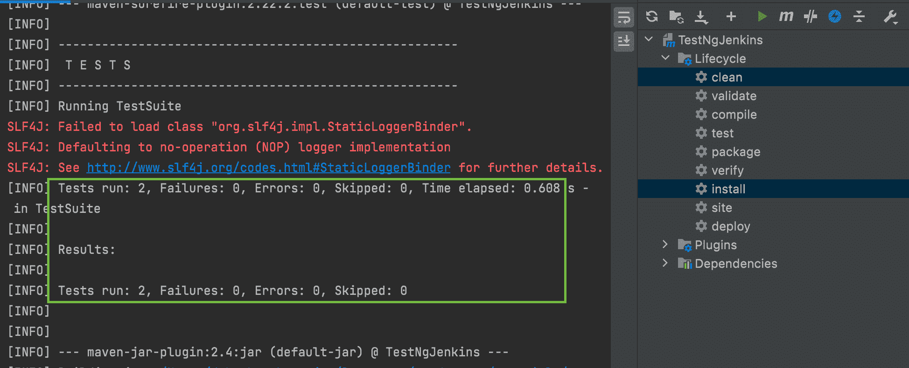](/web/20221122032748/https://www.baeldung.com/wp-content/uploads/2022/11/5_TestNG-maven-build-command.png)

**我们还可以通过将概要文件指定为一个参数来为我们的 Maven 构建运行一个特定的[概要文件](/web/20221122032748/https://www.baeldung.com/maven-profiles)，如`mvn clean test install -Pdefault-second.`**

我们可以看到我们的测试已经成功通过，以及已经运行的测试的数量，以及失败或跳过的测试的数量。

## 5.在本地机器上设置 Jenkins

正如我们所知，Jenkins 是一款开源服务器，有助于自动化软件开发周期的多个部分，如构建、测试和部署，以及促进[持续交付或持续集成](/web/20221122032748/https://www.baeldung.com/spring-boot-ci-cd)。

我们将使用 Jenkins 以自动化的方式运行我们的 TestNG 测试。为了运行这些测试，我们将首先在本地机器上设置 Jenkins。**一旦设置好，我们将通过[作业](/web/20221122032748/https://www.baeldung.com/ops/jenkins-job-schedule)运行我们的测试，并通过日志和测试趋势可视化工具分析结果。**

现在，我们来看一下设置过程。

### 5.1.下载并安装 Jenkins

如果我们使用的是这些操作系统中的一个，我们可以简单地按照详细的说明操作 [Linux](/web/20221122032748/https://www.baeldung.com/linux/jenkins-install-run) 或 [Windows](https://web.archive.org/web/20221122032748/https://www.jenkins.io/doc/book/installing/windows/) ，或者我们可以使用`brew install jenkins` 在 macOS 上设置 Jenkins。

### 5.2.设置 Jenkins 管理仪表板

让我们看看运行 Jenkins 的命令:

```
$ /usr/local/opt/jenkins/bin/jenkins --httpListenAddress=127.0.0.1 --httpPort=8080
```

这里，`/usr/local/opt/jenkins/bin/jenkins` 表示 Jenkins 安装的位置，而参数`httpListenAddress` 和`httpPort`指定我们可以访问 Jenkins UI 的地址和端口。

在整个设置过程中，**我们将看到一条日志消息“`hudson.lifecycle.Lifecycle#onReady: Jenkins is fully up and running”,`，指明 Jenkins UI 已经启动并正在运行**。

在此之后，**我们可以通过**访问 Jenkins 仪表板`**http://127.0.0.1:8080/**.`初始密码继续安装可以在同一个屏幕上看到一个日志: [](/web/20221122032748/https://www.baeldung.com/wp-content/uploads/2022/11/Jenkins-installation-password.png)

输入密码后，系统会提示我们安装 Jenkins 需要的插件。在这一点上，我们可以选择特定的插件来安装或继续进行自定义选择。插件安装阶段开始并尝试安装相关的插件: [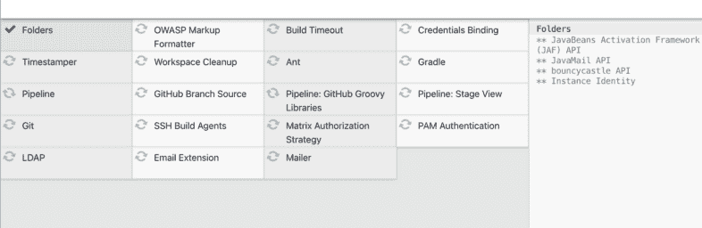](/web/20221122032748/https://www.baeldung.com/wp-content/uploads/2022/11/5_Jenkins-plugin-installation-e1668836270254.png) 
绿色的勾号标记安装过程已经完成的插件，而正在进行的插件在右侧面板上与安装日志一起标记。

安装插件后，我们会被引导到一个屏幕，在这里我们可以设置自己选择的用户名和密码，或者跳过继续使用初始密码。**我们也可以选择修改 Jenkins URL 或继续使用`http://127.0.0.1:8080/`** 的初始 URL

### 5.3.设置 Maven 和 GitHub 特定的插件

我们现在将设置 Maven 和 GitHub 插件，用于在 Jenkins 中构建我们的项目。为此，我们可以选择`Dashboard`中的`Manage Jenkins` 选项:

[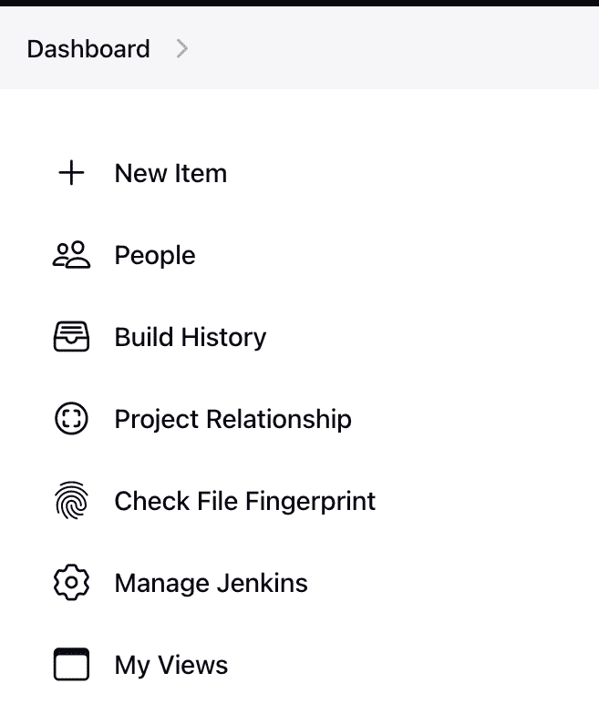](/web/20221122032748/https://www.baeldung.com/wp-content/uploads/2022/11/manage_jenkins.png)

在下一个屏幕中，我们单击`Global Tool` `Configuration`选项，并通过选中`Install automatically` 复选框:
[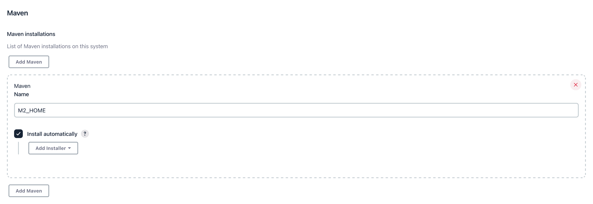](/web/20221122032748/https://www.baeldung.com/wp-content/uploads/2022/11/jenkins_maven_installation.png) 来添加一个 Maven 安装

一旦我们设置好 Maven 安装配置，我们点击`Dashboard,`上的`Manage Jenkins`选项，它会打开一个窗口，我们会在随后的窗口中看到一个名为`Manage Plugins.`的选项，我们点击`Available plugins` 选项，搜索`GitHub Integration`和`Maven Integration`插件:

[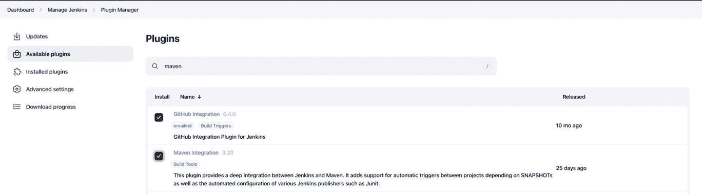](/web/20221122032748/https://www.baeldung.com/wp-content/uploads/2022/11/5_plugins_installation-e1668836677119.png)

我们可以选择这些插件，点击`Install without restarting`。

### 5.4.设置 Jenkins 作业来运行来自 GitHub 项目的测试

我们现在将设置一个 Jenkins 作业，从 GitHub 项目中的一个模块运行 TestNG 测试。为此，我们选择左侧面板上的`New Item` 选项，输入我们作业的名称，然后选择`Maven Project` 选项。之后，我们可以从`Configure`窗口链接我们的 GitHub 库。

首先，让我们勾选`GitHub project`复选框，然后提及项目 URL:
[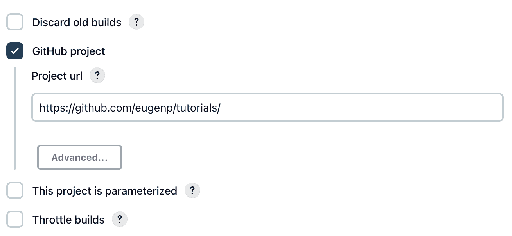](/web/20221122032748/https://www.baeldung.com/wp-content/uploads/2022/11/5_github_project_details-e1668839906928.png)

接下来，我们在`Source Code Management` 部分选择`Git` ，然后输入`.git`存储库的 URL。另外，我们还提到了 `Branch Specifier` 部分下的分支:
[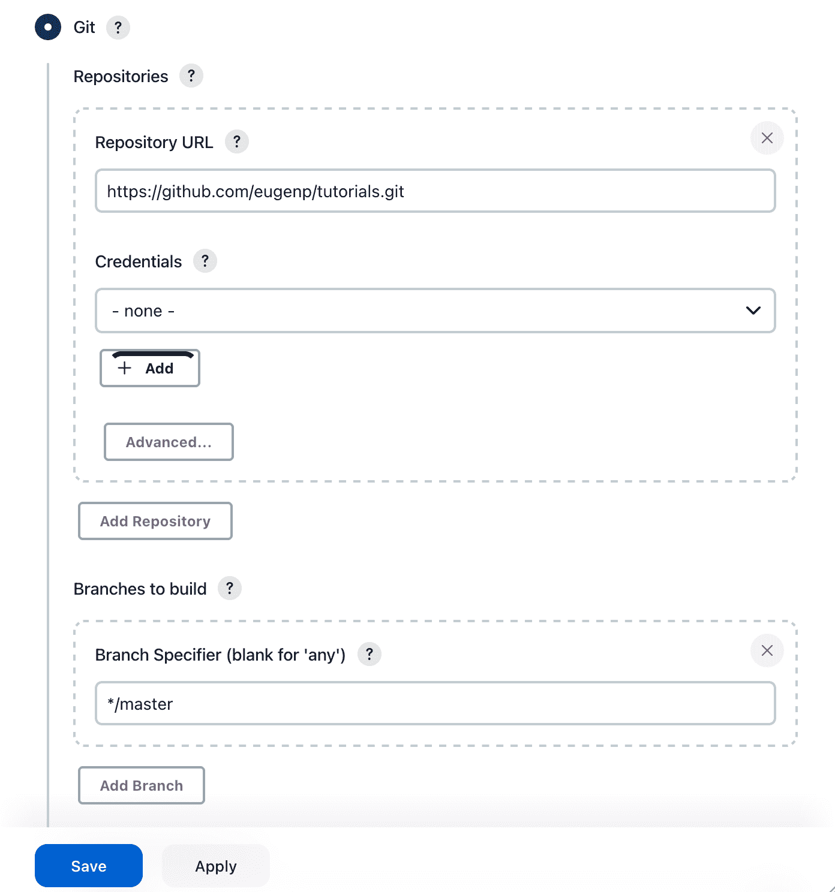](/web/20221122032748/https://www.baeldung.com/wp-content/uploads/2022/11/5_github_branch_details.png)

在这之后，让我们导航到`Build` 部分，并提及到`pom.xml`文件的路径。这里的一个关键点是路径是相对于项目的。下一步，我们还在`Goals and options` 部分:
[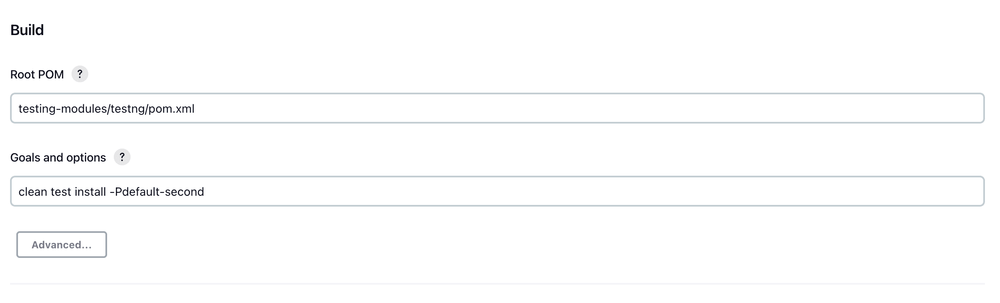](/web/20221122032748/https://www.baeldung.com/wp-content/uploads/2022/11/5_maven_build_command-e1668840367789.png) 中指定 Maven 命令`clean test install -Pdefault-second`(这里，`-P`用来表示用于构建的[概要文件](https://web.archive.org/web/20221122032748/https://maven.apache.org/guides/introduction/introduction-to-profiles.html)

我们现在可以保存这些配置并返回到我们的工作中，点击左侧面板中的`Build Now` 。它为我们提供了构建号，以及到构建作业的链接。点击链接，我们可以选择查看控制台输出的屏幕: [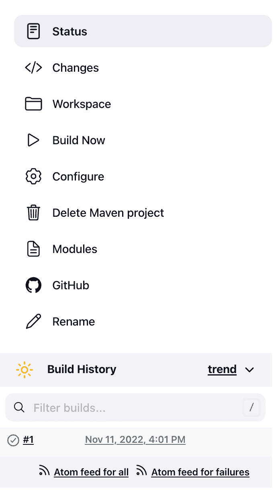](/web/20221122032748/https://www.baeldung.com/wp-content/uploads/2022/11/5_jenkins_build_options-1-e1668837345676.png) 点击控制台输出，我们可以看到测试的运行日志和测试的成功或失败事件，以及`Console output`中的构建状态:

[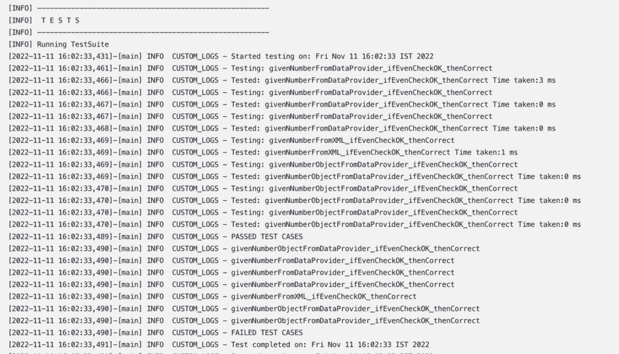](/web/20221122032748/https://www.baeldung.com/wp-content/uploads/2022/11/5_jenkins_build_logs-e1668837047367.png)

我们还可以为 TestNG 测试设置[定制测试报告](/web/20221122032748/https://www.baeldung.com/testng-custom-reporting)。

当我们返回到 TestNG Jenkins 作业的主页面时，我们还可以以可视化的方式看到测试结果趋势:
[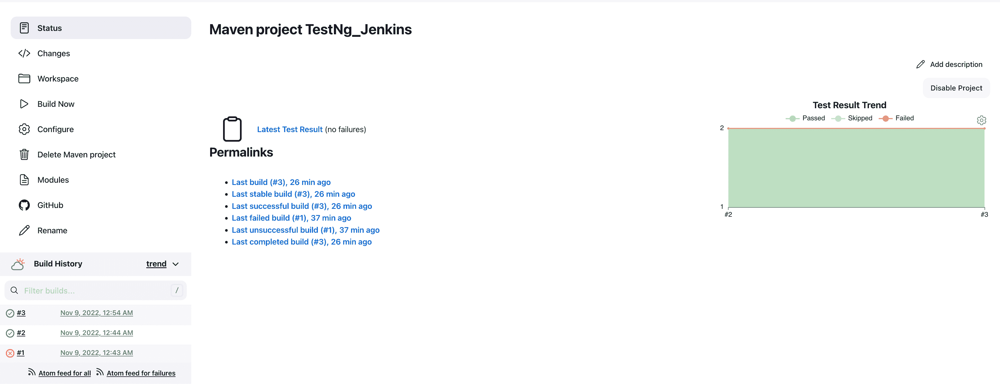](/web/20221122032748/https://www.baeldung.com/wp-content/uploads/2022/11/5_jenkins_test_result_trend_visualisation.png)

我们还可以在[分布式](/web/20221122032748/https://www.baeldung.com/ops/jenkins-slave-node-setup)模式下运行 Jenkins，以扩展我们的 Jenkins 设置。

## 6.结论

在本文中，我们通过在 Jenkins 仪表板上配置一个作业，执行简单的测试用例，并在仪表板上查看测试用例的执行报告，快速了解了如何设置 Jenkins 从 GitHub 存储库中运行 TestNG 测试。

和往常一样，所有代码片段的实现都可以在 GitHub 上找到[。](https://web.archive.org/web/20221122032748/https://github.com/eugenp/tutorials/tree/master/testing-modules/testng)