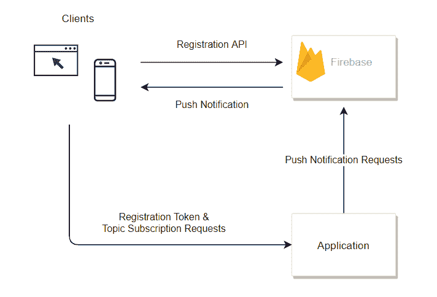
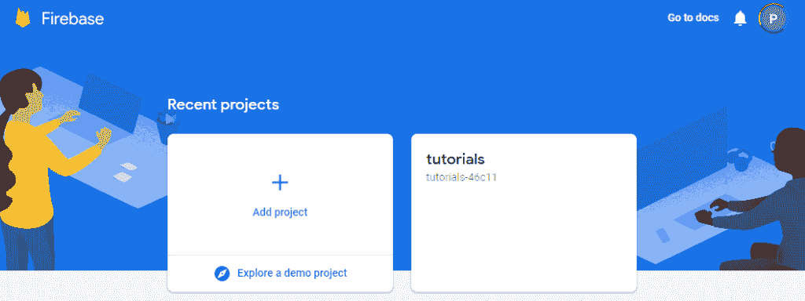
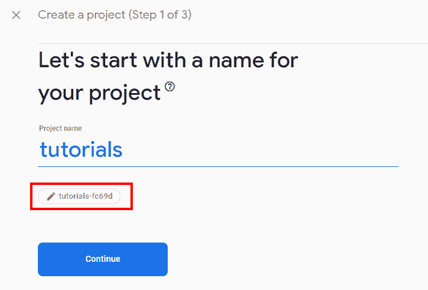
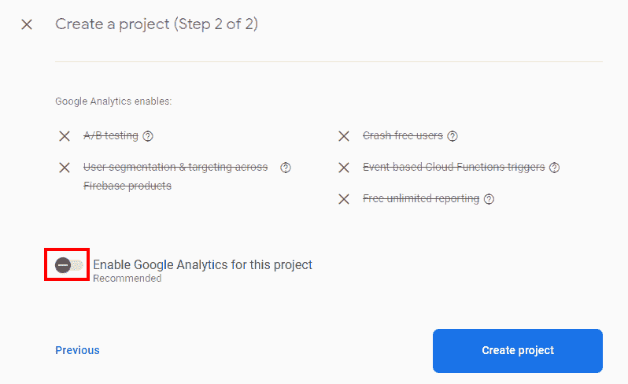
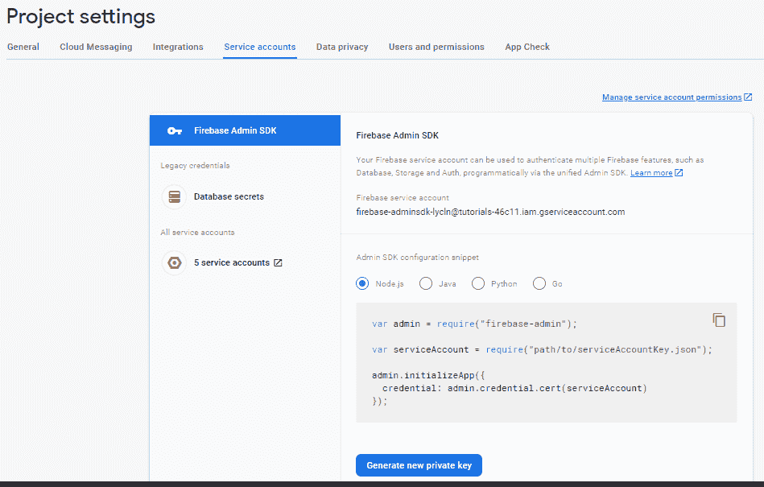

# 在 Spring Boot 应用程序中使用 Firebase 云消息传递

> 原文：<https://web.archive.org/web/20220930061024/https://www.baeldung.com/spring-fcm>

## 1.介绍

在这个快速教程中，我们将展示如何使用 Google 的 Firebase 云消息向 web 和移动应用程序发送推送通知。

## 2.FCM 是什么？

Firebase Cloud Messaging(简称 FCM)是一种基于云的消息服务，提供以下功能:

*   可靠地将消息发送到移动或 web 应用程序，这里称为“客户端”
*   使用基于主题或订阅的寻址方式向所有或特定客户端发送消息
*   在服务器应用程序中接收来自客户端的消息

以下是这项技术的一些实际应用示例:

*   发送特定产品独家优惠的目标信息
*   通知给定应用程序的所有用户有新功能可用
*   即时消息/聊天应用程序
*   给给定客户的直接通知

## 3.应用架构

基于 FCM 的应用程序的典型架构由服务器、客户端和 FCM 本身组成:

在本教程中，我们将关注这类应用程序的服务器端。在我们的例子中，这个服务器将是一个基于 Spring Boot 的服务，它公开了一个 REST API。这个 API 允许我们探索向我们(希望)庞大的用户群发送通知的不同方式:

*   发布主题通知
*   向特定客户端发布通知
*   向多个主题发布通知

这种应用程序的核心是客户端、主题和订阅的概念。

### 3.1.主题

**A `topic`是一个命名实体，作为共享某些属性**的通知的中心。例如，一个金融应用可以为它交易的每一种资产使用一个主题。同样，一个体育应用程序可以为每支球队甚至一场特定的比赛使用一个主题。

### 3.2.客户

**客户端是安装在给定移动设备上或运行在浏览器上的应用程序实例**。为了接收通知，客户端使用适当的 SDK API 调用向我们的 Firebase 项目注册。

注册成功后，客户端会从 Firebase 获得一个唯一的注册令牌。通常，这个令牌被发送到服务器端，因此它可以用于直接通知。

### 3.3.捐款

**订阅表示客户端和主题**之间的关联。服务器应用程序使用一个 API 调用创建新的订阅，该 API 调用接受一个或多个客户机注册令牌和一个主题名。

## 4.Firebase 项目设置

Firebase 项目充当我们将在应用程序中使用的云资源的容器。谷歌提供了一个免费的初始层，允许开发者试验可用的服务，并只为超出可用配额的部分付费。

因此，要使用 FCM，我们的第一步是使用 [Firebase 的控制台](https://web.archive.org/web/20221130224544/https://console.firebase.google.com/)创建一个新项目。一旦我们登录，我们将获得 Firebase 的主页:

在这里，我们可以选择添加一个新项目或选择一个现有的项目。我们选前者吧。这将启动一个向导，该向导将收集创建新项目所需的信息。

首先，我们必须命名我们的项目:

请注意，在通知的名称下，有一个按钮，带有为这个项目生成的内部 ID。通常情况下，没有必要改变它，但如果我们因为某种原因不喜欢它，我们可以点击它，使用不同的。另外，请注意，虽然项目 id 是唯一的，但项目名称却不是唯一的，这可能会有点令人困惑。

下一步，我们可以选择将分析添加到我们的项目中。我们将禁用此选项，因为本教程不需要它。如果需要，我们可以稍后启用它。

一旦我们点击“创建项目”，Firebase 会将我们重定向到新创建的项目管理页面。

## 5.生成服务帐户

为了让服务器端应用程序对 Firebase 服务进行 API 调用，我们需要生成一个新的服务帐户并获取其凭证。我们可以通过访问项目设置页面并选择“服务帐户”选项卡来实现:

任何新项目都是从一个管理服务帐户开始的，这个帐户基本上可以做这个项目中的任何事情。在这里，我们将使用它进行测试，但是现实世界中的应用程序应该创建一个特权有限的专用服务帐户。这样做需要一些 IAM(谷歌的身份&访问管理)知识，超出了本教程的范围。

我们现在必须点击“生成新的私有密钥”按钮来下载一个 JSON 文件，该文件包含调用 Firebase 的 API 所需的数据。不用说，我们必须将这个文件存储在一个安全的位置。

## 6.Maven 依赖性

现在我们已经准备好了 Firebase 项目，是时候编写发送通知的服务器组件了。除了 MVC 应用程序的常规 Spring Boot 启动器，我们还必须添加`firebase-admin`依赖项:

[PRE0]

该依赖关系的最新版本可在 [Maven Central](https://web.archive.org/web/20221130224544/https://search.maven.org/search?q=g:com.google.firebase%20a:firebase-admin) 上获得。

## 7.Firebase 消息传递配置

**`FirebaseMessaging`类是主要的外观，通过它我们将使用 FCM** 发送消息。由于这个类是线程安全的，我们将在一个`@Configuration`类中使用一个`@Bean`方法来创建它的一个实例，并使它对我们的控制器可用:

[PRE1]

相当琐碎，但是现在我们必须提供一个`FirebaseApp`。或者，我们可以使用`getInstance()`的无参数变体，它可以完成工作，但不允许我们更改任何默认参数。

为了解决这个问题，让我们创建另一个创建定制的`FirebaseApp`实例的`@Bean`方法:

[PRE2]

这里，唯一的定制是使用一个特定的`GoogleCredentials`对象。`FirebaseOptions`的构建器允许我们调整 Firebase 客户端的其他方面:

*   超时设定
*   HTTP 请求工厂
*   特定服务的自定义端点
*   螺纹工厂

最后一项配置是凭证本身。我们将创建另一个`@Bean`，它使用通过[配置属性](/web/20221130224544/https://www.baeldung.com/configuration-properties-in-spring-boot)提供的服务帐户或者使用默认的凭证链来创建一个`GoogleCredentials`实例:

[PRE3]

**这种方法简化了本地机器上的测试，在本地机器上我们可能有多个服务帐户文件。**我们可以使用标准的`GOOGLE_APPLICATION_CREDENTIALS`环境变量来指向正确的文件，但是改变它有点麻烦。

## 8.向主题发送消息

向主题发送消息需要两个步骤:构建一个`Message`对象并使用`FirebaseMessaging`的方法之一发送它。使用熟悉的[构建器模式](/web/20221130224544/https://www.baeldung.com/java-builder-pattern-freebuilder) : 创建 **`Message`实例**

[PRE4]

一旦我们有了一个`Message`实例，我们使用`send()`来请求它的交付:

[PRE5]

这里，`fcm`是我们注入到控制器类中的`FirebaseMessaging`实例。`send`()返回一个值，该值是 FCM 生成的消息标识符。我们可以使用这个标识符进行跟踪或记录。

`send()`也有一个异步版本`sendAsync()`，它返回一个`ApiFuture`对象。这个类扩展了 Java 的`Future`，所以我们可以很容易地将它用于像[项目反应器](/web/20221130224544/https://www.baeldung.com/reactor-core)这样的反应式框架。

## 9.向特定客户端发送消息

正如我们之前提到的，每个客户端都有一个与之相关联的唯一订阅令牌。当构建一个`Message`而不是一个主题名时，我们使用这个标记作为它的“地址”:

[PRE6]

对于我们想要向几个客户端发送相同消息的用例，我们可以使用`MulticastMessage`和`sendMulticast().`,它们的工作方式与单播版本相同，但允许我们在一次呼叫中向多达 500 个客户端发送消息:

[PRE7]

返回的`BatchResponse`包含生成的消息标识符和与给定客户端的交付相关的任何错误。

## 10.向多个主题发送消息

FCM 允许我们指定一个条件来定义消息的目标受众。**`condition`是一个逻辑表达式，它根据客户订阅(或不订阅)的主题来选择客户**。例如，给定三个主题(T1、T2 和 T3)，该表达式的目标设备是 T1 或 T2 的用户，而不是 T3 的用户:

[PRE8]

这里，`topics` 变量表示给定客户端已经订阅的所有主题。我们现在可以使用构建器中可用的`setCondition() `方法来构建满足该条件的发往客户端的消息:

[PRE9]

## 11.为客户端订阅主题

我们使用`subscribeToTopic() (`或其异步变体`subscribeToTopicAsync()`方法来创建一个订阅，该订阅将一个客户端与一个主题相关联。该方法接受客户端注册标记列表和主题名称作为参数:

[PRE10]

请注意，与其他消息传递系统不同，返回值没有已创建订阅的标识符。如果我们想跟踪某个客户订阅了哪些主题，我们必须自己去做。

要取消订阅客户端，我们使用`unsubscribeFromTopic():`

[PRE11]

## 12.结论

在本教程中，我们展示了如何使用 Google 的 Firebase 云消息服务向 web 和移动应用程序发送通知消息。

像往常一样，完整的代码可以在 GitHub 上的[处获得。](https://web.archive.org/web/20221130224544/https://github.com/eugenp/tutorials/tree/master/gcp-firebase)