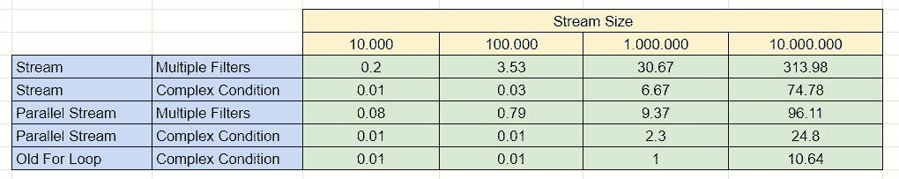

# Java 8 流:多重过滤器与复杂条件

> 原文:[https://web . archive . org/web/20220930061024/https://www . bael dung . com/Java-streams-multiple-filters-vs-condition](https://web.archive.org/web/20220930061024/https://www.baeldung.com/java-streams-multiple-filters-vs-condition)

## 1.概观

在本文中，我们将比较过滤`Java Streams`的不同方式。最初，我们会看到哪个解决方案会产生更可读的代码。之后，我们将从性能角度比较这些解决方案。

## 2.可读性

首先，我们将从可读性的角度比较这两种解决方案。对于本节中的代码示例，我们将使用`Student`类:

```
public class Student {

    private String name;
    private int year;
    private List<Integer> marks;
    private Profile profile;

    // constructor getters and setters

}
```

我们的目标是根据以下三条规则过滤`Students`流:

*   `profile`必须是`Profile.PHYSICS`
*   `marks`的计数应该大于 3
*   平均值`mark`应该大于 50

### 2.1.多重过滤器

`Stream API `允许链接多个过滤器。我们可以利用这一点来满足所描述的复杂过滤标准。此外，如果我们想否定条件，可以使用`not`谓词。

这种方法将产生一个清晰易懂的代码:

```
@Test
public void whenUsingMultipleFilters_dataShouldBeFiltered() {
    List<Student> filteredStream = students.stream()
      .filter(s -> s.getMarksAverage() > 50)
      .filter(s -> s.getMarks().size() > 3)
      .filter(not(s -> s.getProfile() == Student.Profile.PHYSICS))
      .collect(Collectors.toList());

    assertThat(filteredStream).containsExactly(mathStudent);
}
```

### 2.2.复杂条件下的单个过滤器

替代方案是使用具有更复杂条件的单个滤波器。

不幸的是，产生的代码将有点难以阅读:

```
@Test
public void whenUsingSingleComplexFilter_dataShouldBeFiltered() {
    List<Student> filteredStream = students.stream()
      .filter(s -> s.getMarksAverage() > 50 
        && s.getMarks().size() > 3 
        && s.getProfile() != Student.Profile.PHYSICS)
      .collect(Collectors.toList());

    assertThat(filteredStream).containsExactly(mathStudent);
}
```

但是，我们可以通过将几个条件提取到一个单独的方法中来使它变得更好:

```
public boolean isEligibleForScholarship() {
    return getMarksAverage() > 50
      && marks.size() > 3
      && profile != Profile.PHYSICS;
}
```

因此，我们将隐藏复杂的条件，并赋予过滤标准更多的含义:

```
@Test
public void whenUsingSingleComplexFilterExtracted_dataShouldBeFiltered() {
    List<Student> filteredStream = students.stream()
        .filter(Student::isEligibleForScholarship)
        .collect(Collectors.toList());

    assertThat(filteredStream).containsExactly(mathStudent);
}
```

这将是一个很好的解决方案，尤其是当我们可以在模型中封装过滤器逻辑的时候。

## 3.表演

我们已经看到，使用多个过滤器可以提高代码的可读性。另一方面，这将意味着创建多个对象，并可能导致性能损失。为了演示这一点，我们将过滤不同大小的`Streams`,并对它们的元素执行多重检查。

之后，我们将计算总处理时间(以毫秒为单位),并比较两种解决方案。此外，我们将在测试中包含`Parallel Streams`和简单的、旧的、`for loop:`

**[](/web/20220818195354/https://www.baeldung.com/wp-content/uploads/2022/08/stream-filer-size-comparisson.jpg) 因此，我们可以注意到，使用复杂条件会导致性能增益。**

但是，对于小样本，这种差异可能并不明显。

## 4.条件的顺序

不管我们是使用单个过滤器还是多个过滤器，如果没有按照最佳顺序执行检查，过滤都会导致性能下降。

### 4.1.过滤掉许多元素的条件

假设我们有一个由 100 个整数组成的数据流，我们想找出小于 20 的偶数。

如果我们首先检查数字的奇偶性，我们将得到总共 150 张支票。这是因为第一个条件每次都要计算，而第二个条件只对偶数计算。

```
@Test
public void givenWrongFilterOrder_whenUsingMultipleFilters_shouldEvaluateManyConditions() {
    long filteredStreamSize = IntStream.range(0, 100).boxed()
      .filter(this::isEvenNumber)
      .filter(this::isSmallerThanTwenty)
      .count();

    assertThat(filteredStreamSize).isEqualTo(10);
    assertThat(numberOfOperations).hasValue(150);
}
```

另一方面，如果我们颠倒过滤器的顺序，我们将只需要总共 120 次检查来正确地过滤流。因此，应首先评估过滤掉大部分元素的条件。

### 4.2.缓慢或繁重的条件

有些情况可能会很慢。例如，如果其中一个过滤器需要执行一些繁重的逻辑或通过网络进行外部调用。为了获得更好的性能，我们将尽可能少地评估这些条件。**因此，只有在满足所有其他条件的情况下，我们才会尝试对它们进行评估**。

## 5.结论

在本文中，我们分析了过滤`Java Streams`的不同方式。首先，我们从可读性的角度比较了这两种方法。我们发现多个过滤器提供了更容易理解的过滤条件。

之后，我们从性能角度比较了这些解决方案。我们了解到，使用复杂的条件并因此创建较少的对象将会带来更好的整体性能。

和往常一样，源代码可以在 GitHub 上的[处获得。](https://web.archive.org/web/20220818195354/https://github.com/eugenp/tutorials/tree/master/core-java-modules/core-java-streams-4)