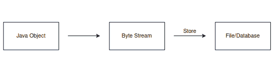
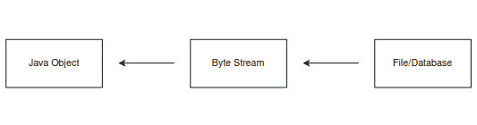

# 如何在 Java 中序列化单例

> 原文：<https://web.archive.org/web/20220930061024/https://www.baeldung.com/java-serialize-singleton>

## 1.概观

在这个快速教程中，我们将学习如何用 Java 创建一个可序列化的单例类。

## 2.什么是序列化？

**[序列化](/web/20221128144643/https://www.baeldung.com/java-serialization)是将 java 对象的状态转换成可以存储在文件或数据库中的字节流的过程**:

[](/web/20221128144643/https://www.baeldung.com/wp-content/uploads/2022/11/Serialization.png)

**反序列化则相反。它从字节流**中创建对象:

[](/web/20221128144643/https://www.baeldung.com/wp-content/uploads/2022/11/Deserialization.png)

## 3.`Serializable`界面

[`Serializable`](https://web.archive.org/web/20221128144643/https://docs.oracle.com/javase/7/docs/api/java/io/Serializable.html) 接口是一个[标记接口](/web/20221128144643/https://www.baeldung.com/java-marker-interfaces)(也叫标记接口)。标记接口为编译器和 JVM 提供关于对象的运行时类型信息。它内部没有任何字段、方法或常量。因此，实现它的类不必实现任何方法。

**如果一个类实现了`Serializable` 接口，它的实例可以被序列化或者反序列化**。

## 4.什么是单例类？

在面向对象编程中， [singleton](/web/20221128144643/https://www.baeldung.com/java-singleton) 类是一个一次只能有一个实例的类。在第一次实例化之后，如果我们试图再次实例化单例类，它会给我们第一次创建的同一个实例。下面是一个实现了`Serializable`接口的单例类:

```
public class Singleton implements Serializable {

    private static Singleton INSTANCE;
    private String state = "State Zero";

    private Singleton() {}

    public static Singleton getInstance() {
        if (INSTANCE == null) {
            INSTANCE = new Singleton();
        }

        return INSTANCE;
    }

    public String getState() {
        return state;
    }

    public void setState(String state) {
        this.state = state;
    }
}
```

我们可以看到它有两个私有字段:`INSTANCE`和`state` `.` `INSTANCE`是 singleton 类的唯一实例，`state`是保存类状态的字符串变量。

## 5.创建可序列化的单例类

问题是，在实例化实现`Serializable`的 singleton 类，然后序列化和反序列化实例之后，我们将得到 singleton 类的两个实例，这违反了 singleton 特性:

```
@Test
public void givenSingleton_whenSerializedAndDeserialized_thenStatePreserved() {
    Singleton s1 = Singleton.getInstance();
    s1.setState("State One");

    try (
      FileOutputStream fos = new FileOutputStream("singleton_test.txt");
      ObjectOutputStream oos = new ObjectOutputStream(fos);
      FileInputStream fis = new FileInputStream("singleton_test.txt");
      ObjectInputStream ois = new ObjectInputStream(fis)) {

        // Serializing.
        oos.writeObject(s1);

        // Deserializing.
        Singleton s2 = (Singleton) ois.readObject();

        // Checking if the state is preserved.
        assertEquals(s1.getState(), s2.getState());

        // Checking if s1 and s2 are not the same instance.
        assertNotEquals(s1, s2);

    } catch (Exception e) {
        // ...
    }
}
```

上面的测试代码通过。因此，即使状态在序列化和反序列化过程中被保留，新变量`s2`并不指向与`s1`相同的实例。因此，有两个`Singleton`类的实例，这是不好的。

要创建一个可序列化的单例类，我们应该使用枚举单例模式:

```
public enum EnumSingleton {

    INSTANCE("State Zero");

    private String state;

    private EnumSingleton(String state) {
        this.state = state;
    }

    public EnumSingleton getInstance() {
        return INSTANCE;
    }

    public String getState() { 
        return this.state; 
    }

    public void setState(String state) { 
        this.state = state; 
    }
}
```

现在让我们看看如果我们序列化和反序列化它会发生什么:

```
@Test
public void givenEnumSingleton_whenSerializedAndDeserialized_thenStatePreserved() {
    EnumSingleton es1 = EnumSingleton.getInstance();
    es1.setState("State One");

    try (
      FileOutputStream fos = new FileOutputStream("enum_singleton_test.txt");
      ObjectOutputStream oos = new ObjectOutputStream(fos);
      FileInputStream fis = new FileInputStream("enum_singleton_test.txt");
      ObjectInputStream ois = new ObjectInputStream(fis)) {

        // Serializing.
        oos.writeObject(es1);

        // Deserializing.
        EnumSingleton es2 = (EnumSingleton) ois.readObject();

        // Checking if the state is preserved.
        assertEquals(es1.getState(), es2.getState());

        // Checking if es1 and es2 are pointing to 
        // the same instance in memory.
        assertEquals(es1, es2);

    } catch (Exception e) {
        // ...
    }
}
```

上面的测试代码通过。因此，状态在序列化和反序列化之后被保留，两个变量`es1`和`es2` 指向最初创建的同一个实例。

## 6.摘要

在本教程中，我们学习了如何用 Java 创建一个可序列化的单例类。

和往常一样，完整的代码样本可以在 GitHub 的[上找到。](https://web.archive.org/web/20221128144643/https://github.com/eugenp/tutorials/tree/master/patterns-modules/design-patterns-singleton)