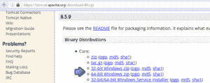
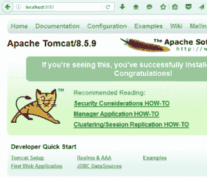
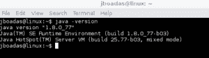
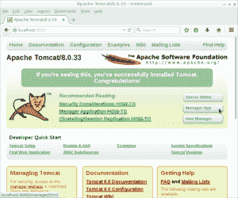
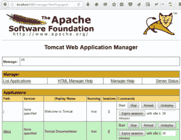

# Apache Tomcat 简介

> 原文:[https://web . archive . org/web/20220930061024/https://www . bael dung . com/Tomcat](https://web.archive.org/web/20220930061024/https://www.baeldung.com/tomcat)

## **1。概述**

简单地说，Apache Tomcat 是一个 web 服务器和用于部署和服务 Java web 应用程序的 servlet 容器。

在这篇简短的文章中，我们将展示如何安装 Tomcat，如何为 Tomcat 管理器配置用户，以及如何创建 SSL 证书以允许 Tomcat 提供 HTTPS 内容。

## **2。在 Windows 上安装 Tomcat**

### **2.1。下载并准备**

首先我们需要[下载 Tomcat](https://web.archive.org/web/20220628093655/https://tomcat.apache.org/download-80.cgi) 。

将服务器作为适用于 Windows 的 zip 文件下载:

[](/web/20220628093655/https://www.baeldung.com/wp-content/uploads/2017/01/1-Download-Tomcat.png)

接下来，我们将简单地将 Tomcat 解压缩到它的目录中。

### **2.3。安装**

在 Windows 上，需要进行快速的额外安装。打开 Windows 终端，从 Tomcat 安装目录`bin`中:

```
C:\Java\Apache Tomcat 8.5.9\bin> 
```

使用以下命令安装服务:

```
C:\Java\Apache Tomcat 8.5.9\bin>service install 
```

输出应该如下所示:

```
Installing the service 'Tomcat8' ...
Using CATALINA_HOME:    "C:\Java\Apache Tomcat 8.5.9"
Using CATALINA_BASE:    "C:\Java\Apache Tomcat 8.5.9"
Using JAVA_HOME:        "C:\Java\jdk1.8.0_40"
Using JRE_HOME:         "C:\Java\jre1.8.0_40"
Using JVM:              "C:\Java\jre1.8.0_40\bin\client\jvm.dll"
The service 'Tomcat8' has been installed.
```

### **2.4。启动 Tomcat 服务**

使用以下命令启动服务:

```
C:\Java\Apache Tomcat 8.5.9\bin>sc start Tomcat8 
```

您应该得到以下输出:

```
SERVICE_NAME: Tomcat8
        TYPE               : 10  WIN32_OWN_PROCESS
        STATUS             : 2  START_PENDING
                                (NOT_STOPPABLE, NOT_PAUSABLE, IGNORES_SHUTDOWN)
        WIN32_OUTPUT_CODE  : 0  (0x0)
        SERVICE_OUTPUT_CODE: 0  (0x0)
        CHECK-POINT        : 0x0
        START-INDICATOR    : 0x7d0
        PID                : 5552
        MARKS              :
```

在 URL 中打开浏览器:

[http://localhost:8080](https://web.archive.org/web/20220628093655/http://localhost:8080/)

您应该会看到 Tomcat 的欢迎屏幕。

[](/web/20220628093655/https://www.baeldung.com/wp-content/uploads/2017/01/2-Tomcat-Welcome-Windows.png)

## **3。在 Linux (Debian)上安装 Tomcat**

我们将在 Ubuntu Linux 16.06 上安装 Tomcat，但是这个过程应该可以在任何基于 Debian 的 Linux 发行版上运行良好。

### **3.1。下载并解压缩**

类似地，我们将[下载](https://web.archive.org/web/20220628093655/https://tomcat.apache.org/download-80.cgi)并解压缩 Tomcat:

```
sudo mkdir /opt/tomcat
sudo tar xvf apache-tomcat-8.5.9.tar.gz -C /opt/tomcat --strip-components=1
```

### **3.2。确保安装了 Java**

我们还要确保系统上安装了 Java，并且 Java 可用:

```
java -version
```

您应该得到以下输出:

[](/web/20220628093655/https://www.baeldung.com/wp-content/uploads/2017/01/4-Java-Version.png)

### **3.3。创建用户和群组**

我们将在单独的组和用户下运行服务器；让我们先为它创建一个组:

```
sudo groupadd tomcat
```

让我们创建一个 Tomcat 用户以避免使用 root 用户:

```
sudo useradd -s /bin/false -g tomcat -d /opt/tomcat tomcat
```

我们还要更新服务器的权限，以便在新用户和组中使用它们:

```
cd /opt/tomcat
sudo chgrp -R tomcat conf
sudo chmod g+rwx conf
sudo chmod g+r conf/*
sudo chown -R tomcat work/ temp/ logs/
```

最后，让我们确保 Tomcat 通过一个简单的 Upstart 脚本自动启动:

```
vi /etc/init/tomcat.conf
```

操作系统使用`tomcat.conf`脚本在引导时启动 Tomcat 服务。

该脚本用于在需要时启动和停止服务:

```
description "Tomcat Server"
    start on runlevel [2345]
    stop on runlevel [!2345]
    setuid tomcat
    setgid tomcat
    env JAVA_HOME=/opt/jdk1.8.0_77/jre/
    env CATALINA_HOME=/opt/tomcat
    exec $CATALINA_HOME/bin/catalina.sh run
```

### **3.4。开始**

转到 opt/tomcat/bin 目录并执行以下命令:

```
./catalina.sh start
```

您应该会看到以下输出:

```
Using CATALINA_BASE:   /opt/tomcat
Using CATALINA_HOME:   /opt/tomcat
Using CATALINA_TMPDIR: /opt/tomcat/temp
Using JRE_HOME:        /usr
Using CLASSPATH:       /opt/tomcat/bin/bootstrap.jar:/opt/tomcat/bin/tomcat-juli.jar
Tomcat started.
[[email protected]](/web/20220628093655/https://www.baeldung.com/cdn-cgi/l/email-protection):/opt/tomcat/bin#
```

现在是测试我们服务器的时候了。

在 URL 中打开浏览器:

[http://localhost:8080](https://web.archive.org/web/20220628093655/http://localhost:8080/)

您应该会看到下面的页面:

[](/web/20220628093655/https://www.baeldung.com/wp-content/uploads/2017/01/5-Tomcat-Welcome-Linux.png)

## 4.Tomcat 管理器

要访问 Tomcat 管理器，我们需要创建一个拥有该权限的用户。

**在 Windows 上:**

```
C:\Java\Apache Tomcat 8.5.9\conf\tomcat-users.xml
```

**在 Linux 上:**

```
/opt/tomcat/conf/tomcat-users.xml
```

在这个文件中，我们将定义访问 tomcat 管理器的用户。

```
<?xml version='1.0' encoding='utf-8'?>
<tomcat-users 
  xmlns:xsi="http://www.w3.org/2001/XMLSchema-instance"
  xsi:schemaLocation="http://tomcat.apache.org/xml tomcat-users.xsd"
  version="1.0">
    <user username="admin" password="admin" roles="manager-gui,admin-gui"/>
</tomcat-users>
```

在`<user>`标签中，我们使用角色 manager-gui 和 admin-gui 定义了一个密码为“admin”的用户“admin”。

现在重启服务器并再次打开 URL:

[http://localhost:8080](https://web.archive.org/web/20220628093655/http://localhost:8080/)

这一次点击“管理应用”按钮，服务器将要求凭证。输入提供的凭据后，您应该会看到以下屏幕:

[](/web/20220628093655/https://www.baeldung.com/wp-content/uploads/2017/01/6-Tomcat-Manager.png)

## 5.SSL 证书

运行以下命令来生成证书:

**在 Windows 上:**

```
keytool -genkey -alias tomcat -keyalg RSA -keystore C:\Java\apache-tomcat-8.5.9\keystore\tomcat
```

**在 Linux 上:**

```
keytool -genkey -alias tomcat -keyalg RSA -keystore /opt/tomcat/keystore/tomcat
```

该工具将询问一些问题来提供证书。证书将放在文件夹中，证书的名称是“tomcat”。您可以在 Windows: 上用
**检查证书**

```
keytool -list -keystore C:\Java\apache-tomcat-8.5.9\keystore\tomcat
```

**在 Linux 上:**

```
keytool -list -keystore /opt/tomcat/keystore/tomcat
```

### **5.1。使用证书**

编辑文件:

**在 Windows 上:**

```
C:\Java\Apache Tomcat 8.5.9\conf\server.xml
```

**在 Linux 上:**

```
/opt/tomcat/conf/server.xml
```

并添加一个 SSL 连接器。

```
<Connector port="8443" protocol="org.apache.coyote.http11.Http11NioProtocol"
  maxThreads="150" SSLEnabled="true" scheme="https" secure="true"
  clientAuth="false" sslProtocol="TLS"
  keystoreFile="C:\Java\apache-tomcat-8.0.23\keystore\tomcat"
  keystorePass="changeit" /> 
```

重启 Tomcat 就大功告成了。现在，您可以在 Tomcat 的 HTTPS 下运行您的应用程序。

## **6。结论**

在这篇快速教程的最后，我们现在有了一个可以在开发过程中使用的 Linux 和 Windows 中的 Tomcat。

为了在生产中使用 Tomcat，我们当然需要相应地配置和调优服务器。