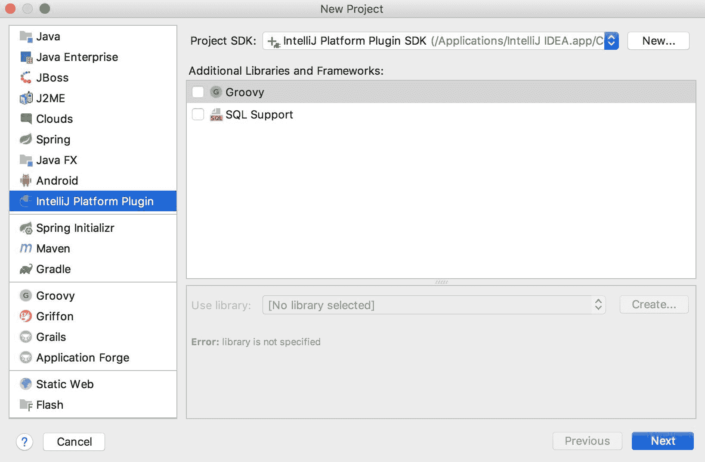
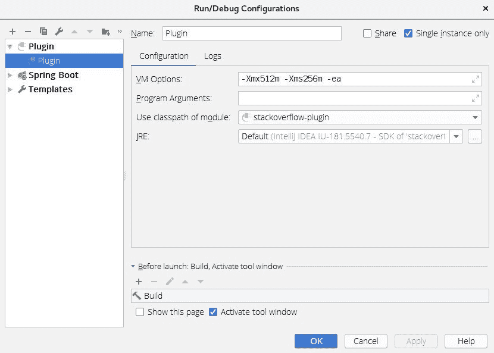
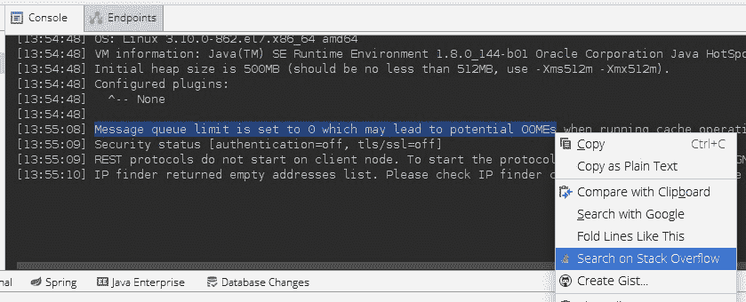

# 编写 IntelliJ IDEA 插件

> 原文:[https://web . archive . org/web/20220930061024/https://www . bael dung . com/intellij-new-custom-plugin](https://web.archive.org/web/20220930061024/https://www.baeldung.com/intellij-new-custom-plugin)

## **1。简介**

在过去的几年里，JetBrains 的 IntelliJ 已经迅速成为 Java 开发人员的顶级 IDE。在我们最近的[Java State of Java 报告](/web/20221129001208/https://www.baeldung.com/java-in-2018)中，IntelliJ 是 55%受访者的首选 IDE，高于去年的 48%。

IntelliJ 吸引 Java 开发人员的一个特性是使用插件扩展和创建新功能的能力。在本教程中，我们将学习编写一个 IntelliJ 插件来演示一些扩展 IDE 的方法。

请注意，虽然本文关注的是 IntelliJ 插件，但是所有的 JetBrains IDEs 都共享相同的代码。因此，**这里使用的很多技术都可以应用到其他 JetBrain 的 ide**上，比如 PyCharm、RubyMine 等等。

## **2。插件功能**

IntelliJ 的插件功能通常分为 4 类:

*   定制语言:编写、解释和编译用不同语言编写的代码的能力
*   **框架**:支持 Spring 等第三方框架
*   **工具**:与 Gradle 等外部工具集成
*   **用户界面附加组件**:新的菜单项、工具窗口和按钮等

**插件通常会分成多个类别**。例如，IntelliJ 附带的 [Git 插件](https://web.archive.org/web/20221129001208/https://www.jetbrains.com/help/idea/using-git-integration.html)与系统上安装的 Git 可执行文件进行交互。该插件提供了它的工具窗口和弹出式菜单项，同时还集成到项目创建工作流程，首选项窗口，等等。

## **3。创建插件**

开始使用 IntelliJ 插件最简单的方法是使用他们的[插件开发包](https://web.archive.org/web/20221129001208/http://www.jetbrains.org/intellij/sdk/docs/basics/getting_started/using_dev_kit.html)。这可以从`New` > `Project`菜单进入:

[](/web/20221129001208/https://www.baeldung.com/wp-content/uploads/2018/08/intellij-plugin.jpg)

**注意我们必须使用 JetBrains JDK** 来确保所需的插件类在类路径中可用。默认情况下，IntelliJ 应该有一个合适的 JDK，但如果没有，我们可以从[这里](https://web.archive.org/web/20221129001208/https://bintray.com/jetbrains/intellij-jdk)下载一个。

截至本文撰写之时，**我们只能使用 Java 8 来编写 IntelliJ 插件**。这是因为 JetBrains 目前没有为 Java 9 或更高版本提供官方 JDK。

## **4。示例插件**

为了演示如何编写一个 IntelliJ 插件，我们将创建一个插件，提供从 IDE 的多个区域快速访问流行的堆栈溢出网站。我们将补充:

*   用于访问“提出问题”页面的工具菜单项
*   文本编辑器和控制台输出中的弹出菜单项，用于在堆栈溢出中搜索突出显示的文本。

### **4.1。创建动作**

**动作是用于编写 IntelliJ 插件**的核心组件。动作由 IDE 中的事件触发，例如单击菜单项或工具栏按钮。

创建动作的第一步是创建一个扩展`AnAction`的 Java 类。对于堆栈溢出插件，我们将创建 2 个动作。

第一个操作在新的浏览器窗口中打开“提出问题”页面:

```
public class AskQuestionAction extends AnAction {
   @Override
   public void actionPerformed(AnActionEvent e) {
       BrowserUtil.browse("https://stackoverflow.com/questions/ask");
   }
}
```

我们使用内置的`BrowserUtil`类，因为它处理在不同操作系统和浏览器上打开网页的所有细微差别。

第二个操作打开“堆栈溢出搜索”页面，并将搜索文本作为查询字符串传递。这次我们将实现两个方法。

我们实现的第一个方法就像我们的第一个动作，处理打开 web 浏览器。

首先，我们需要为 StackOverflow 收集两个值。一个是语言标签，另一个是要搜索的文本。

为了获得语言标签，我们将使用[程序结构接口](https://web.archive.org/web/20221129001208/http://www.jetbrains.org/intellij/sdk/docs/basics/architectural_overview/psi.html)。**这个 API 解析一个项目中的所有文件，并提供一个检查它们的编程方式。**

在这种情况下，我们使用 PSI 来确定文件的编程语言:

```
PsiFile file = e.getData(CommonDataKeys.PSI_FILE);
Language lang = e.getData(CommonDataKeys.PSI_FILE).getLanguage();
String languageTag = "+[" + lang.getDisplayName().toLowerCase() + "]";
```

请注意，PSI 还提供了关于文件的特定于语言的详细信息。例如，**我们可以使用 PSI 来查找 Java 类中的所有公共方法。**

为了获取要搜索的文本，我们将使用`Editor ` API 来检索屏幕上高亮显示的文本:

```
final Editor editor = e.getRequiredData(CommonDataKeys.EDITOR);
CaretModel caretModel = editor.getCaretModel();
String selectedText = caretModel.getCurrentCaret().getSelectedText();
```

尽管此操作对于编辑器和控制台窗口是相同的，但访问所选文本的方式是相同的。

现在，我们可以将所有这些放在一个`actionPerformed`声明中:

```
@Override
public void actionPerformed(AnActionEvent e) {

    PsiFile file = e.getData(CommonDataKeys.PSI_FILE);
    Language lang = e.getData(CommonDataKeys.PSI_FILE).getLanguage();
    String languageTag = "+[" + lang.getDisplayName().toLowerCase() + "]";

    Editor editor = e.getRequiredData(CommonDataKeys.EDITOR);
    CaretModel caretModel = editor.getCaretModel();
    String selectedText = caretModel.getCurrentCaret().getSelectedText()

    String query = selectedText.replace(' ', '+') + languageTag;
    BrowserUtil.browse("https://stackoverflow.com/search?q=" + query);
} 
```

这个动作也覆盖了第二个名为`update`的方法。这允许我们在不同条件下启用或禁用该操作。

在这种情况下，当没有选定的文本时，我们禁用搜索操作:

```
@Override
public void update(AnActionEvent e) {
     Editor editor = e.getRequiredData(CommonDataKeys.EDITOR);
     CaretModel caretModel = editor.getCaretModel();
     e.getPresentation().setEnabledAndVisible(caretModel.getCurrentCaret().hasSelection());
} 
```

### **4.2。注册动作**

一旦我们写好了动作，**我们需要在 IDE** 中注册它们。有两种方法可以做到这一点。

第一种方法是使用`plugin.xml`文件，它是在我们开始一个新项目时为我们创建的。

默认情况下，该文件将有一个空的`<actions>`元素，我们将在这里添加我们的操作:

```
<actions>
    <action 
      id="StackOverflow.AskQuestion.ToolsMenu"
      class="com.baeldung.intellij.stackoverflowplugin.AskQuestionAction"
      text="Ask Question on Stack Overflow"
      description="Ask a Question on Stack Overflow">
        <add-to-group group-id="ToolsMenu" anchor="last"/>
    </action>
    <action 
      id="StackOverflow.Search.Editor"
      class="com.baeldung.intellij.stackoverflowplugin.SearchAction"
      text="Search on Stack Overflow"
      description="Search on Stack Overflow">
        <add-to-group group-id="EditorPopupMenu" anchor="last"/>
    </action>
    <action 
      id="StackOverflow.Search.Console"
      class="com.baeldung.intellij.stackoverflowplugin.SearchAction"
      text="Search on Stack Overflow"
      description="Search on Stack Overflow">
        <add-to-group group-id="ConsoleEditorPopupMenu" anchor="last"/>
    </action>
</actions>
```

使用 XML 文件注册操作将确保它们在 IDE 启动时注册，这通常是更可取的做法。

注册动作的第二种方式是以编程方式使用`ActionManager`类:

```
ActionManager.getInstance().registerAction("StackOverflow.SearchAction", new SearchAction());
```

这有利于我们动态注册动作。例如，如果我们编写一个插件来集成一个远程 API，我们可能希望根据我们调用的 API 版本注册一组不同的操作。

这种方法的缺点是动作在启动时不会注册。我们必须创建一个`ApplicationComponent`实例来管理动作，这需要更多的编码和 XML 配置。

## **5。测试插件**

与任何程序一样，编写 IntelliJ 插件需要测试。对于一个像我们写的这样的小插件，它足以确保插件编译，并且当我们点击它们时，我们创建的动作按预期工作。

我们可以通过使用插件运行配置来手动测试(和调试)我们的插件:

[](/web/20221129001208/https://www.baeldung.com/wp-content/uploads/2018/08/intellij-plugin-run-configuration.jpg)

这将启动一个新的 IntelliJ 实例，并激活我们的插件。这允许我们单击我们创建的不同菜单项，并确保打开正确的堆栈溢出页面。

如果您希望进行更传统的单元测试，IntelliJ 提供了一个[无头环境](https://web.archive.org/web/20221129001208/http://www.jetbrains.org/intellij/sdk/docs/basics/testing_plugins.html)来运行单元测试。我们可以使用任何我们想要的测试框架来编写测试，并且测试使用来自 IDE 的真实的、未被支持的组件来运行。

## **6。部署插件**

插件开发包提供了一种简单的方法来打包插件，这样我们就可以安装和分发它们。只需右键单击插件项目并选择“准备插件模块进行部署”。这将在项目目录中生成一个 JAR 文件。

生成的 JAR 文件包含加载到 IntelliJ 所需的代码和配置文件。您可以在本地安装它，或者将其发布到一个[插件库](https://web.archive.org/web/20221129001208/http://www.jetbrains.org/intellij/sdk/docs/plugin_repository/index.html)供其他人使用。

下面的屏幕截图显示了一个正在运行的新堆栈溢出菜单项:

[](/web/20221129001208/https://www.baeldung.com/wp-content/uploads/2018/08/intellij-stackoverflow-pluginjpg.jpg)

## **7。结论**

在本文中，我们开发了一个简单的插件，突出了我们如何增强 IntelliJ IDE 的几个方面。

虽然我们主要处理动作，但 IntelliJ 插件 SDK 提供了几种向 IDE 添加新功能的方法。如需进一步阅读，请查看[官方入门指南](https://web.archive.org/web/20221129001208/http://www.jetbrains.org/intellij/sdk/docs/welcome.html)。

和往常一样，我们的示例插件的完整代码可以在我们的 [GitHub 库](https://web.archive.org/web/20221129001208/https://github.com/eugenp/tutorials/tree/master/intelliJ-modules)中找到。