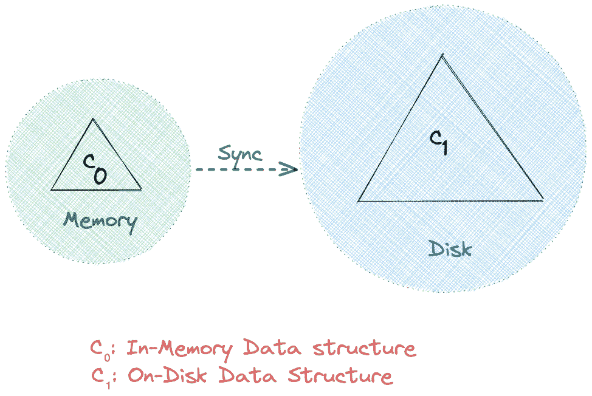
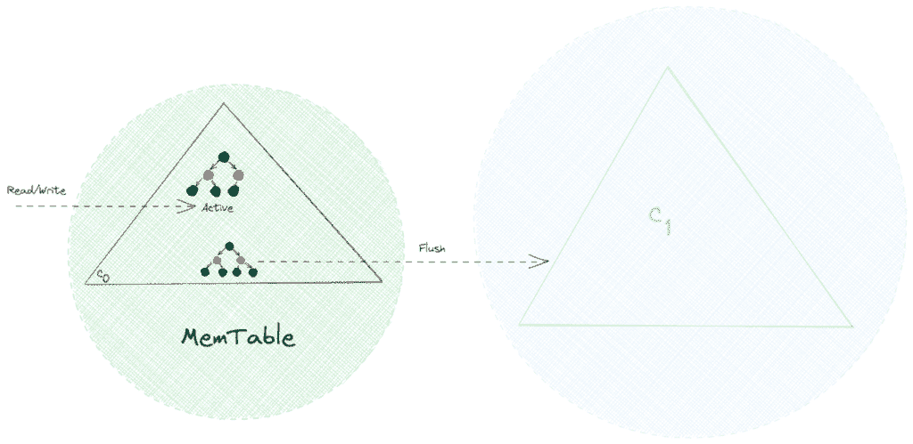
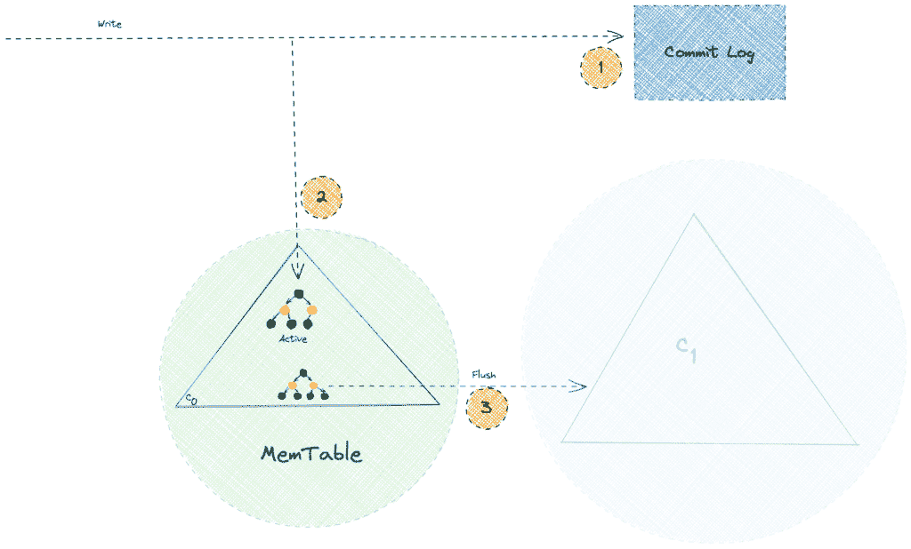
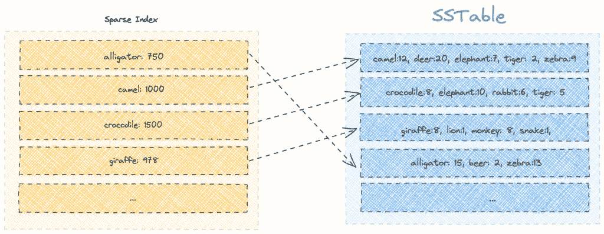
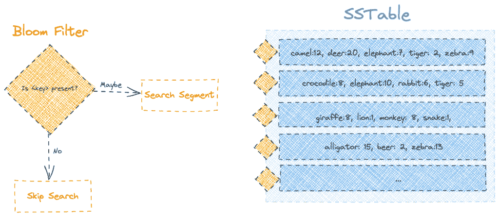
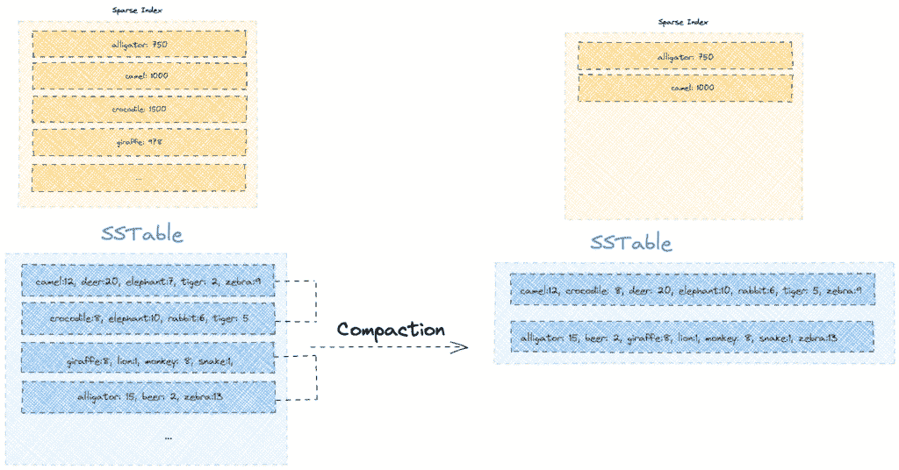

# Apache Cassandra 中的存储引擎指南

> 原文：<https://web.archive.org/web/20220930061024/https://www.baeldung.com/cassandra-storage-engine>

## 1.概观

现代数据库系统通过利用复杂的存储引擎读写数据来保证一系列功能，如可靠性、一致性、高吞吐量等。

在本教程中，我们将**深入探究 [Apache Cassandra](/web/20221006102916/https://www.baeldung.com/cassandra-with-java#Cassandra) 使用的存储引擎的内部结构，该引擎旨在处理大量写入的工作负载，同时保持良好的读取性能**。

## 2.日志结构的合并树(LSMT)

**Apache Cassandra 利用基于两级日志结构合并树的数据结构进行存储**。在高层次上，在这样的 LSM 树中有两个树状组件，一个内存缓存组件(C 0 )和一个磁盘组件(C 1 ):

直接从内存读写通常比磁盘快。因此，按照设计，所有的请求在到达 C 1 之前都命中 C 0 。此外，**同步操作定期将数据从 C0 保存到 C1**。因此，通过减少 I/O 操作，它有效地使用了**网络带宽。**

在接下来的几节中，我们将了解更多关于 Apache Cassandra 中两级 LSM 树的 C 0 和 C 1 数据结构，通常分别称为 MemTable 和 SSTable。

## 3.内存表

顾名思义， **MemTable 是一种驻留在内存中的数据结构，比如具有自平衡[二叉查找树](/web/20221006102916/https://www.baeldung.com/cs/binary-search-trees)属性**的[红黑树](/web/20221006102916/https://www.baeldung.com/cs/red-black-trees)。因此，所有的读写操作，即搜索、插入、更新和删除，都可以以 O(log n)的时间复杂度实现。

作为一个**内存中可变的数据结构，MemTable 使得所有的写操作都是连续的，并允许快速写操作**。此外，由于物理内存的典型约束，例如有限的容量和易失性，我们需要将 MemTable 中的数据持久存储到磁盘:

一旦 MemTable 的大小达到一个阈值，所有的读/写请求都会切换到一个新的 MemTable，而旧的 mem table 会在刷新到磁盘后被丢弃。

到目前为止，一切顺利！我们可以高效地处理大量写入。但是，如果节点在刷新操作之前崩溃，会发生什么情况呢？很简单，我们会丢失那些还没有刷新到磁盘的数据。

在下一节中，我们将看到 Apache Cassandra 如何通过使用预写日志(WAL)的概念来解决这个问题。

## 4.提交日志

Apache Cassandra 推迟了将数据从内存保存到磁盘的刷新操作。因此，意外的节点或流程崩溃会导致数据丢失。

持久性是任何现代数据库系统的必备功能，Apache Cassandra 也不例外。**它通过确保所有写操作都保存在磁盘上一个名为提交日志**的仅附加文件中来保证持久性。此后，它使用 MemTable 作为写入路径中的回写缓存:

我们必须注意，仅追加操作速度很快，因为它们避免了磁盘上的随机寻道。因此，提交日志在不影响写入性能的情况下提供了持久性功能。此外， **Apache Cassandra 仅在崩溃恢复场景**中引用提交日志，而常规的读取请求不会进入提交日志。

## 5.表

**排序字符串表(SSTable)是 Apache Cassandra 存储引擎**使用的 LSM 树的磁盘驻留组件。它的名字来源于一个类似的数据结构，最早由 Google 的 BigTable 数据库使用，表示数据是以排序格式提供的。一般来说，来自 MemTable 的每个刷新操作都会在 SSTable 中生成一个新的不可变段。

让我们试着想象一个包含动物园中各种动物数量数据的表是什么样子的:

尽管这些片段是按关键字排序的，但是同一个关键字可能出现在多个片段中。所以如果我们要寻找一个特定的键，我们需要从最近的部分开始搜索，一旦找到就返回结果。

使用这样的策略，对最近写入的键的读取操作将会很快。然而，在最坏的情况下，该算法以 O( `N` *log( `K`))的时间复杂度执行，其中`N`是段的总数，`K`是段的大小。由于`K`是一个常数，我们可以说整体时间复杂度为 O( `N`)，效率不高。

在接下来的几节中，我们将了解 Apache Cassandra 如何优化 SSTable 的读操作。

## 6.稀疏索引

Apache Cassandra 维护一个稀疏索引，以限制它在查找关键字时需要扫描的段的数量。

稀疏索引中的每个条目都包含段的第一个成员，以及它在磁盘上的页面偏移位置。此外，该索引在内存中作为一个 [B 树数据结构](/web/20221006102916/https://www.baeldung.com/cs/b-tree-data-structure)来维护，这样我们可以在 O(log( `K`)时间复杂度下搜索索引中的偏移量。

假设我们想要搜索关键字“啤酒”我们将从搜索单词“beer”之前的稀疏索引中的所有键开始。之后，使用偏移值，我们将只研究有限数量的段。在这种情况下，我们将查看第四段，其中第一个关键字是“鳄鱼”:

另一方面，如果我们必须搜索一个不存在的键，比如“kangaroo”，我们就必须徒劳地遍历所有的部分。因此，我们意识到使用稀疏索引在一定程度上优化了搜索。

此外，我们应该注意，SSTable 允许相同的键出现在不同的段中。因此，随着时间的推移，相同的键会发生越来越多的更新，从而也会在稀疏索引中创建重复的键。

在下面几节中，我们将了解 Apache Cassandra 如何借助 bloom filters 和压缩来解决这两个问题。

## 7.布隆过滤器

Apache Cassandra 使用一种被称为 [bloom filter](/web/20221006102916/https://www.baeldung.com/cs/bloom-filter) 的概率数据结构来优化读取查询。简单地说，**通过首先使用 bloom filter 对一个键执行成员检查来优化搜索。**

因此，通过为 SSTable 的每个段附加一个 bloom filter，我们可以对读取查询进行显著的优化，尤其是对于段中不存在的键:

由于布隆过滤器是概率数据结构，我们可以得到“也许”作为响应，即使对于丢失的键。然而，如果我们得到的回答是“否”,我们就可以确定这个键肯定是丢失了。

尽管它们有局限性，**我们可以计划通过为它们分配更大的存储空间来提高布隆过滤器的准确性**。

## 8.压紧

尽管使用了 bloom 过滤器和稀疏索引，但读取查询的性能会随着时间的推移而降低。这是因为包含不同密钥版本的段的数量可能会随着每次 MemTable 刷新操作而增加。

为了解决这个问题，Apache Cassandra 运行了一个后台压缩过程，将较小的排序段合并到较大的段中，同时只保留每个键的最新值。因此，**压缩过程带来了双重好处，即读取速度更快，存储容量更少**。

让我们看看在我们现有的表上运行一次压缩会是什么样子:

我们注意到压缩操作通过只保留最新版本来回收一些空间。例如，旧版本的键(如“elephant”和“tiger ”)不再存在，从而释放了磁盘空间。

此外，压缩过程支持硬删除键。虽然删除操作会用逻辑删除标记一个键，但实际的删除会推迟到压缩之后。

## 9.结论

在本文中，我们探索了 Apache Cassandra 存储引擎的内部组件。在此过程中，**我们学习了高级数据结构概念，如 LSM 树、MemTable 和 SSTable** 。此外，我们还学习了一些使用预写日志、Bloom Filters、稀疏索引和压缩的优化技术。