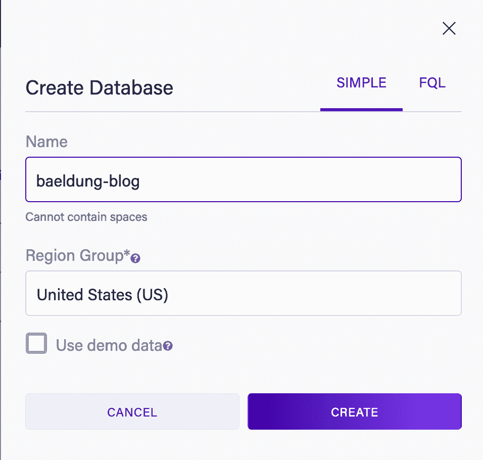
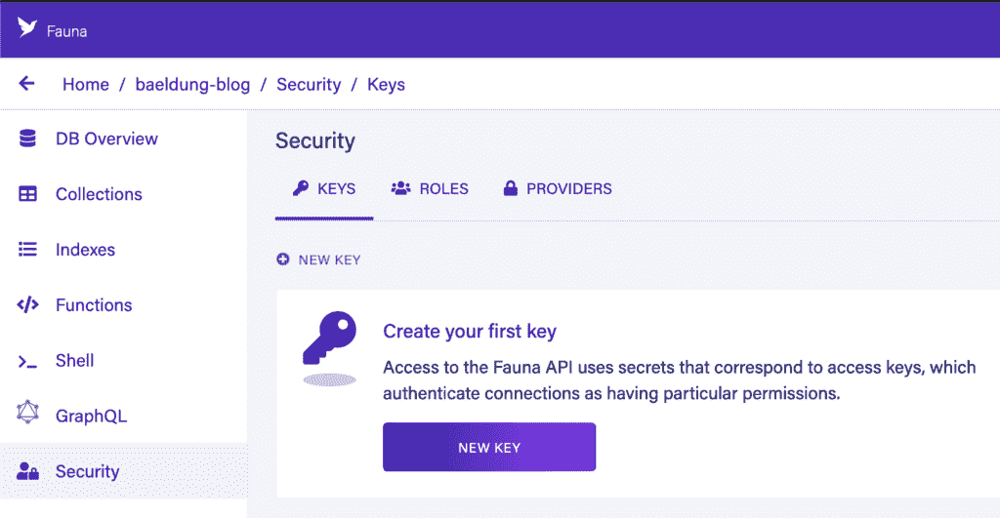
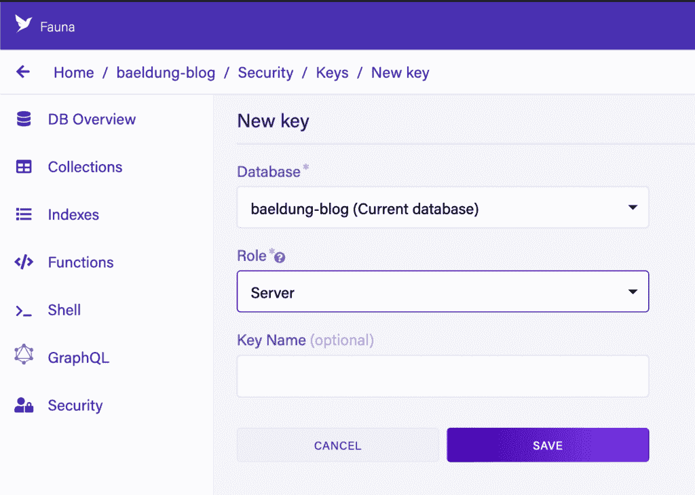
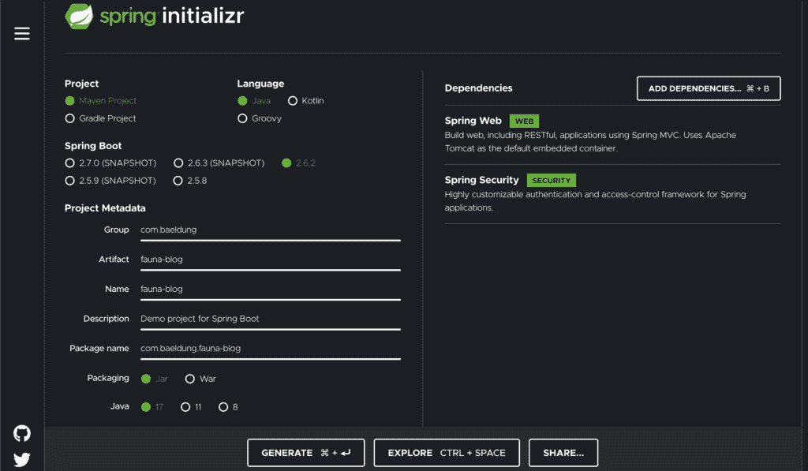
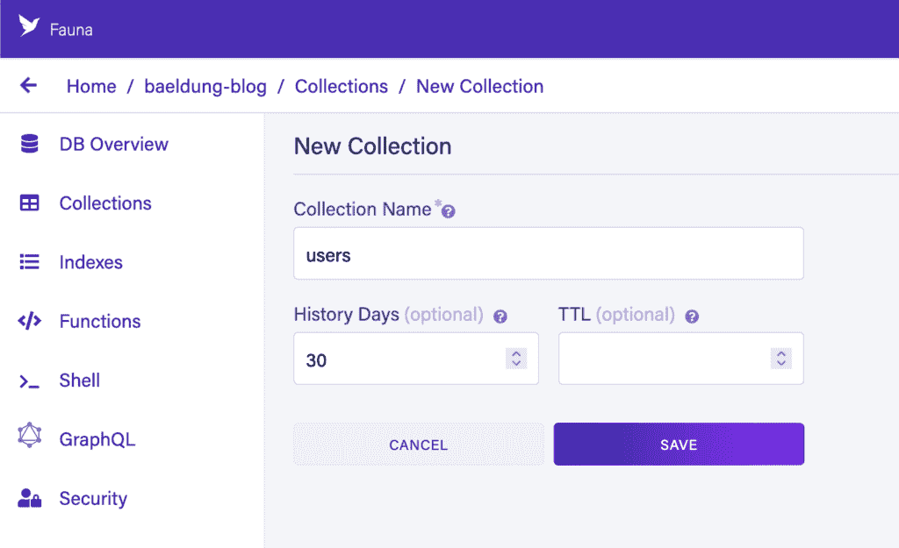
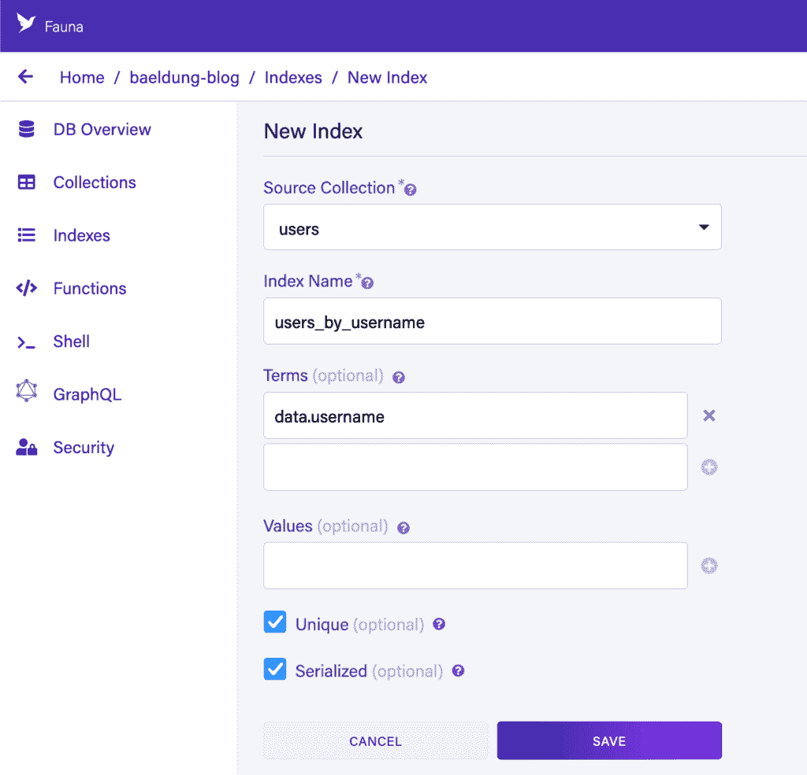
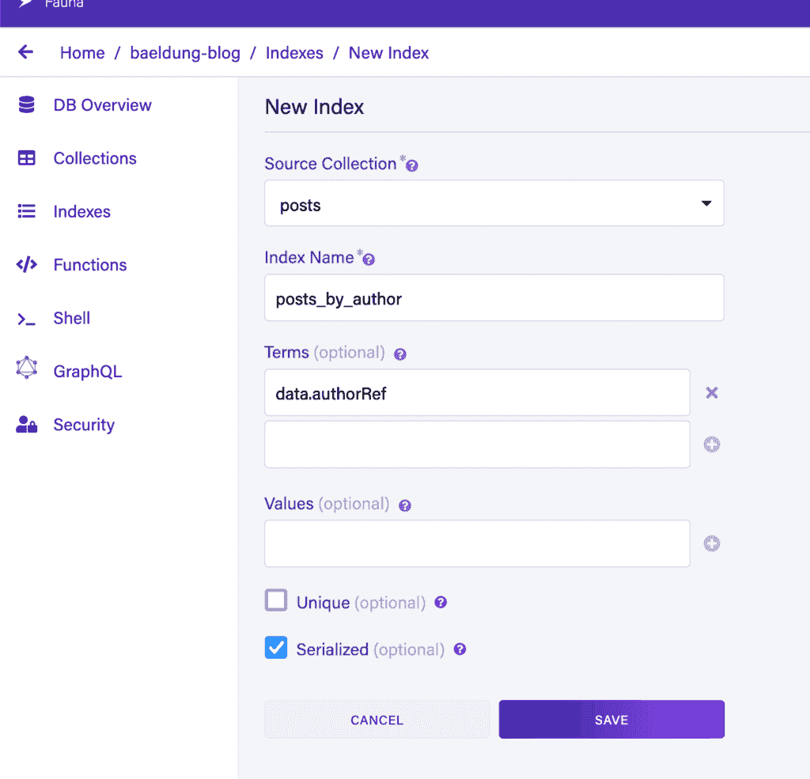

# 为您的第一个网络代理客户端使用 Fauna 和 Spring 构建一个 web 应用程序

> 原文：<https://web.archive.org/web/20220930061024/https://www.baeldung.com/faunadb-spring-web-app>

## **1。简介**

**在本文中，我们将使用 Spring 和 Java 17 构建一个由[动物群数据库服务](https://web.archive.org/web/20220524051216/https://fauna.com/)** 支持的博客服务的后端。

## **2。项目设置**

在开始构建我们的服务之前，我们需要执行一些初始设置步骤——具体来说，我们需要创建一个动物数据库和一个空白的 Spring 应用程序。

### **2.1。创建动物数据库**

开始之前，我们需要一个动物数据库。如果我们还没有账户，我们需要[用动物群](https://web.archive.org/web/20220524051216/https://dashboard.fauna.com/accounts/register)创建一个新账户。

完成后，我们可以创建一个新的数据库。给它一个名称和一个区域，并选择不包含演示数据，因为我们想要构建自己的模式:

接下来，**我们需要创建一个安全密钥来从我们的应用程序中访问它。**我们可以通过数据库中的“安全”选项卡来实现这一点:

在这里，我们需要选择一个“服务器”的“角色”,并且可以选择给这个键起一个名字。这意味着密钥可以访问这个数据库，但只能访问这个数据库。或者，我们有一个“Admin”选项，可用于访问我们帐户中的任何数据库:

完成后，**我们需要写下我们的秘密**。这是访问服务所必需的，但是**一旦我们离开这个页面，出于安全原因**就不能再获得了。

### **2.2。创建一个 Spring 应用程序**

一旦我们有了数据库，我们就可以创建应用程序了。因为这将是一个 Spring webapp，我们最好从 [Spring Initializr](https://web.archive.org/web/20220524051216/https://start.spring.io/) 启动它。

我们希望选择使用最新发布的 Spring 和最新发布的 Java LTS 来创建 Maven 项目——在撰写本文时，它们是 Spring 2.6.2 和 Java 17。我们还想选择 Spring Web 和 Spring Security 作为我们服务的依赖项:

一旦我们在这里完成，我们可以点击“生成”按钮下载我们的启动项目。

接下来，我们需要将动物驱动程序添加到我们的项目中。这是通过向生成的`pom.xml`文件添加对它们的依赖来实现的:

[PRE0]

此时，我们应该能够执行`mvn install`并让构建成功下载我们需要的一切。

### **2.3。配置动物群客户端**

一旦我们有了可以使用的 Spring webapp，我们需要一个动物群客户端来使用数据库。

首先，我们需要做一些配置。为此，我们将向我们的`application.properties`文件添加两个属性，为我们的数据库提供正确的值:

[PRE1]

然后，我们需要一个新的 Spring 配置类来构建动物群客户端:

[PRE2]

这使得 Spring 上下文可以使用一个`FaunaClient`实例，供其他 beans 使用。

## **3。增加对用户的支持**

在为我们的 API 添加对帖子的支持之前，我们需要对将要创作帖子的用户的支持。为此，我们将利用 Spring Security 并将其连接到代表用户记录的动物群集合。

### **3.1。创建用户集合**

我们要做的第一件事是打造这个系列。这是通过导航到我们数据库中的集合屏幕，使用“新集合”按钮，并填写表格来完成的。在本例中，我们希望使用默认设置创建一个“用户”集合:

接下来，我们将添加一个用户记录。为此，我们按下集合中的“新建文档”按钮，并提供以下 JSON:

[PRE3]

**注意，我们在这里以明文形式存储密码。请记住，这是一个可怕的做法，只是为了方便本教程。**

最后，我们需要一个索引。任何时候我们想通过引用之外的任何字段访问记录，我们需要创建一个索引来实现。这里，我们希望通过用户名访问记录。这可以通过按下“新索引”按钮并填写表格来完成:

现在，我们将能够使用“users_by_username”索引编写 FQL 查询来查找我们的用户。例如:

[PRE4]

上面将返回我们之前创建的记录。

### **3.2。针对动物群进行认证**

现在我们已经在动物群中收集了一批用户，我们可以配置 Spring Security 来验证这一点。

为了实现这一点，我们首先需要一个 [`UserDetailsService`](/web/20220524051216/https://www.baeldung.com/spring-security-authentication-with-a-database) 来查找用户的动物群:

[PRE5]

接下来，我们需要一些弹簧配置来设置它。这是连接上述`UserDetailsService`的标准 Spring 安全配置:

[PRE6]

此时，我们可以将标准的`@PreAuthorize`注释添加到我们的代码中，并根据验证细节是否存在于动物群中的“用户”集合中来接受或拒绝请求。

## **4。添加对列表文章的支持**

如果不支持帖子的概念，我们的博客服务就不会出色。这些是已经写好并可以被其他人阅读的真实博文。

### **4.1。创建帖子集合**

和以前一样，我们首先需要一个集合来存储帖子。这是同一个创建，只叫“帖子”而不是“用户”。我们将有四个字段:

*   标题–文章的标题。
*   内容–文章的内容。
*   创建时间——文章创作时的时间戳。
*   author ref–对文章作者的“用户”记录的引用。

我们还需要两个指数。第一个是“posts_by_author ”,它将让我们搜索具有特定作者的“posts”记录:

第二个索引将是“帖子 _ 排序 _ 按 _ 创建 _desc”。这将允许我们按照创建日期对结果进行排序，这样最近创建的帖子会首先返回。我们需要以不同的方式创建它，因为它依赖于 web UI 中没有的一个特性——指示索引以相反的顺序存储值。

为此，我们需要在动物外壳中执行 FQL 的一部分:

[PRE7]

web 用户界面所做的一切同样可以用这种方式来完成，允许对所做的事情进行更多的精确控制。

然后，我们可以在动物群外壳中创建一个帖子，以获得一些初始数据:

[PRE8]

这里，我们需要确保“authorRef”的值是我们之前创建的“users”记录中的正确值。我们通过查询“users_by_username”索引，通过查找我们的用户名来获得 ref。

### **4.2。帖子服务**

既然我们已经支持了动物群中的帖子，我们可以在我们的应用程序中构建一个服务层来使用它。

首先，我们需要一些 Java 记录来表示我们正在获取的数据。这将由一个`Author`和一个`Post`记录类组成:

[PRE9]

现在，我们可以开始我们的邮政服务。这将是一个 Spring 组件，它包装`FaunaClient`并使用它来访问数据存储:

[PRE10]

### **4.3。获取所有帖子**

在我们的`PostsService`中，我们现在可以实现一个方法来获取所有的文章。在这一点上，我们不会担心正确的分页，而是只使用默认值——这意味着结果集中的前 64 个文档。

为此，我们将把下面的方法添加到我们的`PostsService`类中:

[PRE11]

**这将执行一个查询，从“posts”集合中检索每个文档，并根据“posts_sort_by_created_desc”索引进行排序。然后它应用一个 Lambda 来构建响应，每个条目包含两个文档——帖子本身和帖子的作者。**

现在，我们需要能够将这个响应转换回我们的`Post`对象:

[PRE12]

这从我们的查询中提取一个结果，提取它的所有值，并构造我们更丰富的对象。

注意“ts”字段是记录最后一次更新的时间戳，但它不是动物群`Timestamp`类型。相反，它是一个代表自 UNIX 纪元以来的微秒数的`Long`。在这种情况下，我们将其视为不透明的版本标识符，而不是将其解析为时间戳。

### 4.4。获取单个作者的帖子

我们还希望检索由特定作者撰写的所有帖子，而不仅仅是曾经撰写的每个帖子。这是一个使用我们的“文章作者”索引的问题，而不仅仅是匹配每个文档。

我们还将链接到“users_by_username”索引，以通过用户名而不是用户记录的引用进行查询。

为此，我们将向`PostsService`类添加一个新方法:

[PRE13]

### **4.5。岗位控制器**

我们现在能够编写我们的 posts 控制器，它将允许 HTTP 请求到我们的服务来检索帖子。它将监听“/posts”URL，并根据是否提供了“author”参数，返回所有帖子或单个作者的帖子:

[PRE14]

此时，我们可以启动我们的应用程序，向`/posts` 或`/posts?author=baeldung`发出请求并获得结果:

[PRE15]

## **5。创建和更新帖子**

到目前为止，我们有一个完全只读的服务，可以让我们获取最近的帖子。然而，为了提供帮助，我们也想创建和更新帖子。

### **5.1。创建新职位**

首先，我们将支持创建新的职位。为此，我们将向我们的`PostsService`添加一个新方法:

[PRE16]

如果这看起来很熟悉的话，这就是我们早先在动物群外壳中创建新帖子时的 Java 等价物。

接下来，我们可以添加一个控制器方法，让客户端创建帖子。为此，我们首先需要一个 Java 记录来表示传入的请求数据:

[PRE17]

现在，我们可以在`PostsController`中创建一个新的控制器方法来处理请求:

[PRE18]

**注意，我们使用了`@PreAuthorize`注释来确保请求被认证，然后我们使用认证用户的用户名作为新帖子的作者。**

此时，启动服务并向端点发送 POST 将导致在我们的集合中创建一个新记录，然后我们可以使用早期的处理程序检索该记录。

### 5.2。更新现有帖子

更新现有帖子而不是创建新帖子对我们也有帮助。我们将通过接受带有新标题和内容的 PUT 请求并更新帖子以包含这些值来管理这个问题。

和以前一样，我们首先需要在`PostsService`上有一个新的方法来支持它:

[PRE19]

接下来，我们将处理程序添加到`PostsController`:

[PRE20]

请注意，我们使用相同的请求主体来创建和更新帖子。这完全没问题，因为两者具有相同的形状和含义——该帖子的新细节。

此时，启动服务并向正确的 URL 发送 PUT 将导致记录被更新。然而，如果我们用一个未知的 ID 调用，我们将得到一个错误。我们可以用一个异常处理方法来解决这个问题:

[PRE21]

这将导致更新未知帖子的请求返回 HTTP 404。

## **6。检索帖子的过去版本**

现在我们可以更新帖子了，查看旧版本会有所帮助。

首先，我们将向我们的`PostsService`添加一个新方法来检索帖子。这需要文章的 ID，以及可选地，我们想要获取的之前的版本——换句话说，如果我们提供版本“5 ”,那么我们想要返回版本“4 ”:

[PRE22]

**这里介绍一下`At`方法，它会让动物群返回给定时间点的数据。**我们的版本号只是以微秒为单位的时间戳，因此我们可以通过简单地请求在给定值之前 1μs 的数据来获得给定点之前的值。

同样，我们需要一个控制器方法来处理传入的调用。我们将把它添加到我们的`PostsController`:

[PRE23]

现在，我们可以获得个人帖子的个人版本。对`/posts/321742144715882562` 的调用将获得该文章的最新版本，但对`/posts/321742144715882562?before=1643183487660000`的调用将获得该版本之前的文章版本。

## **7。结论**

在这里，我们探索了动物数据库的一些特性，以及如何利用它们构建应用程序。动物群还有很多我们在这里没有涉及到的东西，但是为什么不在你的下一个项目中尝试探索它们呢？

和往常一样，这里显示的所有代码都可以在 [GitHub](https://web.archive.org/web/20220524051216/https://github.com/eugenp/tutorials/tree/master/persistence-modules/fauna) 上获得。