# JPA Buddy 指南

> 原文:[https://web . archive . org/web/20220930061024/https://www . bael dung . com/JPA-buddy](https://web.archive.org/web/20220930061024/https://www.baeldung.com/jpa-buddy)

## 1.概观

[JPA Buddy](https://web.archive.org/web/20221207045809/https://plugins.jetbrains.com/plugin/15075-jpa-buddy) 是一个广泛使用的 IntelliJ IDEA 插件，面向使用 JPA 数据模型和相关技术(如 Spring Data [、JPA](/web/20221207045809/https://www.baeldung.com/learn-jpa-hibernate) 、DB 版本工具( [Flyway](/web/20221207045809/https://www.baeldung.com/database-migrations-with-flyway) 、 [Liquibase](/web/20221207045809/https://www.baeldung.com/liquibase-refactor-schema-of-java-app) )、 [MapStruct](/web/20221207045809/https://www.baeldung.com/mapstruct) 以及其他一些技术)的新老开发人员。该插件提供了可视化的设计器、代码生成和额外的检查，可以根据 JPA 的最佳实践简化开发和改进代码。

该插件可以在 IntelliJ IDEA 的社区和终极版本下工作，并使用“免费增值”模式。大多数功能都是免费的，我们需要购买订阅才能使用付费功能。

在本教程中，我们将看看插件的主要特性，并看看我们如何在应用程序开发周期中使用它们。作为一个例子，我们将使用流行的参考应用程序—“[Spring pet clinic](https://web.archive.org/web/20221207045809/https://github.com/spring-projects/spring-petclinic)”。

## 2.入门指南

我们可以在向应用程序源代码添加 JPA 依赖时自动激活 JPA Buddy。该插件在“推荐的 InteiilJ 插件”列表中，所以即使我们没有安装它，IDEA 也会建议我们这样做。我们也可以从 IntelliJ 的市场安装插件:

[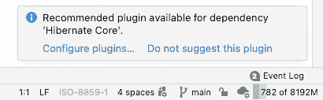](/web/20221207045809/https://www.baeldung.com/wp-content/uploads/2022/04/Picture-1.png)

JPA Buddy 功能可能因应用程序附带的库而异。例如，如果我们既没有连接 Liquibase 也没有连接 Flyway，我们就看不到用于 DB 版本脚本生成的菜单。

## 3.使用 JPA 实体

通常，应用程序开发从数据模型开始。JPA Buddy 提供了一个可视化设计器和组件面板，允许我们创建一个实体，并向其添加基本属性和关联。我们可以从上下文菜单或 JPA 结构工具窗口中调用相应的操作:

[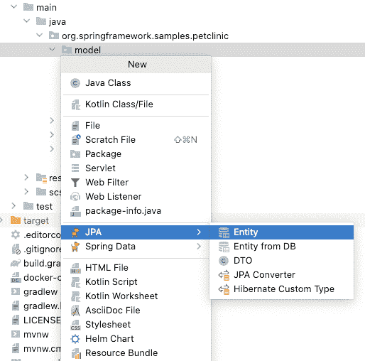](/web/20221207045809/https://www.baeldung.com/wp-content/uploads/2022/04/Picture-2.png)

如果我们需要添加或编辑实体属性，我们可以使用 JPA 调色板和检查器。要添加属性，我们需要双击它或执行拖放操作。可视化编辑器允许我们定义属性特性:

[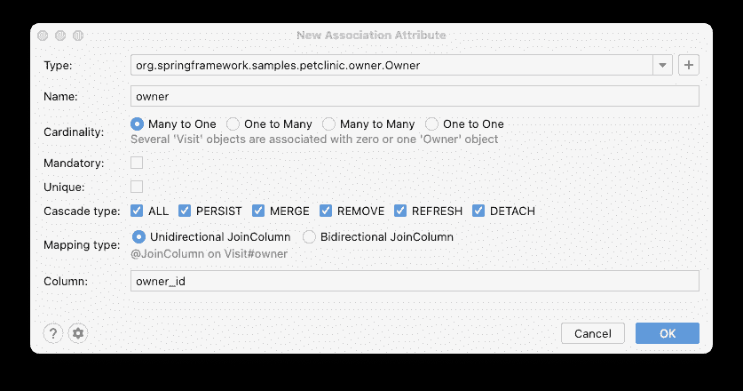](/web/20221207045809/https://www.baeldung.com/wp-content/uploads/2022/04/Picture-3.png)

要编辑实体的属性，我们可以使用 JPA 检查器。根据 JPA 规范，检查器允许我们查看和编辑实体属性的几乎所有选项。编辑器有两种工作方式:当我们更新一个属性的属性时，代码也被更新。反之亦然，当实体的代码被更新时，所有的更改都会反映在检查器中。

### 3.1.龙目支持

根据 JPA 规范，实体应该有属性的 getters 和 setters，这通常被视为“样板”代码。Lombok 是一个流行的库，它允许我们避免编写样板文件，而是用一些注释来代替。许多开发人员在 JPA 实体定义中使用 Lombok，因此 JPA Buddy 完全支持它。我们可以在 JPA 检查器中编辑与 Lombok 相关的属性:

[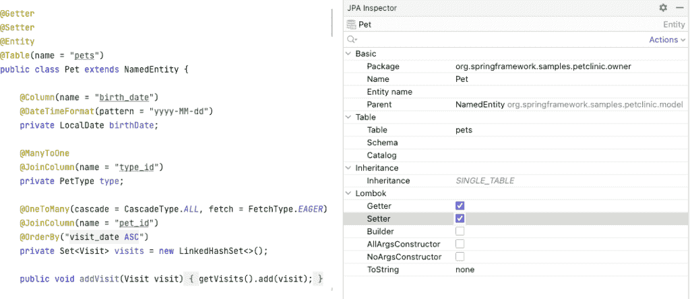](/web/20221207045809/https://www.baeldung.com/wp-content/uploads/2022/04/Picture-4.png)

插件功能不限于检查和编辑。支持的重要部分是检查。当与 JPA 一起使用时，一些 Lombok 注释可能会导致性能问题或意外错误。例如，使用`@ToString`注释可能会导致 [`LazyInitException`](/web/20221207045809/https://www.baeldung.com/hibernate-initialize-proxy-exception) ，因为它使用对象字符串表示的所有属性，包括惰性属性。

JPA Buddy 会显示此类情况的警告并提供快速修复，它帮助我们避免 JPA 代码中的错误:

[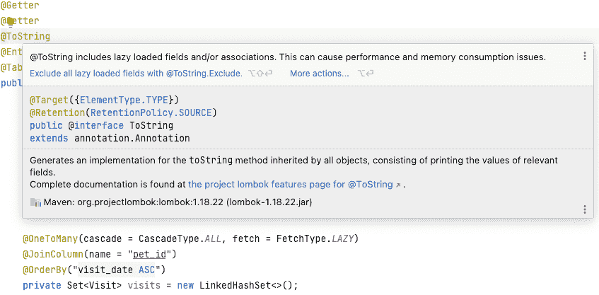](/web/20221207045809/https://www.baeldung.com/wp-content/uploads/2022/04/Picture-5.png)

## 4.使用 Liquibase 和 Flyway 进行数据库迁移

为了从 JPA 数据模型创建数据库，我们通常使用 DB 版本控制工具；Liquibase 和 Flyway 是这一领域的两大巨头。数据库迁移过程中最容易出错的部分是根据 JPA 实体的变化编写迁移脚本。JPA Buddy 为 Liquibase 和 Flyway 都提供了模式差异脚本生成。该插件可以将现有的 DB 模式与 JPA 模型甚至两个模式进行比较:

[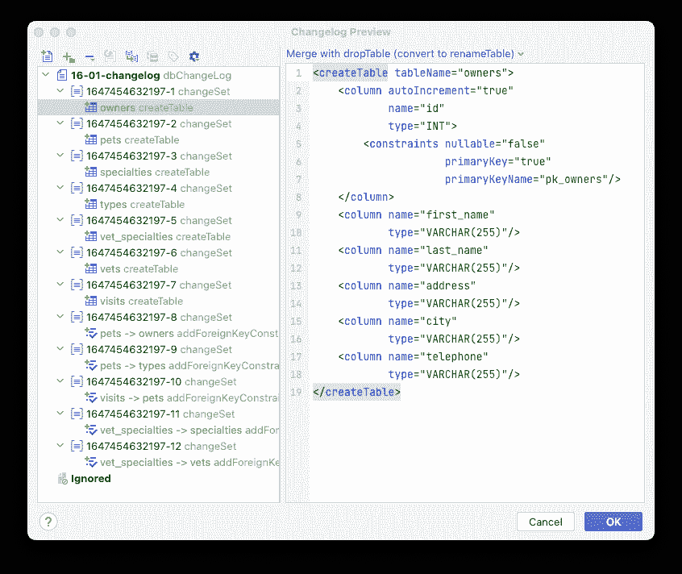](/web/20221207045809/https://www.baeldung.com/wp-content/uploads/2022/04/Picture-6.png)

除此之外，JPA Buddy 还提供脚本自动完成和智能预览。在这种模式下，插件分析生成的脚本，如果更改会导致目标数据源在更新时失败，则显示警告:

[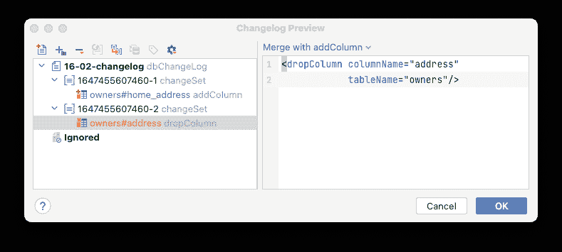](/web/20221207045809/https://www.baeldung.com/wp-content/uploads/2022/04/Picture-7.png)

## 5.Spring 数据 JPA 支持

创建数据模型后，下一步是实现数据访问存储库。Spring Data JPA 可能是最流行的框架。JPA Buddy 允许我们基于实体定义生成新的存储库。在存储库代码中，我们可以使用 JPA 调色板，使用可视化工具在存储库代码中创建各种派生方法和查询:

[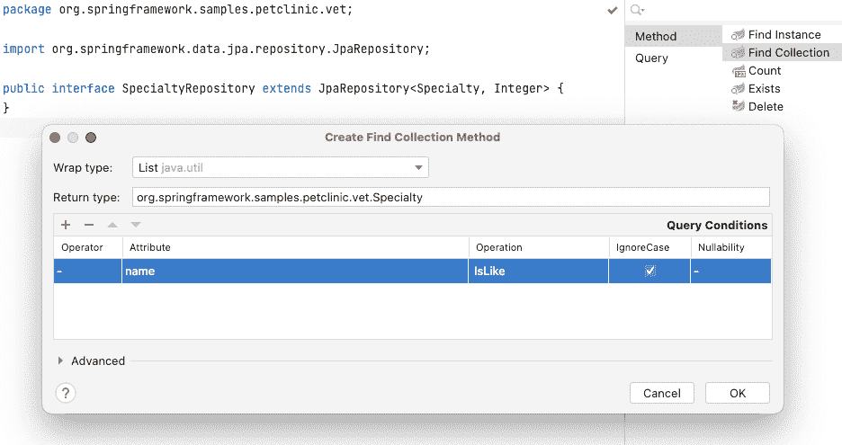](/web/20221207045809/https://www.baeldung.com/wp-content/uploads/2022/04/Picture-8.png)

对于每种方法，我们可以使用 JPA inspector 来更改其属性。该插件允许我们添加分页和排序，以及为方法的返回数据类型创建投影:

[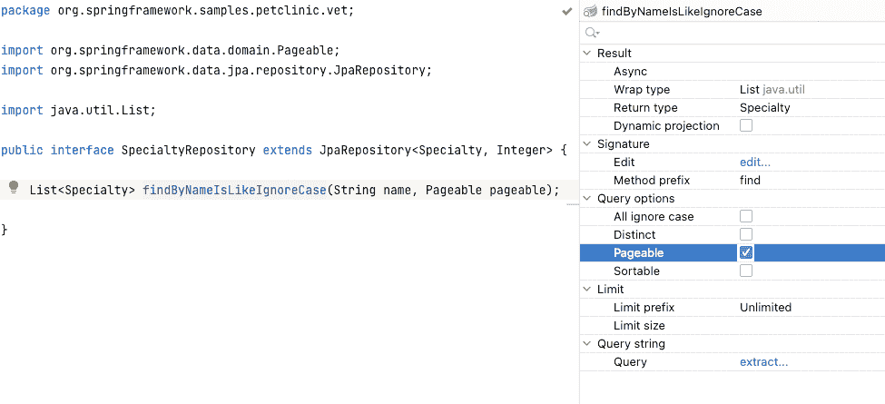](/web/20221207045809/https://www.baeldung.com/wp-content/uploads/2022/04/Picture-9.png)

一个更有用的特性是查询提取。对于像这样的复杂查询，有时派生的方法名可能会变得太长:

```
List<Owner> findDistinctByFirstNameIgnoreCaseOrLastNameIgnoreCaseOrPets_NameIgnoreCaseAllIgnoreCaseOrderByFirstNameAsc(
  String firstName, String lastName, String name);
```

JPA Buddy 分析派生的方法名，并允许我们通过重命名和移动 JPQL 查询到`@Query`注释来重构它:

[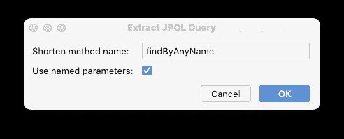](/web/20221207045809/https://www.baeldung.com/wp-content/uploads/2022/04/Picture-10.png)

```
@Query("select distinct o from Owner o left join o.pets pets " +
  "where upper(o.firstName) = upper(:firstName) " +
  "or upper(o.lastName) = upper(:lastName) " +
  "or upper(pets.name) = upper(:name) " +
  "order by o.firstName")
List<Owner> findByAnyName(@Param("firstName") String firstName,
  @Param("lastName") String lastName,
  @Param("name") String name); 
```

## 6.基于数据库表的实体生成

数据通常比代码更持久，因此当我们在现有数据库上构建 JPA 数据层时，我们需要基于当前的表创建 JPA 实体。JPA Buddy 提供了这一功能，并允许开发人员以“精选”的方式创建实体，一个接一个地选择表:

[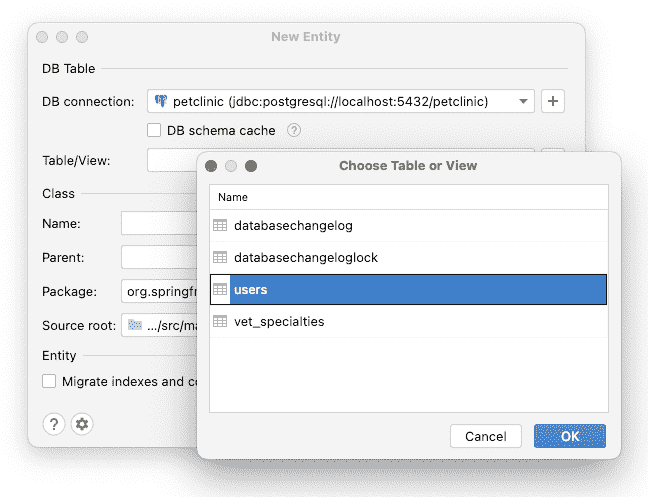](/web/20221207045809/https://www.baeldung.com/wp-content/uploads/2022/04/Picture-11.png)

与现有的解决方案相比，该插件执行“智能”生成，并试图检测实体之间的关联。即使对于没有列支持的[`OneToMany`](/web/20221207045809/https://www.baeldung.com/hibernate-one-to-many)[`ManyToMany`](/web/20221207045809/https://www.baeldung.com/jpa-many-to-many)实体，我们也会生成相应的属性:

[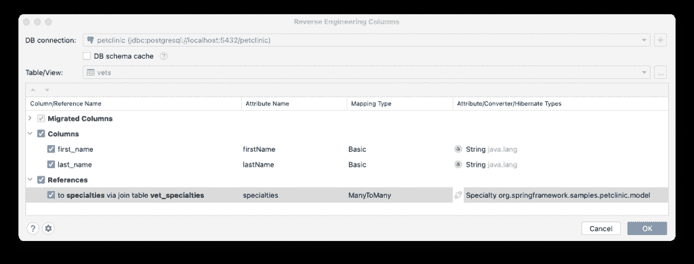](/web/20221207045809/https://www.baeldung.com/wp-content/uploads/2022/04/Picture-12.png)

JPA Buddy 为这种关联生成“空”实体，只有一个 ID 列和一个 TODO 注释。通过单击此 TODO，我们可以为现有实体运行列导入流程:

[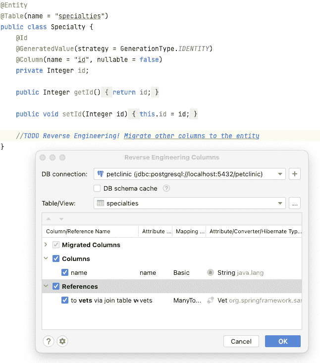](/web/20221207045809/https://www.baeldung.com/wp-content/uploads/2022/04/Picture-13.png)

## 7.dto 和 Mappers 生成

对于传递我们不能直接映射到 JPA 实体的数据的情况，DTO 是一个有价值的设计模式。例如，当创建 REST API 时，我们可能只想公开一些实体属性。

JPA Buddy 可以使用 MapStruct 库生成 dto 和映射器。我们需要做的就是为生成的 d to 选择所需的属性:

[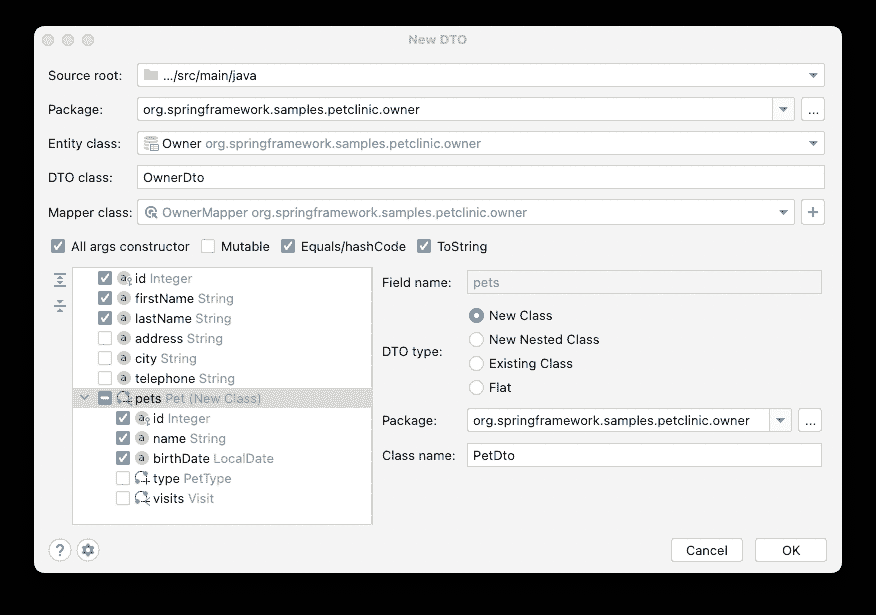](/web/20221207045809/https://www.baeldung.com/wp-content/uploads/2022/04/Picture-14.png)

该插件生成一个 DTO 和一个映射器，包括正确的关联映射。JPA Buddy 在这种情况下也支持 Lombok，并为 dto 生成适当的注释:

```
@Data
public class OwnerDto implements Serializable {
   private final Integer id;
   @NotEmpty
   private final String firstName;
   @NotEmpty
   private final String lastName;
   private final List<PetDto> pets;
} 
```

## 8.极简模式

JPA Buddy 有一个友好的 UI，但是对于那些喜欢 IntelliJ IDEA 中“聚焦”视图的人来说，该插件提供了“极简模式”。我们可以隐藏所有的工具窗口，只使用键盘生成实体，创建和编辑 Spring Data JPA 存储库，调用 DTO 创建向导，等等:

[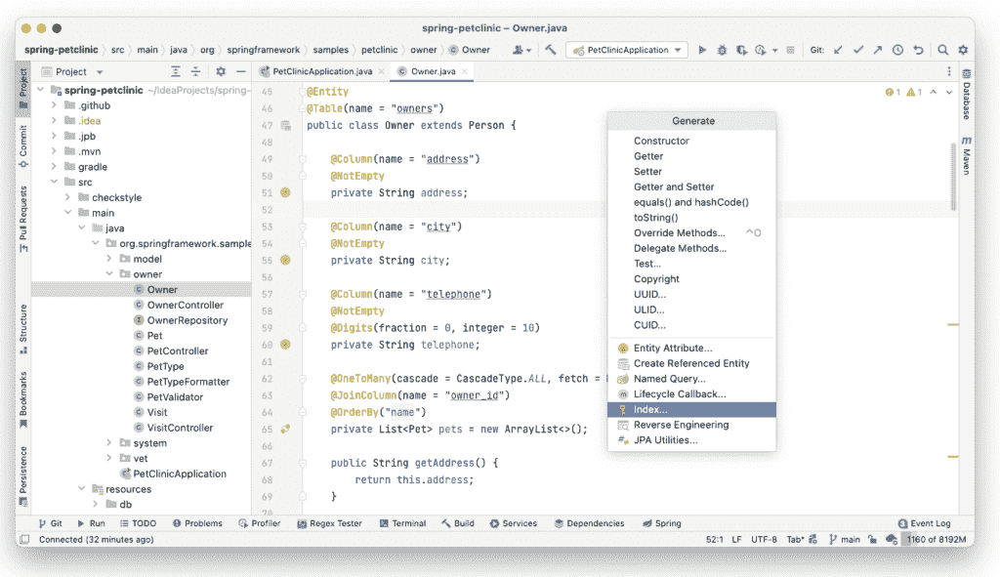](/web/20221207045809/https://www.baeldung.com/wp-content/uploads/2022/04/Picture-15.png)

## 9.结论

JPA Buddy 提供了一套强大的工具，使 JPA 开发变得更加容易。该插件的好处是它不仅支持 JPA，还支持数据访问层开发中使用的相关库:Spring Data JPA、MapStruct、Lombok 和 DB versioning 解决方案。

如果我们考虑 IntelliJ IDEA 社区，这个插件可以大大简化 JPA 的工作。IDEA Ultimate 用户可以从 JPA 和 Spring 框架支持的捆绑插件中获得一些 JPA Buddy 功能。尽管如此，看起来数据库版本脚本生成和 dto 创建特性在数据库开发自动化中仍然是独一无二的。

对于那些喜欢视频格式的人来说，有一个 15 分钟的记录显示 JPA Buddy 的行动。我们可以看到如何使用 IntelliJ IDEA 与 JPA Buddy 和 Spring Boot 一起创建一个应用程序:

[https://web.archive.org/web/20221207045809if_/https://www.youtube.com/embed/DC6FrC4olhE?feature=oembed](https://web.archive.org/web/20221207045809if_/https://www.youtube.com/embed/DC6FrC4olhE?feature=oembed)