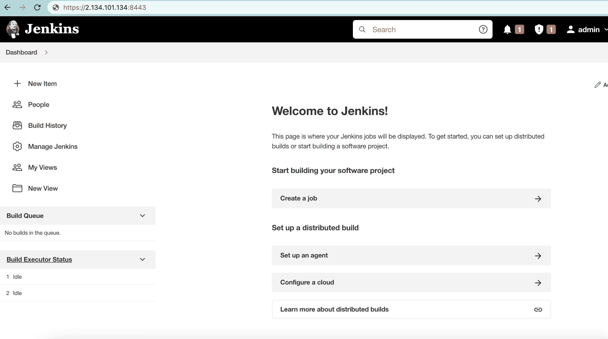
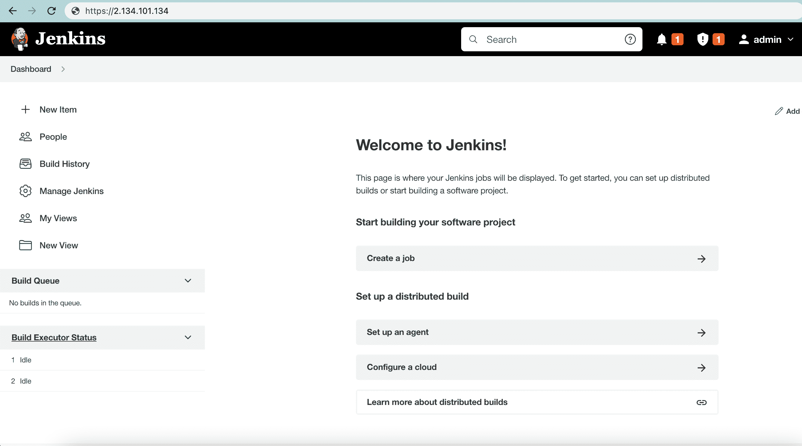

# 启用詹金斯的 HTTPS

> 原文：<https://web.archive.org/web/20220930061024/https://www.baeldung.com/ops/jenkins-enable-https>

## 1.概观

[Jenkins](/web/20221223083143/https://www.baeldung.com/linux/jenkins-install-run) 是一款开源且易于使用的基于 [Java](/web/20221223083143/https://www.baeldung.com/java-tutorial) 的 web 服务器，常用于持续集成和持续交付(CI/CD)管道的开发。

在本教程中，我们将通过配置 [SSL](/web/20221223083143/https://www.baeldung.com/cs/ssl-vs-tls) 来完成在 Jenkins 服务器上启用 [HTTPS](/web/20221223083143/https://www.baeldung.com/cs/https-urls-encrypted) 的过程。

## 2.使用 Jenkins SSL 配置

要使用 HTTPS，我们必须更改詹金斯服务器 的内部 SSL 设置。

### 2.1.生成 SSL 证书

首先，我们需要生成一个 SSL 证书和密钥库。这里，我们将使用 [OpenSSL](/web/20221223083143/https://www.baeldung.com/linux/openssl-extract-certificate-info#the-openssl-tool) 来创建两者。

让我们从在 CentOS 机器上安装 OpenSSL 开始:

[PRE0]

下一步，我们将使用 OpenSSL 工具生成 SSL 公钥和私钥:

[PRE1]

这里，生成了`key.pem`密钥和`certificate.pem` [自签名证书](/web/20221223083143/https://www.baeldung.com/openssl-self-signed-cert)。接下来，让我们把这两个文件合并成一个`.p12` `keystore`:

[PRE2]

重要的是，我们以后可以使用这两个`.pem`文件，所以我们可能想要保存它们。现在让我们用`[keytool](/web/20221223083143/https://www.baeldung.com/keytool-intro)`导入`.p12`文件，并将其转换成`.jks` `keystore`:

[PRE3]

现在，我们可以在 Jenkins 设置中使用`jenkinsserver.jks`。

### 2.2.将 JKS 文件添加到詹金斯路径

**重要的是，我们需要确保`jenkinsserver.jks`在詹金斯可以访问的地方**。`JENKINS_HOME`(一般为`/var/lib/jenkins`)是个不错的选择:

[PRE4]

默认情况下，`jenkins`用户可以访问`/var/lib/jenkins/`路径。然而，**我们必须改变我们的`.jks`文件的所有者**:

[PRE5]

现在，Jenkins 已经为安全 SSL 身份验证设置了正确的密钥库文件。

### 2.3.为 SSL 通信配置 Jenkins

**为了用 SSL 设置 Jenkins，我们需要使用一个 HTTPS `keystore`、一个 HTTPS 端口和一个密码**。让我们使用`/etc/systemd/system/jenkins.service`文件中的变量来设置每个变量:

[PRE6]

至此，HTTPS 在詹金斯建立了。

### 2.4.重新启动 Jenkins 服务

到目前为止，我们已经对配置进行了所有的更改。为了应用它们，我们重新加载守护进程并重启 Jenkins:

[PRE7]

现在，我们的 SSL 证书对于 Jenkins 服务器是有效的。因此，HTTPS 启动并运行，保护我们的数据。

### 2.5.Jenkins 服务器的验证

当然，现在可以通过 HTTP 和 HTTPS 访问 Jenkins。为了举例说明，让我们通过 HTTPS 端口访问 Jenkins 服务器:

我们可以看到，Jenkins 服务器运行在带有 HTTPS 的`8443`端口上，受 SSL 保护。

## 3.使用反向代理

我们还可以在主 Jenkins 服务器前运行一个`[reverse proxy server](/web/20221223083143/https://www.baeldung.com/cs/proxy-vs-reverse-proxy)`来增加安全性。此外，例如，在 HAProxy 后面运行 Jenkins 可以提供更加用户友好的 URL。代理是一种防火墙，可以进一步保护对后端服务器的访问。

我们可以运行 HAProxy、Nginx、Apache 或 Squid 作为我们的代理服务器。在这里，我们使用 HAProxy 作为一个相对标准的选择。

### 3.1.安装和配置 HAProxy

使用 [HAProxy](https://web.archive.org/web/20221223083143/https://www.haproxy.com/blog/using-haproxy-as-an-api-gateway-part-1/) ，我们可以将请求重定向到 Jenkins。让我们在 Linux 机器上安装 HAProxy:

[PRE8]

接下来，让我们更改一些默认设置。首先，我们将创建一个监听所有连接的前端节点:

[PRE9]

在这里，重定向通过`use_backend`到达 Jenkins 后端。当然，我们必须在配置中添加一个 Jenkins 后端节点，以便 HAProxy 可以正确转发:

[PRE10]

上面，我们使用了`haproxy.pem`文件，它很容易创建:

[PRE11]

这里，我们将前面的`certificate.pem`和`key.pem`组合起来，生成了`haproxy.pem`文件。最后，让我们重新加载守护进程并重启`haproxy`服务:

[PRE12]

此时，SSL 应该可以通过 HAProxy 在 Jenkins 服务器上使用 。

### 3.2.确认

到目前为止，HAProxy 应该已经启动并运行，重定向到詹金斯。为了说明，让我们访问 Jenkins 服务器并验证 HTTPS 连接:

如我们所见，Jenkins 使用 HTTPS 进行安全访问，没有任何自定义端口。

## 4.结论

在本文中，我们按照步骤在 Jenkins 服务器上启用 SSL 安全性。最初，我们学习了如何配置 Jenkins 本身的 HTTPS 设置。最后，为了进一步保护 SSL 连接，我们添加了一个反向代理服务器，使用 Jenkins 作为后端。