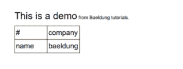
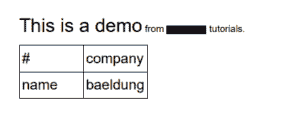
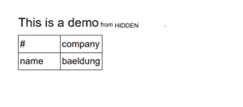

# 在 Java 中编辑现有的 PDF 文件

> 原文：<https://web.archive.org/web/20220930061024/https://www.baeldung.com/java-edit-existing-pdf>

## 1.概观

在本文中，我们将看到如何用 Java 编辑现有 PDF 文件的内容。首先，我们只是添加新的内容。然后，我们将重点关注删除或替换一些预先存在的内容。

## 2.添加 iText7 依赖项

**我们将使用 [iText7](https://web.archive.org/web/20221018043203/https://search.maven.org/artifact/com.itextpdf/itext7-core) 库向 PDF 文件添加内容。**稍后，我们将使用 [pdfSweep](https://web.archive.org/web/20221018043203/https://search.maven.org/artifact/com.itextpdf/cleanup) 附加组件删除或替换内容。

首先，让我们将这些依赖项添加到我们的`pom.xml`:

[PRE0]

## 3.文件处理

让我们了解使用 iText7 处理 PDF 的步骤:

*   首先，我们打开一个`PdfReader`来读取源文件的内容。如果在读取文件的过程中出现错误，就会抛出一个`IOException`。
*   然后，我们打开一个`PdfWriter`到目标文件。如果这个文件不存在或者不能被创建，抛出一个 [`FileNotFoundException`](/web/20221018043203/https://www.baeldung.com/java-filenotfound-exception) 。
*   之后，我们将打开一个使用我们的`PdfReader`和`PdfWriter`的`PdfDocument`。
*   最后，关闭`PdfDocument`会关闭底层的`PdfReader`和`PdfWriter`。

让我们写一个 [`main()`](/web/20221018043203/https://www.baeldung.com/java-main-method) 方法来运行我们的整个处理。为了简单起见，我们只重新抛出任何可能发生的 [`Exception`](/web/20221018043203/https://www.baeldung.com/java-exceptions) :

[PRE1]

在接下来的部分，我们将逐步完成`addContentToDocument()`方法，以便用新内容填充我们的 PDF。源文件是一个 PDF 文件，只在左上角包含文本“Hello Baeldung `“`。目标文件将由程序创建。

## 4.向文件中添加内容

我们现在将向文件中添加各种类型的内容。

### 4.1.添加表单

**我们将从向文件添加一个表单开始。**我们的表单将非常简单，包含一个名为`name`的独特字段。

此外，我们需要告诉 iText 在哪里放置字段。这种情况下，我们就放在下面这个点:`(35,400)`。坐标`(0,0)`指的是文档的左下方。最后，我们将设置字段的维度为`100×30`:

[PRE2]

此外，我们明确指定 iText 将表单添加到文档的第一页。

### 4.2.添加新页面

现在让我们看看如何向文档添加新页面。**我们将使用`addNewPage()`方法。**

如果我们想要指定的话，这个方法可以接受添加页面的索引。例如，我们可以在文档的开头添加一个新页面:

[PRE3]

### 4.3.添加注释

我们现在想给文档添加一个注释。具体来说，注释看起来像一个方形的漫画泡泡。

我们将把它添加到现在位于文档第二页的表单之上。因此，我们将把它放在坐标`(40,435)`上。此外，我们将给它一个简单的名称和内容。这些仅在悬停在注释上时才会显示:

[PRE4]

下面是我们第二页的中间部分:

### 4.4.添加图像

从现在开始，我们将向页面添加布局元素。为了做到这一点，我们将不能再直接操纵`PdfDocument`。我们宁愿从它创建一个`Document`并使用它。此外，我们最终需要关闭`Document`。**关闭`Document`会自动关闭底座`PdfDocument.`** ，这样我们就可以移除之前关闭`PdfDocument`的部分:

[PRE5]

**现在，要添加图像，我们需要从它的位置加载它。**我们将使用`ImageDataFactory`类的`create()`方法来实现。如果传递的文件 URL 不能被解析，就会抛出一个 [`MalformedURLException`](/web/20221018043203/https://www.baeldung.com/java-common-exceptions#1-ioexception) 。在本例中，我们将使用位于 resources 目录中的 Baeldung 徽标图像:

`ImageData imageData = ImageDataFactory.create("src/main/resources/baeldung.png");` 

下一步是在文件中设置图像的属性。我们将它的大小设置为`550×100`。我们将把它放在 PDF 的第一页上，在`(10,50)`坐标处。让我们看看添加图像的代码:

[PRE6]

图像会自动调整到给定的大小。下面是它在文档中的样子:

### 4.5.添加段落

**iText 库带来了一些向文件添加文本的工具。**字体可以在块本身上参数化，或者直接在`Paragraph`元素上参数化。

例如，让我们在第一页的顶部添加下面的句子:`This is a demo from Baeldung tutorials`。我们将把这个句子开头的字体大小设置为`16`，把`Paragraph`的全局字体大小设置为`8`:

[PRE7]

### 4.6.添加表格

**最后但同样重要的是，我们还可以向文件中添加一个表格。**例如，我们将定义一个双条目表格，上面有两个单元格和两个标题。我们不会指定任何位置。因此，它会自然地添加到文档的顶部，就在我们刚刚添加的`Paragraph`之后:

[PRE8]

现在让我们看看文档第一页的开头:

## 5.从文件中删除内容

现在让我们看看如何从 PDF 文件中删除内容。为了简单起见，我们将编写另一个`main()`方法。

我们的源 PDF 文件将是`baeldung-modified.pdf`文件，目标文件将是一个新的`baeldung-cleaned.pdf`文件。我们将直接在`PdfDocument`对象上工作。从现在开始，我们将使用 iText 的 pdfSweep 插件。

### 5.1.从文件中删除文本

**要从文件中删除给定的文本，我们需要定义一个清理策略。**在这个例子中，策略就是找到所有匹配`Baeldung`的文本。最后一步是调用`PdfCleaner`的`autoSweepCleanUp()` [静态](/web/20221018043203/https://www.baeldung.com/java-static-methods-use-cases)方法。该方法将创建一个自定义的`PdfCleanUpTool`，如果在文件处理过程中出现任何错误，它将抛出一个`IOException`:

[PRE9]

正如我们所见，源文件中出现的`Baeldung`单词在结果文件中被一个黑色矩形覆盖。例如，此行为适用于数据匿名化:

### 5.2.从文件中删除其他内容

不幸的是，很难检测文件中的任何非文本内容。然而，pdfSweep 提供了删除部分文件内容的可能性。因此，如果我们知道我们想要删除的内容位于何处，我们就能够利用这种可能性。

例如，我们将删除第二页上位于`(35,400)`的大小为`100×35`的矩形的内容。这意味着我们将删除表单的所有内容和注释。此外，我们将删除位于第一页`(10,50)`的`90×70`大小的矩形。这基本上从 Baeldung 的标志中去掉了`B`。使用`PdfCleanUpTool`类，下面是完成所有这些的代码:

[PRE10]

我们现在可以在`baeldung-cleaned.pdf`中看到下面的图像:

##  6。替换文件中的内容

在这一节中，我们将做与前面相同的工作，除了**我们将用新的文本替换以前的文本，而不仅仅是删除它**。

为了更加清晰，我们将再次使用一个新的`main()`方法。我们的源文件将是`baeldung-modified.pdf`文件。我们的目标文件将是一个新的`baeldung-fixed.pdf`文件。

之前我们看到删除的文本被黑色背景覆盖。然而，这种颜色是可配置的。因为我们知道在我们的文件中文本的背景是白色的，我们将强制覆盖为白色。治疗的开始将类似于我们之前所做的，除了我们将搜索文本`Baeldung tutorials`。

**然而，在调用`autoSweepCleanUp()`之后，我们将查询策略以获得被删除代码的位置。**然后我们将实例化一个包含替换文本`HIDDEN`的`PdfCanvas`。此外，我们将删除顶部空白，使其更好地与原始文本对齐。默认对齐确实不太好。让我们看看结果代码:

[PRE11]

我们可以看看这个文件:

## 7.结论

在本教程中，我们看到了如何编辑 PDF 文件的内容。我们已经看到，我们可以添加新内容，删除现有内容，甚至用新内容替换原始文件中的文本。

和往常一样，这篇文章的代码可以在 GitHub 上找到[。](https://web.archive.org/web/20221018043203/https://github.com/eugenp/tutorials/tree/master/pdf-2)