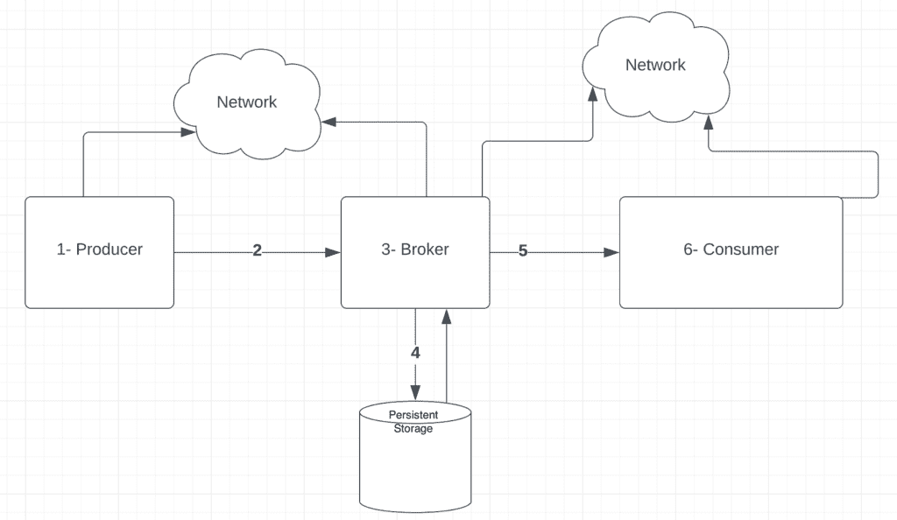
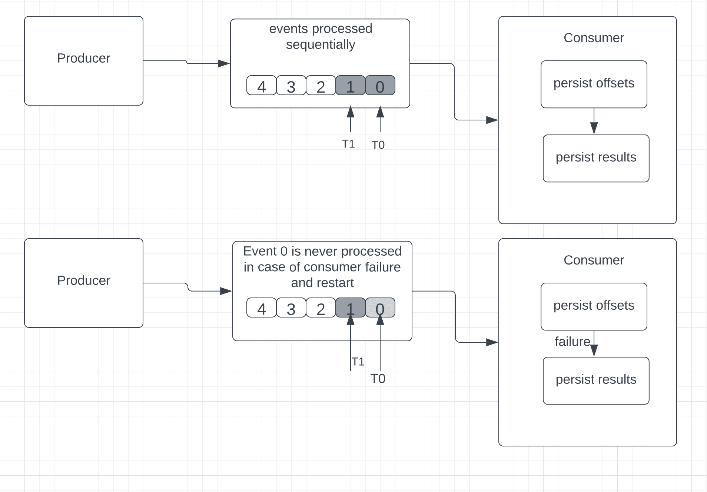
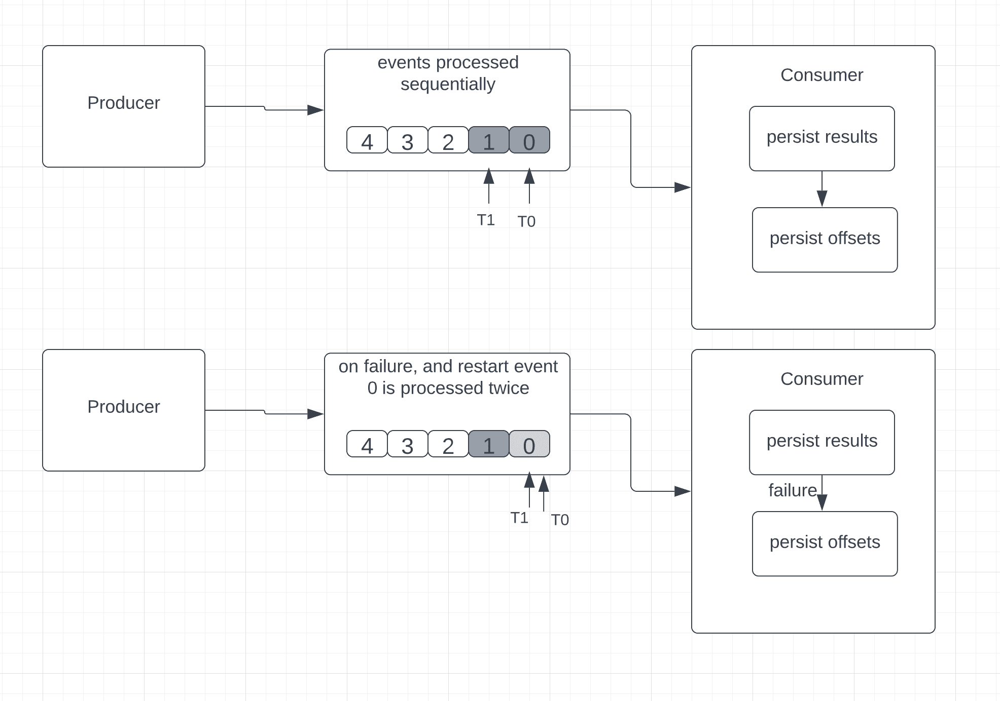
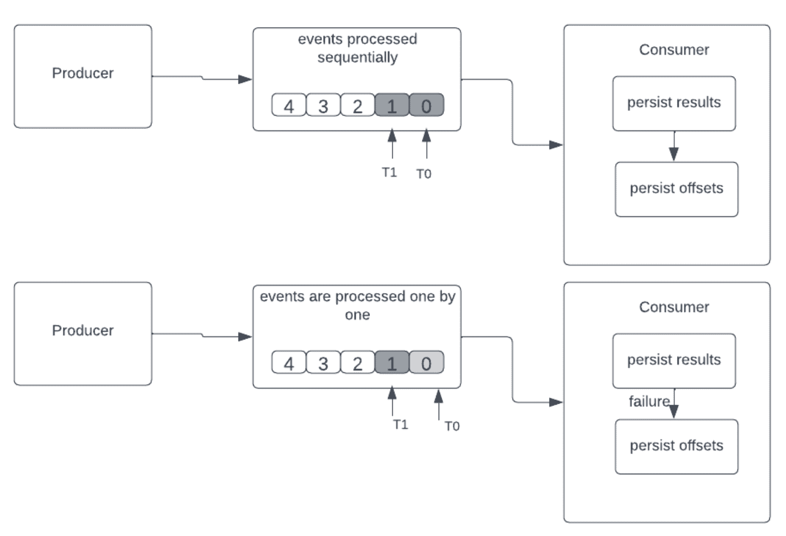

# 流媒体平台中的消息传递语义

> 原文:[https://web . archive . org/web/20220930061024/https://www . bael dung . com/Kafka-message-delivery-semantics](https://web.archive.org/web/20220930061024/https://www.baeldung.com/kafka-message-delivery-semantics)

## 1.概观

在本教程中，我们将讨论流媒体平台中的消息传递语义。

首先，**我们将快速查看通过流媒体平台主要组件的事件流。接下来，我们将讨论此类平台中数据丢失和重复的常见原因。然后，我们将关注三种主要的可用交付语义。**

我们将讨论如何在流媒体平台中实现这些语义，以及它们如何处理数据丢失和重复问题。

在每一种交付语义中，我们将非常简要地讨论在 Apache Kafka 中获得交付保证的方法。

## 2.流媒体平台的基础知识

简单地说，像 [Apache Kafka](/web/20221109081746/https://www.baeldung.com/spring-kafka) 和 Apache [ActiveMQ](/web/20221109081746/https://www.baeldung.com/apache-activemq-vs-kafka) 这样的流媒体平台以实时或接近实时的方式处理来自一个或多个来源(也称为生产者)的事件，并将它们传递到一个或多个目的地(也称为消费者)，以便进一步处理、转换、分析或存储。

生产者和消费者通过代理解耦，这实现了可伸缩性。

流应用的一些使用案例可以是电子商务网站中的大量用户活动跟踪、实时方式的金融交易和欺诈检测、需要实时处理的自主移动设备等。

**在消息传递平台**中有两个重要的考虑因素:

*   准确(性)
*   潜伏

通常，在[分布式实时系统](/web/20221109081746/https://www.baeldung.com/cs/distributed-systems-guide)中，我们需要在延迟和准确性之间做出权衡，这取决于什么对系统更重要。

在这种情况下，我们需要理解流媒体平台提供的交付保证，或者使用消息元数据和平台配置实现所需的交付保证。

接下来，让我们简要看看流媒体平台中的数据丢失和重复问题，这将引导我们讨论交付语义来管理这些问题

## 3.可能的数据丢失和重复情况

为了了解流媒体平台中的数据丢失和/或重复，让我们快速回顾一下流媒体平台中的高级事件流程:

  

在这里，我们可以看到从生产者到消费者的流程中可能存在多个潜在的故障点。

这经常会导致数据丢失、滞后和消息重复等问题。

让我们关注上图中的每个组件，看看可能会出现什么问题及其对流媒体系统可能产生的后果。

### **3.1。生产者失败**

产生故障会导致一些问题:

*   生成器生成消息后，可能会在通过网络发送之前失败。**这可能会导致数据丢失。**
*   生产者在等待接收来自代理的确认时可能会失败。当生成器恢复时，它会尝试重新发送消息，假设缺少来自代理的确认。**这可能会导致代理**处的数据重复。

### **3.2。生产者和经纪人之间的网络问题**

生产者和代理之间可能存在网络故障:

*   生产者可能会发送一条消息，但由于网络问题，该消息永远不会到达代理。
*   还有一种情况是，代理接收消息并发送确认，但是由于网络问题，生产者从未收到确认。

在这两种情况下，**生产者将重新发送消息，这将导致代理**处的数据复制。

### **3.3。经纪人失败**

同样，代理故障也会导致数据重复:

*   代理可能会在将消息提交到持久性存储之后、向生成器发送确认之前失败。这可能导致生产者重新发送数据，导致数据重复。
*   一个经纪人可能正在跟踪消费者目前已经阅读的信息。代理可能会在提交该信息之前失败。这可能会导致消费者多次阅读同一条消息，从而导致数据重复。

### **3.4。消息持久性问题**

从内存状态向磁盘写入数据时可能会出现故障，导致数据丢失。

### **3.5。消费者和经纪人之间的网络问题**

代理和消费者之间可能存在网络故障:

*   尽管代理发送了消息并记录了它发送了消息，但是消费者可能永远也不会收到消息。
*   类似地，消费者可能在收到消息后发送确认，但是确认可能永远不会到达代理。

**在这两种情况下，代理可能会重新发送导致数据复制的消息**

### 3.6。消费者失败

*   消费者可能会在处理消息之前失败。
*   消费者可能会在持久性存储中记录其已处理消息之前失败。
*   消费者也可能在记录它处理了消息之后但在发送确认之前失败。

这可能导致消费者再次向代理请求相同的消息，从而导致数据重复。

接下来，让我们看看流媒体平台中可用的交付语义，以处理这些问题来满足各个系统的需求。

## **4。交付语义**

交付语义定义了流媒体平台如何在我们的流媒体应用中保证事件从源到目的地的交付。

有三种不同的交付语义可用:

*   最多一次
*   至少一次
*   恰好一次

### **4.1。最多一次交货**

在这种方法中，**消费者首先保存最后接收到的事件的位置，然后处理它。**

简而言之，如果事件处理中途失败，在使用者重新启动时，它就不能回过头来读取旧的事件。

因此，不能保证所有接收到的事件都能成功处理。

至多，语义对于一些数据丢失不是问题并且准确性不是强制性的情况是理想的。

以 Apache Kafka 为例，它使用消息的偏移量，最多一次保证的顺序是:

*   持续偏移
*   保存结果

**为了在 Kafka 中启用最多一次语义，我们需要在消费者处设置“`enable.auto.commit”`到“`true”` ”。**

如果出现故障，使用者重新启动，它将查看最后一个持久化的偏移量。由于偏移量在实际事件处理之前就已经存在，因此我们无法确定消费者收到的每个事件是否都被成功处理。在这种情况下，消费者可能会错过一些活动。

让我们想象一下这个语义:

 
**4.2。至少一次交付**

在这种方法中，使用者处理接收到的事件，将结果保存在某个地方，然后最终保存最后接收到的事件的位置。

与“最多一次”不同，在这种情况下，如果失败，消费者可以读取并重新处理旧事件。

在某些情况下，这可能会导致数据重复。让我们考虑这样一个例子，在处理和保存一个事件之后，但在保存最后一个已知的事件位置(也称为偏移量)之前，使用者失败了。

消费者将重新开始并从偏移量开始读取。**在这里，消费者不止一次地重新处理事件，因为即使消息在失败之前被成功处理，最后接收的事件的位置也没有被成功保存:**

对于任何更新滚动条或标尺以显示当前值的应用程序来说，这种方法都是理想的。然而，需要聚合准确性的用例，如 sum 和 counters，对于至少一次处理并不理想，主要是因为重复事件会导致不正确的结果。

因此，在这个交付语义中，**没有数据丢失，但是可能会出现重新处理相同事件的情况**。

**为了避免多次处理同一个事件，我们可以使用幂等消费者**。

本质上，幂等消费者可以多次消费一条消息，但只处理一次。

**以下方法的组合使等幂消费者能够至少交付一次:**

*   生产者为每条消息分配一个唯一的`messageId`。
*   消费者在数据库中维护所有已处理消息的记录。
*   当新消息到达时，消费者对照持久存储表中现有的`messageId`对其进行检查。
*   如果匹配，消费者更新偏移量而不重新消费，发送回确认，并有效地将消息标记为已消费。
*   当事件不存在时，启动一个数据库事务，并插入一个新的`messageId`。接下来，根据所需的任何业务逻辑来处理这个新消息。消息处理完成后，事务最终被提交

在 Kafka 中，为了确保至少一次语义，制作者必须等待经纪人的确认。

如果没有收到来自代理的任何确认，生产者将重新发送消息。

此外，当生产者批量向代理写入消息时，如果该写入失败并且生产者重试，则批量内的消息可能在 Kafka 中被多次写入。

然而，为了避免重复，卡夫卡引入了幂等生产者的特征。

本质上，为了在 Kafka 中启用至少一次语义，我们需要:

*   **在生产者端**将属性`ack`设置为值`“1”`
*   **在消费者端设置`enable.auto.commit`【物有所值】`false`。**
*   **设置`enable.idempotence`【属性值】`true`**
*   **将序列号和生产者 id 附加到来自生产者的每条消息上**

Kafka Broker 可以使用序列号和生产者 id 来识别主题上的消息重复。 

### **4.3。恰好一次交货**

这种交付保证类似于至少一次语义。首先，处理收到的事件，然后将结果存储在某个地方。在失败和重启的情况下，消费者可以重新读取和重新处理旧的事件。 然而，****n 与至少一次处理类似，任何重复的事件都被丢弃而不被处理，从而导致恰好一次处理。****

 **这非常适合精度非常重要的任何应用，例如涉及精确计数器等聚合的应用，或者任何只需处理一次事件且不会丢失的应用。

序列如下进行:

*   保存结果
*   持续偏移

让我们看看当消费者在处理事件后失败，但没有保存下图中的补偿时会发生什么:  

我们可以通过以下方法来消除一次性语义中的重复:

*   幂等更新–我们将把结果保存在生成的唯一键或 ID 上。在重复的情况下，生成的密钥或 ID 将已经存在于结果中(例如，一个数据库)，因此消费者可以删除重复项，而无需更新结果
*   事务性更新——我们将批量保存结果，这需要一个事务开始和一个事务提交，因此在提交事件时，事件将被成功处理。这里我们将简单地删除重复的事件，而不更新任何结果。

让我们看看在 Kafka 中启用[恰好一次语义需要做些什么:](/web/20221109081746/https://www.baeldung.com/kafka-exactly-once)

*   **通过为每个生成器**的“`transaction.id`”设置唯一值，在生成器上启用幂等生成器和事务特性
*   **通过将属性“`isolation.level`”设置为值“`read_committed`”**，在消费者端启用交易功能

## 5.结论

在本文中，我们看到了流平台中使用的三种交付语义之间的差异。

在简要概述了流平台中的事件流之后，我们看了一下数据丢失和重复问题。然后，我们看到了如何使用各种交付语义来减轻这些问题。然后我们研究了至少一次交付，接着是最多一次，最后是恰好一次交付语义。**