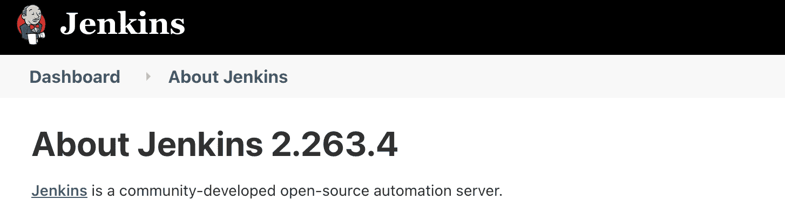
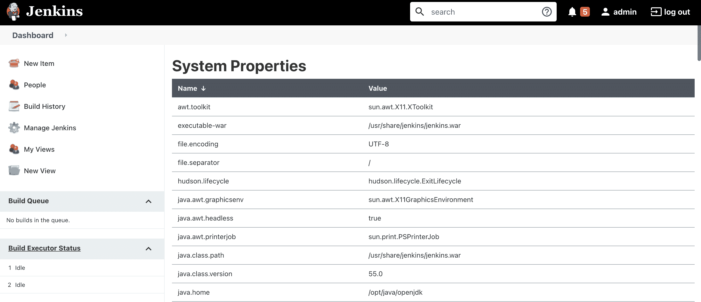
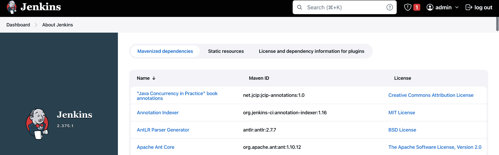
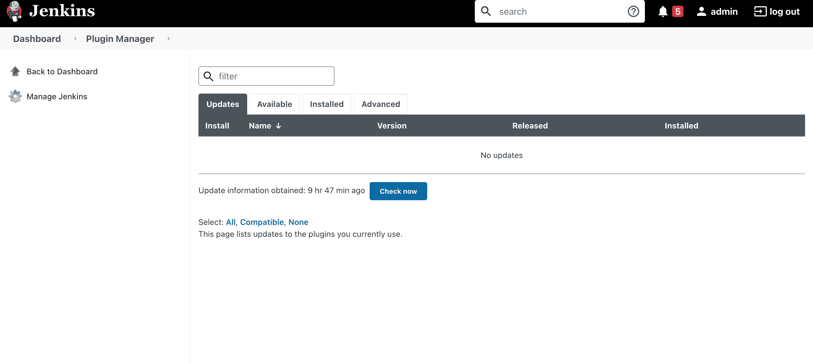
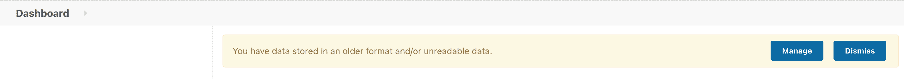

# 更新詹金斯从战争

> 原文:[https://web . archive . org/web/20220930061024/https://www . bael dung . com/ops/Jenkins-war-update](https://web.archive.org/web/20220930061024/https://www.baeldung.com/ops/jenkins-war-update)

## 1.介绍

[Jenkins](/web/20221223065112/https://www.baeldung.com/linux/jenkins-install-run) 是一个自动化服务器，支持数百个用于实施 [CI 和 CD](/web/20221223065112/https://www.baeldung.com/cs/continuous-integration-deployment-delivery) 工作流的管道插件。通常，Jenkins 作为独立的应用程序运行，但是它也可以作为 servlet 部署在不同的 [Java servlet](/web/20221223065112/https://www.baeldung.com/intro-to-servlets) 容器中。

在本教程中，我们将使用`jenkins.war`文件升级 Jenkins 服务器。

## 2.下载詹金斯战争档案

[`jenkins.war` Jenkins WAR](https://web.archive.org/web/20221223065112/https://www.jenkins.io/doc/book/installing/war-file/) 文件是一个 Java web 档案文件，包含运行 Jenkins 持续集成和交付平台所需的所有文件和资源。这包括 Jenkins 核心代码以及所有插件和依赖项。**Jenkins WAR 文件用于所有类型的 Jenkins 安装，无论分发方式如何**。

因此，通过 Jenkins WAR 文件进行更新是在任何环境中升级 Jenkins 的一种简单而有效的方法。

### 2.1.检查当前的 Jenkins 版本

在我们继续之前，让我们从仪表板上查看当前的 Jenkins 版本:

[](/web/20221223065112/https://www.baeldung.com/wp-content/uploads/2022/12/2_about_jenkins2.63.4-e1670151087919.png)

从上图中我们可以看到，Jenkins 目前运行的是版本`2.263.4`。

### 2.2.下载詹金斯战争档案

为了升级到最新的 Jenkins 版本，我们需要首先下载最新的 WAR 文件。我们可以使用 [`wget`](/web/20221223065112/https://www.baeldung.com/linux/tag/wget) 命令下载最新的詹金斯战争文件:

```
$ wget https://updates.jenkins-ci.org/latest/jenkins.war
```

以上命令将下载最新的 Jenkins WAR 文件。或者，我们可以从[全球库](https://web.archive.org/web/20221223065112/https://updates.jenkins-ci.org/download/war/)下载任何 Jenkins 版本。让我们下载詹金斯的版本`2.375.1`:

```
$ wget https://updates.jenkins-ci.org/download/war/2.375.1/jenkins.war
```

值得注意的是，当使用 [`yum`或`apt`](/web/20221223065112/https://www.baeldung.com/linux/yum-and-apt) 安装 Jenkins 时，我们可以简单地运行升级命令来获得最新版本。**如果本地 Linux repo 中没有最新版本，我们仍然可以使用`wget`命令**下载 WAR 文件。

## 3.安装詹金斯战争文件

**要更新 Jenkins WAR，我们需要找到它的可执行文件**。Jenkins 服务器的默认路径会因操作系统而异。通常， `/usr/share/jenkins/` 和 `/usr/lib/jenkins/`是詹金斯服务器主页的位置。此外，如果 WAR 文件不在这些目录中，我们需要按照以下步骤获取实际目录:

*   转到詹金斯仪表板
*   点击 Jenkins 仪表盘上的`Manage Jenkins`
*   点击`System Information`

[](/web/20221223065112/https://www.baeldung.com/wp-content/uploads/2022/12/2_executable-war.png)

在上图中，**我们可以看到詹金斯战争文件在`executable-war`地产**中的位置。在我们升级 Jenkins 服务器之前，**让我们停止服务器以确保升级过程顺利**:

```
$ sudo systemctl stop jenkins
```

一旦服务器停止，我们可以将新的`jenkins.war`移动到`/usr/share/jenkins/`目录。在移动`jenkins.war` 文件`,`之前，我们需要[更改其权限](/web/20221223065112/https://www.baeldung.com/linux/chown-chmod-permissions):

```
$ cd /download
$ chown root:root jenkins.war
$ chmod 644 jenkins.war
```

现在，**我们将`jenkins.war`文件从`executable-war`移动到**目录中:

```
$ sudo mv /download/jenkins.war /usr/share/jenkins/
```

为了看到变化，我们需要启动 Jenkins 服务器:

```
$ sudo systemctl start jenkins
```

让我们看一下检查 Jenkins 服务器状态的命令:

```
$ systemctl status jenkins
● jenkins.service - Jenkins Continuous Integration Server
   Loaded: loaded (/usr/lib/systemd/system/jenkins.service; enabled; vendor preset: disabled)
   Active: active (running) since Sun 2022-12-04 07:38:00 UTC; 2s ago
```

这里，在上述命令的输出中，我们可以看到服务器已经启动并正在运行。

## 4.升级后任务

到目前为止，我们已经完成了更新 Jenkins 服务器所需的所有步骤。但是我们通常也需要执行一些任务来确保与新版本的数据兼容性。

### 4.1.验证版本更新

Jenkins 服务器已经启动并运行。现在，让我们从 Jenkins 仪表板验证版本:

[](/web/20221223065112/https://www.baeldung.com/wp-content/uploads/2022/12/2_Screenshot-2022-12-04-at-5.08.22-PM.png)

在 Jenkins UI 的右下角可以看到升级后的 Jenkins 版本。

### 4.2.与新版本的兼容性

插件可能是 Jenkins 管道中最关键的部分。事实上，每个作业都使用一个插件来检查已安装插件的可用更新:

*   转到詹金斯仪表板
*   点击 Jenkins 仪表盘上的`Manage Jenkins`
*   点击`About Plugins`

[](/web/20221223065112/https://www.baeldung.com/wp-content/uploads/2022/12/2_updates-2.png)

上图显示，不需要更新任何插件。

**升级 Jenkins 后，我们可能会遇到与新版本**的数据兼容性问题。因此，为了确保我们的数据是正确的格式，我们应该将其更新为更新后的格式。此外，要检查数据版本更新，请执行以下步骤:

*   转到詹金斯仪表板
*   点击 Jenkins 仪表盘上的`Manage Jenkins`

[](/web/20221223065112/https://www.baeldung.com/wp-content/uploads/2022/12/2_dataformat.png)

上图显示我们的新版本与旧版本不兼容。但是，我们可以通过点击`Manage`按钮来解决这个问题。

## 5.结论

在本文中，Jenkins 服务器正在使用 WAR 文件从版本`2.263.4`升级到`2.375.1`。首先，我们下载了新版 Jenkins 的最新 WAR 文件。之后，我们通过替换现有版本将其部署到 Jenkins 服务器上。