# 在 JMeter 中运行多个线程组

> 原文：<https://web.archive.org/web/20220930061024/https://www.baeldung.com/jmeter-run-multiple-thread-groups>

## 1.概观

使用 JMeter，我们可以对场景进行分组，并以不同的方式运行它们，以复制真实世界的流量。

在本教程中，我们将学习如何以及何时使用多线程组来复制真实场景，以及如何使用一个简单的测试计划来顺序或并行运行它们。

## 2.创建多个线程组

线程组是 JMeter 的一个元素，它控制执行测试的线程数量。

JMeter 测试计划中的每个线程组都模拟了一个特定的真实应用场景。

大多数基于服务器的应用程序通常有不止一个场景，所以创建一个单独的线程组来映射每一个用例给了我们更多的灵活性来在测试期间正确地分配负载。

有两种方法可以运行多个线程组:顺序或并行。

## 3.按顺序运行线程组

当我们想要一个接一个地执行应用程序场景时，这非常有用，尤其是当各种场景之间存在依赖关系时。

### **3.1。用例**

假设我们有一个电子商务应用程序，用户可以浏览产品，将特定的产品(他们喜欢的)添加到购物车中，最后启动结账，然后下最终订单。

对于这样的应用程序，当有我们想要模拟的用户旅程时，我们希望我们的脚本遵循特定的序列。例如，我们的脚本可能首先执行浏览产品，然后将产品添加到购物车，最后下订单。

### **3.2。配置**

从测试计划中，您可以通过选择复选框`Run Thread Groups consecutively (i.e. one at a time): `来实现这个行为

[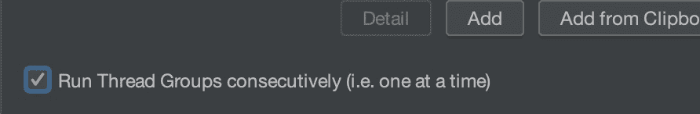](/web/20221222011926/https://www.baeldung.com/wp-content/uploads/2022/12/Multiple_Thread_Groups_Sequencially.jpg)

## 4.并行运行线程组

这主要在各种场景之间没有依赖关系时有用。

测试操作是并发执行的，模拟测试系统上的混合负载。

### **4.1。用例**

举个例子，想象一下一个网站，它的新闻被分成不同的类别，比如科技新闻、市场新闻、体育新闻等等。

这个网站的主页将总是显示所有不同类别的最新头条新闻。

对于这样的应用程序，我们仍然可以创建多个线程组，在不同的页面上分配不同的用户负载。

然而，可以同时执行这些线程组，因为它们是互斥的。

### **4.2。配置**

JMeter 中的测试计划默认配置为并行运行多个线程组，所以我们不需要检查`Run Thread Groups consecutively`。

[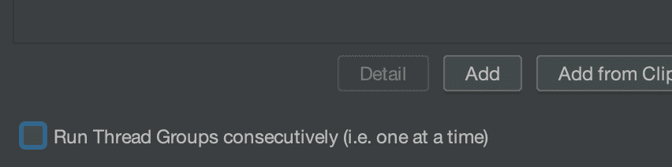](/web/20221222011926/https://www.baeldung.com/wp-content/uploads/2022/12/2_Parallel.png)

## 5.测试用例设置

为了测试一个测试计划，我们需要一个 API。我们可以使用一个由 [JSON 占位符](https://web.archive.org/web/20221222011926/https://jsonplaceholder.typicode.com/)站点公开的。这个网站提供假的 API 给我们实验。

我们将在测试计划中使用两个场景

场景 1:阅读特定的帖子。

场景 2:创建新帖子。

由于大多数最终用户会对阅读帖子感兴趣，而不是写一篇新帖子，我们希望将它们作为两个独立主题组的一部分。

## 6.向测试计划添加线程组

### 6.1.创建基本测试计划

我们将[运行 JMeter](/web/20221222011926/https://www.baeldung.com/jmeter#run-jmeter) 来开始。

默认情况下，JMeter 创建一个名为`Test Plan`的默认测试计划。让我们把这个名字更新为`My Test Plan:`

[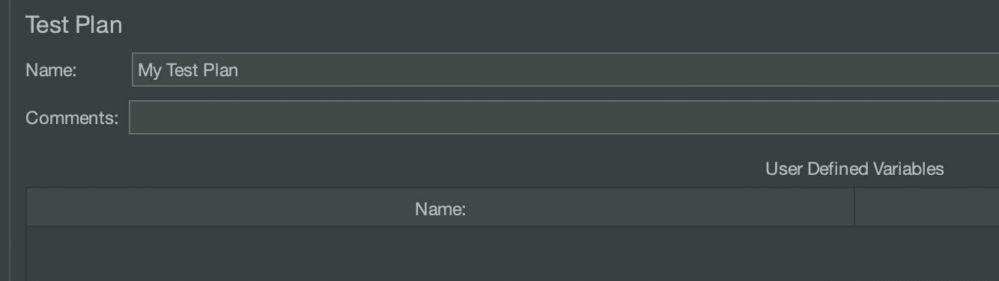](/web/20221222011926/https://www.baeldung.com/wp-content/uploads/2022/12/Test_Plan.jpg)

### 6.2.添加多个线程组

为了创建一个线程组，我们将右键单击`Test Plan`并选择`Add -> Threads (Users) -> Thread Group:`

[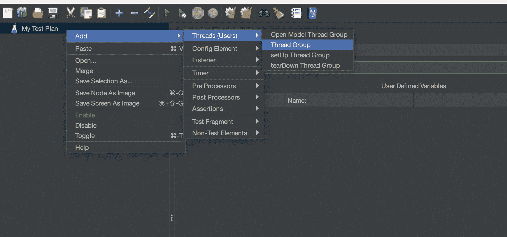](/web/20221222011926/https://www.baeldung.com/wp-content/uploads/2022/12/2_Add_Thread_Group.jpg)

现在我们将创建两个线程组，从 GET Request 线程组`:`开始

[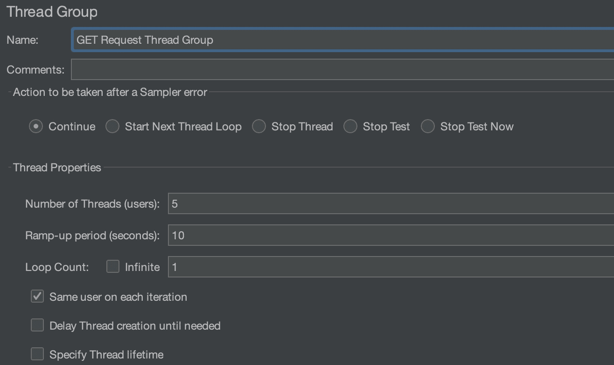](/web/20221222011926/https://www.baeldung.com/wp-content/uploads/2022/12/Get_Request.jpg)

这个线程组将用于阅读特定的帖子。

我们在这里指定了一些关键参数:

*   `Name`:获取请求线程组` (`我们想给这个线程组起的名字)
*   `Number of Threads` : 5(作为负载的一部分，我们将模拟的虚拟用户的数量)
*   `Ramp up Period` :10(启动并运行配置数量的线程所需的时间)
*   `Loop Count`:1(JMeter 应该执行特定场景的次数)

接下来，我们将创建 POST 请求线程组`:`

[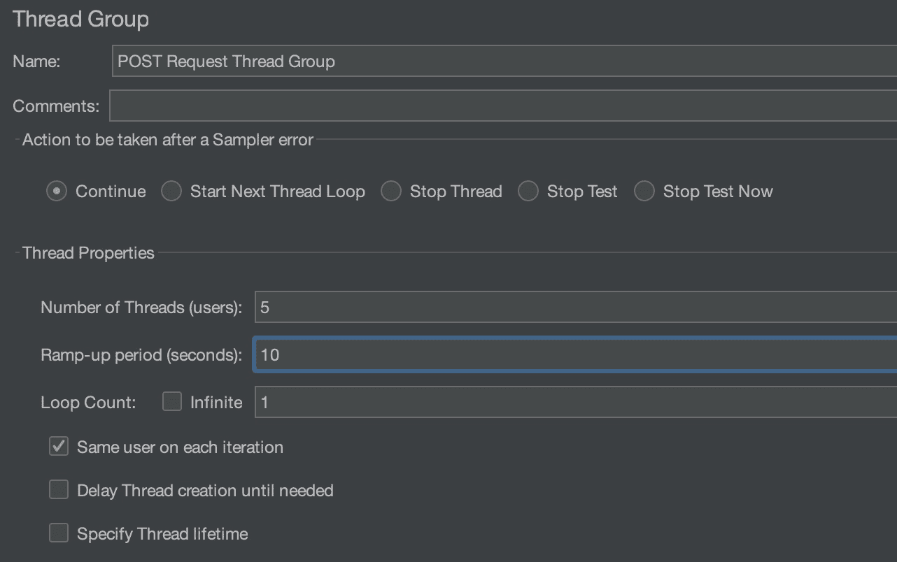](/web/20221222011926/https://www.baeldung.com/wp-content/uploads/2022/12/Post_request_thread_group.jpg)

该主题组将用于创建新帖子。

这里，我们指定了:

*   `Name` : POST 请求线程组` (`我们想给这个线程组起的名字)
*   `Number of Threads` : 5(作为负载的一部分，我们将模拟的虚拟用户的数量)。
*   `Ramp-up Period` : 10(为特定线程组启动并运行配置数量的线程所需的时间)
*   `Loop Count`:1(JMeter 应该执行在单个线程组中定义的特定场景的次数)

### 6.3.添加请求

现在，对于每个线程组，我们将添加一个新的 HTTP 请求。

要创建请求，我们右键单击`Test Group`并选择`Add -> Sampler -> HTTP Request`:

[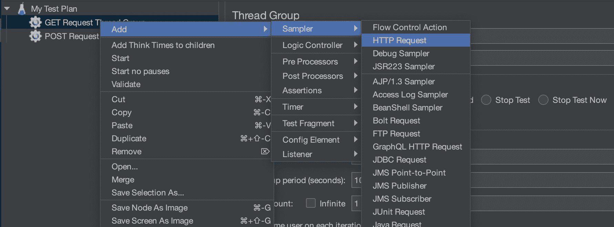](/web/20221222011926/https://www.baeldung.com/wp-content/uploads/2022/12/2_add_request.jpg)

现在我们在 GET 请求线程组`:`下创建一个请求

[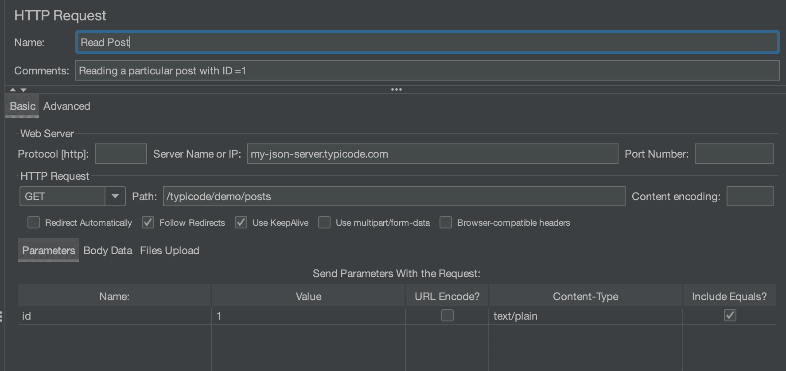](/web/20221222011926/https://www.baeldung.com/wp-content/uploads/2022/12/read_post.png)

在这里，我们指定:

*   `Name` : Read Post(我们想给这个 HTTP 请求起的名字)
*   评论:阅读 ID =1 的特定帖子
*   `Server Name or IP` : `my-json-server.typicode.com `
*   `HTTP Request Type` : GET (HTTP 请求方法)
*   `Path`:/typicode/demo/post
*   随请求发送参数:这里，我们使用了 1 个参数，即 id(这是检索具有特定 id 的帖子所需要的)

现在，我们将在 POST 请求线程组下创建另一个请求:

``

这里，我们指定了:

*   `Name`:创建 Post(我们想给这个 HTTP 请求起的名字)
*   `Comments`:创建 ID =p1 的新帖子(通过发布到服务器)
*   `Server Name or IP` : `my-json-server.typicode.com `
*   `Path`:/typicode/demo/post
*   这里，我们使用了两个参数，即 id 和 title(这是创建新帖子所需的属性)

### 6.4.添加摘要报告

JMeter 让我们能够以多种格式查看结果。

为了查看我们的执行结果，我们将在表侦听器中添加一个视图结果。

要创建请求，我们右键单击`“Test Plan”`并选择`Add -> Listener -> View Results in Table:`

[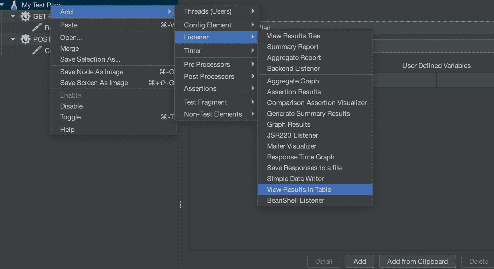](/web/20221222011926/https://www.baeldung.com/wp-content/uploads/2022/12/add_summary.png)

### 6.5.运行测试(并行)

现在我们按下工具栏上的`the Run`按钮(Ctrl + R)开始 JMeter 性能测试。

测试结果实时显示:

[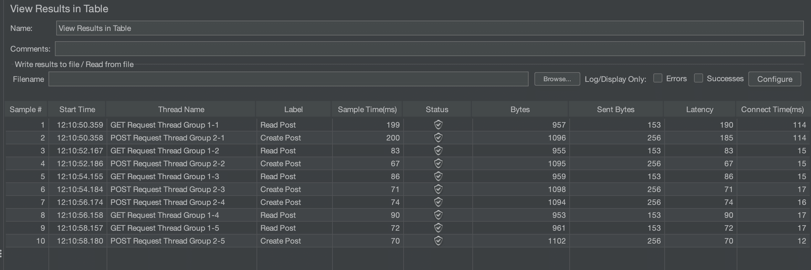](/web/20221222011926/https://www.baeldung.com/wp-content/uploads/2022/12/view_results.jpg)

这表明 Read Post 和 Create Post 按照配置的线程数依次(并行)运行。

这个测试结果是并行运行多个线程组的结果。这是测试计划的默认设置(未选中复选框):

[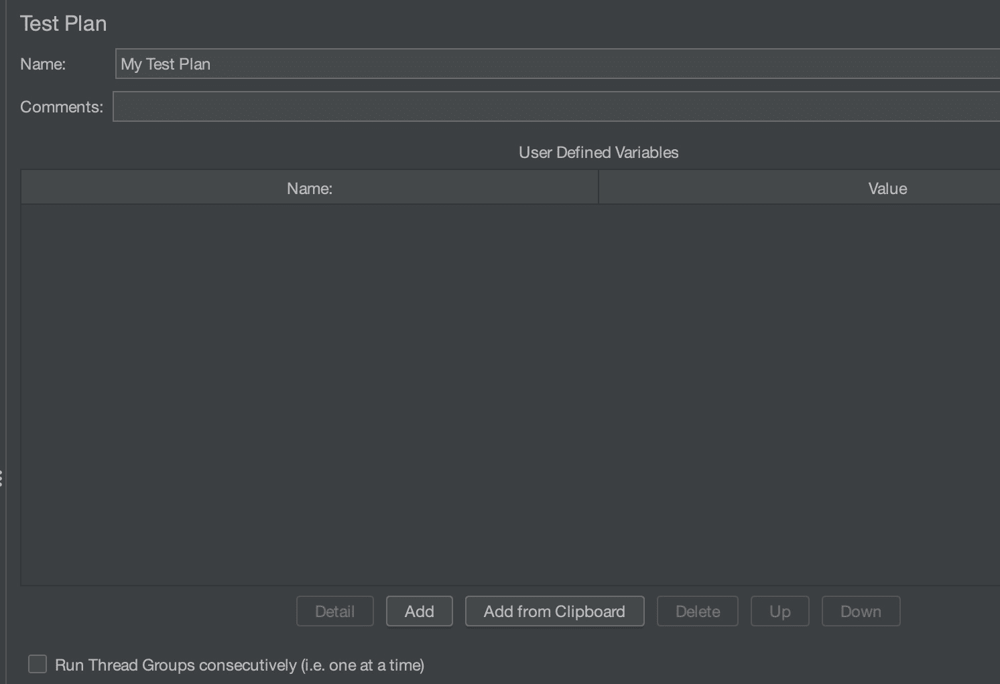](/web/20221222011926/https://www.baeldung.com/wp-content/uploads/2022/12/checkbox_unselected.jpg)

### 6.6.运行测试(按顺序)

现在，我们从测试计划中选择连续运行线程组(即一次一个)复选框:

现在我们再次按下工具栏上的`the Run`按钮(Ctrl + R)开始 JMeter 性能测试。

测试结果实时显示:

[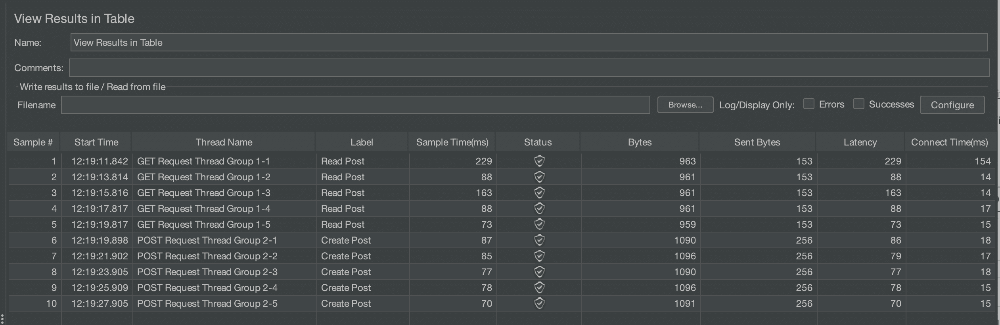](/web/20221222011926/https://www.baeldung.com/wp-content/uploads/2022/12/summary_in_sequence.png)

这表明所有映射到 Read Post 的线程首先被执行，然后是 Create Post 线程。

## 7.结论

在本教程中，我们看到了如何创建多个线程组，并使用它们来模拟真实的应用程序用户负载。

我们还学习了如何顺序或并行配置多个线程组的场景。