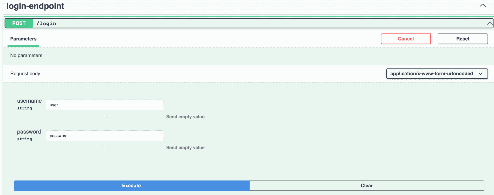
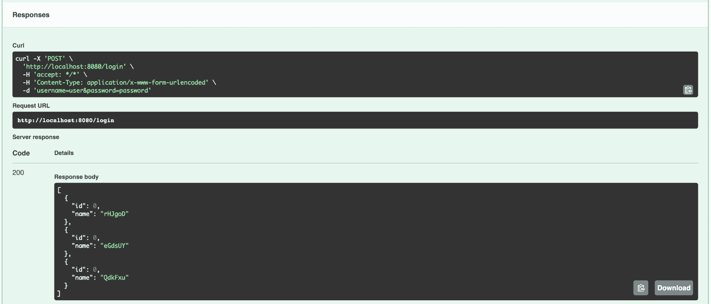
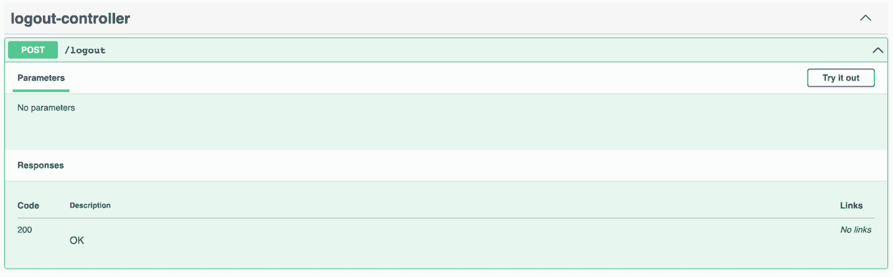
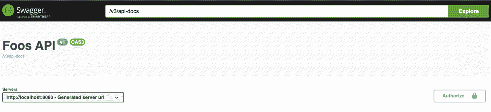
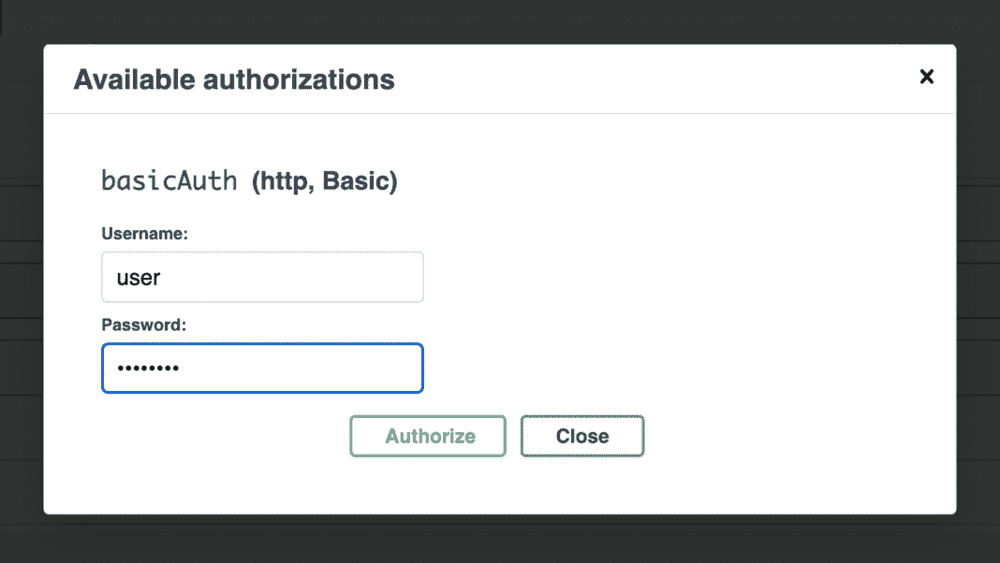
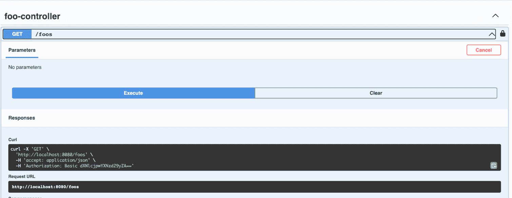

# springdoc-openapi 中的表单登录和基本认证

> 原文：<https://web.archive.org/web/20220930061024/https://www.baeldung.com/springdoc-openapi-form-login-and-basic-authentication>

## 1.概观

Springdoc-OpenAPI 是一个基于 [OpenAPI 3](https://web.archive.org/web/20221219081705/https://spec.openapis.org/oas/latest.html) 规范为 Spring Boot 应用程序自动生成服务文档的库。

通过一个用户界面与我们的 API 进行交互，而不需要实现一个用户界面，这是非常方便的。因此，让我们看看如果涉及授权，我们如何使用端点。

在本教程中，我们将学习**如何使用 Spring Security** 通过表单登录和基本认证来管理 Springdoc 中的安全端点访问。

## 2.项目设置

我们将建立一个 Spring Boot web 应用程序，公开一个由 Spring Security 保护的 API，并用 Springdoc 生成文档。

### 2.1.属国

让我们声明项目所需的 maven 依赖项。首先，我们将添加 [`springdoc-openapi-ui`](https://web.archive.org/web/20221219081705/https://search.maven.org/artifact/org.springdoc/springdoc-openapi-ui/1.6.13/jar) ，负责与 [Swagger-UI](https://web.archive.org/web/20221219081705/https://swagger.io/tools/swagger-ui/) 集成，并提供默认可访问的可视化工具:

[PRE0]

其次，增加了 [`springdoc-openapi-security`](https://web.archive.org/web/20221219081705/https://search.maven.org/artifact/org.springdoc/springdoc-openapi-security/1.6.13/jar) 模块，为 Spring 安全提供了支持:

[PRE1]

### 2.2.示例 API

对于本文，我们将实现一个虚拟 REST 控制器，作为用 Springdoc 生成文档的来源。此外，我们将举例说明通过 Swagger-UI 与`FooController`的受保护端点进行交互的认证方法。

[PRE2]

### 2.3.用户凭据

我们将利用 Spring Security 的内存认证来注册我们的测试用户凭证:

[PRE3]

## 3.基于表单的登录身份验证

让我们看看如何进行身份验证，以便与基于表单的登录安全的记录端点进行交互。

### 3.1.安全配置

这里我们定义了安全配置来授权表单登录请求:

[PRE4]

### 3.2.登录文档

默认情况下，框架提供的登录端点没有记录。因此，我们需要通过设置相应的配置属性来使其可见。此外，可以在库的[文档](https://web.archive.org/web/20221219081705/https://springdoc.org/#springdoc-openapi-core-properties)中找到有用的配置属性:

[PRE5]

之后， **Springdoc 会检测配置好的 Spring Security 的表单登录，并在 Swagger-UI** 中生成文档。因此，它将添加带有用户名和密码请求参数的`/login`端点以及特定的`application/x-www-form-urlencoded`请求主体类型:

经过身份验证后，我们将调用安全的`FooController`端点。此外，由于`defaultSucccesfulUrl`安全配置，我们从`/foos`端点获得成功登录的响应:

### 3.3.注销文档

能够注销方便了用户在 Swagger-UI 中的切换，这很有帮助。例如，在应用基于角色的 API 授权时。

**Springdoc 不像登录**那样提供自动检测注销端点的方法。在这种情况下，我们需要定义一个假的 REST 控制器，为`/logout`路径公开一个请求后映射。然而，我们不需要添加实现，因为 Spring Security 会拦截并处理请求:

[PRE6]

通过添加`LogoutController`，该库将生成文档并使注销在 Swagger-UI 中可用:

## 4.基本认证

当处理基本认证安全端点时，我们不需要直接调用登录。另一方面，OpenAPI 支持一套标准的[安全方案，](https://web.archive.org/web/20221219081705/https://swagger.io/docs/specification/authentication/)包括基本 Auth，我们可以据此配置 Springdoc。

### 4.1.安全配置

使用基本身份验证保护端点的简单安全配置:

[PRE7]

### 4.2.Springdoc 安全方案

为了配置 OpenAPI 安全方案，我们需要提供一个基于`@SecurityScheme`注释的配置:

[PRE8]

然后，我们还必须用`@SecurityRequirement(name = “basicAuth”)`来注释我们的`FooController`。如果我们只想保护一些端点或使用不同的方案，我们可以在方法级别应用此注释:

[PRE9]

因此，授权按钮将在 Swagger-UI 中可用:

然后，我们可以提供以下形式的用户凭据:

随后，**调用任何`FooController`端点时，带有凭证的授权头将包含在请求**中，如生成的 curl 命令所示。因此，我们将被授权执行请求:

## 5.结论

在本文中，我们学习了如何在 Springdoc 中配置身份验证，以便通过 Swagger-UI 中生成的文档访问受保护的端点。最初，我们经历了一个基于表单的登录设置。然后，我们为基本身份验证配置了安全方案。

本教程的项目实现可从 GitHub 上的[处获得。](https://web.archive.org/web/20221219081705/https://github.com/eugenp/tutorials/tree/master/spring-security-modules/spring-security-web-springdoc)