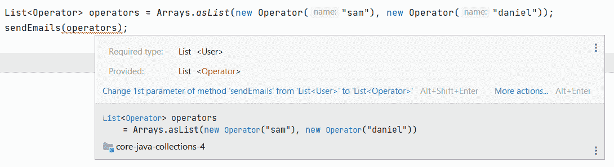
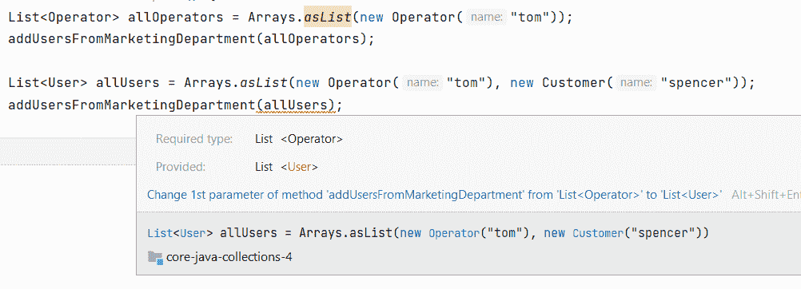

# Java 泛型 PECS——生产者扩展消费者超级

> 原文：<https://web.archive.org/web/20220930061024/https://www.baeldung.com/java-generics-pecs>

## 1.概观

在本文中，我们将探讨在生产和消费集合时 [Java 泛型](/web/20221207152312/https://www.baeldung.com/java-generics)的用法。

我们还将讨论`extends`和`super` 关键字，我们将查看 PECS(生产者扩展消费者超级)规则的几个示例，以确定如何正确使用这些关键字。

## 2.生产者延伸

对于本文中的代码示例，我们将使用一个简单的数据模型，它有一个`User`基类和两个扩展它的类:`Operator`和`Customer`。

**必须从产品系列的角度来理解 PECS 规则，这一点很重要。**换句话说，如果我们遍历一个`List` 并处理它的元素，列表将作为我们逻辑的生产者:

[PRE0]

现在，让我们假设我们想要对`Operator`的`List`使用`sendEmail`方法。`Operator`类扩展了`User`，所以我们可能期望它是一个简单、直接的方法调用。但是，不幸的是，我们会得到一个编译错误:

为了解决这个问题，我们可以按照 PECS 规则更新`sendEmail`方法。因为用户列表是我们逻辑的一个`producer`，我们将使用`extends`关键字:

[PRE1]

因此，我们现在可以轻松地为任何泛型类型的列表调用该方法，只要它们继承自`User`类:

[PRE2]

## 3.超级消费者

当我们向集合中添加元素时，我们成为生产者，而列表将充当消费者。让我们编写一个方法，它接收一个`Operator`列表，并向其中添加两个元素:

[PRE3]

如果我们传递一个`Operator`列表，这将完美地工作。但是，如果我们想用它将两个操作符添加到一个`Users`列表，我们将再次得到一个编译错误: 

因此，我们需要更新这个方法，让它接受一组`Operator`或它的前辈，使用`super`关键字:

[PRE4]

## 4.生产和消费

可能会有这样的情况，我们的逻辑需要读写集合。在这种情况下，`Collection`将同时成为生产者和消费者。

处理这些情况的唯一方法是使用基类，不使用任何关键字:

[PRE5]

另一方面，对读和写使用相同的集合将违反命令-查询分离原则，应该避免。

## 5.结论

在本文中，我们讨论了`Produce Extends Consumer Supers`规则，并学习了如何在使用 Java 集合时应用它。

我们探索了集合作为我们逻辑的生产者或消费者的各种用途。在那之后，我们了解到如果一个集合两者都做，这可能在我们的设计中发出代码味道的信号。

本文中使用的所有代码示例都可以从 GitHub 上的[处获得。](https://web.archive.org/web/20221207152312/https://github.com/eugenp/tutorials/tree/master/core-java-modules/core-java-collections-4)