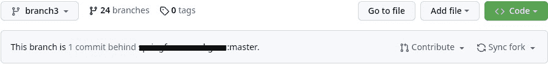
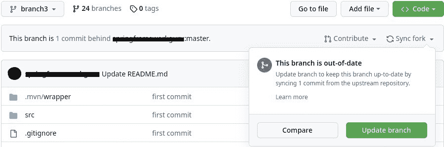
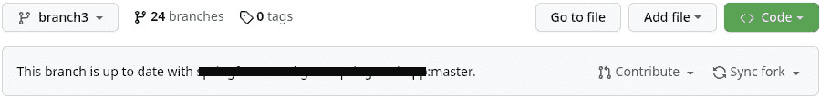

# 如何在 GitHub 上同步分叉的存储库

> 原文：<https://web.archive.org/web/20220930061024/https://www.baeldung.com/ops/github-sync-forked-repository>

## 1.概观

在这个快速教程中，我们将学习如何将 GitHub 存储库与原始存储库同步。

## 2.同步存储库

同步存储库有两种方法:

### 2.1.使用 GitHub Web 用户界面

第一种方法是使用 GitHub 的 web UI。如果我们输入我们正在处理的分支的 URL，我们会得到以下结果:

[](/web/20221207151406/https://www.baeldung.com/wp-content/uploads/2022/12/old_branch.jpg)

为了将分支与原始存储库同步，我们应该点击“Sync fork”:

[](/web/20221207151406/https://www.baeldung.com/wp-content/uploads/2022/12/syncing_branch.jpg)

分支开始与原始存储库同步。此后，分支将是最新的:

[](/web/20221207151406/https://www.baeldung.com/wp-content/uploads/2022/12/new_branch.jpg)

我们已经成功地将分支与原始存储库同步。

### 2.2.使用命令行(CLI)

另一种方法是使用命令行。要使用命令行同步我们的 fork，我们应该首先`clone`它:

```
$ git clone https://github.com/[username]/[repository_name]
```

在克隆我们的 fork 之后，我们应该向原始存储库添加一个`remote` 。我们可以随便叫它什么。姑且称之为`upstream`:

```
$ git remote add upstream https://github.com/[original_username]/[original_repository_name]
```

现在，我们应该从`upstream`遥控器上`fetch`下来所有的分支:

```
$ git fetch upstream
```

之后，我们应该切换到我们想要更新的分支:

```
$ git checkout branch3
Branch 'branch3' set up to track remote branch 'branch3' from 'origin'.
Switched to a new branch 'branch3'
```

现在，**我们应该改变我们分支的基础，以便我们的新提交出现在`upstream`库的`master`分支**的顶部:

```
$ git rebase upstream/master
First, rewinding head to replay your work on top of it...
Fast-forwarded branch3 to upstream/master.
```

最后，我们应该`push`对 GitHub 上的`origin`存储库进行更改:

```
$ git push -f origin branch3
```

我们使用了`-f`标志来强制推送到我们的远程存储库。

## 3.摘要

在这个快速教程中，我们学习了如何使用 GitHub 的 web UI 和命令行同步 fork 和它的原始存储库。