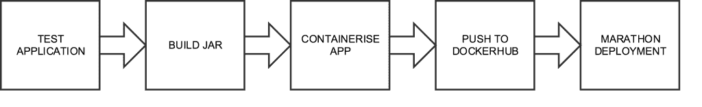
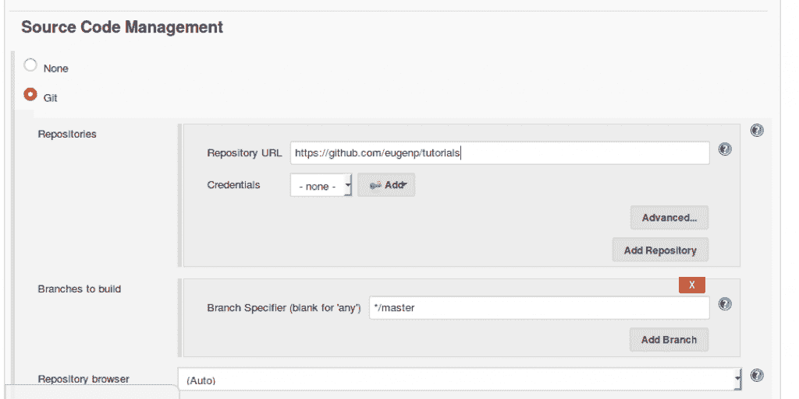
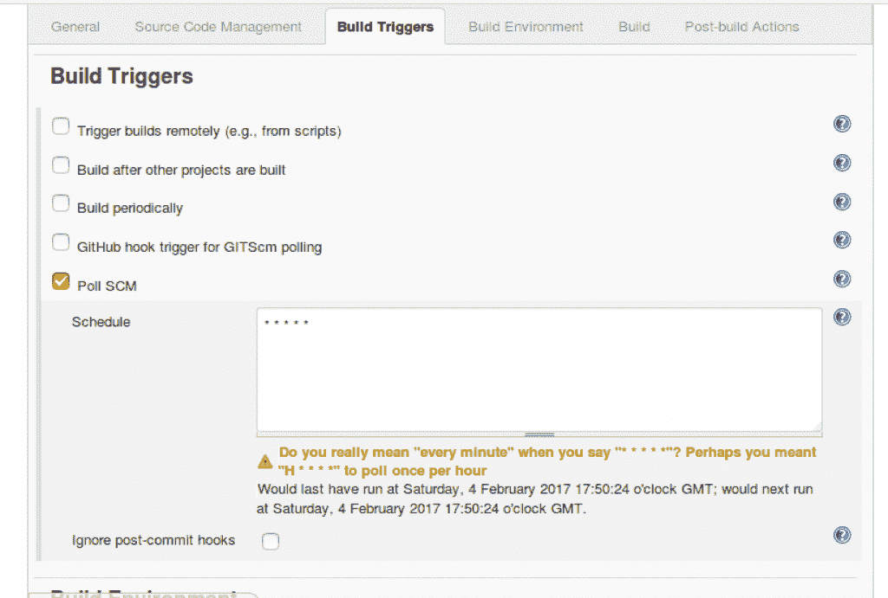
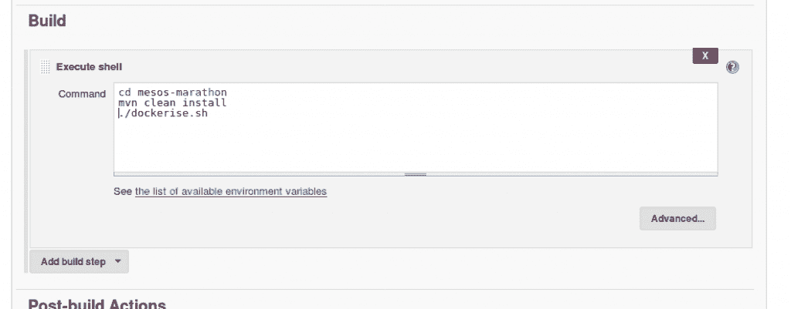
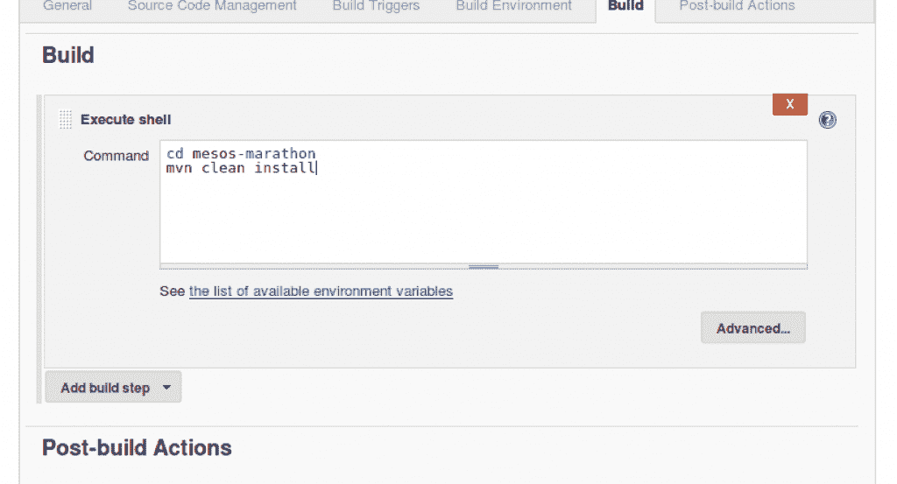
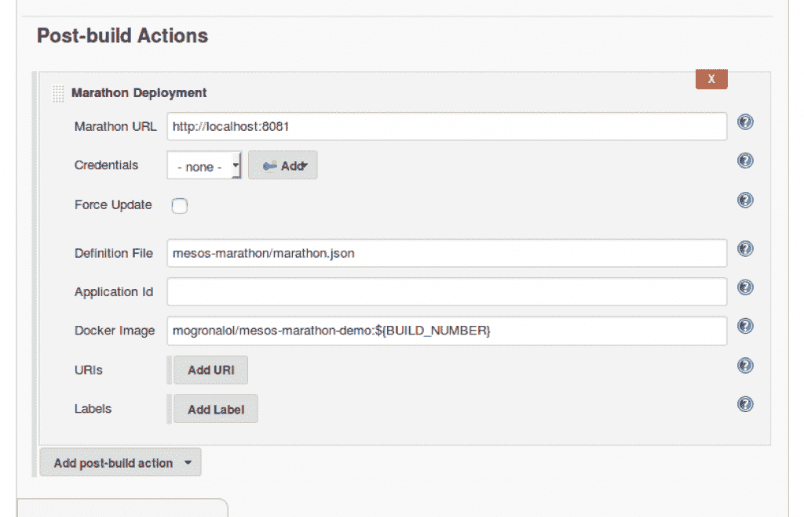
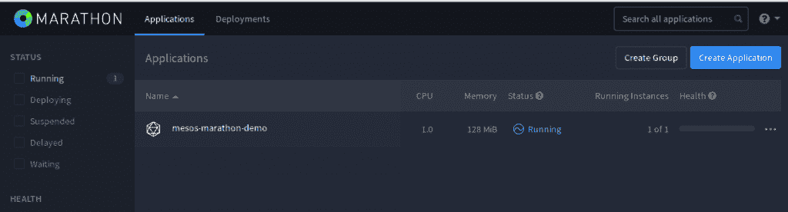
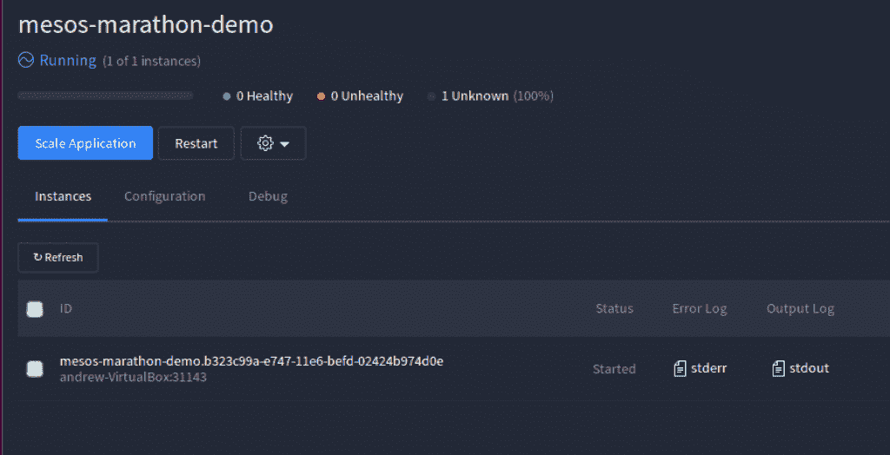

# 简单的詹金斯管道与马拉松和 Mesos

> 原文：<https://web.archive.org/web/20220930061024/https://www.baeldung.com/ops/jenkins-pipeline-with-marathon-mesos>

## **1。简介**

在本文中，我们将使用 [Jenkins](https://web.archive.org/web/20221006082513/https://jenkins.io/) 、[马拉松](https://web.archive.org/web/20221006082513/https://mesosphere.github.io/marathon/)和 [Mesos](https://web.archive.org/web/20221006082513/https://mesos.apache.org/) 实现一个简单的连续交付管道。

首先，我们将给出技术堆栈和架构的高级概述，并解释所有内容是如何结合在一起的。接下来，我们将进入一个实际的，一步一步的例子。

其结果将是一个完全自动化的 Jenkins 管道，使用 Marathon 将我们的应用程序部署到我们的 Mesos 集群。

## **2。技术堆栈概述**

当使用容器和微服务架构时，我们会面临新的运营问题，这些问题是我们在使用传统堆栈时不会遇到的。

例如，在部署到集群时，我们必须处理扩展、故障转移、联网等问题。这些困难的分布式计算问题可以用分布式内核和调度程序来解决，比如 Apache Mesos 和 Marathon。

### **2.1\. Mesos**

最简单地说，Mesos 可以被看作是我们的应用程序将要运行的单一服务器。事实上，我们有一个集群，但正是这种抽象使它如此有用。

### **2.2。马拉松**

Marathon 是用于将我们的应用程序部署到 Mesos 的框架，为我们解决困难的问题(健康检查、自动伸缩、故障转移、监控等)。

## **3。设置和安装**

这篇文章假设你已经有了詹金斯，梅索斯和马拉松跑步。如果不是这种情况，请查阅它们各自的官方文档，了解如何设置它们。否则，您将无法实施指南中的任何步骤。

## **4。我们的交付渠道**

我们将创建以下 Jenkins 管道:

这种方法没有什么特别复杂的地方——它与大多数现代 CD 管道的流程是同义的。在我们的例子中，构建意味着应用程序的容器化，部署意味着使用 Marathon 在一个 Mesos 集群上调度它。

## **5。测试和构建我们的应用程序**

第一步是构建和测试我们的应用程序。为了简单起见，我们将要使用的应用程序是一个 Spring Boot 应用程序。因此，我们得到的工件将是一个可执行的 jar。除了 JRE 之外，它没有任何外部依赖，这使得它非常容易执行。

### **5.1。创建我们的工作**

我们要做的第一件事是创建我们的 Jenkins 工作。让我们在左侧导航栏中选择“新项目”，然后选择创建一个自由式项目，将其命名为“`marathon-mesos-demo`”`:`

### 5.2。与 Git 集成

接下来，让我们将其配置为[克隆包含我们的应用程序的 Github 存储库](https://web.archive.org/web/20221006082513/https://github.com/eugenp/tutorials/tree/master/mesos-marathon):

为了简单起见，我们的存储库是公共的，这意味着我们能够通过 https `.` 进行克隆。如果不是这样，我们通过 SSH 进行克隆，那么还需要一个额外的步骤来设置 SSH 用户和私有密钥，这超出了本文的范围。

### 5.3。设置构建触发器

接下来，让我们设置一些构建触发器，这样我们的作业将每分钟轮询 git 是否有新的提交:

### 5.4。生成我们的构建脚本

我们现在可以告诉我们的作业在运行时执行一个 shell 脚本。因为我们正在处理一个简单的 Spring Boot Maven 项目，所以我们需要做的就是运行命令“ *mvn clean install* ”。这将运行所有的测试，并构建我们的可执行 jar `:`

### **5.5。构建我们的项目**

现在，我们已经设置了管道的开始，让我们通过单击作业上的“Build Now”来手动触发它。一旦作业完成，我们可以通过将它标记为蓝色来确认它已通过。

## **6。容器化我们的应用程序**

让我们进入管道的下一个阶段，用 Docker 打包和发布我们的应用程序。我们需要使用 Docker，因为容器是 Marathon 专门管理的。这不是不合理的，因为几乎任何东西都可以在容器中运行。对于像 Marathon 这样的工具来说，使用这些赋予的抽象更容易。

### **6.1。创建 Dockerfile 文件**

首先，让我们在项目根目录中创建一个 [Dockerfile](https://web.archive.org/web/20221006082513/https://docs.docker.com/engine/reference/builder/) 。实质上，Docker 文件是一个包含 Docker 守护程序如何构建映像的指令的文件:

[PRE0]

我们正在构建的映像很简单——它包含的只是一个可执行的 jar 和一个 shell 命令，当容器启动时将执行这个命令。我们还必须确保我们公开了应用程序将监听的端口，在本例中是“8082”。

### 6.2。发布图像

现在我们已经能够构建我们的映像了，让我们创建一个简单的 bash 脚本，它构建并发布到我们的私有 [Docker Hub](https://web.archive.org/web/20221006082513/https://hub.docker.com/) 存储库中，并把它放在我们的项目根目录中:

[PRE1]

您可能需要将您的图像推送到公共 docker 注册中心或您的私有注册中心。

环境变量`$BUILD_NUMBER`由 Jenkins 填充，随着每次构建而增加。虽然有点脆弱，但这是让每个版本增加版本号的快速方法。詹金斯也填充了`$DOCKER_PASSWORD` ,在这种情况下，我们将使用 [EnvInject 插件](https://web.archive.org/web/20221006082513/https://wiki.jenkins-ci.org/display/JENKINS/EnvInject+Plugin),以便保密。

虽然我们可以将这个脚本直接存储在 Jenkins 中，但更好的做法是将其保留在版本控制中，因为它可以与我们项目的其余部分一起进行版本控制和审计。

### 6.3。在 Jenkins 上构建和发布

现在让我们修改我们的 Jenkins 作业，使它在构建 jar 之后运行“Dockerise.sh ”:

然后，让我们再次运行我们的作业进行确认，通过它变蓝来确认一切正常。

## **7。部署我们的映像**

我们的管道即将完工。只有一个阶段，即使用 Marathon 将我们的应用程序部署到我们的 Mesos 集群。

Jenkins 附带了一个“[部署马拉松](https://web.archive.org/web/20221006082513/https://wiki.jenkins-ci.org/display/JENKINS/Marathon+Plugin)插件。这充当了 Marathon API 的包装器，比使用传统的 shell 脚本更容易。你可以通过插件管理器安装它。

### 7.1。创造我们的马拉松。Json 文件

在使用 Marathon 插件之前，我们需要创建一个“marathon.json”文件，并将其存储在我们的项目根目录中。这是因为插件依赖于它。

这个文件:“marathon.json”包含一个 [Mesos 应用程序定义](https://web.archive.org/web/20221006082513/https://mesosphere.github.io/marathon/docs/application-basics.html)。这是我们想要运行的长期运行服务(应用程序)的描述。最终，Jenkins Marathon 插件会将文件内容发布到马拉松`/v2/apps` 端点。然后，Marathon 将依次安排定义的应用程序在 Mesos 上运行:

[PRE2]

这是我们可以为容器化应用程序提供的最简单的配置。

属性:"`portMappings`"需要正确设置，以使我们的应用程序可以从我们的 Mesos slave 访问。这基本上意味着，将容器端口`8082`映射到主机上的一个随机端口(mesos slave ),这样我们就可以从外部与我们的应用程序对话。部署我们的应用程序后，Marathon 会告诉我们该端口使用了什么。

### 7.2。添加马拉松式部署构建步骤

让我们为我们的工作添加一个马拉松式的部署构建后操作:

注意我们告诉插件马拉松在哪里运行，在这个例子中是“localhost:8081”。我们还告诉它我们想要部署的映像。这就是我们文件中的空“图像”字段被替换的内容。

现在，我们已经创建了管道的最后一个阶段，让我们再运行一次我们的作业，并确认它仍然在通过，这一次有一个额外的步骤，将我们的应用程序发送到马拉松。

### 7.3。验证我们在马拉松中的部署

现在它已经部署好了，让我们看看马拉松 UI:

如我们所见，我们的应用程序现在显示在 UI 中。为了访问它，我们只需要检查它被分配了什么主机和端口:

在本例中，它在 localhost 上被随机分配了端口 31143，该端口将在内部映射到我们的容器中的端口 8082，如应用程序定义中所配置的。然后，我们可以在浏览器中访问这个 URL，以确认应用程序得到了正确的服务。

## **8。结论**

在本文中，我们使用 Jenkins、Marathon 和 Mesos 创建了一个简单的连续交付管道。每当我们对代码进行修改时，几分钟后它就会在一个环境中运行。

本系列的后续文章将涵盖更高级的马拉松主题，例如应用程序健康检查、伸缩、故障转移。Mesos 的其他用例，比如批处理，也可能会涉及到。

我们应用程序的源代码可以在 GitHub 的[上找到；这是一个 Maven 项目，应该能够运行。](https://web.archive.org/web/20221006082513/https://github.com/eugenp/tutorials/tree/master/mesos-marathon)