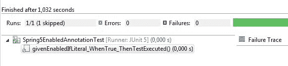

# 使用@EnabledIf 注释的 Spring 5 测试

> 原文：<https://web.archive.org/web/20220930061024/https://www.baeldung.com/spring-5-enabledif>

## **1。简介**

在这篇简短的文章中，我们将使用 JUnit 5 发现 Spring 5 中的`@EnabledIf`和`@DisabledIf`注释。

简而言之，如果满足指定的条件，这些注释使得禁用/启用特定的测试成为可能。

我们将使用一个简单的测试类来展示这些注释是如何工作的:

```
@SpringJUnitConfig(Spring5EnabledAnnotationIntegrationTest.Config.class)
public class Spring5EnabledAnnotationIntegrationTest {

    @Configuration
    static class Config {}
}
```

## 2.**T2`@EnabledIf`**

让我们用文本文字`“true”`向我们的类添加这个简单的测试:

```
@EnabledIf("true")
@Test
void givenEnabledIfLiteral_WhenTrue_ThenTestExecuted() {
    assertTrue(true);
}
```

如果我们运行这个测试，它会正常执行。

**然而，如果我们用`“false”`替换提供的`String`，它不会被执行:**

[](/web/20220524113322/https://www.baeldung.com/wp-content/uploads/2017/11/Captura-test.jpg)

记住，如果你想静态地禁用一个测试，这里有一个专用的 [`@Disabled`](https://web.archive.org/web/20220524113322/http://junit.org/junit5/docs/5.0.0/api/org/junit/jupiter/api/Disabled.html) 注释。

## **3。`@EnabledIf`带有属性占位符**

使用`@EnabledIf`的一个更实际的方法是使用一个属性占位符:

```
@Test
@EnabledIf(
  expression = "${tests.enabled}", 
  loadContext = true)
void givenEnabledIfExpression_WhenTrue_ThenTestExecuted() {
    // ...
}
```

首先，我们需要确保将`loadContext`参数设置为`true`，以便加载 Spring 上下文。

默认情况下，该参数设置为`false`以避免不必要的上下文加载。

## **4。`@EnabledIf`带着特殊表情**

最后，**我们可以在 Spring Expression Language (SpEL)表达式中使用注释。**

例如，我们只能在运行 JDK 1.8 时启用测试

```
@Test
@EnabledIf("#{systemProperties['java.version'].startsWith('1.8')}")
void givenEnabledIfSpel_WhenTrue_ThenTestExecuted() {
    assertTrue(true);
}
```

## **5。`@DisabledIf`**

**这个注解是`@EnabledIf.`的反义词**

例如，我们可以在 Java 1.7 上运行时禁用测试:

```
@Test
@DisabledIf("#{systemProperties['java.version'].startsWith('1.7')}")
void givenDisabledIf_WhenTrue_ThenTestNotExecuted() {
    assertTrue(true);
}
```

## **6。结论**

在这篇简短的文章中，我们通过使用`SpringExtension`查看了几个在 JUnit 5 测试中使用`@EnabledIf`和`@DisabledIf`注释的例子。

GitHub 上的[提供了示例的完整源代码。](https://web.archive.org/web/20220524113322/https://github.com/eugenp/tutorials/tree/master/testing-modules/spring-testing-2)