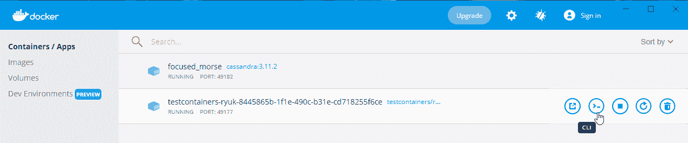

# 在 Spring Data Cassandra 中保存日期值

> 原文:[https://web . archive . org/web/20220930061024/https://www . bael dung . com/spring-data-Cassandra-dates](https://web.archive.org/web/20220930061024/https://www.baeldung.com/spring-data-cassandra-dates)

## 1.概观

Apache Cassandra 是一个可伸缩的 NoSQL 数据库。它提供了无单点故障的连续可用性。此外，Cassandra 能够以出色的性能处理大量数据。

在本教程中，我们将看看如何使用 Spring 数据和 Docker 连接到 Cassandra。此外，我们将利用 Spring 数据库抽象来处理 Cassandra 的数据层。

我们将看到如何在 Cassandra 中保存不同的 Java 日期值。最后，我们将研究这些日期值是如何映射到 Cassandra 类型的。

## 2.卡珊德拉的春季数据

Apache Cassandra 的 Spring Data 为 Spring 开发者**提供了一个与 Cassandra** 合作的熟悉界面。这个项目将核心的 Spring 概念应用到使用 Cassandra 数据存储的解决方案的开发中。

Spring Data 让我们能够创建基于公共 Spring 接口的存储库。它还允许使用`QueryBuilders`来消除学习 Cassandra 查询语言(CQL)的需要。该项目提供了支持丰富对象映射的简单注释。

有两个重要的助手类:

*   `CqlTemplate`处理常见的数据访问操作
*   `CassandraTemplate` 提供对象映射

该项目与 Spring 的核心 JDBC 支持有明显的相似之处。

## 3.设置测试环境

为了开始，我们需要建立一个到 Cassandra 实例的连接。

注意，我们也可以连接到 Astra DB 数据库，这是一个基于 Apache Cassandra 的云数据库。

本指南将向您展示如何将 [连接到 Datastax Astra DB](https://web.archive.org/web/20220525130304/https://docs.datastax.com/en/astra/docs/gs-grant-user-access.html) 。

### 3.1.卡珊德拉集装箱

让我们使用 [`Testcontainers`](/web/20220525130304/https://www.baeldung.com/docker-test-containers) 库配置并启动 Cassandra。首先，我们将定义一个 Cassandra 容器，并将其公开给一个特定的端口:

```
@Container
public static final CassandraContainer cassandra = (CassandraContainer) new CassandraContainer("cassandra:3.11.2")
    .withExposedPorts(9042);
```

接下来，我们需要[覆盖 Spring 数据所需的测试属性](/web/20220525130304/https://www.baeldung.com/spring-tests-override-properties),以便能够与 Cassandra 容器建立连接:

```
TestPropertyValues.of(
    "spring.data.cassandra.keyspace-name=" + KEYSPACE_NAME,
    "spring.data.cassandra.contact-points=" + cassandra.getContainerIpAddress(),
    "spring.data.cassandra.port=" + cassandra.getMappedPort(9042)
).applyTo(configurableApplicationContext.getEnvironment());
```

最后，在创建任何对象/表之前，我们需要创建一个键空间:

```
session.execute("CREATE KEYSPACE IF NOT EXISTS " + KEYSPACE_NAME + " WITH replication = {'class':'SimpleStrategy','replication_factor':'1'};");
```

在 Cassandra 中，keyspace 只是一个数据容器。事实上，它非常类似于 RDBMS 中的数据库。

### 3.2.卡珊德拉知识库

Spring Data 的 **[存储库支持](/web/20220525130304/https://www.baeldung.com/spring-data-cassandra-tutorial)大大简化了 DAOs** 的实现。让我们从创建一个简单的 DAO 开始。

在`org.springframework.data.cassandra.core.mapping`包中提供的`@Table`注释支持域对象映射:

```
@Table
public class Person {

    @PrimaryKey
    private UUID id;
    private String firstName;
    private String lastName;

    public Person(UUID id, String firstName, String lastName) {
        this.id = id;
        this.firstName = firstName;
        this.lastName = lastName;
    }

    //getters, setters, equals and hash code

}
```

接下来，我们将通过扩展`CassandraRepository`接口为我们的 DAO 定义一个 Spring 数据存储库:

```
@Repository
public interface PersonRepository extends CassandraRepository<Person, UUID> {}
```

最后，在开始编写集成测试之前，我们需要定义两个额外的属性:

```
spring.data.cassandra.schema-action=create_if_not_exists
spring.data.cassandra.local-datacenter=datacenter1
```

第一个属性将确保 Spring Data 自动为我们创建带注释的表。

我们应该注意到**生产系统**不建议使用该设置。

## 4.使用日期值

在 Apache Cassandra 的 Spring Data 的现代版本中，处理日期值非常简单。 **Spring 数据将自动确保 Java 日期类型与 Apache Cassandra 表示之间的正确映射**。

### 4.1 .LocalDate Type(本地日期类型)

让我们向我们的`Person` DAO 添加一个类型为`LocalDate`的新字段`birthDate`:

```
@Test
public void givenValidPersonUsingLocalDate_whenSavingIt_thenDataIsPersisted() {
    UUID personId = UUIDs.timeBased();
    Person newPerson = new Person(personId, "Luka", "Modric");
    newPerson.setBirthDate(LocalDate.of(1985, 9, 9));
    personRepository.save(newPerson);

    List<Person> savedPersons = personRepository.findAllById(List.of(personId));
    assertThat(savedPersons.get(0)).isEqualTo(newPerson);
}
```

**Spring Data 自动将 Java 的`LocalDate`转换为 Cassandra 的`date`类型**。从 Cassandra 保存和获取记录后，DAO 中的`LocalDate`值是相同的。

### 4.2 .LocalDateTime Type

让我们向我们的`Person` DAO 添加另一个名为*的字段，其类型为`LocalDateTime`:*

```
@Test
public void givenValidPersonUsingLocalDateTime_whenSavingIt_thenDataIsPersisted() {
    UUID personId = UUIDs.timeBased();
    Person newPerson = new Person(personId, "Luka", "Modric");
    newPerson.setLastVisitedDate(LocalDateTime.of(2021, 7, 13, 11, 30));
    personRepository.save(newPerson);

    List<Person> savedPersons = personRepository.findAllById(List.of(personId));
    assertThat(savedPersons.get(0)).isEqualTo(newPerson);
}
```

**Spring Data 自动将 Java 的`LocalDateTime`转换为 Cassandra 的*时间戳*类型**。从 Cassandra 保存和获取记录后，DAO 中的`LocalDateTime`值是相同的。

### 4.3.传统日期类型

最后，让我们向我们的`Person` DAO 添加一个继承类型 *Date* 的字段*lastpucheddate*:

```
@Test
public void givenValidPersonUsingLegacyDate_whenSavingIt_thenDataIsPersisted() {
    UUID personId = UUIDs.timeBased();
    Person newPerson = new Person(personId, "Luka", "Modric");
    newPerson.setLastPurchasedDate(new Date(LocalDate.of(2021, 7, 13).toEpochDay()));
    personRepository.save(newPerson);

    List<Person> savedPersons = personRepository.findAllById(List.of(personId));
    assertThat(savedPersons.get(0)).isEqualTo(newPerson);
}
```

与`LocalDateTime,` **一样，Spring Data 将 Java 的 *java.util.Date* 转换为 Cassandra 的*时间戳*类型**。

### 4.4.映射的 Cassandra 类型

让我们使用 CQLSH 检查保存在 Cassandra 中的数据。这是一个通过 CQL 与 Cassandra 交互的命令行 shell。

为了在测试执行期间检查 Cassandra 容器中存储了什么数据，我们可以简单地在测试中放置一个断点。在暂停的测试执行期间，我们可以通过 Docker 桌面应用程序连接到 Docker 容器 CLI:

[](/web/20220525130304/https://www.baeldung.com/wp-content/uploads/2021/10/container-list.png)

连接到 Docker 容器 CLI 后，我们应该首先选择密钥空间，然后选择表:

```
# cqlsh
Connected to Test Cluster at 127.0.0.1:9042.
[cqlsh 5.0.1 | Cassandra 3.11.2 | CQL spec 3.4.4 | Native protocol v4]
Use HELP for help.
cqlsh> USE test;
cqlsh:test> select * from person;
```

因此，CQLSH 将向我们显示保存在表中的数据的格式化输出:

```
 id                                   | birthdate  | firstname | lastname | lastpurchaseddate | lastvisiteddate
--------------------------------------+------------+-----------+----------+-------------------+-----------------
 9abef910-e3fd-11eb-9829-c5149ac796de | 1985-09-09 |      Luka |   Modric |              null |            null
```

但是，我们还想检查用于特定日期列的数据类型:

```
cqlsh:test> DESC TABLE person;
```

输出返回用于创建表的 CQL 命令。因此，它包含所有数据类型定义:

```
CREATE TABLE test.person (
    id uuid PRIMARY KEY,
    birthdate date,
    firstname text,
    lastname text,
    lastpurchaseddate timestamp,
    lastvisiteddate timestamp
)
```

## 5.结论

在本文中，我们探索了如何在 Apache Cassandra 的 Spring 数据中使用不同的日期值。

在示例中，我们讨论了如何使用`LocalDate`、`LocalDateTime,`和遗留的`Date` Java 类型。我们看到了如何使用`Testcontainers`连接到 Cassandra 实例。最后，我们使用 Spring 数据库抽象来操作 Cassandra 中存储的数据。

和往常一样，源代码可以在 GitHub 上的[处获得。](https://web.archive.org/web/20220525130304/https://github.com/Baeldung/datastax-cassandra/tree/main/spring-cassandra)