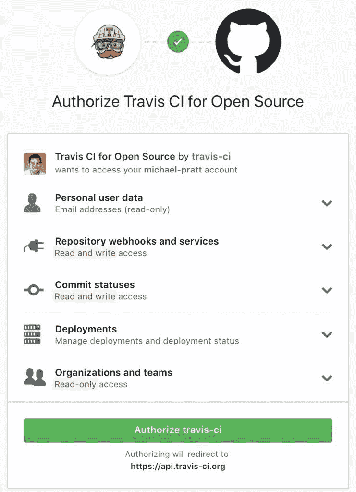
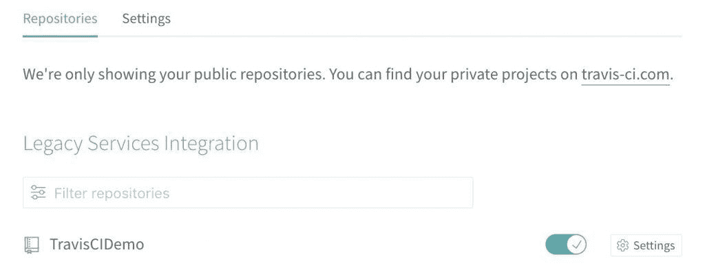

# 使用 Travis CI 创建构建管道

> 原文:[https://web . archive . org/web/20220930061024/https://www . bael dung . com/ops/Travis-ci-build-pipeline](https://web.archive.org/web/20220930061024/https://www.baeldung.com/ops/travis-ci-build-pipeline)

## 1.介绍

在现代软件开发中，术语`pipeline`被大量使用。但这是什么呢？

一般来说，**构建管道是一组将代码从开发转移到生产的自动化步骤**。

构建管道对于实现软件的持续集成工作流非常有用。它们允许我们**以更高的频率**构建更小的变更，目标是更快地找到 bug 并减少它们的影响。

在本教程中，我们将看看如何使用 [Travis CI](https://web.archive.org/web/20221207130816/https://travis-ci.org/) 构建一个简单的构建管道。

## 2.构建管道中的步骤

构建管道可以由许多不同的步骤组成，但至少应该包括:

*   在我们的例子中，这意味着将 Java 源代码编译成类文件
*   类似于运行单元测试和可能的集成测试
*   `Deploying artifacts`:将编译好的代码打包成工件，比如说打包成`jar`文件，并部署它们

如果应用程序使用不同的技术，那么**额外的步骤可以包含在构建管道**中。例如，我们可能有一个额外的步骤来缩小 JavaScript 文件或发布更新的 API 文档。

## 3.什么是特拉维斯 CI？

对于我们的示例构建管道，我们将使用 **Travis CI，一个基于云的持续集成工具**。

它有许多特性，这些特性使它成为开始构建管道的绝佳选择:

*   快速与任何公共 GitHub 库集成
*   支持每一种主要的编程语言
*   部署到多个不同的云平台
*   提供各种消息传递和警报工具

在高层次上，它通过监视 GitHub 存储库的新提交来工作。

当进行新的提交时，它执行配置文件中定义的构建管道的步骤(下面将详细介绍)。如果任何一步失败，管道终止，它会通知我们。

Travis CI 开箱即用，几乎不需要任何配置。唯一需要的配置是指定编程语言。

如果需要，我们可以随时提供更多配置来定制我们的管道。例如，我们可以限制触发构建的分支，向管道添加额外的步骤，等等。

### 3.1.免费和付费版本

重要的是要知道特拉维斯 CI 目前有 2 个产品:免费和付费版本。

由`.org`域名表示的免费版本为任何公共 GitHub 库提供了全部功能**。构建或存储库的数量没有限制，尽管在管道运行时会有资源限制。**

使用`.com`域名的付费版本是私有 GitHub 库所必需的。与免费计划相比，它还提供了更多的并发构建和无限的构建时间。前 100 个版本可以免费试用，以测试付费版本。

## 4.使用 Travis CI 创建构建管道

对于本教程，我们将使用上面提到的免费版本。任何公共存储库都可以用来创建免费管道。

我们所要做的就是用我们的 GitHub 账户登录 Travis CI 并授权:

[](/web/20221207130816/https://www.baeldung.com/wp-content/uploads/2018/11/travis1.jpg)

授予 GitHub 帐户权限后，我们就可以开始配置构建管道了。

### 4.1.配置存储库

最初，我们所有的公共存储库都被认为是不活动的。为了解决这个问题，**我们需要从账户设置页面**启用我们的存储库。

这列出了我们所有的公共存储库，以及一个切换按钮。单击 toggle 按钮将配置 Travis CI，使用默认的分支`master:`开始监控新提交的存储库

[](/web/20221207130816/https://www.baeldung.com/wp-content/uploads/2018/11/travis-ci-enable-repository-1024x397.jpg)

注意，每个存储库还有一个`Settings`按钮。在这里，我们可以配置不同的管道行为:

*   定义哪些事件触发管道(推、拉请求等)
*   设置传入管道的环境变量
*   触发新事件时自动取消构件

对于本教程，默认设置就可以了。稍后我们将看到如何覆盖一些默认行为。

### 4.2.创建 Travis 配置

下一步是在我们的存储库的根目录下创建一个名为`.travis.yml`的新文件。该文件包含配置管道所需的所有信息。没有这个文件，管道将不会执行。

对于本教程，我们只需要包含最低配置，它指定了编程语言:

```
language: java
```

就是这样！在不提供更多信息的情况下，Travis CI 将执行一个简单的管道:

*   编译我们的源代码
*   执行我们的测试

一旦我们提交了`.travis.yml`文件，Travis 将开始我们的第一次构建。对`master`分支的任何进一步提交都将触发额外的构建。仪表板还允许我们随时手动触发管道，而不需要提交或拉取请求。

## 5.附加配置

在上一节中，我们看到了运行我们的构建管道只需要一行配置。但是大多数项目需要额外的配置来实现有意义的管道。

本节概述了我们可能希望添加到管道中的一些更有用的配置。

### 5.1.更改默认的构建命令

用于构建 Maven 项目的默认命令是:

```
mvn test -B
```

我们可以通过设置`.travis.yml`中的`script`指令将它改为任何命令:

```
script: mvn package -DskipTests
```

可以使用`&&`操作符在一行`script`中将多个命令链接在一起。

有些构建命令很复杂，可能跨越多行或具有复杂的逻辑。例如，它们可以根据环境变量执行不同的操作。

**在这些情况下，建议将构建命令放在独立脚本**中，并从配置文件内部调用该脚本:

```
script: ./build.sh
```

### 5.2.部署代码

Java 项目的默认构建设置只是编译代码和执行测试。产生的工件(。jar 文件等。)被丢弃在管道的末端，除非我们将它们部署在某个地方。

Travis CI 支持各种知名的第三方服务。工件可以复制到许多流行的云存储系统，如亚马逊 S3、谷歌云存储、Bintray 等。

它还可以[将代码直接部署到最流行的云计算平台](https://web.archive.org/web/20221207130816/https://docs.travis-ci.com/user/deployment/)，比如 AWS、Google App Engine、Heroku 等等。

下面是一个配置示例，展示了我们如何部署到 Heroku。要生成加密属性，我们必须使用 [Travis CLI 工具](https://web.archive.org/web/20221207130816/https://github.com/travis-ci/travis.rb#readme)。

```
deploy:
  provider: heroku
  api_key:
    secure: "ENCRYPTED_API_KEY"
```

此外，它提供了一个通用的部署选项，允许我们编写自己的部署脚本。如果我们需要将工件部署到本地不支持的第三方系统，这是很有帮助的。

例如，我们可以编写一个 shell 脚本，将工件安全地复制到一个私有的 FTP 服务器上:

```
deploy:
  provider: script
  script: bash ./custom-deploy.sh
```

### 5.3.管理触发管道的分支

默认情况下，管道将在`master`执行任何提交。然而，大多数大型项目使用某种形式的 git 分支来管理开发周期。

**Travis CI 支持 git 分支的白名单和黑名单**,以确定哪些提交应该触发管道。

例如，考虑以下配置:

```
branches:
  only:
  - release
  - stable
  except:
  - master
  - nightly
```

这将忽略`master`和`nightly`分支上的提交。对`release`和`stable`分支的提交将触发流水线。注意，`only`指令总是优先于`except`指令。

我们还可以使用正则表达式来控制哪些分支触发管道:

```
branches:
  only:
  - /^development.*$/
```

这将只为以`development`开始的分支上的提交启动管道。

### 5.4.跳过特定提交

**我们可以使用 git 提交消息来跳过单独的提交**。Travis CI 将检查邮件的以下模式:

*   跳过
*   <keyword>跳过</keyword>

其中<keyword>是下列值之一:</keyword>

*   铸铁
*   特拉维斯
*   特拉维斯·ci
*   特拉维斯-ci
*   特拉维斯·ci

如果提交消息与这些模式中的任何一个匹配，那么管道将不会运行。

### 5.5.使用不同的构建环境

Java 项目的默认构建环境是 Ubuntu Linux。通过将以下配置添加到`.travis.yml`中，管道也可以在 Mac OSX 或 Windows 服务器上执行:

```
os: osx # can also be 'windows'
```

即使是 Linux，也有 3 个不同的发行版可供我们选择:

```
os: linux
  dist: xenial # other choices are 'trusty' or 'precise'
```

[构建平台文档](https://web.archive.org/web/20221207130816/https://docs.travis-ci.com/user/reference/overview/)涵盖了所有可用的环境及其差异。

请记住，如果我们改变平台，我们可能还需要改变任何定制的`build`或`deploy`脚本，以确保兼容性。[在配置上处理多个操作系统](https://web.archive.org/web/20221207130816/https://docs.travis-ci.com/user/multi-os/)有几种方法。

### 5.6.使用不同的 JDK 版本

我们还可以通过在`.travis.yml`文件中设置以下配置来测试特定版本的 JDK:

```
jdk: oraclejdk8
```

请记住，不同的构建环境，甚至不同的 Linux 发行版，都可能有不同的可用 JDK 版本。请查阅每个环境的文档，查看 JDK 版本的完整列表。

## 6.构建矩阵

默认情况下，每次我们的管道运行时，它都作为单个作业运行。这意味着管道的所有阶段都在具有相同设置的单个虚拟机上顺序执行。

但是 Travis CI 的一个重要特性是能够创建构建矩阵。这使我们可以为每次提交运行多个作业，对我们前面看到的一些设置使用不同的值。

例如，我们可以使用构建矩阵在 Linux 和 Mac OSX 上运行我们的管道，或者在 JDK 8 和 9 上运行。

有两种方法可以创建构建矩阵。首先，**我们可以为我们之前看到的一个或多个语言和环境配置提供一组值**。例如:

```
language: java
jdk:
  - openjdk8
  - openjdk9
os:
  - linux
  - osx
```

使用这种方法，Travis CI 将自动扩展每个配置组合以形成多个作业。在上面的示例中，结果将是总共四个作业。

**创建构建矩阵的第二种方法是使用`matrix.include`指令**。这让我们可以明确地声明我们想要运行哪些组合:

```
language: java
matrix:
  include:
  - jdk: openjdk8
    os: linux
  - jdk: openjdk9
    os: osx
```

上面的示例会产生两个作业。

同样，如果我们在多个操作系统上构建，我们必须小心确保我们的`build`和`deployment`脚本适用于所有情况。例如，Shell 脚本不能在 Windows 上运行。我们必须使用适当的条件语句来处理不同的操作系统。

有更多的选项可以更精确地控制创建哪些作业，以及如何处理故障。

## 7.结论

在本文中，我们使用 Travis CI 创建了一个简单的构建管道。我们主要使用开箱即用的配置，创建了一个构建代码和运行测试的管道。

我们还看到了 Travis CI 可配置性的一个小示例。它可以与各种编程语言和第三方云平台一起工作。一个缺点是，它目前只适用于 GitHub 库。