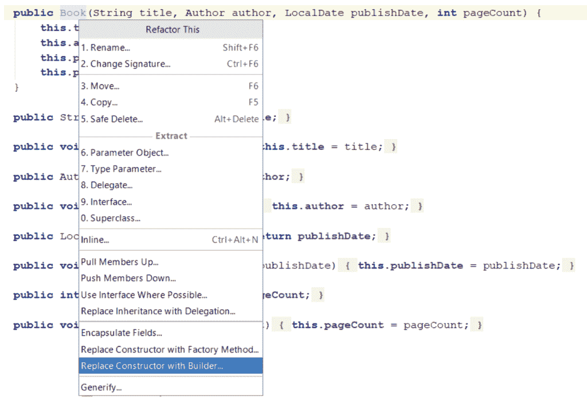
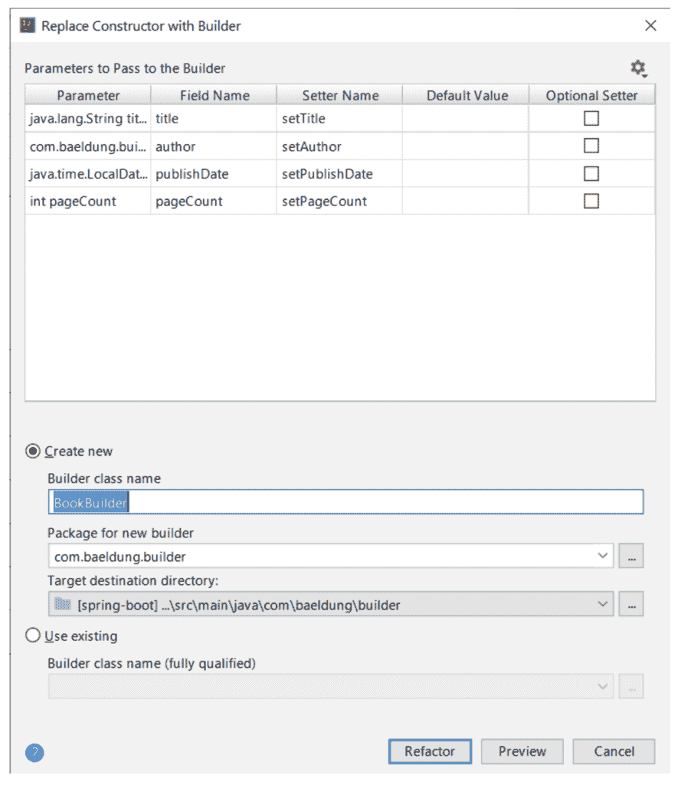
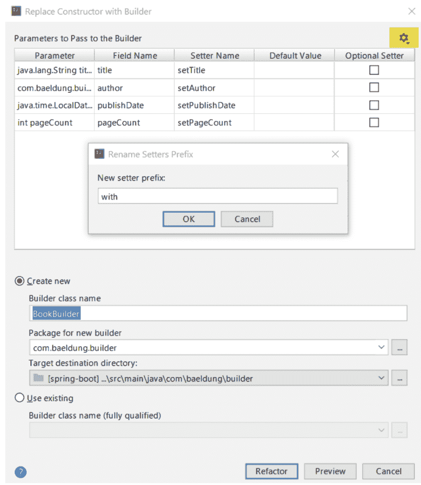
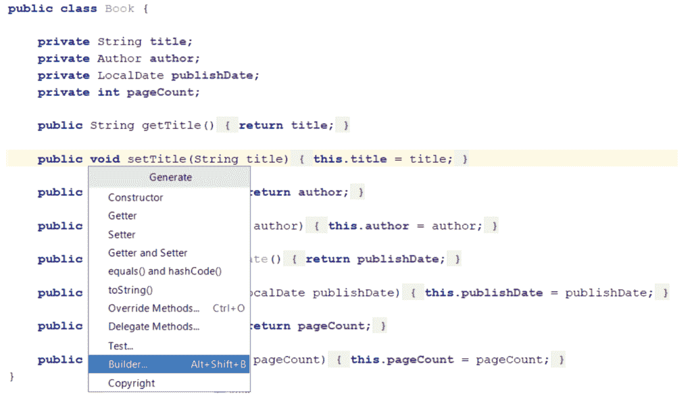
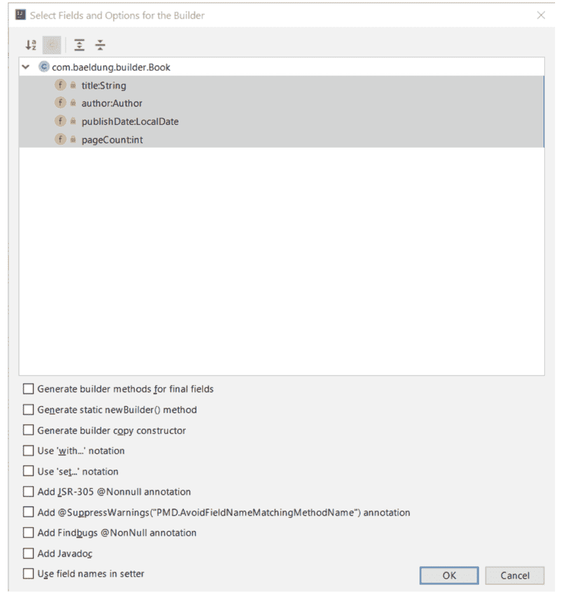
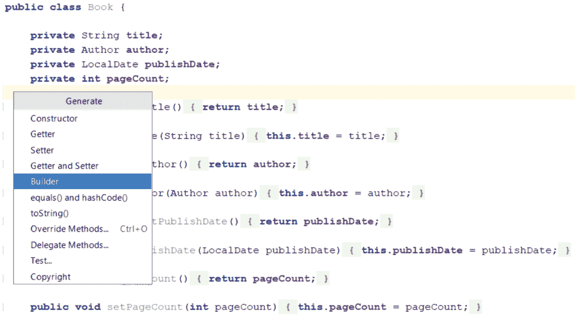
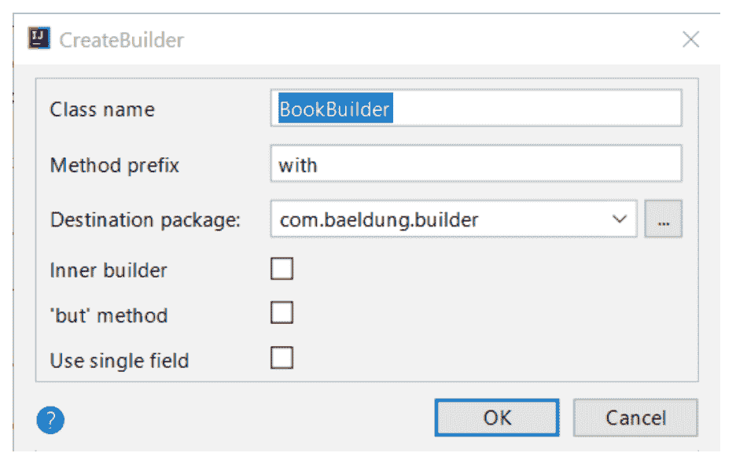

# 在 IntelliJ 中为类创建 Java 生成器

> 原文：<https://web.archive.org/web/20220930061024/https://www.baeldung.com/intellij-idea-java-builders>

## 1.介绍

[Builder 设计模式](/web/20221129003346/https://www.baeldung.com/creational-design-patterns#builder)是使用最广泛的创造模式之一。它帮助我们构造复杂的物体。

手工编写构建器既麻烦又容易出错。因此，我们应该尽可能使用专用工具来自动生成它们。

在本教程中，我们将探索在 IntelliJ IDE 中自动创建构建器类的不同方法。我们将看看 IntelliJ 提供的开箱即用的内置特性，以及第三方插件。

## 2.初始设置

在本文中，我们将使用 IntelliJ IDEA Community edition 的 2019.1.3 版本，这是撰写本文时的最新版本。然而，示例中介绍的所有技术应该也适用于任何其他版本的 IDEA。

让我们从定义`Book`类开始，我们将为其生成一个构建器:

[PRE0]

## 3.使用 IntelliJ 的内置功能

**要使用 IntelliJ 的内置工具为`Book`类生成一个构建器，我们需要一个合适的构造函数。**

让我们创建一个:

[PRE1]

现在，我们准备创建一个构建器。因此，让我们将光标放在创建的构造函数上，通过按`Ctrl+Alt+Shift+T`(在 PC 上)打开 [`Refactor This`](https://web.archive.org/web/20221129003346/https://www.jetbrains.com/help/idea/refactoring-source-code.html#refactoring_invoke) 弹出菜单，并选择 [`Replace Constructor with Builder`](https://web.archive.org/web/20221129003346/https://www.jetbrains.com/help/idea/replace-constructor-with-builder.html) 重构:

我们可以进一步调整 builder 类的一些选项，比如它的名称和目标包:

结果，我们生成了`BookBuilder`类:

[PRE2]

### 3.1.自定义 Setters 前缀

在构建器类中为 setter 方法使用前缀`with`是一种常见的做法。

**要更改默认前缀，我们需要选择选项窗口右上角的`Rename Setters Prefix`图标**:

### 3.2.静态内部生成器

我们中的一些人可能更喜欢将构建器实现为静态内部类，就像约书亚·布洛赫在《高效 Java 中描述的[。](https://web.archive.org/web/20221129003346/http://www.informit.com/articles/article.aspx?p=1216151&seqNum=2)

如果是这种情况，我们需要使用 IntelliJ 的`Replace Constructor with Builder`特性采取一些额外的步骤来实现这一点。

首先，我们需要手动创建一个空的内部类，并将构造函数设为私有:

[PRE3]

此外，我们必须在选项窗口中选择`Use existing`并指向我们新创建的类:

## 4.使用 InnerBuilder 插件

**现在让我们看看如何使用[内置构建器](https://web.archive.org/web/20221129003346/https://plugins.jetbrains.com/plugin/7354-innerbuilder)插件为`Book`类生成一个构建器。**

一旦我们安装了插件，我们可以通过按下`Alt+Insert`(在 PC 上)并选择`Builder…`选项来打开 [`Generate`](https://web.archive.org/web/20221129003346/https://www.jetbrains.com/help/idea/generating-code.html) 弹出窗口:

或者，我们可以通过按`Alt+Shift+B`(在 PC 上)直接调用 InnerBuilder 插件:

正如我们所看到的，有几个选项可供我们选择来定制生成的构建器。

让我们看看当所有选项都取消选中时生成的构建器:

[PRE4]

默认情况下，InnerBuilder 插件将构建器实现为静态内部类。

## 5.使用生成器插件

最后，我们来看看 [Builder 生成器](https://web.archive.org/web/20221129003346/https://plugins.jetbrains.com/plugin/6585-builder-generator)是如何工作的。

同样，对于 InnerBuilder，我们可以(在 PC 上)按下`Alt+Insert`并选择`Builder`选项，或者使用`Alt+Shift+B`快捷键。

正如我们所见，我们有三个选项可供选择来定制`BookBuilder`:

让我们保留所有未选中的选项，并查看生成的构建器类:

[PRE5]

构建器生成器插件提供的第一个选项是定制创建的构建器类—`Inner builder –` ,这个选项是不言自明的。

然而，另外两个更有趣，我们将在接下来的章节中探讨它们。

### 5.1.`‘but'`方法选项

如果我们选择这个选项，插件将向`BookBuilder`类添加一个`but()` 方法:

[PRE6]

现在，让我们假设我们想要创建三本书，它们的作者相同，页数相同，但书名和出版日期不同。**我们可以创建一个已经设置了公共属性的基础构建器，然后使用`but()`方法从中创建新的`BookBuilder`(以及稍后的`Book`)。**

让我们来看一个例子:

[PRE7]

### 5.2.使用单一字段选项

如果我们选择这个选项，生成的构建器将保存对创建的`Book`对象的引用，而不是书的所有属性:

[PRE8]

这是一种创建构建器类的不同方法，在某些情况下可能会派上用场。

## 6.结论

在本教程中，我们探索了在 IntelliJ 中生成生成器类的不同方法。

通常最好使用这些工具来自动生成我们的构建器。我们提出的每一种选择都各有利弊。我们实际上选择哪种方法完全是个人喜好的问题。