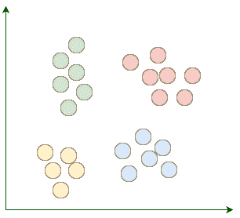
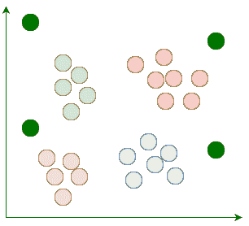
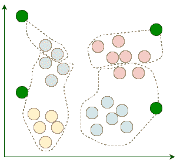
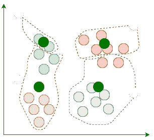
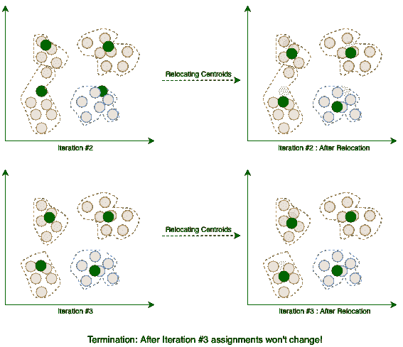
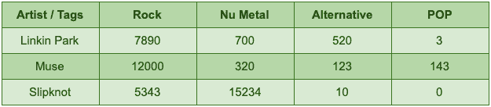
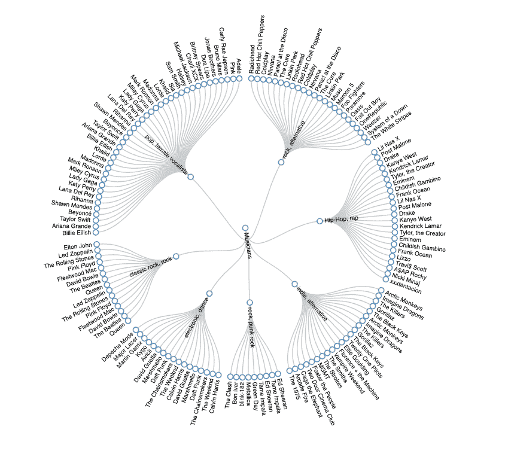
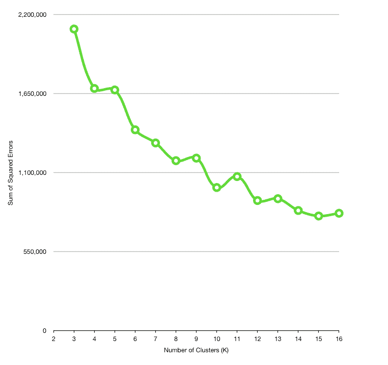

# Java 中的 K-Means 聚类算法

> 原文：<https://web.archive.org/web/20220930061024/https://www.baeldung.com/java-k-means-clustering-algorithm>

## 1.概观

聚类是一类无监督算法的总称，用于**发现彼此密切相关的一组事物、人或想法**。

在这个看似简单的单行定义中，我们看到了一些流行词汇。集群到底是什么？什么是无监督算法？

在本教程中，我们将首先阐明这些概念。然后，我们将看到它们如何在 Java 中表现出来。

## 2.无监督算法

在我们使用大多数学习算法之前，我们应该以某种方式向它们提供一些样本数据，并允许算法从这些数据中学习。在机器学习术语中，**我们称之为样本数据集训练数据。**同样，**整个过程被称为训练过程。**

无论如何，**我们可以根据学习算法在训练过程中需要的监督量来对它们进行分类。**这一类别中的两种主要学习算法是:

*   **监督学习**:在监督算法中，训练数据应该包括每个点的实际解。例如，如果我们要训练我们的垃圾邮件过滤算法，我们将样本邮件和它们的标签，即垃圾邮件或非垃圾邮件，输入到算法中。从数学上来说，我们将从包括`xs `和`ys.`的训练集中推断出`f(x)`
*   **无监督学习**:当训练数据中没有标签时，那么算法就是无监督的。例如，我们有大量关于音乐家的数据，我们将在数据中发现相似的音乐家群体。

## 3.使聚集

聚类是一种无监督的算法，用于发现相似事物、想法或人的组。与监督算法不同，我们不用已知标签的例子来训练聚类算法。相反，聚类试图在训练集中找到没有数据点是标签的结构。

### 3.1.k 均值聚类

K-Means 是一种具有一个基本属性的聚类算法:**聚类的数目是预先定义的**。除了 K-Means，还有其他类型的聚类算法，如层次聚类、相似性传播或谱聚类。

### 3.2.K-Means 如何工作

假设我们的目标是在数据集中找到几个相似的组，比如:

K-Means 从 k 个随机放置的质心开始。**质心，顾名思义，是星团**的中心点。例如，这里我们添加了四个随机质心:

然后，我们将每个现有数据点分配到其最近的质心:

在指定之后，我们移动质心到指定给它的点的平均位置。请记住，质心应该是群集的中心点:

每次重新定位质心后，当前的迭代就会结束。**我们重复这些迭代，直到多个连续迭代之间的赋值停止变化:**

当算法终止时，这四个聚类如预期的那样被找到。现在我们知道了 K-Means 是如何工作的，让我们用 Java 实现它。

### 3.3.特征表示

当对不同的训练数据集建模时，我们需要一个数据结构来表示模型属性及其相应的值。例如，一个音乐家可以有一个值为 Rock `.` **的流派属性，我们通常使用术语 feature 来指代属性及其值的组合。**

为了为特定的学习算法准备数据集，我们通常使用一组通用的数字属性，这些属性可用于比较不同的项目。例如，如果我们让用户为每位艺术家标记一个流派，那么在一天结束时，我们可以计算每位艺术家被标记特定流派的次数:

像 Linkin Park 这样的艺术家的特征向量是`[rock -> 7890, nu-metal -> 700, alternative -> 520, pop -> 3]. `,因此如果我们能够找到一种将属性表示为数值的方法，那么我们就可以简单地比较两个不同的项目，例如艺术家，通过比较它们对应的向量条目。

由于数字向量是如此通用的数据结构，我们将使用它们来表示特征`. `下面是我们如何在 Java 中实现特征向量:

[PRE0]

### 3.4.查找相似的项目

在 K-Means 的每次迭代中，我们需要一种方法来找到数据集中每个项目的最近质心。计算两个特征向量之间距离的最简单方法之一是使用[欧几里德距离](https://web.archive.org/web/20221116154651/https://en.wikipedia.org/wiki/Euclidean_distance)。像`[p1, q1]` 和 `[p2, q2]` 这样的两个向量之间的欧几里德距离等于:

让我们用 Java 实现这个函数。首先，抽象:

[PRE1]

除了欧几里德距离，**还有其他方法来计算不同项目之间的距离或相似性，如皮尔逊[相关系数](/web/20221116154651/https://www.baeldung.com/cs/correlation-coefficient)** 。这种抽象使得在不同的距离度量之间切换变得容易。

让我们看看欧几里德距离的实现:

[PRE2]

首先，我们计算相应条目之间的平方差之和。然后，通过应用`sqrt `函数，我们计算实际的欧几里德距离。

### 3.5.质心表示

质心与普通要素位于同一空间，因此我们可以将其表示为类似于要素:

[PRE3]

现在我们已经有了一些必要的抽象，是时候编写 K-Means 实现了。下面快速浏览一下我们的方法签名:

[PRE4]

让我们来分解这个方法签名:

*   `dataset `是一组特征向量。由于每个特征向量是一个`Record, `，那么数据集类型就是 `List<Record>`
*   `k `参数决定了我们应该提前提供的集群数量
*   `distance `概括了我们将要计算两个特征之间差异的方式
*   当赋值在几次连续迭代中停止变化时，K-Means 终止。除了这个终止条件，我们还可以为迭代次数设置一个上限。`maxIterations `参数决定了上限
*   当 K-Means 终止时，每个质心应该有一些指定的特征，因此我们使用一个`Map<Centroid, List<Record>> `作为返回类型。基本上，每个映射条目对应一个集群

### 3.6.质心生成

第一步是生成`k `随机放置的质心。

尽管每个质心可以包含完全随机的坐标，但是为每个属性生成最小和最大可能值之间的随机坐标是一个很好的实践。不考虑可能值的范围而生成随机质心会导致算法收敛得更慢。

首先，我们应该计算每个属性的最小值和最大值，然后在每对属性之间生成随机值:

[PRE5]

现在，我们可以将每个记录分配给这些随机质心之一。

### 3.7.分配

首先，给定一个`Record`，我们应该找到离它最近的质心:

[PRE6]

每个记录属于其最近的质心聚类:

[PRE7]

### 3.8.质心重定位

如果在一次迭代之后，一个质心不包含任何赋值，那么我们不会重新定位它。否则，我们应该将每个属性的质心坐标重新定位到所有分配记录的平均位置:

[PRE8]

由于我们可以重新定位单个质心，现在可以实现`relocateCentroids `方法:

[PRE9]

这个简单的一行程序遍历所有的质心，重新定位它们，并返回新的质心。

### 3.9.把所有的放在一起

在每次迭代中，在将所有记录分配给它们最近的质心之后，首先，我们应该将当前分配与上一次迭代进行比较。

如果分配是相同的，那么算法终止。否则，在跳到下一次迭代之前，我们应该重新定位质心:

[PRE10]

## 4.示例:在 Last.fm 上发现相似的艺术家

Last.fm 通过记录用户所听音乐的细节，建立了每个用户音乐品味的详细资料。在这一部分，我们将找到相似艺术家的群集。为了构建适合这个任务的数据集，我们将使用 Last.fm 中的三个 API:

1.  API 在 Last.fm 上获得顶级艺术家的集合。
2.  另一个 API 寻找[流行标签](https://web.archive.org/web/20221116154651/https://www.last.fm/api/show/chart.getTopTags)。每个用户都可以用一些东西给一个艺术家加标签，例如`rock. `所以，Last.fm 维护着一个这些标签及其频率的数据库。
3.  和一个 API 来获取某个艺术家的顶级标签，按受欢迎程度排序。因为有很多这样的标签，我们将只保留那些在顶级全局标签中的标签。

### 4.1.Last.fm 的 API

要使用这些 API，我们应该从 Last.fm 获取一个 [API 键，并在每个 HTTP 请求中发送它。我们将使用下面的](https://web.archive.org/web/20221116154651/https://www.last.fm/api/authentication)[改进](/web/20221116154651/https://www.baeldung.com/retrofit)服务来调用这些 API:

[PRE11]

所以，让我们在 Last.fm 上找到最受欢迎的艺术家:

[PRE12]

类似地，我们可以获取顶部的标签:

[PRE13]

最后，我们可以建立艺术家及其标签频率的数据集:

[PRE14]

### 4.2.形成艺术家集群

现在，我们可以将准备好的数据集提供给 K-Means 实现:

[PRE15]

如果我们运行这段代码，它会将聚类可视化为文本输出:

[PRE16]

由于质心坐标是按平均标签频率排序的，我们可以很容易地找出每个聚类中的主导类型。例如，最后一个集群是一个很好的老摇滚乐队的集群，或者第二个集群充满了说唱明星。

虽然这种聚类有意义，但在大多数情况下，它并不完美，因为数据仅仅是从用户行为中收集的。

## 5.形象化

几分钟前，我们的算法以终端友好的方式可视化了艺术家集群。如果我们将集群配置转换成 JSON 并输入 D3.js，那么通过几行 JavaScript，我们将得到一个很好的人友好的[放射状整齐树](https://web.archive.org/web/20221116154651/https://observablehq.com/@d3/radial-tidy-tree?collection=@d3/d3-hierarchy):

我们必须将我们的`Map<Centroid, List<Record>>`转换成具有类似模式的 JSON，如[这个 d3.js 示例](https://web.archive.org/web/20221116154651/https://raw.githubusercontent.com/d3/d3-hierarchy/v1.1.8/test/data/flare.json)。

## 6.聚类数

K-Means 的基本属性之一是我们应该预先定义聚类的数量。到目前为止，我们为`k`使用了一个静态值，但是确定这个值可能是一个具有挑战性的问题。**有两种常用的方法来计算集群的数量:**

1.  领域知识
2.  数学启发式

如果我们足够幸运，对这个领域了解如此之多，那么我们也许能够简单地猜出正确的数字。否则，我们可以应用一些试探法，如肘方法或剪影方法，以了解集群的数量。

在进一步探讨之前，我们应该知道这些启发法虽然有用，但只是启发法，可能无法提供明确的答案。

### 6.1.肘法

要使用肘方法，我们应该首先计算每个聚类质心与其所有成员之间的差异。随着我们将更多不相关的成员分组到一个簇中，质心与其成员之间的距离增加，因此簇的质量下降。

执行该距离计算的一种方式是使用误差平方和`. ` **误差平方和或 SSE 等于质心与其所有成员之间的平方差之和**:

[PRE17]

然后，**我们可以对不同的`k`** 值运行 K-Means 算法，并计算每个值的 SSE:

[PRE18]

在一天结束时，可以通过绘制针对 SSE 的集群数量来找到合适的`k `:

通常，随着集群数量的增加，集群成员之间的距离会减小。然而，我们不能为`k, `选择任何任意大的值，因为多个集群只有一个成员会破坏集群的整体目的。

**肘方法背后的想法是为`k `找到一个合适的值，使得上证综指在该值附近大幅下降。**比如`k=9`在这里可以是很好的候选。

## 7.结论

在本教程中，首先，我们介绍了机器学习中的一些重要概念。然后，我们用 K-Means 聚类算法的机制对其进行了着色。最后，我们为 K-Means 编写了一个简单的实现，用来自 Last.fm 的真实数据集测试了我们的算法，并以一种漂亮的图形方式可视化了聚类结果。

像往常一样，我们的 [GitHub](https://web.archive.org/web/20221116154651/https://github.com/eugenp/tutorials/tree/master/algorithms-modules/algorithms-miscellaneous-3) 项目中提供了示例代码，所以请务必查看它！