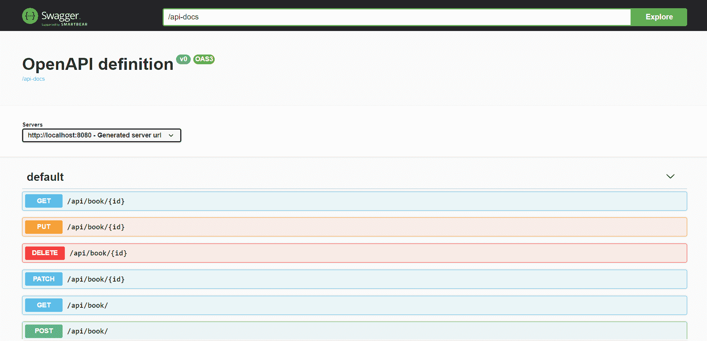
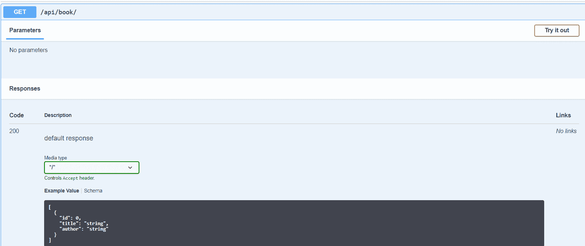
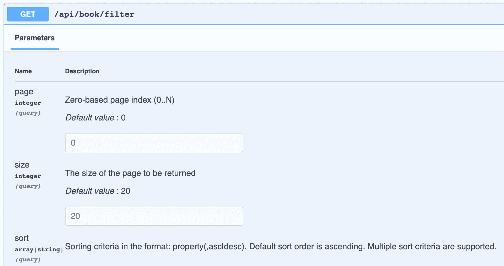
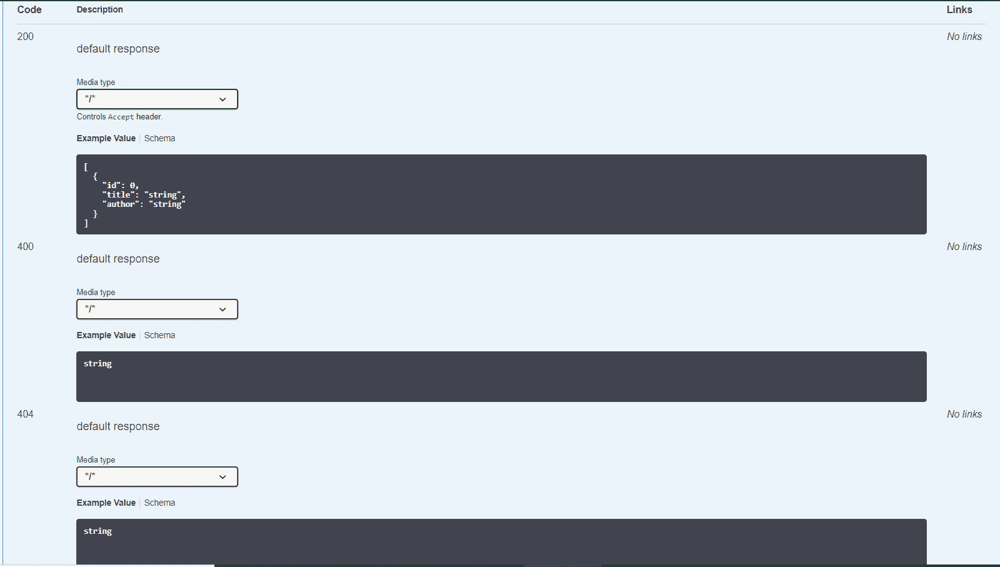
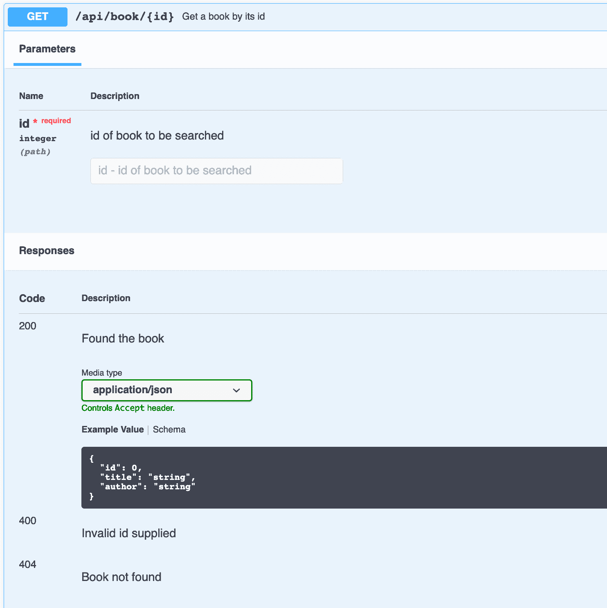
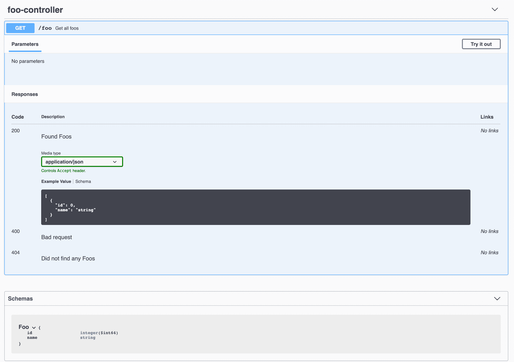
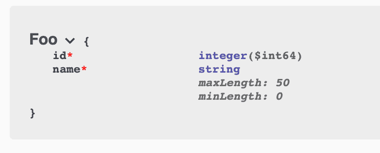

# 使用 OpenAPI 3.0 记录 Spring REST API

> 原文：<https://web.archive.org/web/20220930061024/https://www.baeldung.com/spring-rest-openapi-documentation>

## **1。概述**

文档是构建 REST APIs 的重要部分。在本教程中，我们将了解 SpringDoc——一种基于 OpenAPI 3 规范为 Spring Boot 1.x 和 2.x 应用程序简化 API 文档生成和维护的工具。

## 延伸阅读:

## [生成带有 Swagger 的 Spring Boot REST 客户端](/web/20220818091138/https://www.baeldung.com/spring-boot-rest-client-swagger-codegen)

Learn how you can generate a Spring Boot REST client using Swagger Code generator.[Read more](/web/20220818091138/https://www.baeldung.com/spring-boot-rest-client-swagger-codegen) →

## [使用 Springfox 用 Spring REST API 设置 Swagger 2](/web/20220818091138/https://www.baeldung.com/swagger-2-documentation-for-spring-rest-api)

Learn how to document a Spring REST API using Swagger 2.[Read more](/web/20220818091138/https://www.baeldung.com/swagger-2-documentation-for-spring-rest-api) →

## [春云合同简介](/web/20220818091138/https://www.baeldung.com/spring-cloud-contract)

Learn to write and test Consumer-Driven Contracts using Spring Cloud Contract.[Read more](/web/20220818091138/https://www.baeldung.com/spring-cloud-contract) →

## **2。设置 springdoc-openapi**

为了让 [springdoc-openapi](https://web.archive.org/web/20220818091138/https://github.com/springdoc/springdoc-openapi) 自动为我们的 api 生成 OpenAPI 3 规范文档，我们只需将`[springdoc-openapi-ui](https://web.archive.org/web/20220818091138/https://search.maven.org/search?q=g:org.springdoc%20AND%20a:springdoc-openapi-ui&core=gav)`依赖项添加到我们的`pom.xml`中:

```
<dependency>
    <groupId>org.springdoc</groupId>
    <artifactId>springdoc-openapi-ui</artifactId>
    <version>1.6.4</version>
</dependency>
```

然后，当我们运行我们的应用程序时，默认情况下，OpenAPI 描述将在路径`/v3/api-docs`中可用:

```
http://localhost:8080/v3/api-docs/
```

要使用自定义路径，我们可以在`application.properties`文件中指明:

```
springdoc.api-docs.path=/api-docs
```

现在，我们可以通过以下网址访问这些文档:

```
http://localhost:8080/api-docs/
```

缺省情况下，OpenAPI 定义采用 JSON 格式。对于`yaml`格式，我们可以从以下网址获得定义:

```
http://localhost:8080/api-docs.yaml
```

## **3。与 Swagger UI 集成**

除了生成 OpenAPI 3 规范本身，我们可以将`springdoc-openapi`与 Swagger UI 集成，这样我们就可以与我们的 API 规范进行交互，并锻炼端点。

依赖项已经包含了 Swagger UI，所以我们已经准备好了。

我们可以从以下网址访问 API 文档:

```
http://localhost:8080/swagger-ui.html
```

### 3.1.支持`swagger-ui`属性

Springdoc-openapi 还支持[属性](https://web.archive.org/web/20220818091138/https://springdoc.org/#swagger-ui-properties)。这些可以用作 Spring Boot 属性，带有前缀`springdoc.swagger-ui`。

例如，让我们定制 API 文档的路径。我们可以通过修改我们的`application.properties` 来做到这一点:

```
springdoc.swagger-ui.path=/swagger-ui-custom.html
```

所以现在我们的 API 文档将在 [`http://localhost:8080/swagger-ui-custom.html`](https://web.archive.org/web/20220818091138/http://localhost:8080/swagger-ui-custom.html) 可用。

作为另一个例子，为了按照 HTTP 方法的顺序对 API 路径进行排序，我们可以添加:

```
springdoc.swagger-ui.operationsSorter=method
```

### 3.2.示例 API

假设我们的应用程序有一个控制器来管理`Book` s:

```
@RestController
@RequestMapping("/api/book")
public class BookController {

    @Autowired
    private BookRepository repository;

    @GetMapping("/{id}")
    public Book findById(@PathVariable long id) {
        return repository.findById(id)
            .orElseThrow(() -> new BookNotFoundException());
    }

    @GetMapping("/")
    public Collection<Book> findBooks() {
        return repository.getBooks();
    }

    @PutMapping("/{id}")
    @ResponseStatus(HttpStatus.OK)
    public Book updateBook(
      @PathVariable("id") final String id, @RequestBody final Book book) {
        return book;
    }
} 
```

然后，当我们运行我们的应用程序时，我们可以在以下位置查看文档:

```
http://localhost:8080/swagger-ui-custom.html
```

[](/web/20220818091138/https://www.baeldung.com/wp-content/uploads/2019/11/1-swagger-ui.png)

让我们深入到 `/api/book` 端点，查看其请求和响应的详细信息:
[](/web/20220818091138/https://www.baeldung.com/wp-content/uploads/2019/11/2-swagger-ui-api-details.png)

## **4。集成 springdoc-openapi 和 Spring WebFlux**

我们可以通过添加 [`springdoc-openapi-webflux-ui`](https://web.archive.org/web/20220818091138/https://search.maven.org/search?q=g:org.springdoc%20AND%20a:springdoc-openapi-webflux-ui&core=gav) 将 springdoc-openapi 和 Swagger UI 集成在一个 Spring WebFlux 项目中:

```
<dependency>
    <groupId>org.springdoc</groupId>
    <artifactId>springdoc-openapi-webflux-ui</artifactId>
    <version>1.6.4</version>
</dependency>
```

和以前一样，这些文档可以在以下位置获得:

```
http://localhost:8080/swagger-ui.html
```

为了定制路径，我们可以再次在我们的`application.properties`中添加`springdoc.swagger-ui.path`属性。

## 5.公开分页信息

Spring Data JPA 与 Spring MVC 无缝集成。这种集成的一个例子是`Pageable` 支持:

```
@GetMapping("/filter")
public Page<Book> filterBooks(@ParameterObject Pageable pageable) {
     return repository.getBooks(pageable);
}
```

从 springdoc-openapi v1.6.0 开始，对`Pageable`的支持就是现成的了。P `age`、`size`和`sort`查询参数被添加到生成的文档中。：

[](/web/20220818091138/https://www.baeldung.com/wp-content/uploads/2019/11/Pageable.png)

## **6。使用 springdoc-openapi Maven 插件**

springdoc-openapi 库提供了一个 Maven 插件 [`springdoc-openapi-maven-plugin`](https://web.archive.org/web/20220818091138/https://search.maven.org/search?q=g:org.springdoc%20AND%20a:springdoc-openapi-maven-plugin&core=gav) ，用于生成`json`和`yaml`格式的 openapi 描述。

`springdoc-openapi-maven-plugin`插件与`spring-boot-maven`插件一起工作。Maven 在`integration-test` 阶段运行`openapi` 插件。

让我们看看如何在我们的`pom.xml`中配置插件:

```
<plugin>
    <groupId>org.springframework.boot</groupId>
    <artifactId>spring-boot-maven-plugin</artifactId>
    <version>2.3.3.RELEASE</version>
    <executions>
        <execution>
            <id>pre-integration-test</id>
            <goals>
                <goal>start</goal>
            </goals>
        </execution>
        <execution>
            <id>post-integration-test</id>
            <goals>
                <goal>stop</goal>
            </goals>
        </execution>
    </executions>
</plugin>
<plugin>
    <groupId>org.springdoc</groupId>
    <artifactId>springdoc-openapi-maven-plugin</artifactId>
    <version>0.2</version>
    <executions>
        <execution>
            <phase>integration-test</phase>
            <goals>
                <goal>generate</goal>
            </goals>
        </execution>
    </executions>
</plugin>
```

我们还可以配置插件使用自定义值:

```
<plugin>
    <executions>
        .........
    </executions>
    <configuration> 
        <apiDocsUrl>http://localhost:8080/v3/api-docs</apiDocsUrl> 
        <outputFileName>openapi.json</outputFileName> 
        <outputDir>${project.build.directory}</outputDir> 
    </configuration>
</plugin> 
```

让我们仔细看看可以为插件配置的参数:

*   `apiDocsUrl`–可以访问 JSON 格式文档的 URL，默认为`http://localhost:8080/v3/api-docs`
*   `outputFileName`–保存定义的文件名，默认为`openapi.json`
*   `outputDir`–保存文件的目录的绝对路径，默认为`${project.build.directory}`

## **7。使用 JSR-303 Bean 验证自动生成文档**

当我们的模型包含 JSR-303 bean 验证注释时，比如`@NotNull`、`@NotBlank`、`@Size`、`@Min`和`@Max`，springdoc-openapi 库使用它们为相应的约束生成附加的模式文档。

让我们看一个使用我们的`Book` bean 的例子:

```
public class Book {

    private long id;

    @NotBlank
    @Size(min = 0, max = 20)
    private String title;

    @NotBlank
    @Size(min = 0, max = 30)
    private String author;

}
```

现在为`Book` bean 生成的文档更加丰富了:
[](/web/20220818091138/https://www.baeldung.com/wp-content/uploads/2019/11/3-schema-doc-1.png)

## **8。使用`@ControllerAdvice`和`@ResponseStatus`和**生成文档

在`@RestControllerAdvice`类中的方法上使用`@ResponseStatus`将会自动生成响应代码的文档。在这个`@RestControllerAdvice`类中，这两个方法被标注为`@ResponseStatus`:

```
@RestControllerAdvice
public class GlobalControllerExceptionHandler {

    @ExceptionHandler(ConversionFailedException.class)
    @ResponseStatus(HttpStatus.BAD_REQUEST)
    public ResponseEntity<String> handleConnversion(RuntimeException ex) {
        return new ResponseEntity<>(ex.getMessage(), HttpStatus.BAD_REQUEST);
    }

    @ExceptionHandler(BookNotFoundException.class)
    @ResponseStatus(HttpStatus.NOT_FOUND)
    public ResponseEntity<String> handleBookNotFound(RuntimeException ex) {
        return new ResponseEntity<>(ex.getMessage(), HttpStatus.NOT_FOUND);
    }
}
```

因此，我们现在可以看到响应代码 400 和 404 的文档:
[](/web/20220818091138/https://www.baeldung.com/wp-content/uploads/2019/11/4-controlleradvice.png)

## 9.使用`@Operation`和`@ApiResponses`生成文件

接下来，让我们看看如何使用几个 [OpenAPI 特定的注释](https://web.archive.org/web/20220818091138/https://javadoc.io/doc/io.swagger.core.v3/swagger-annotations/latest/index.html)向我们的 API 添加一些描述。

为了做到这一点，我们将用`@Operation`和`@ApiResponses`来注释控制器的`/api/book/{id}` 端点:

```
@Operation(summary = "Get a book by its id")
@ApiResponses(value = { 
  @ApiResponse(responseCode = "200", description = "Found the book", 
    content = { @Content(mediaType = "application/json", 
      schema = @Schema(implementation = Book.class)) }),
  @ApiResponse(responseCode = "400", description = "Invalid id supplied", 
    content = @Content), 
  @ApiResponse(responseCode = "404", description = "Book not found", 
    content = @Content) })
@GetMapping("/{id}")
public Book findById(@Parameter(description = "id of book to be searched") 
  @PathVariable long id) {
    return repository.findById(id).orElseThrow(() -> new BookNotFoundException());
}
```

效果是这样的:

[](/web/20220818091138/https://www.baeldung.com/wp-content/uploads/2019/11/BooksGetByID.png)

正如我们所看到的，我们添加到`@Operation`的文本被放置在 API 操作级别。类似地，添加到`@ApiResponses`容器注释中各种`@ApiResponse`元素的描述在这里也是可见的，为我们的 API 响应增加了意义。

显然，对于上面的响应 400 和 404，我们没有得到任何模式。因为我们为它们定义了一个空的`@Content`，所以只显示它们的描述。

## 10。科特林支持

由于 Spring Boot 2.x 对 Kotlin 有一流的支持，SpringDoc 对 Boot 2.x 应用程序开箱即用地支持这种 JVM 语言。

为了看到这一点，我们将在 Kotlin 中创建一个简单的`Foo` API。

在[初始设置](/web/20220818091138/https://www.baeldung.com/spring-boot-kotlin#2-setup)之后，我们将添加一个数据类和一个控制器。我们将把它们添加到我们的启动应用程序的一个子包中，这样当它运行时，它会将我们的`FooController`和之前的`BookController`一起捡起来:

```
@Entity
data class Foo(
    @Id
    val id: Long = 0,

    @NotBlank
    @Size(min = 0, max = 50)
    val name: String = ""
)

@RestController
@RequestMapping("/")
class FooController() {
    val fooList: List = listOf(Foo(1, "one"), Foo(2, "two"))

    @Operation(summary = "Get all foos")
    @ApiResponses(value = [
	ApiResponse(responseCode = "200", description = "Found Foos", content = [
            (Content(mediaType = "application/json", array = (
                ArraySchema(schema = Schema(implementation = Foo::class)))))]),
	ApiResponse(responseCode = "400", description = "Bad request", content = [Content()]),
	ApiResponse(responseCode = "404", description = "Did not find any Foos", content = [Content()])]
    )
    @GetMapping("/foo")
    fun getAllFoos(): List = fooList
}
```

现在，当我们点击我们的 API 文档 URL 时，我们也会看到`Foo` API:

[](/web/20220818091138/https://www.baeldung.com/wp-content/uploads/2019/11/FooAPI_kotlin.png)

为了增强对 Kotlin 类型的支持，我们可以添加这种依赖关系:

```
<dependency>
    <groupId>org.springdoc</groupId>
    <artifactId>springdoc-openapi-kotlin</artifactId
    <version>1.6.4</version>
</dependency>
```

在这之后，我们的 Foo 模式将看起来更加丰富，就像我们添加 JSR-303 Bean 验证时一样:

[](/web/20220818091138/https://www.baeldung.com/wp-content/uploads/2019/11/FooSchema.png)

## **11。结论**

在本文中，我们学习了在项目中设置 springdoc-openapi。然后我们看到了如何将 springdoc-openapi 与 Swagger UI 集成。我们还看到了如何使用 Spring Webflux 项目来实现这一点。

接下来，我们使用 springdoc-openapi Maven 插件为我们的 api 生成 openapi 定义，我们看到了如何从 Spring 数据中公开分页和排序信息。之后，我们查看了 springdoc-openapi 如何使用 JSR 303 bean 验证注释和`@ControllerAdvice`类中的`@ResponseStatus`注释自动生成文档。

我们还学习了如何使用一些特定于 OpenAPI 的注释向我们的 API 添加描述。最后，我们瞥了一眼 OpenAPI 对 Kotlin 的支持。

springdoc-openapi 按照 Openapi 3 规范生成 API 文档。此外，它还为我们处理 Swagger UI 配置，使 API 文档生成成为一项相当简单的任务。

和往常一样，代码可以在 GitHub 的[上获得。](https://web.archive.org/web/20220818091138/https://github.com/eugenp/tutorials/tree/master/spring-boot-modules/spring-boot-springdoc)