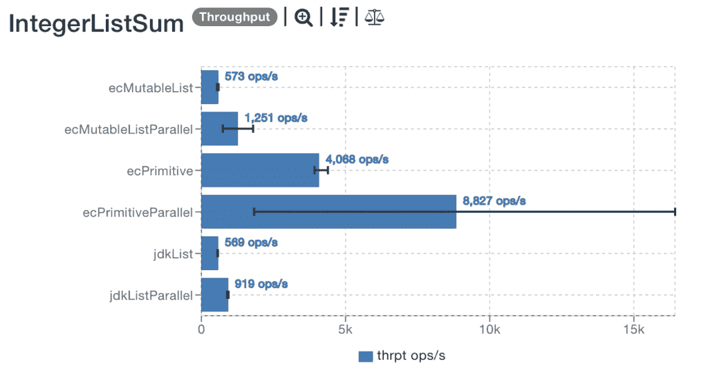
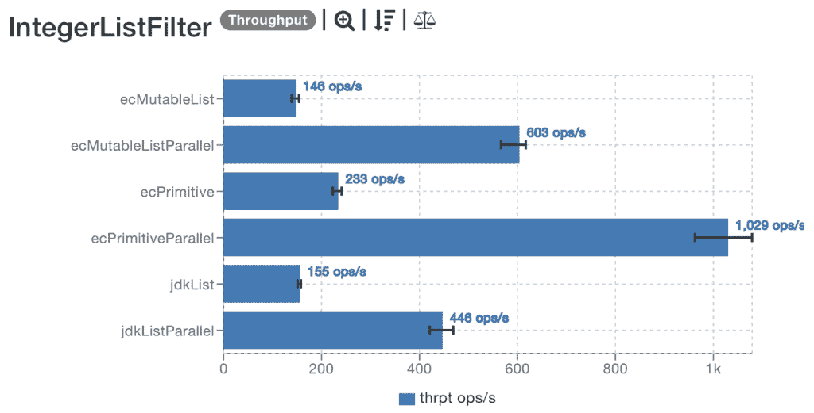

# 基准 JDK 集合与 Eclipse 集合

> 原文：<https://web.archive.org/web/20220930061024/https://www.baeldung.com/jdk-collections-vs-eclipse-collections>

## 1.介绍

在本教程中，我们将比较传统的 JDK 集合和 Eclipse 集合的性能。我们将创建不同的场景并探索结果。

## 2.配置

首先，请注意，对于本文，我们将使用默认配置来运行测试。我们的基准测试不会设置任何标志或其他参数。

我们将使用以下硬件和库:

*   JDK 11.0.3，Java HotSpot(TM) 64 位服务器虚拟机，11.0.3+12-LTS。
*   MacPro 2.6GHz 6 核 i7，配 16GB DDR4。
*   Eclipse 集合 10.0.0 (撰写本文时最新的版本)
*   我们将利用 [JMH (Java 微基准测试工具)](/web/20221206030803/https://www.baeldung.com/java-microbenchmark-harness)来运行我们的基准测试
*   [JMH 可视化器](https://web.archive.org/web/20221206030803/http://jmh.morethan.io/)从 JMH 结果生成图表

创建项目最简单的方法是通过命令行:

[PRE0]

之后，我们可以使用我们最喜欢的 IDE 打开项目并编辑`pom.xml`来添加[Eclipse 集合依赖项](https://web.archive.org/web/20221206030803/https://search.maven.org/search?q=a:eclipse-collections):

[PRE1]

## 3.第一个基准

我们的第一个基准很简单。我们想计算先前创建的 `Integers`的总和`List` 。

我们将以串行和并行方式测试六种不同的组合:

[PRE2]

要运行我们的第一个基准测试，我们需要执行:

[PRE3]

这将在我们的`IntegerListSum`类中触发基准，并将结果保存到一个 JSON 文件中。

**我们将在测试中测量吞吐量或每秒操作数，因此越高越好:**

[PRE4]

根据我们的测试，Eclipse 集合的并行原语列表具有最高的吞吐量。此外，它是最高效的，性能比并行运行的 Java JDK 快 10 倍。

当然，一部分原因可以解释为，当使用[原语列表](/web/20221206030803/https://www.baeldung.com/java-eclipse-primitive-collections)时，我们没有与装箱和拆箱相关的成本。

我们可以使用 JMH 可视化工具来分析我们的结果。下图显示了更好的可视化效果:

## 4.过滤

接下来，我们将修改我们的列表以获取所有 5 的倍数的元素。我们将重用之前的大部分基准和过滤函数:

[PRE5]

我们将像之前一样执行测试:

[PRE6]

结果是:

[PRE7]

正如我们所看到的，Eclipse Collections 原语再次胜出。其吞吐量比 JDK 并行列表快 2 倍以上。

**注意，对于滤波，并行处理的效果更明显。求和对于 CPU 来说是一种廉价的操作，我们不会看到串行和并行之间的相同差异。**

此外，Eclipse 集合原语列表早先获得的性能提升开始消失，因为对每个元素所做的工作开始超过装箱和拆箱的成本。

最后，我们可以看到原语上的操作比对象更快:

## 5.结论

在本文中，我们创建了几个基准来比较 Java 集合和 Eclipse 集合。我们利用 JMH 来尽量减少环境偏见。

和往常一样，源代码可以在 GitHub 上的[处获得。](https://web.archive.org/web/20221206030803/https://github.com/eugenp/tutorials/tree/master/core-java-modules/core-java-11)