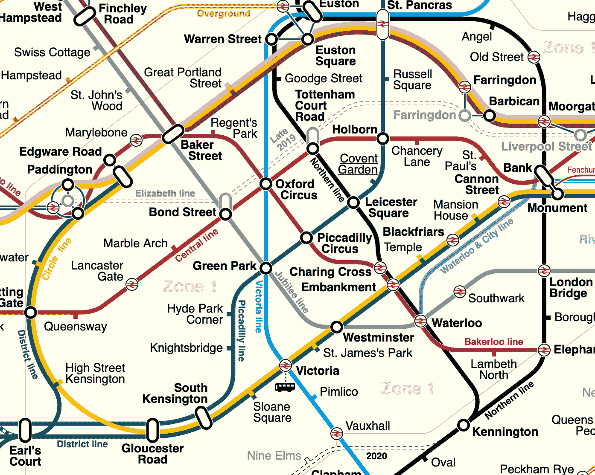

# 用 Java 实现 A*寻路

> 原文:[https://web . archive . org/web/20220930061024/https://www . bael dung . com/Java-a-star-path finding](https://web.archive.org/web/20220930061024/https://www.baeldung.com/java-a-star-pathfinding)

## **1。简介**

**寻路算法是导航地图的技术**，允许我们找到两个不同点之间的路线。不同的算法有不同的优点和缺点，通常是在算法的效率和它生成的路由的效率方面。

## **2。什么是寻路算法？**

**寻路算法是一种将由节点和边组成的图转换成通过图的路线的技术**。这个图可以是任何需要遍历的东西。在这篇文章中，我们将尝试穿越伦敦地铁系统的一部分:

[](/web/20221018063907/https://www.baeldung.com/wp-content/uploads/2019/11/Screenshot-2019-11-13-at-06.49.37.png)

( [sameboat](https://web.archive.org/web/20221018063907/https://commons.wikimedia.org/wiki/User:Sameboat) 的“[伦敦地铁地上 DLR 跨轨图](https://web.archive.org/web/20221018063907/https://commons.wikimedia.org/wiki/File:London_Underground_Overground_DLR_Crossrail_map.svg)”获得 [CC BY-SA 4.0](https://web.archive.org/web/20221018063907/https://creativecommons.org/licenses/by-sa/4.0/deed.en) 授权)

这里面有很多有趣的成分:

*   我们在起点和终点之间可能有也可能没有直接的路线。比如我们可以直接从“伯爵宫”到“纪念碑”，但不能到“天使”。
*   每一步都有特定的成本。在我们的例子中，这是站与站之间的距离。
*   每个停靠点仅连接到其他停靠点的一个子集。比如“摄政公园”直接连接的只有“贝克街”和“牛津广场”。

所有寻路算法都将所有节点(在我们的例子中是站点)和它们之间的连接以及所需的起点和终点的集合作为输入。**输出通常是一组节点，按照我们需要进行**的顺序，让我们从头到尾。

## **3。什么是 A*？**

**[A*](/web/20221018063907/https://www.baeldung.com/cs/a-star-algorithm) 是一种特定的寻路算法**，由 Peter Hart、Nils Nilsson 和 Bertram Raphael 于 1968 年首次发表。**当没有机会预先计算路线并且对内存使用没有限制时，通常认为这是最好的算法**。

在最坏的情况下，内存和性能的复杂性都可能是`O(b^d)`的，所以虽然它总是能找到最有效的路线，但它并不总是最有效的方法。

A*实际上是 Dijkstra 算法的变体，其中提供了额外的信息来帮助选择下一个要使用的节点。这些额外的信息不需要完美——如果我们已经有了完美的信息，那么寻路就毫无意义。但是越好，最后的结果也就越好。

## **4。A*是如何工作的？**

A*算法的工作原理是反复选择迄今为止的最佳路线，并尝试查看下一步的最佳路线。

在使用这种算法时，我们需要跟踪几条数据。“开放集”是我们目前正在考虑的所有节点。这并不是系统中的每一个节点，相反，这是我们可能进行下一步的每一个节点。

我们还将跟踪系统中每个节点的当前最佳得分、估计总得分和当前最佳先前节点。

作为其中的一部分，我们需要能够计算两个不同的分数。一个是从一个节点到下一个节点的得分。第二种是启发式的，给出从任何节点到目的地的成本估计。这个估计不需要精确，但是更高的精确度会产生更好的结果。唯一的要求是两个分数彼此一致，也就是说，它们的单位相同。

在最开始，我们的开集由我们的开始节点组成，我们没有任何关于其他节点的信息。

在每次迭代中，我们将:

*   从我们的开放集合中选择具有最低估计总分的节点
*   从开放集中删除此节点
*   向开集添加我们可以到达的所有节点

当我们这样做时，我们还计算出从这个节点到每个新节点的新分数，看看它是否比我们目前所得到的有所改进，如果是的话，那么我们就更新我们对那个节点的了解。

然后重复这一过程，直到我们的开放集合中具有最低估计总分的节点是我们的目的地，在这一点上，我们得到了我们的路线。

### **4.1。工作示例**

例如，让我们从“玛丽莱波恩”出发，试图找到去“邦德街”的路。

**一开始，我们的开放集只包含“Marylebone”**。这意味着这无疑是我们获得最佳“估计总分”的节点。

我们的下一站可以是“Edgware Road”，费用为 0.4403 km，也可以是“Baker Street”，费用为 0.4153 km。然而，“Edgware Road”的方向是错误的，所以我们从这里到目的地的启发式得分是 1.4284 km，而“Baker Street”的启发式得分是 1.0753 km。

这意味着在这个迭代之后，我们的开放集包括两个条目——“Edgware Road”，估计总得分为 1.8687 km，以及“Baker Street”，估计总得分为 1.4906 km。

我们的第二次迭代将从“贝克街”开始，因为它具有最低的估计总分。从这里开始，我们的下一站可以是“玛丽莱本”、“圣约翰伍德”、“大波特兰街”、“摄政公园”或“邦德街”。

我们不会讨论所有这些，但让我们以“Marylebone”作为一个有趣的例子。到达那里的成本也是 0.4153 km，但这意味着总成本现在是 0.8306 km。此外，从这里到目的地的试探法给出 1.323 km 的分数。

**这意味着估计总得分将为 2.1536 公里，比该节点的先前得分高`worse`。**这是有道理的，因为在这种情况下，我们不得不做额外的工作而毫无进展。这意味着我们不认为这是一条可行的路线。因此,“Marylebone”的详细信息不会更新，也不会添加回开放集。

## **5。Java 实现**

既然我们已经讨论了这是如何工作的，让我们实际实现它。我们将构建一个通用的解决方案，然后我们将实现它为伦敦地铁工作所必需的代码。然后，我们可以通过只实现那些特定的部分，将它用于其他场景。

### **5.1。代表图形**

首先，我们需要能够表示我们希望遍历的图形。这包括两个类——单个节点和整个图形。

我们将用一个名为`GraphNode`的接口来表示我们的单个节点:

```
public interface GraphNode {
    String getId();
}
```

我们的每个节点都必须有一个 ID。其他任何东西都是特定于这个特定的图，对于一般的解决方案是不需要的。这些类是简单的 Java Beans，没有特殊的逻辑。

然后，我们的整个图由一个简单的叫做`Graph`的类来表示:

```
public class Graph<T extends GraphNode> {
    private final Set<T> nodes;
    private final Map<String, Set<String>> connections;

    public T getNode(String id) {
        return nodes.stream()
            .filter(node -> node.getId().equals(id))
            .findFirst()
            .orElseThrow(() -> new IllegalArgumentException("No node found with ID"));
    }

    public Set<T> getConnections(T node) {
        return connections.get(node.getId()).stream()
            .map(this::getNode)
            .collect(Collectors.toSet());
    }
}
```

这存储了我们图中的所有节点，并且知道哪些节点连接到哪些节点。然后，我们可以通过 ID 获取任何节点，或者连接到给定节点的所有节点。

在这一点上，我们能够表示我们希望的任何形式的图，在任何数量的节点之间有任何数量的边。

### 5.2。我们路线上的步骤

我们需要的下一件事是我们通过图寻找路线的机制。

**第一部分是以某种方式在任意两个节点之间生成一个分数。**我们将为到下一个节点的分数和到目的地的估计值提供`Scorer`接口:

```
public interface Scorer<T extends GraphNode> {
    double computeCost(T from, T to);
}
```

给定一个起点和一个终点，然后我们得到在它们之间旅行的分数。

**我们还需要一个包装器来包装我们的节点，携带一些额外的信息。**这不是一个`GraphNode`，而是一个`RouteNode`，因为它是我们计算出的路线中的一个节点，而不是整个图中的一个节点:

```
class RouteNode<T extends GraphNode> implements Comparable<RouteNode> {
    private final T current;
    private T previous;
    private double routeScore;
    private double estimatedScore;

    RouteNode(T current) {
        this(current, null, Double.POSITIVE_INFINITY, Double.POSITIVE_INFINITY);
    }

    RouteNode(T current, T previous, double routeScore, double estimatedScore) {
        this.current = current;
        this.previous = previous;
        this.routeScore = routeScore;
        this.estimatedScore = estimatedScore;
    }
}
```

**与`GraphNode`一样，这些是简单的 Java Beans，用于存储当前路由计算的每个节点的当前状态。**当我们第一次访问一个节点并且还没有关于它的额外信息时，我们已经给了它一个简单的构造函数。

**这些也需要被`Comparable`处理，这样我们就可以根据估计的分数对它们进行排序，作为算法的一部分。**这意味着添加一个`compareTo()`方法来满足`Comparable`接口的需求:

```
@Override
public int compareTo(RouteNode other) {
    if (this.estimatedScore > other.estimatedScore) {
        return 1;
    } else if (this.estimatedScore < other.estimatedScore) {
        return -1;
    } else {
        return 0;
    }
}
```

### 5.3。寻找我们的路线

现在，我们可以实际生成穿过图表的路线了。这将是一个名为`RouteFinder`的类:

```
public class RouteFinder<T extends GraphNode> {
    private final Graph<T> graph;
    private final Scorer<T> nextNodeScorer;
    private final Scorer<T> targetScorer;

    public List<T> findRoute(T from, T to) {
        throw new IllegalStateException("No route found");
    }
}
```

**我们有一个正在寻找路线的图表，还有两个计分器**——一个是下一个节点的精确分数，另一个是到达目的地的估计分数。我们还找到了一种方法，它可以获取起点和终点节点，并计算两者之间的最佳路径。

这个方法就是我们的 A*算法。我们剩下的所有代码都放在这个方法中。

我们从一些基本的设置开始——我们可以考虑作为下一步的节点“开放集”,以及到目前为止我们已经访问过的每个节点的地图和我们对它的了解:

```
Queue<RouteNode> openSet = new PriorityQueue<>();
Map<T, RouteNode<T>> allNodes = new HashMap<>();

RouteNode<T> start = new RouteNode<>(from, null, 0d, targetScorer.computeCost(from, to));
openSet.add(start);
allNodes.put(from, start);
```

我们的开集最初只有一个节点——我们的起点。这里没有前一个节点，到达那里的分数是 0，我们已经估计了离目的地有多远。

对开集使用一个`PriorityQueue`意味着我们可以根据前面的`compareTo() `方法，自动从中获得最佳入口。

现在我们迭代，直到我们用完了要查看的节点，或者最佳可用节点是我们的目的地:

```
while (!openSet.isEmpty()) {
    RouteNode<T> next = openSet.poll();
    if (next.getCurrent().equals(to)) {
        List<T> route = new ArrayList<>();
        RouteNode<T> current = next;
        do {
            route.add(0, current.getCurrent());
            current = allNodes.get(current.getPrevious());
        } while (current != null);
        return route;
    }

    // ...
```

当我们找到目的地时，我们可以通过反复查看前一个节点来建立我们的路线，直到我们到达起点。

接下来，如果我们还没有到达目的地，我们可以想出下一步该做什么:

```
 graph.getConnections(next.getCurrent()).forEach(connection -> { 
        RouteNode<T> nextNode = allNodes.getOrDefault(connection, new RouteNode<>(connection));
        allNodes.put(connection, nextNode);

        double newScore = next.getRouteScore() + nextNodeScorer.computeCost(next.getCurrent(), connection);
        if (newScore < nextNode.getRouteScore()) {
            nextNode.setPrevious(next.getCurrent());
            nextNode.setRouteScore(newScore);
            nextNode.setEstimatedScore(newScore + targetScorer.computeCost(connection, to));
            openSet.add(nextNode);
        }
    });

    throw new IllegalStateException("No route found");
}
```

在这里，我们正在对图中连接的节点进行迭代。对于其中的每一个，我们都获得了现有的`RouteNode`——如果需要的话，创建一个新的。

然后，我们计算这个节点的新分数，看看它是否比我们目前的分数更便宜。如果是，那么我们更新它以匹配这个新的路由，并将其添加到开放集，以供下次考虑。

**这是整个算法。我们不断重复这个过程，直到我们达到目标或者失败。**

### 5.4。伦敦地铁的具体细节

**到目前为止，我们拥有的是一个通用的 A*探路者，**，但它缺乏我们确切用例所需的细节。这意味着我们需要`GraphNode`和`Scorer`的具体实现。

我们的节点是地铁上的车站，我们将用`Station`类对它们建模:

```
public class Station implements GraphNode {
    private final String id;
    private final String name;
    private final double latitude;
    private final double longitude;
}
```

名称对于查看输出很有用，而纬度和经度则用于我们的评分。

在这个场景中，我们只需要一个`Scorer`的实现。我们将使用[哈弗辛公式](/web/20221018063907/https://www.baeldung.com/cs/haversine-formula)来计算两对纬度/经度之间的直线距离:

```
public class HaversineScorer implements Scorer<Station> {
    @Override
    public double computeCost(Station from, Station to) {
        double R = 6372.8; // Earth's Radius, in kilometers

        double dLat = Math.toRadians(to.getLatitude() - from.getLatitude());
        double dLon = Math.toRadians(to.getLongitude() - from.getLongitude());
        double lat1 = Math.toRadians(from.getLatitude());
        double lat2 = Math.toRadians(to.getLatitude());

        double a = Math.pow(Math.sin(dLat / 2),2)
          + Math.pow(Math.sin(dLon / 2),2) * Math.cos(lat1) * Math.cos(lat2);
        double c = 2 * Math.asin(Math.sqrt(a));
        return R * c;
    }
}
```

我们现在几乎拥有了计算任意两对站点间路径所需的一切。唯一缺少的就是它们之间的连接图。

让我们用它来绘制路线。我们会从伯爵的宫廷到天使产生一个。这有许多不同的旅行选择，至少有两条线路:

```
public void findRoute() {
    List<Station> route = routeFinder.findRoute(underground.getNode("74"), underground.getNode("7"));

    System.out.println(route.stream().map(Station::getName).collect(Collectors.toList()));
}
```

**由此生成一条伯爵宫- >南肯辛顿- >格林公园- >尤斯顿- >天使的路线。**

很多人会选择的明显路线可能是伯爵->纪念碑->天使，因为那变化较少。相反，这采取了一条明显更直接的路线，尽管这意味着更多的变化。

## **6。结论**

在本文中，我们已经了解了什么是 A*算法，它是如何工作的，以及如何在我们自己的项目中实现它。为什么不把这个拿来扩展一下自己用呢？

也许尝试扩展它以考虑到地铁线路之间的换乘，看看这将如何影响所选择的路线？

同样，这篇文章的完整代码可以在 GitHub 上找到[。](https://web.archive.org/web/20221018063907/https://github.com/eugenp/tutorials/tree/master/algorithms-modules/algorithms-miscellaneous-2)