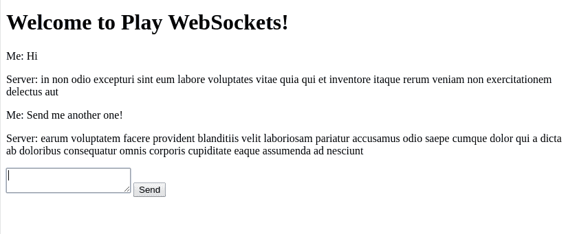

# 使用 Play 框架和 Akka 的 WebSockets

> 原文：<https://web.archive.org/web/20220930061024/https://www.baeldung.com/akka-play-websockets>

## 1.概观

当我们希望我们的 web 客户端与我们的服务器保持对话时，WebSockets 是一个有用的解决方案。WebSockets 保持持久的全双工连接。这个 **让我们能够在服务器和客户端之间发送双向消息。**

在本教程中，我们将学习如何在[游戏框架](/web/20220628113531/https://www.baeldung.com/java-intro-to-the-play-framework)中使用带有 [Akka](/web/20220628113531/https://www.baeldung.com/akka-actors-java) 的 WebSockets。

## 2.设置

让我们建立一个简单的聊天应用程序。用户将向服务器发送消息，服务器将使用来自 [JSONPlaceholder](https://web.archive.org/web/20220628113531/https://jsonplaceholder.typicode.com/) 的消息进行响应。

### 2.1.设置 Play 框架应用程序

我们将使用 Play 框架构建这个应用程序。

让我们按照[Java Play 简介](/web/20220628113531/https://www.baeldung.com/java-intro-to-the-play-framework#Play)中的说明来设置和运行一个简单的 Play 框架应用程序。

### 2.2.添加必要的 JavaScript 文件

此外，我们需要使用 JavaScript 进行客户端脚本编写。这将使我们能够接收从服务器推送的新消息。为此，我们将使用 [jQuery](https://web.archive.org/web/20220628113531/https://code.jquery.com/) 库。

让我们将 jQuery 添加到`app/views/i` `ndex.scala.html`文件的底部:

[PRE0]

### 2.3.设置 Akka

最后，我们将使用 Akka 来处理服务器端的 WebSocket 连接。

让我们导航到`build.sbt` 文件并添加依赖项。

我们需要添加`[akka-actor](https://web.archive.org/web/20220628113531/https://search.maven.org/classic/#search%7Cgav%7C1%7Cg%3A%22com.typesafe.akka%22%20AND%20a%3A%22akka-actor_2.13%22)`和`[akka-testkit](https://web.archive.org/web/20220628113531/https://search.maven.org/classic/#search%7Cgav%7C1%7Cg%3A%22com.typesafe.akka%22%20AND%20a%3A%22akka-testkit_2.13%22)`依赖项:

[PRE1]

我们需要这些来使用和测试 Akka 框架代码。

接下来，我们将使用 Akka 流。所以让我们添加`[akka-stream](https://web.archive.org/web/20220628113531/https://search.maven.org/classic/#search%7Cgav%7C1%7Cg%3A%22com.typesafe.akka%22%20AND%20a%3A%22akka-stream_2.13%22)`依赖项:

[PRE2]

最后，我们需要从 Akka actor 调用一个 rest 端点。为此，我们需要`[akka-http](https://web.archive.org/web/20220628113531/https://search.maven.org/classic/#search%7Cgav%7C1%7Cg%3A%22com.typesafe.akka%22%20AND%20a%3A%22akka-http_2.13%22)`依赖关系。当我们这样做时，端点将返回 JSON 数据，我们必须对这些数据进行反序列化，因此我们还需要添加 [`akka-http-jackson`](https://web.archive.org/web/20220628113531/https://search.maven.org/classic/#search%7Cgav%7C1%7Cg%3A%22com.typesafe.akka%22%20AND%20a%3A%22akka-http-jackson_2.13%22) 依赖项:

[PRE3]

现在我们都准备好了。让我们看看如何让 WebSockets 工作！

## 3.用 Akka Actors 处理 WebSockets

**Play 的 WebSocket 处理机制是围绕 Akka 流构建的。**web socket 被建模为一个流。因此，传入的 WebSocket 消息被输入到流中，由流产生的消息被发送到客户端。

为了使用 Actor 处理 WebSocket，我们需要 Play 实用程序`ActorFlow`，它将`ActorRef `转换为流。这主要需要一些 Java 代码，稍微配置一下。

### 3.1.WebSocket 控制器方法

首先，我们需要一个`Materializer`实例。**物化器是流执行引擎的工厂。**

我们需要将`ActorSystem`和`Materializer`注入控制器`app/controllers/HomeController.java`:

[PRE4]

现在让我们添加一个套接字控制器方法:

[PRE5]

这里我们调用函数`acceptOrResult`,它接受请求头并返回一个未来值。返回的 future 是一个处理 WebSocket 消息的流。

相反，我们可以拒绝请求并返回拒绝结果。

现在，让我们创建流程:

[PRE6]

Play 框架中的`F `类定义了一组函数式编程风格的助手。在这种情况下，我们使用`F.` `Either.Right `来接受连接并返回流。

假设我们想在客户端未经身份验证时拒绝连接。

为此，我们可以检查是否在会话中设置了用户名。如果不是，我们拒绝连接 HTTP 403 禁止:

[PRE7]

我们使用`F.Either.Left `拒绝连接，就像我们使用`F.Either.Right`提供流一样。

最后，我们将流链接到将处理消息的参与者:

[PRE8]

**`ActorFlow.actorRef`创建一个由`Messenger`角色**处理的流。

### 3.2.`routes`文件

现在，让我们在`conf/routes`中添加控制器方法的`routes`定义:

[PRE9]

这些路由定义将传入的 HTTP 请求映射到控制器动作方法，如 Java 中的 [Routing in Play Applications 中所述。](/web/20220628113531/https://www.baeldung.com/routing-in-play)

### 3.3.执行元实现

**actor 类最重要的部分是`createReceive` 方法**，它决定了 actor 可以处理哪些消息:

[PRE10]

actor 将所有匹配`JsonNode`类的消息转发给`onSendMessage `处理程序方法:

[PRE11]

然后，处理程序将使用`processMessage`方法响应每条消息:

[PRE12]

### 3.4.使用 Akka HTTP 使用 Rest API

我们将向位于 [JSONPlaceholder Posts](https://web.archive.org/web/20220628113531/https://jsonplaceholder.typicode.com/posts/) 的虚拟消息生成器发送 HTTP 请求。当响应到达时，我们通过写响应给客户机`out`。

让我们用一个随机 post id 调用端点的方法:

[PRE13]

我们还处理从调用服务中获得的`HttpResponse`,以便获得 JSON 响应:

[PRE14]

`MessageConverter `类是用于在`JsonNode `和 dto 之间进行转换的实用程序:

[PRE15]

接下来，我们需要[丢弃实体](https://web.archive.org/web/20220628113531/https://doc.akka.io/docs/akka-http/current/implications-of-streaming-http-entity.html)。如果实体对我们来说没有任何意义，那么方便的方法可以很容易地丢弃它。

让我们看看如何丢弃字节:

[PRE16]

现在已经完成了 WebSocket 的处理，让我们看看如何使用 HTML5 WebSockets 为此设置一个客户端。

## 4.设置 WebSocket 客户端

对于我们的客户端，让我们构建一个简单的基于 web 的聊天应用程序。

### 4.1.控制器动作

我们需要定义一个呈现索引页面的控制器动作。我们将把它放入控制器类`app.controllers.HomeController`:

[PRE17]

### 4.2.模板页面

现在，让我们转到`app/views/ndex.scala.html` 页面，添加一个用于接收消息的容器和一个用于捕获新消息的表单:

[PRE18]

我们还需要通过在`app/views/index.scala.html` 页面的顶部声明这个参数来传入 WebSocket 控制器动作的 URL:

[PRE19]

### 4.3.JavaScript 中的 WebSocket 事件处理程序

现在，我们可以添加 JavaScript 来处理 WebSocket 事件。为了简单起见，我们将在`app/views/index.scala.html`页面的底部添加 JavaScript 函数。

让我们声明事件处理程序:

[PRE20]

让我们添加处理程序本身:

[PRE21]

然后，为了显示输出，我们将使用函数`appendMessageToView` 和`writeToScreen`:

[PRE22]

### 4.4.运行和测试应用程序

我们已经准备好测试应用程序，现在让我们运行它:

[PRE23]

随着应用程序的运行，我们可以通过访问`[http://localhost:9000](https://web.archive.org/web/20220628113531/http://localhost:9000/)`与服务器聊天:

每当我们输入一条消息并点击`Send`时，服务器会立即用来自 JSON 占位符服务的一些`lorem ipsum`进行响应。

## 5.用 Akka 流直接处理 WebSockets

如果我们正在处理来自源的事件流，并将它们发送到客户端，那么我们可以围绕 Akka 流对此进行建模。

让我们看看如何在服务器每两秒发送一次消息的例子中使用 Akka 流。

我们将从`HomeController`中的 WebSocket 动作开始:

[PRE24]

`Source#` `tick`方法有三个参数。第一个是处理第一个分笔成交点之前的初始延迟，第二个是连续分笔成交点之间的间隔。在上面的代码片段中，我们将两个值都设置为两秒。第三个参数是应该在每个节拍返回的对象。

要看到这一点，我们需要修改`index `动作中的 URL，并使其指向`akkaStreamsSocket `端点:

[PRE25]

现在刷新页面，我们将每两秒钟看到一个新条目:

## 6.终止演员

在某些时候，我们需要关闭聊天，要么通过用户请求，要么通过超时。

### 6.1.处理执行元终止

我们如何检测 WebSocket 何时被关闭？

当处理 WebSocket 的 actor 终止时，Play 将自动关闭 WebSocket。所以我们可以通过实现`Actor#postStop `方法来处理这个场景:

[PRE26]

### 6.2.手动终止执行元

此外，如果我们必须停止演员，我们可以发送一个`PoisonPill`给演员。在我们的示例应用程序中，我们应该能够处理“停止”请求。

让我们看看如何在`onSendMessage`方法中做到这一点:

[PRE27]

当我们收到一个消息时，我们检查它是否是一个停止请求。如果是，我们发送`PoisonPill`。否则，我们处理请求。

## 7.配置选项

我们可以根据应该如何处理 WebSocket 来配置几个选项。我们来看几个。

### 7.1.WebSocket 帧长度

WebSocket 通信涉及数据帧的交换。

WebSocket 帧长度是可配置的。我们可以根据应用要求调整框架长度。

**配置较短的帧长度可能有助于减少使用长数据帧的拒绝服务攻击。**我们可以通过在`application.conf`中指定最大长度来改变应用的帧长度:

[PRE28]

我们还可以通过将最大长度指定为命令行参数来设置此配置选项:

[PRE29]

### 7.2.连接空闲超时

默认情况下，我们用来处理 WebSocket 的 actor 在一分钟后被终止。这是因为运行我们的应用程序的 Play 服务器的默认空闲超时是 60 秒。这意味着在六十秒内没有收到请求的所有连接都将自动关闭。

我们可以通过配置选项来改变这一点。让我们来看看我们的`application.conf `,将服务器改为没有空闲超时:

[PRE30]

或者我们可以将选项作为命令行参数传入:

[PRE31]

我们也可以通过在`build.sbt`中指定`devSettings `来进行配置。

**在`build.sbt`中指定的配置选项仅在开发中使用，在生产中会被忽略:**

[PRE32]

如果我们重新运行应用程序，参与者不会终止。

我们可以将该值更改为秒:

[PRE33]

我们可以在 Play 框架文档中找到关于可用配置选项[的更多信息。](https://web.archive.org/web/20220628113531/https://www.playframework.com/documentation/2.7.x/ConfigFile)

## 8.结论

在本教程中，我们用 Akka actors 和 Akka Streams 在 Play 框架中实现了 WebSockets。

然后我们继续看如何直接使用 Akka actors，然后看如何设置 Akka 流来处理 WebSocket 连接。

在客户端，我们使用 JavaScript 来处理 WebSocket 事件。

最后，我们看了一些可以使用的配置选项。

像往常一样，本教程的源代码可以在 GitHub 上的[处获得。](https://web.archive.org/web/20220628113531/https://github.com/eugenp/tutorials/tree/master/play-framework/websockets)