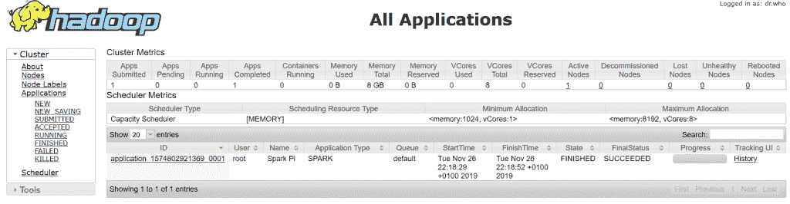

# 网飞精灵简介

> 原文：<https://web.archive.org/web/20220930061024/https://www.baeldung.com/ops/netflix-genie-intro>

## 1.概观

在本教程中，我们将探索 Genie 引擎，这是网飞为以抽象方式向集群提交作业而开发的。

本教程推荐大数据处理的基础知识，例如 [Hadoop](https://web.archive.org/web/20220523151343/https://hadoop.apache.org/) 和 [Spark](/web/20220523151343/https://www.baeldung.com/apache-spark) 。

## 2.为什么是精灵？

假设我们有许多用户需要**向包含大量不同大小的 Hadoop 集群的云中提交各种任务**。虽然创建一些集群是为了在特定时间处理数据，但其他集群则是为了关闭服务以释放资源。因此，用户会遇到为他们的工作找到合适的集群的问题。

假设许多用户甚至不想创建集群或了解配置，这可能是一个真正的问题。为用户提供一种无需处理基础设施设置，只需提交作业并获取结果的方法，怎么样？

## 3.什么是精灵？

网飞构建了 Genie 作为分布式引擎，正是为了解决上述问题。一个引擎，为提交任务**提供统一的**RESTful API。Genie 将启动作业与允许灵活扩展集群的配置分开。****

 **然而，Genie 本身并不扩展集群——它只是通过在符合用户作业需求的集群上启动用户作业来完成用户任务。

Genie 也不是为调度而生的。主要目的是在单个作业级别上进行作业管理。

对于工作流调度，应该使用其他工具，比如 Apache Oozie。事实上，网飞明确指出:

> Genie 不是工作流调度器，比如 Oozie。Genie 的执行单元是单个 Hadoop、Hive 或 Pig 作业。Genie 不调度或运行工作流——事实上，我们使用网飞的企业调度器(UC4)来运行我们的 ETL。

然而，Genie 提供了管理资源的 API，比如集群、应用程序和命令。注册资源后，用户可以发现这些资源并开始提交他们的作业。

最后，值得注意的是，Genie 是一个开源项目，或多或少是根据网飞的特定需求定制的。它在网飞快速变化的云环境中发挥着重要作用，并与网飞的技术堆栈相集成。

## 4.精灵在行动

现在，让我们看看 Genie 的运行情况，以便更好地理解如何使用它来提交作业。作为介绍，我们将通过 GitHub 上的[精灵演示](https://web.archive.org/web/20220523151343/https://netflix.github.io/genie/docs/3.3.9/demo/)来学习。

### 4.1.先决条件

该示例要求:

*   最新的 Docker 和 Docker Compose 版本(或 Docker Desktop，包含两者)
*   以下自由港:8080、8088、19888、19070、19075、8089、19889、19071 和 19076
*   一台相对强大的机器，至少有 8GB RAM，其中 4GB 应该分配给 docker
*   至少 4GB 的磁盘空间

### 4.2.集群设置

首先，我们必须注意**使用 Docker Compose** 通过下载 [`docker-compose.yml`](https://web.archive.org/web/20220523151343/https://netflix.github.io/genie/docs/3.3.9/demo/docker-compose.yml) 到我们选择的文件夹来设置我们的集群。为此，让我们创建一个名为`demoDir`的新目录。compose 文件定义了五个服务，我们将逐一研究它们。

首先，让我们看看运行在名为`genie_demo_app_3.3.9`的容器中的精灵服务器，它将端口 8080 映射到精灵 UI:

[PRE0]

第二个服务是`genie_demo_apache_3.3.9`，用于下载演示所需的文件:

[PRE1]

接下来是 Genie 客户端，它包含使用 Genie 提交作业的示例脚本。其容器名为`genie_demo_client_3.3.9`:

[PRE2]

接下来是我们的生产(SLA) Hadoop 集群。该服务将接收我们提交的作业。集群资源管理器映射到端口 8088，而历史服务器得到 19888。

**我们将在这里做一个小调整**，并将命名节点和数据节点分别映射到端口 19070 和 19075:

[PRE3]

最后，让我们探索代表测试集群的测试 Hadoop 容器。与生产群集类似，它被分配了端口 8089(资源管理器)、19889(历史服务器)、19071(命名节点)和 19076(数据节点):

[PRE4]

让**通过从`demoDir.` 运行 `docker-compose`** 来启动上述容器。这将在第一次运行时花费更长的时间，因为它必须下载演示映像:

[PRE5]

我们可以通过检查以下内容来验证群集是否已启动并准备就绪:

*   精灵 UI: [`http://localhost:8080`](https://web.archive.org/web/20220523151343/http://localhost:8080/)
*   SLA 集群资源管理器 UI: [`http://localhost:8088`](https://web.archive.org/web/20220523151343/http://localhost:8088/)
*   测试集群资源管理器 UI: [`http://localhost:8089`](https://web.archive.org/web/20220523151343/http://localhost:8089/)

### 4.3\. Init Demo

现在，在演示容器运行之后，我们可以使用`docker exec` 命令登录到客户机容器:

[PRE6]

现在，在客户机容器中，我们执行一个 init 脚本来**准备集群接受我们的作业**:

[PRE7]

如果演示运行成功，Genie UI 将在集群、命令和应用程序选项卡中显示数据。

### 4.4.作业提交

再比如，我们提交一个 Spark 作业，计算π的前 10 位小数。我们可以通过将相应的文字作为参数传递给脚本来将作业提交给 test 或 SLA:

[PRE8]

从 Genie UI 中的 Jobs 选项卡，我们可以单击每个作业描述中的文件夹图标，导航到其`output`文件夹。从那里，在成功结束时，我们可以在`stdout.`下找到计算的值

Hadoop 资源管理器 UI 也显示集群作业。

最后，我们通过运行以下命令退出客户机容器，停止并删除所有演示容器:

[PRE9]

这些图像仍然可以在磁盘上找到，我们可以在任何时候再次启动演示容器。

## 5.结论

在本教程中，我们介绍了网飞开发的作业管理工具 Genie。

然后我们运行了一个演示，它给了我们一个如何在现实生活中使用 Genie 的实际例子。

和往常一样，代码示例是 GitHub 上的[。](https://web.archive.org/web/20220523151343/https://github.com/eugenp/tutorials/tree/master/netflix-modules/genie)**