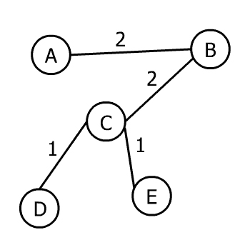
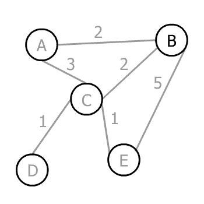
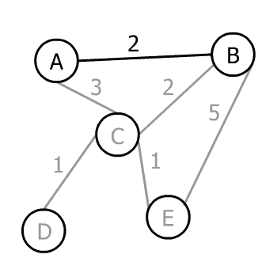
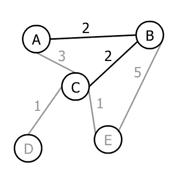
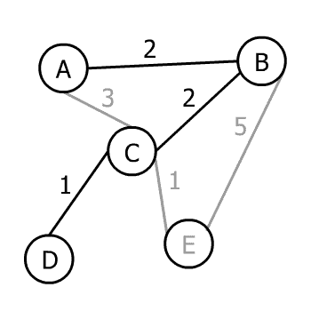
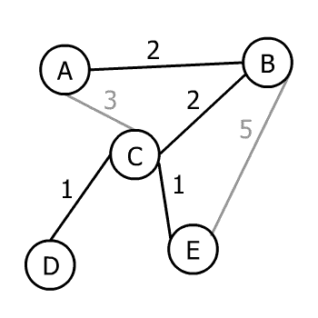

# Prim 算法及其 Java 实现

> 原文：<https://web.archive.org/web/20220930061024/https://www.baeldung.com/java-prim-algorithm>

## 1.介绍

在本教程中，我们首先学习什么是最小生成树。之后，我们将使用 [Prim 的算法](/web/20221207071952/https://www.baeldung.com/cs/prim-algorithm)来找到一个。

## 2.最小生成树

**最小生成树(MST)是一个加权的、无向的连通图，其总边权重已经通过移除较重的边而最小化**。换句话说，我们保持图的所有顶点不变，但是我们可以删除一些边，使得所有边的总和最小。

我们从加权图开始，因为如果这些边没有权重，那么最小化总边权重是没有意义的。让我们来看一个示例图:

上图是一个加权的，无向的，连通图。下面是该图 MST:

然而，图的 MST 不是唯一的。如果一个图有多个 MST，那么每个 MST 都有相同的总边权。

## 3.普里姆算法

Prim 的算法将一个加权的、无方向的连通图作为输入，并返回该图的 MST 作为输出。

它以贪婪的方式工作。第一步，它选择一个任意的顶点。此后，**每一个新的步骤都将最近的顶点添加到目前构建的树中**，直到没有不连通的顶点。

让我们一步一步地在这张图上运行 Prim 的算法:

假设开始算法的任意顶点是 B，我们有三个选择 A，C 和 E。边的相应权重是 2、2 和 5，因此最小值是 2。在这种情况下，我们有两条权重为 2 的边，所以我们可以选择其中任何一条(哪一条都无所谓)。让我们选择一个:

现在我们有了一个树，它有两个顶点 A 和 B。我们可以选择 A 或 B 的任何一条尚未添加的边，这些边会导致一个未添加的顶点。所以，我们可以选 AC，BC，或者 BE。

Prim 的算法选择最小值，即 2 或 BC:

现在我们有了一个树，它有三个顶点和三条可能的边:CD、CE 或 BE。AC 不包括在内，因为它不会给树添加新的顶点。这三个中的最小权重是 1。

然而，有两条边的权重都是 1。因此，Prim 的算法在这一步中选择了其中一个(也不在乎是哪一个): 

只剩下一个顶点要加入，所以我们可以从 CE 和 BE 中选择。可以将我们的树连接到它的最小权重是 1，Prim 的算法会选择它:

当输入图的所有顶点都出现在输出树中时，Prim 的算法结束。因此，这棵树是输入图的 MST。

## 4.履行

顶点和边构成了图形，所以我们需要一个数据结构来存储这些元素。让我们创建类`Edge`:

[PRE0]

每个`Edge`必须有一个`weight` ,因为 Prim 的算法在加权图上工作。`isIncluded`显示`Edge`是否出现在最小生成树中。

现在，让我们添加`Vertex`类:

[PRE1]

每个`Vertex`可以选择有一个`label`。我们使用`edges`地图来存储顶点之间的连接。最后，`isVisited`显示顶点到目前为止是否被 Prim 的算法访问过。

让我们创建我们的`Prim`类，我们将在其中实现逻辑:

[PRE2]

顶点列表足以存储整个图，因为在每个`Vertex`中，我们有一个`Map<Vertex, Edge>`来标识所有连接。在`Prim,` 中，我们创建了一个`run()` 方法:

[PRE3]

我们首先将`List<Vertex> graph`的第一个元素设置为 visited。第一个元素可以是任何顶点，这取决于它们最初被添加到列表中的顺序。`isDisconnected()`返回`true`如果有到目前为止没有访问过的`Vertex`:

[PRE4]

而最小生成树`isDisconnected()`，我们在已经访问过的顶点上循环，找到具有最小权重的`Edge`作为`nextVertex:`的候选

[PRE5]

我们找到主循环中所有`candidate`的最小值，并将其存储在`nextVertex`中。然后，我们将`nextVertex`设置为已访问。循环继续，直到所有顶点都被访问。

最后，**与`isIncluded`等于`true`的每个`Edge`都存在。**

注意，由于`nextMinimum()`迭代通过边缘，该实现的时间复杂度是`O(V²)`。如果我们将边存储在优先级队列中(按权重排序),算法将在`O(E log V)`中执行。

## 5.测试

好了，现在我们已经有了一些代码，让我们用一个真实的例子来测试它。首先，我们构建我们的图表:

[PRE6]

`Prim`类的构造函数获取它并将其存储在类中。我们可以用`originalGraphToString()`方法打印输入图形:

[PRE7]

我们的示例将输出:

[PRE8]

现在，我们运行 Prim 的算法并用`minimumSpanningTreeToString()`方法打印结果 MST:

[PRE9]

最后，我们打印出我们的 MST:

[PRE10]

## 6.结论

在本文中，我们学习了 Prim 的算法如何找到一个图的最小生成树。代码可以在 GitHub 上的[处获得。](https://web.archive.org/web/20221207071952/https://github.com/eugenp/tutorials/tree/master/algorithms-modules/algorithms-miscellaneous-5)