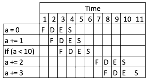
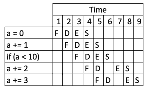
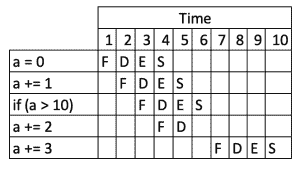

# Java 中的分支预测

> 原文:[https://web . archive . org/web/20220930061024/https://www . bael dung . com/Java-branch-prediction](https://web.archive.org/web/20220930061024/https://www.baeldung.com/java-branch-prediction)

## **1。简介**

分支预测是计算机科学中一个有趣的概念，对我们应用程序的性能有深远的影响。然而，它通常没有得到很好的理解，大多数开发人员也很少关注它。

在这篇文章中，我们将探索它到底是什么，它如何影响我们的软件，以及我们可以做些什么。

## **2。什么是指令流水线？**

当我们编写任何计算机程序时，我们都是在编写一组我们期望计算机按顺序执行的命令。

早期的计算机会一次运行一个。这意味着每个命令都被加载到内存中，完整地执行，只有当它完成时，下一个命令才会被加载。

指令流水线是对此的改进。它们允许处理器将工作分成几部分，然后并行执行不同的部分。这将允许处理器执行一个命令，同时加载下一个命令，准备就绪。

处理器内部更长的流水线不仅可以简化每个部分，还可以让更多的部分并行执行。这可以提高系统的整体性能。

例如，我们可以有一个简单的程序:

```
int a = 0;
a += 1;
a += 2;
a += 3;
```

这可以由包括提取、解码、执行、存储段的流水线来处理，如:

[](/web/20221128045245/https://www.baeldung.com/wp-content/uploads/2019/12/branch_prediction1.png)

我们可以看到这四个命令的整体执行是如何并行运行的，从而使整个序列更快。

## **3。有哪些危害？**

**处理器需要执行的某些命令会给流水线**带来问题。这些是任何命令，其中管道的一部分的执行依赖于更早的部分，但是那些更早的部分可能还没有被执行。

树枝是一种特殊形式的危险。它们导致执行向两个方向中的一个方向进行，在分支被解析之前不可能知道哪个方向。这意味着任何越过分支加载命令的尝试都是不安全的，因为我们无法知道从哪里加载它们。

让我们改变我们的简单程序，引入一个分支:

```
int a = 0;
a += 1;
if (a < 10) {
  a += 2;
}
a += 3;
```

结果和之前一样，但是我们在中间引入了一个`if`语句。**计算机会发现这一点，并且在问题解决之前不能加载超过这一点的命令**。因此，该流程看起来类似于:

[](/web/20221128045245/https://www.baeldung.com/wp-content/uploads/2019/12/branch_prediction2.png)

我们可以立即看到这对程序执行的影响，以及执行相同的结果需要多少时钟步骤。

## **4。什么是分支预测？**

分支预测是对上述方法的增强，我们的计算机将试图预测分支的走向，然后采取相应的行动。

在我们上面的例子中，处理器可能预测到`if (a < 10)`很可能是`true`，因此它会像指令`a += 2`是下一个要执行的指令一样行动。这将导致流程看起来像这样:

[](/web/20221128045245/https://www.baeldung.com/wp-content/uploads/2019/12/branch_prediction3.png)

**我们可以直接看到，这提高了我们程序**的性能——现在只需要 9 个节拍，而不是 11 个，因此速度提高了 19%。

然而，这并非没有风险。如果分支预测出错，那么它将开始把不应该执行的指令排队。如果发生这种情况，那么计算机将需要扔掉它们并重新开始。

让我们改变一下条件，现在是`false`:

```
int a = 0;
a += 1;
if (a > 10) {
  a += 2;
}
a += 3;
```

这可能会执行如下内容:

[](/web/20221128045245/https://www.baeldung.com/wp-content/uploads/2019/12/branch_prediction4.png)

**尽管我们做得更少，但现在比之前的流程慢了！**处理器错误地预测分支将评估为`true`，开始排队等待`a += 2`指令，然后当分支评估为`false.`时不得不丢弃它并重新开始

## **5。对代码的实际影响**

现在我们知道了什么是分支预测，它的好处是什么，它会如何影响我们呢？毕竟，我们谈论的是在高速计算机上损失几个处理器周期，所以这肯定不会被注意到。

有时候确实如此。但有时它会对我们的应用程序的性能产生惊人的影响。这在很大程度上取决于我们到底在做什么。具体来说，这取决于我们在短时间内做了多少。

### **5.1。盘点列表条目**

让我们试着计算列表中的条目。我们将生成一个数字列表，然后计算其中有多少小于某个临界值。这与上面的例子非常相似，但我们是在一个循环中进行的，而不是作为一条指令:

```
List<Long> numbers = LongStream.range(0, top)
    .boxed()
    .collect(Collectors.toList());

if (shuffle) {
    Collections.shuffle(numbers);
}

long cutoff = top / 2;
long count = 0;

long start = System.currentTimeMillis();
for (Long number : numbers) {
    if (number < cutoff) {
        ++count;
    }
}
long end = System.currentTimeMillis();

LOG.info("Counted {}/{} {} numbers in {}ms",
    count, top, shuffle ? "shuffled" : "sorted", end - start);
```

请注意，我们只对执行计数的循环计时，因为这是我们感兴趣的。那么，这需要多长时间？

如果我们生成足够小的列表，那么代码运行得如此之快以至于无法计时——一个大小为 100，000 的列表仍然显示 0 毫秒的时间。然而，当列表变得足够大以至于我们可以计时时，我们可以根据我们是否打乱了列表来看到显著的差异。对于 10，000，000 个数字的列表:

*   已排序–44 毫秒
*   随机播放–221 毫秒

也就是说，**无序列表的计数时间是有序列表的 5 倍，尽管实际计数的数字是相同的。**

然而，对列表进行排序的行为比仅仅执行计数要昂贵得多。我们应该始终分析我们的代码，并确定任何性能提升是否有益。

### 5.2。分支顺序

综上所述，**一条`if/else`语句中的分支顺序应该是重要的**，这似乎是合理的。也就是说，与重新排序分支相比，我们可以预期以下内容的性能会更好:

```
if (mostLikely) {
  // Do something
} else if (lessLikely) {
  // Do something
} else if (leastLikely) {
  // Do something
}
```

然而，**现代计算机可以通过使用分支预测缓存**来避免这个问题。事实上，我们也可以测试这个:

```
List<Long> numbers = LongStream.range(0, top)
  .boxed()
  .collect(Collectors.toList());
if (shuffle) {
    Collections.shuffle(numbers);
}

long cutoff = (long)(top * cutoffPercentage);
long low = 0;
long high = 0;

long start = System.currentTimeMillis();
for (Long number : numbers) {
    if (number < cutoff) {
        ++low;
    } else {
        ++high;
    }
}
long end = System.currentTimeMillis();

LOG.info("Counted {}/{} numbers in {}ms", low, high, end - start);
```

当计算 10，000，000 个数字时，不管`cutoffPercentage`的值是多少，这段代码的执行时间大约相同——排序后的数字大约为 35 毫秒，打乱后的数字大约为 200 毫秒。

这是因为**分支预测器平等地处理两个分支**，并且正确地猜测我们将为它们选择哪条路。

### 5.3。组合条件

如果我们可以在一个或两个条件中选择一个呢？也许可以用不同的方式重写我们的逻辑，但是我们应该这样做吗？

例如，如果我们将两个数字与 0 进行比较，另一种方法是将它们相乘，然后将结果与 0 进行比较。这就用乘法运算代替了条件运算。但这值得吗？

让我们考虑一个例子:

```
long[] first = LongStream.range(0, TOP)
  .map(n -> Math.random() < FRACTION ? 0 : n)
  .toArray();
long[] second = LongStream.range(0, TOP)
  .map(n -> Math.random() < FRACTION ? 0 : n)
  .toArray();

long count = 0;
long start = System.currentTimeMillis();
for (int i = 0; i < TOP; i++) {
    if (first[i] != 0 && second[i] != 0) {
        ++count;
    }
}
long end = System.currentTimeMillis();

LOG.info("Counted {}/{} numbers using separate mode in {}ms", count, TOP, end - start);
```

如上所述，我们可以替换循环中的条件。这样做实际上会影响运行时:

*   独立条件–40 毫秒
*   多重和单一条件–22 毫秒

因此，使用两种不同条件的选项实际上需要两倍的时间来执行。

## **6。结论**

我们已经看到了什么是分支预测，以及它如何对我们的程序产生影响。这可以给我们带来一些额外的工具，以确保我们的程序尽可能高效。

然而，和往常一样，**我们需要记住在做出重大改变之前对我们的代码进行概要分析**。有时，进行更改以帮助分支预测会在其他方面花费更多的成本。

GitHub 上的[提供了这篇文章中的案例。](https://web.archive.org/web/20221128045245/https://github.com/eugenp/tutorials/tree/master/core-java-modules/core-java-perf)