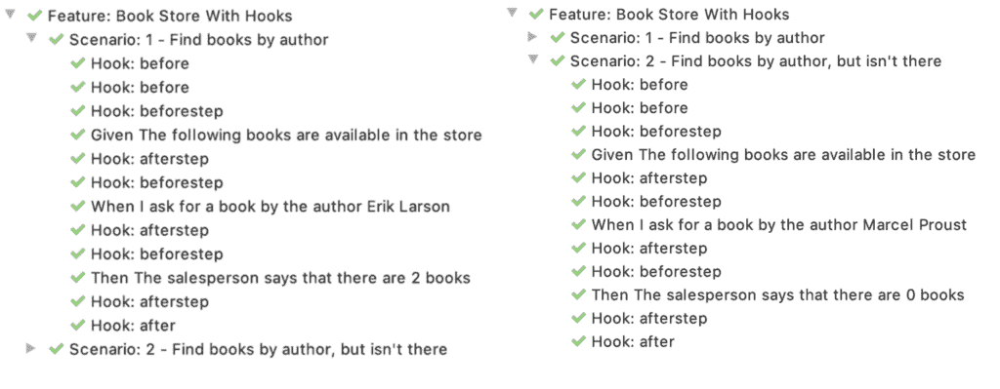
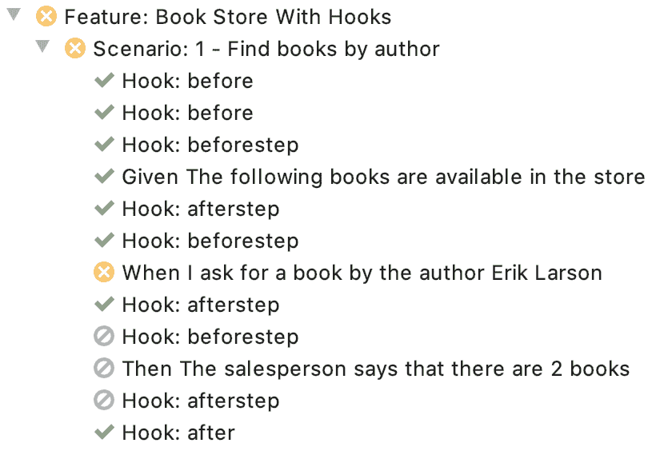

# 黄瓜钩

> 原文：<https://web.archive.org/web/20220930061024/https://www.baeldung.com/java-cucumber-hooks>

## 1.介绍

当我们想要为每个场景或步骤执行特定的动作，但不需要在小黄瓜代码中显式地包含这些动作时，Cucumber 钩子可以派上用场。

在本教程中，我们将看看`@Before`、`@BeforeStep, @AfterStep,`和`@After`黄瓜挂钩。

## 2.黄瓜挂钩概述

### 2.1.什么时候应该使用挂钩？

挂钩可用于执行不属于业务功能的后台任务。这些任务可以是:

*   启动浏览器
*   设置或清除 cookies
*   连接到数据库
*   检查系统的状态
*   监视

监控的一个用例是用测试进度实时更新仪表板。

钩子在小黄瓜代码中是不可见的。因此，**我们不应该把它们看作是一个[黄瓜背景](/web/20220926194357/https://www.baeldung.com/java-cucumber-background)或一个给定步骤**的替代。

我们将看一个例子，在这个例子中，我们在测试执行期间使用钩子来截取屏幕截图。

### 2.2.挂钩的范围

钩子影响每一个场景。因此，在一个专用的配置类中定义所有的钩子是一个好的实践。

没有必要在每个 glue 代码类中定义相同的钩子。如果我们用胶水代码在同一个类中定义钩子，我们的代码可读性会更差。

## 3.钩住

我们先来看一下单个的钩子。然后我们将看一个完整的例子，在这个例子中我们将看到钩子在组合时是如何执行的。

### 3.1.`@Before`

用`@Before`标注的方法将在每个场景之前**执行。在我们的示例中，我们将在每个场景之前启动浏览器:**

```
@Before
public void initialization() {
    startBrowser();
}
```

**如果我们用`@Before`标注几个方法，就可以明确定义步骤执行的顺序:**

```
@Before(order=2)
public void beforeScenario() {
    takeScreenshot();
}
```

上面的方法第二次执行，因为我们将`2`作为参数`order`的值传递给注释。我们还可以将`1`作为我们初始化方法的顺序参数的值传递:

```
@Before(order=1)
public void initialization()
```

所以，当我们执行一个场景时，`initialization()`先执行，`beforeScenario()`后执行。

### 3.2.`@BeforeStep`

用`@BeforeStep` **标注的方法在每一步**之前执行。让我们在每一步之前使用注释来截图:

```
@BeforeStep
public void beforeStep() {
    takeScreenshot();
}
```

### 3.3.`@AfterStep`

用`@AfterStep` **标注的方法在每一步**后执行:

```
@AfterStep
public void afterStep() {
    takeScreenshot();
}
```

我们在这里使用了`@AfterStep`在每一步之后进行截图。无论该步骤是成功完成还是失败，都会发生这种情况**。**

### 3.4.`@After`

用`@After` **标注的方法在每个场景**之后执行:

```
@After
public void afterScenario() {
    takeScreenshot();
    closeBrowser();
}
```

在我们的示例中，我们将截取最后一个屏幕截图并关闭浏览器。不管场景是否成功结束，这都会发生**。**

### 3.5.`Scenario`参数

用钩子注释标注的方法可以接受类型为`Scenario`的参数:

```
@After
public void beforeScenario(Scenario scenario) { 
    // some code
}
```

类型为`Scenario`的对象包含当前场景的信息。包括场景名称、步骤数量、步骤名称和状态(通过或失败)。如果我们想要对通过和失败的测试执行不同的操作，这可能是有用的。

## 4.钩子执行

### 4.1.快乐之花

现在让我们来看看当我们用所有四种类型的钩子运行一个黄瓜场景时会发生什么:

```
Feature: Book Store With Hooks
  Background: The Book Store
    Given The following books are available in the store
      | The Devil in the White City          | Erik Larson |
      | The Lion, the Witch and the Wardrobe | C.S. Lewis  |
      | In the Garden of Beasts              | Erik Larson |

  Scenario: 1 - Find books by author
    When I ask for a book by the author Erik Larson
    Then The salesperson says that there are 2 books

  Scenario: 2 - Find books by author, but isn't there
    When I ask for a book by the author Marcel Proust
    Then The salesperson says that there are 0 books
```

查看 IntelliJ IDE 中测试运行的结果，我们可以看到执行顺序:

[](/web/20220926194357/https://www.baeldung.com/wp-content/uploads/2020/01/Screenshot-2019-12-29-at-15.28.42.png)

首先，我们的两个`@Before`钩子执行。然后在每一步前后，`@BeforeStep`和`@AfterStep`吊钩分别运行。最后，`@After`挂钩运行。两种情况下所有的钩子都执行。

### 4.2.不愉快的流动:一步失败

让我们看看如果一个步骤失败会发生什么。正如我们在下面的截图中看到的，失败步骤的`@Before`和`@After`钩子都被执行。后续步骤被跳过，最后，`@After`钩子执行:

[](/web/20220926194357/https://www.baeldung.com/wp-content/uploads/2020/01/Screenshot-2019-12-29-at-13.32.59.png)

`@After`的行为类似于 Java 中`try-catch`后的 [`finally-clause`](/web/20220926194357/https://www.baeldung.com/java-finally-keyword) 。如果某个步骤失败，我们可以用它来执行清理任务。在我们的示例中，即使场景失败，我们仍然会截取一个屏幕截图。

### 4.3.不愉快的流程:挂钩失败

让我们看看当一个钩子本身失败时会发生什么。在下面的例子中，第一个`@BeforeStep`失败。

在这种情况下，实际的步骤不会运行，但是`@AfterStep` hook 会运行。后续步骤也不会运行，而`@After`钩子在最后被执行:

[](/web/20220926194357/https://www.baeldung.com/wp-content/uploads/2020/01/Screenshot-2019-12-29-at-13.30.49.png)

## 5.带标签的条件执行

钩子是全局定义的，影响所有场景和步骤。然而，在 Cucumber 标签的帮助下，我们可以精确地定义应该为哪些场景执行钩子:

```
@Before(order=2, value="@Screenshots")
public void beforeScenario() {
    takeScreenshot();
}
```

该挂钩将仅在标记有`@Screenshots`的场景中执行:

```
@Screenshots
Scenario: 1 - Find books by author 
When I ask for a book by the author Erik Larson 
Then The salesperson says that there are 2 books
```

## 6.Java 8

我们可以添加[黄瓜 Java 8 支持](/web/20220926194357/https://www.baeldung.com/cucumber-java-8-support)用 lambda 表达式定义所有钩子。

回想一下上面例子中的初始化钩子:

```
@Before(order=2)
public void initialization() {
    startBrowser();
}
```

用 lambda 表达式重写后，我们得到:

```
public BookStoreWithHooksRunSteps() {
    Before(2, () -> startBrowser());
}
```

同样的道理也适用于`@BeforeStep`、`@After,`和`@AfterStep`。

## 7.结论

在本文中，我们看了如何定义黄瓜挂钩。

我们讨论了在什么情况下应该使用它们，什么时候不应该。然后，我们看到了钩子执行的顺序以及如何实现条件执行。

最后，我们看到了如何用 Java 8 lambda 符号定义钩子。

和往常一样，这篇文章的完整源代码可以在 GitHub 的[上找到。](https://web.archive.org/web/20220926194357/https://github.com/eugenp/tutorials/tree/master/testing-modules/testing-libraries)