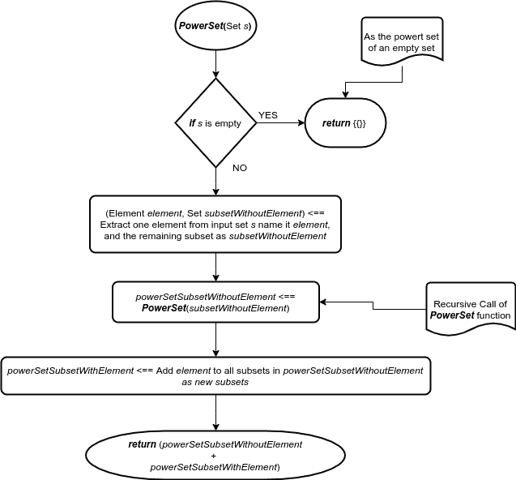
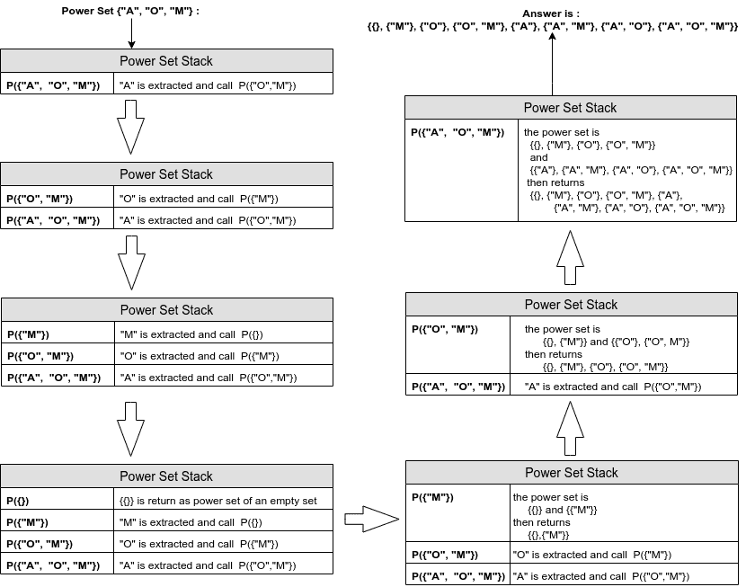

# 用 Java 语言获取集合的幂集

> 原文:[https://web . archive . org/web/20220930061024/https://www . bael dung . com/Java-power-set-of-a-set](https://web.archive.org/web/20220930061024/https://www.baeldung.com/java-power-set-of-a-set)

## 1.介绍

在本教程中，我们将学习用 Java 生成给定集合的[幂集](https://web.archive.org/web/20221208143859/https://en.wikipedia.org/wiki/Power_set)的过程。

快速提醒一下，对于每个大小为`n`的集合，都有一个大小为`2<sup>n</sup>`的幂集合。我们将学习如何使用各种技术获得它。

## 2.幂集的定义

给定集合`S`的幂集是`S`的所有子集的集合，包括`S`本身和空集。

例如，对于给定的集合:

```
{"APPLE", "ORANGE", "MANGO"}
```

功率设置为:

```
{
    {},
    {"APPLE"},
    {"ORANGE"},
    {"APPLE", "ORANGE"},
    {"MANGO"},
    {"APPLE", "MANGO"},
    {"ORANGE", "MANGO"},
    {"APPLE", "ORANGE", "MANGO"}
}
```

由于它也是一组子集，其内部子集的顺序并不重要，它们可以按任何顺序出现:

```
{
    {},
    {"MANGO"},
    {"ORANGE"},
    {"ORANGE", "MANGO"},
    {"APPLE"},
    {"APPLE", "MANGO"},
    {"APPLE", "ORANGE"},
    {"APPLE", "ORANGE", "MANGO"}
}
```

## 3.番石榴图书馆

谷歌[番石榴图书馆有一些有用的`Set`工具](/web/20221208143859/https://www.baeldung.com/guava-sets)，比如 power set。因此，我们也可以很容易地用它来得到给定集合的幂集:

```
@Test
public void givenSet_WhenGuavaLibraryGeneratePowerSet_ThenItContainsAllSubsets() {
    ImmutableSet<String> set = ImmutableSet.of("APPLE", "ORANGE", "MANGO");
    Set<Set<String>> powerSet = Sets.powerSet(set);
    Assertions.assertEquals((1 << set.size()), powerSet.size());
    MatcherAssert.assertThat(powerSet, Matchers.containsInAnyOrder(
      ImmutableSet.of(),
      ImmutableSet.of("APPLE"),
      ImmutableSet.of("ORANGE"),
      ImmutableSet.of("APPLE", "ORANGE"),
      ImmutableSet.of("MANGO"),
      ImmutableSet.of("APPLE", "MANGO"),
      ImmutableSet.of("ORANGE", "MANGO"),
      ImmutableSet.of("APPLE", "ORANGE", "MANGO")
   ));
}
```

**Guava `powerSet`在内部通过`Iterator`接口操作，当请求下一个子集时，该子集被计算并返回。因此，空间复杂度降低为`O(n)`而不是`O(2<sup>n</sup>)`。**

但是，番石榴是怎么做到的呢？

## 4.发电机组发电方法

### 4.1.算法

现在让我们讨论为这个操作创建算法的可能步骤。

空集的幂集是 `{{}}`其中只包含一个空集，所以这是我们最简单的情况。

对于除空集之外的每个集合`S`，我们首先提取一个元素，并将其命名为—*element*。然后，对于集合`subsetWithoutElement`中的其余元素，我们递归地计算它们的幂集——并将其命名为类似于`powerSet` S `ubsetWithoutElement`的东西。然后，通过将提取的`element` 添加到`powerSet` S `ubsetWithoutElement`中的所有集合，我们得到`powerSet` S `ubsetWithElement.`

现在，幂集`S`是一个`powerSetSubsetWithoutElement`和一个`powerSetSubsetWithElement`的联合:

 [](/web/20221208143859/https://www.baeldung.com/wp-content/uploads/2020/01/powerSet-Example.png) [](/web/20221208143859/https://www.baeldung.com/wp-content/uploads/2020/01/powerSet-Algorithm-1.png)

让我们看一个给定集合`{“APPLE”, “ORANGE”, “MANGO”}`的递归幂集栈的例子。

为了提高图像的可读性，我们使用名称的缩写:`P`表示幂集函数，`“A”, “O”, “M”`分别是`“APPLE”, “ORANGE”,`和 `“MANGO”`的缩写:

[](/web/20221208143859/https://www.baeldung.com/wp-content/uploads/2020/01/powerSet-Example.png)

### 4.2.履行

因此，首先，让我们编写提取一个元素的 Java 代码，并获取其余的子集:

```
T element = set.iterator().next();
Set<T> subsetWithoutElement = new HashSet<>();
for (T s : set) {
    if (!s.equals(element)) {
        subsetWithoutElement.add(s);
    }
}
```

然后我们想要得到`subsetWithoutElement`的幂集:

```
Set<Set<T>> powersetSubSetWithoutElement = recursivePowerSet(subsetWithoutElement);
```

接下来，我们需要将该 powerset 添加回原始文件中:

```
Set<Set<T>> powersetSubSetWithElement = new HashSet<>();
for (Set<T> subsetWithoutElement : powerSetSubSetWithoutElement) {
    Set<T> subsetWithElement = new HashSet<>(subsetWithoutElement);
    subsetWithElement.add(element);
    powerSetSubSetWithElement.add(subsetWithElement);
}
```

最后，`powerSetSubSetWithoutElement`和`powerSetSubSetWithElement`的并集是给定输入集的幂集:

```
Set<Set<T>> powerSet = new HashSet<>();
powerSet.addAll(powerSetSubSetWithoutElement);
powerSet.addAll(powerSetSubSetWithElement);
```

如果我们把所有的代码片段放在一起，我们可以看到我们的最终产品:

```
public Set<Set<T>> recursivePowerSet(Set<T> set) {
    if (set.isEmpty()) {
        Set<Set<T>> ret = new HashSet<>();
        ret.add(set);
        return ret;
    }

    T element = set.iterator().next();
    Set<T> subSetWithoutElement = getSubSetWithoutElement(set, element);
    Set<Set<T>> powerSetSubSetWithoutElement = recursivePowerSet(subSetWithoutElement);
    Set<Set<T>> powerSetSubSetWithElement = addElementToAll(powerSetSubSetWithoutElement, element);

    Set<Set<T>> powerSet = new HashSet<>();
    powerSet.addAll(powerSetSubSetWithoutElement);
    powerSet.addAll(powerSetSubSetWithElement);
    return powerSet;
} 
```

### 4.3.单元测试注意事项

现在我们来测试一下。我们这里有一些标准需要确认:

*   首先，我们检查幂集的大小，对于大小为`n`的集合，它必须是`2<sup>n</sup>`。
*   然后，每个元素将只在一个子集和`2<sup>n-1</sup>`不同的子集中出现一次。
*   最后，每个子集必须出现一次。

如果所有这些条件都通过了，我们就可以确定我们的功能起作用了。现在，由于我们已经使用了`Set<Set>`，我们已经知道没有重复。在这种情况下，我们只需要检查幂集的大小，以及每个元素在子集中出现的次数。

要检查电源组的大小，我们可以使用:

```
MatcherAssert.assertThat(powerSet, IsCollectionWithSize.hasSize((1 << set.size())));
```

并检查每个元素的出现次数:

```
Map<String, Integer> counter = new HashMap<>();
for (Set<String> subset : powerSet) { 
    for (String name : subset) {
        int num = counter.getOrDefault(name, 0);
        counter.put(name, num + 1);
    }
}
counter.forEach((k, v) -> Assertions.assertEquals((1 << (set.size() - 1)), v.intValue()));
```

最后，如果我们能把所有的放在一个单元测试中:

```
@Test
public void givenSet_WhenPowerSetIsCalculated_ThenItContainsAllSubsets() {
    Set<String> set = RandomSetOfStringGenerator.generateRandomSet();
    Set<Set<String>> powerSet = new PowerSet<String>().recursivePowerSet(set);
    MatcherAssert.assertThat(powerSet, IsCollectionWithSize.hasSize((1 << set.size())));

    Map<String, Integer> counter = new HashMap<>();
    for (Set<String> subset : powerSet) {
        for (String name : subset) {
            int num = counter.getOrDefault(name, 0);
            counter.put(name, num + 1);
        }
    }
    counter.forEach((k, v) -> Assertions.assertEquals((1 << (set.size() - 1)), v.intValue()));
}
```

## 5.最佳化

在这一节中，我们将尝试最小化空间并减少内部操作的数量，以最佳方式计算幂集。

### 5.1.数据结构

正如我们在给定的方法中看到的，我们在递归调用中需要大量的减法，这消耗了大量的时间和内存。

相反，我们可以将每个集合或子集映射到一些其他概念，以减少运算的数量。

首先，我们需要给给定集合`S`中的每个对象分配一个从 0 开始递增的数字，这意味着我们使用一个有序的数字列表。

例如，对于给定的集合`{“APPLE”, “ORANGE”, “MANGO”}`,我们得到:

“苹果”-> 0

“橙色”-> 1

“芒果”-> 2

因此，从现在开始，我们不再生成`S`的子集，而是为[0，1，2]的有序列表生成它们，并且由于它是有序的，我们可以通过起始索引来模拟减法。

例如，如果起始索引是 1，这意味着我们生成[1，2]的幂集。

为了从对象中检索映射的 id，反之亦然，我们存储映射的双方。在我们的例子中，我们存储了`(“MANGO” -> 2)`和`(2 -> “MANGO”)`。由于数字的映射是从零开始的，所以对于反向映射，我们可以使用一个简单的数组来检索相应的对象。

该函数的一个可能实现是:

```
private Map<T, Integer> map = new HashMap<>();
private List<T> reverseMap = new ArrayList<>();

private void initializeMap(Collection<T> collection) {
    int mapId = 0;
    for (T c : collection) {
        map.put(c, mapId++);
        reverseMap.add(c);
    }
}
```

现在，为了表示子集，有两个众所周知的想法:

1.  索引表示
2.  二进制表示法

### 5.2.索引表示

每个子集由其值的索引来表示。例如，给定集合 `{“APPLE”, “ORANGE”, “MANGO”}`的索引映射将是:

```
{
   {} -> {}
   [0] -> {"APPLE"}
   [1] -> {"ORANGE"}
   [0,1] -> {"APPLE", "ORANGE"}
   [2] -> {"MANGO"}
   [0,2] -> {"APPLE", "MANGO"}
   [1,2] -> {"ORANGE", "MANGO"}
   [0,1,2] -> {"APPLE", "ORANGE", "MANGO"}
}
```

因此，我们可以使用给定的映射从索引子集中检索相应的集合:

```
private Set<Set<T>> unMapIndex(Set<Set<Integer>> sets) {
    Set<Set<T>> ret = new HashSet<>();
    for (Set<Integer> s : sets) {
        HashSet<T> subset = new HashSet<>();
        for (Integer i : s) {
            subset.add(reverseMap.get(i));
        }
        ret.add(subset);
    }
    return ret;
}
```

### 5.3.二进制表示法

或者，我们可以用二进制表示每个子集。如果实际集合的元素存在于该子集中，则其相应的值为`1`；否则就是`0`。

对于我们的水果示例，功率集为:

```
{
    [0,0,0] -> {}
    [1,0,0] -> {"APPLE"}
    [0,1,0] -> {"ORANGE"}
    [1,1,0] -> {"APPLE", "ORANGE"}
    [0,0,1] -> {"MANGO"}
    [1,0,1] -> {"APPLE", "MANGO"}
    [0,1,1] -> {"ORANGE", "MANGO"}
    [1,1,1] -> {"APPLE", "ORANGE", "MANGO"}
}
```

因此，我们可以使用给定的映射从二进制子集中检索相应的集合:

```
private Set<Set<T>> unMapBinary(Collection<List<Boolean>> sets) {
    Set<Set<T>> ret = new HashSet<>();
    for (List<Boolean> s : sets) {
        HashSet<T> subset = new HashSet<>();
        for (int i = 0; i < s.size(); i++) {
            if (s.get(i)) {
                subset.add(reverseMap.get(i));
            }
        }
        ret.add(subset);
    }
    return ret;
}
```

### 5.4.递归算法实现

在这一步中，我们将尝试使用这两种数据结构来实现前面的代码。

在调用其中一个函数之前，我们需要调用`initializeMap` 方法来获取有序列表。同样，在创建我们的数据结构之后，我们需要调用各自的`unMap`函数来检索实际的对象:

```
public Set<Set<T>> recursivePowerSetIndexRepresentation(Collection<T> set) {
    initializeMap(set);
    Set<Set<Integer>> powerSetIndices = recursivePowerSetIndexRepresentation(0, set.size());
    return unMapIndex(powerSetIndices);
}
```

因此，让我们尝试一下指数表示法:

```
private Set<Set<Integer>> recursivePowerSetIndexRepresentation(int idx, int n) {
    if (idx == n) {
        Set<Set<Integer>> empty = new HashSet<>();
        empty.add(new HashSet<>());
        return empty;
    }
    Set<Set<Integer>> powerSetSubset = recursivePowerSetIndexRepresentation(idx + 1, n);
    Set<Set<Integer>> powerSet = new HashSet<>(powerSetSubset);
    for (Set<Integer> s : powerSetSubset) {
        HashSet<Integer> subSetIdxInclusive = new HashSet<>(s);
        subSetIdxInclusive.add(idx);
        powerSet.add(subSetIdxInclusive);
    }
    return powerSet;
}
```

现在，让我们看看二元方法:

```
private Set<List<Boolean>> recursivePowerSetBinaryRepresentation(int idx, int n) {
    if (idx == n) {
        Set<List<Boolean>> powerSetOfEmptySet = new HashSet<>();
        powerSetOfEmptySet.add(Arrays.asList(new Boolean[n]));
        return powerSetOfEmptySet;
    }
    Set<List<Boolean>> powerSetSubset = recursivePowerSetBinaryRepresentation(idx + 1, n);
    Set<List<Boolean>> powerSet = new HashSet<>();
    for (List<Boolean> s : powerSetSubset) {
        List<Boolean> subSetIdxExclusive = new ArrayList<>(s);
        subSetIdxExclusive.set(idx, false);
        powerSet.add(subSetIdxExclusive);
        List<Boolean> subSetIdxInclusive = new ArrayList<>(s);
        subSetIdxInclusive.set(idx, true);
        powerSet.add(subSetIdxInclusive);
    }
    return powerSet;
}
```

### 5.5.迭代通过`[0, 2<sup>n</sup>)`

现在，我们可以对二进制表示做一个很好的优化。如果我们看一下，可以看到每一行都相当于`[0, 2<sup>n</sup>).`中一个数的二进制格式

因此，如果我们遍历从`0`到`2<sup>n</sup>`的数字，我们可以将该索引转换为二进制，并使用它来创建每个子集的布尔表示:

```
private List<List<Boolean>> iterativePowerSetByLoopOverNumbers(int n) {
    List<List<Boolean>> powerSet = new ArrayList<>();
    for (int i = 0; i < (1 << n); i++) {
        List<Boolean> subset = new ArrayList<>(n);
        for (int j = 0; j < n; j++)
            subset.add(((1 << j) & i) > 0);
        powerSet.add(subset);
    }
    return powerSet;
}
```

### 5.6.格雷码最小变化子集

现在，如果我们定义任何一个[双射](https://web.archive.org/web/20221208143859/https://en.wikipedia.org/wiki/Bijection)函数，从长度`n`的二进制表示到`[0, 2<sup>n</sup>)`中的一个数，我们可以按照我们想要的任何顺序生成子集。

[格雷码](https://web.archive.org/web/20221208143859/https://en.wikipedia.org/wiki/Gray_code)是一个众所周知的函数，用于生成数字的二进制表示，使得连续数字的二进制表示仅相差一位(甚至最后一个数字和第一个数字的差也是 1)。

因此，我们可以进一步优化它:

```
private List<List<Boolean>> iterativePowerSetByLoopOverNumbersWithGrayCodeOrder(int n) {
    List<List<Boolean>> powerSet = new ArrayList<>();
    for (int i = 0; i < (1 << n); i++) {
        List<Boolean> subset = new ArrayList<>(n);
        for (int j = 0; j < n; j++) {
            int grayEquivalent = i ^ (i >> 1);
            subset.add(((1 << j) & grayEquivalent) > 0);
        }
        powerSet.add(subset);
    }
    return powerSet;
}
```

## 6.惰性装载

为了最小化 power set 的空间使用，也就是`O(2<sup>n</sup>)`，我们可以利用`Iterator`接口来获取每个子集，以及每个子集中的每个元素。

### 6.1.`ListIterator`

首先，为了能够从`0`迭代到`2<sup>n</sup>`，我们应该有一个特殊的`Iterator`，它在这个范围内循环，但不会提前消耗整个范围。

为了解决这个问题，我们将使用两个变量:一个用于大小，即`2<sup>n</sup>`，另一个用于当前子集索引。我们的`hasNext()` 函数将检查`position`是否小于`size` `:`

```
abstract class ListIterator<K> implements Iterator<K> {
    protected int position = 0;
    private int size;
    public ListIterator(int size) {
        this.size = size;
    }
    @Override
    public boolean hasNext() {
        return position < size;
    }
}
```

我们的`next()`函数返回当前`position`的子集，并将`position`的值增加 1:

```
@Override
public Set<E> next() {
    return new Subset<>(map, reverseMap, position++);
}
```

### 6.2.`Subset`

为了实现惰性加载`Subset`，我们定义了一个扩展`AbstractSet`的类，并且我们覆盖了它的一些函数。

通过循环`Subset`的接收`mask (or position)`中的所有位`1`，我们可以实现`AbstractSet`中的`Iterator`和其他方法。

例如，`size()`是接收`mask`中`1`的数量:

```
@Override
public int size() { 
    return Integer.bitCount(mask);
}
```

而`contains() `功能就是`mask`中的相应位是否为`1`:

```
@Override
public boolean contains(@Nullable Object o) {
    Integer index = map.get(o);
    return index != null && (mask & (1 << index)) != 0;
}
```

我们使用另一个变量—`remainingSetBits`——每当我们在子集中检索其各自的元素时，我们将该位更改为`0`,来修改它。然后，`hasNext()` 检查`remainingSetBits` 是否不为零(也就是说，它至少有一个位的值为`1`):

```
@Override
public boolean hasNext() {
    return remainingSetBits != 0;
}
```

而`next()`函数使用`remainingSetBits`中最右边的`1` ，然后将其转换为`0`，也返回相应的元素:

```
@Override
public E next() {
    int index = Integer.numberOfTrailingZeros(remainingSetBits);
    if (index == 32) {
        throw new NoSuchElementException();
    }
    remainingSetBits &= ~(1 << index);
    return reverseMap.get(index);
}
```

### 6.3.`PowerSet`

为了拥有一个延迟加载的`PowerSet`类，我们需要一个扩展`AbstractSet<Set<T>>.` 的类

`size()`函数只是集合大小的 2 次方:

```
@Override
public int size() {
    return (1 << this.set.size());
}
```

由于幂集将包含输入集的所有可能子集，因此`contains(Object o)`函数检查`object o`的所有元素是否都存在于`reverseMap` (或输入集中):

```
@Override
public boolean contains(@Nullable Object obj) {
    if (obj instanceof Set) {
        Set<?> set = (Set<?>) obj;
        return reverseMap.containsAll(set);
    }
    return false;
}
```

为了检查给定的`Object `与这个类是否相等，我们只能检查输入`set`是否等于给定的`Object`:

```
@Override
public boolean equals(@Nullable Object obj) {
    if (obj instanceof PowerSet) {
        PowerSet<?> that = (PowerSet<?>) obj;
        return set.equals(that.set);
    }
    return super.equals(obj);
}
```

`iterator()` 函数返回我们已经定义的`ListIterator`的一个实例:

```
@Override
public Iterator<Set<E>> iterator() {
    return new ListIterator<Set<E>>(this.size()) {
        @Override
        public Set<E> next() {
            return new Subset<>(map, reverseMap, position++);
        }
    };
}
```

**番石榴库使用了这种延迟加载的思想，这些`PowerSet`和`Subset`是番石榴库的等价实现。**

更多信息，请查看他们的[源代码](https://web.archive.org/web/20221208143859/https://github.com/google/guava/blob/master/guava/src/com/google/common/collect/Sets.java)和[文档](https://web.archive.org/web/20221208143859/https://guava.dev/releases/22.0/api/docs/com/google/common/collect/Sets.html)。

此外，如果我们想对`PowerSet`中的子集进行并行操作，我们可以在一个`ThreadPool`中为不同的值调用`Subset`。

## 7.摘要

总结一下，第一，我们研究了什么是幂集。然后，我们使用番石榴库生成它。之后，我们研究了该方法以及我们应该如何实现它，以及如何为它编写单元测试。

最后，我们利用`Iterator `接口来优化子集的生成空间及其内部元素。

和往常一样，源代码可以在 GitHub 上找到[。](https://web.archive.org/web/20221208143859/https://github.com/eugenp/tutorials/tree/master/core-java-modules/core-java-lang-math)