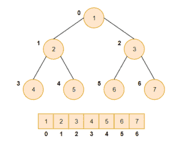

# 高效合并排序后的 Java 序列

> 原文：<https://web.archive.org/web/20220930061024/https://www.baeldung.com/java-merge-sorted-sequences>

## **1。概述**

在这个简短的教程中，我们将看到如何使用堆来有效地合并排序后的数组。

## **2。算法**

因为我们的问题陈述是使用堆来合并数组，所以我们将使用最小堆来解决我们的问题。最小堆只不过是一棵**二叉树，其中每个节点的值都小于其子节点**的值。

通常，最小堆是使用一个数组实现的，在查找节点的父节点和子节点时，该数组满足特定的规则。

对于数组`A[]`和索引`i`处的元素:

*   `A[(i-1)/2]`将返回其父级
*   `A[(2*i)+1]`将左子归还
*   `A[(2*i)+2]`会归还合适的孩子

下面是最小堆及其数组表示的图片:

现在让我们创建合并一组排序数组的算法:

1.  创建一个数组来存储结果，其大小由所有输入数组的长度相加决定。
2.  创建第二个数组，其大小等于输入数组的数量，并用所有输入数组的第一个元素填充它。
3.  通过在所有节点及其子节点上应用最小堆规则，将先前创建的数组转换为最小堆。
4.  重复接下来的步骤，直到结果数组被完全填充。
5.  从最小堆中获取根元素，并将其存储在结果数组中。
6.  用数组中填充当前根元素的下一个元素替换根元素。
7.  对我们的最小堆数组再次应用最小堆规则。

我们的算法有一个**递归流程来创建最小堆**，我们必须**访问输入数组**的所有元素。

该算法的时间[复杂度](/web/20221205162507/https://www.baeldung.com/java-algorithm-complexity)为 **`O(k log n)`，**其中 **`k`为所有输入数组中元素的总数，**， **`n` 为排序后数组的总数**。

现在让我们来看一个样本输入和运行算法后的预期结果，这样我们可以更好地理解这个问题。所以对于这些阵列:

[PRE0]

该算法应该返回一个结果数组:

[PRE1]

## **3。Java 实现**

既然我们对什么是最小堆以及合并算法如何工作有了基本的了解，那么让我们来看看 Java 实现。我们将使用两个类——一个表示堆节点，另一个实现合并算法。

### **3.1。堆节点表示法**

在实现算法本身之前，让我们创建一个表示堆节点的类。这将存储节点值和两个支持字段:

[PRE2]

注意，为了简单起见，我们特意省略了`getters`和`setters` 。我们将使用`arrayIndex`属性来存储获取当前堆节点元素的数组的索引。我们将使用`nextElementIndex`属性来存储将根节点移动到结果数组后要获取的元素的索引。

最初，`nextElementIndex`的值将是`1`。在替换最小堆的根节点后，我们将增加它的值。

### **3.2。最小堆合并算法**

我们的下一个类是表示最小堆本身，并实现合并算法:

[PRE3]

现在我们已经创建了 min-heap 类，让我们添加一个方法来堆化一个子树，其中子树的根节点位于数组的给定索引处:

[PRE4]

当我们用一个数组来表示一个最小堆时，最后一个叶子节点总是在数组的末尾。因此，当通过迭代调用`heapify() `方法将数组转换为最小堆时，我们只需要从最后一个叶子的父节点开始迭代:

[PRE5]

我们的下一个方法将实际实现我们的算法。为了更好地理解，让我们把这个方法分成两部分，看看它是如何工作的:

[PRE6]

第一部分将输入数组转换为包含第一个数组的所有元素的堆节点数组，并查找结果数组的大小:

[PRE7]

下一部分通过实现我们算法的步骤 4、5、6 和 7 来填充结果数组:

[PRE8]

## **4。测试算法**

现在让我们用之前提到的相同输入来测试我们的算法:

[PRE9]

## **5。结论**

在本教程中，我们学习了如何使用最小堆有效地合并排序后的数组。

我们在这里演示的例子可以在 GitHub 上找到[。](https://web.archive.org/web/20221205162507/https://github.com/eugenp/tutorials/tree/master/algorithms-modules/algorithms-miscellaneous-6)