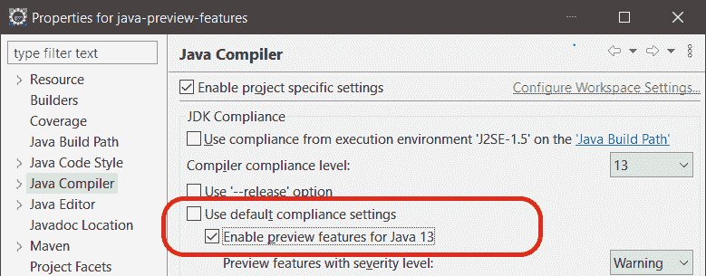

# Java 预览功能

> 原文：<https://web.archive.org/web/20220930061024/https://www.baeldung.com/java-preview-features>

## 1.概观

在本教程中，我们将探索 Java 预览版特性背后的动机，它们与实验性特性的区别，以及如何用不同的工具来启用它们。

## 2.为什么要预览功能

现在每个人可能都很清楚，Java 特性版本每六个月发布一次。这意味着等待新 Java 特性的时间更少，但同时也意味着对新特性的反馈做出反应的时间更少。

我们在这里谈论的是 Java。它被用来开发大量的生产系统。因此，即使是一个实施中的一个小故障或一个糟糕的功能设计都可能导致非常高的成本。

必须有一种方法来确保新特性是稳定的。更重要的是，它们必须适合社区的需要。但是怎么做呢？

多亏了 [JEP-12](https://web.archive.org/web/20220910004940/https://openjdk.java.net/jeps/12) ，“审查语言和虚拟机功能”可以包含在交付中。通过这种方式，社区可以在真实场景中检验新特性——当然不是在产品中。

基于社区反馈，预览功能可以被改进，可能在多个版本中多次改进。最终，这一特征可能会成为永久性的。但在某些情况下，提供的评论可能会导致完全撤销预览功能。

## 3.预览与实验特征

Java **预览功能是完全指定和开发的功能，正在接受评估**。因此，他们只是还没有达到最终状态。

由于它们的高质量，不同的 JDK 实现必须包括每个 Java 交付中计划的所有预览特性。然而，**一个 Java 版本仍然不支持早期版本的预览特性**。

预览功能本质上只是一种鼓励社区回顾和提供反馈的方式。此外，并不是每个 Java 特性都必须经过预览阶段才能成为最终版本。

以下是 JEP-12 对预览功能的看法:

> 一个`preview language or VM feature`是一个新特性，它的设计、规范和实现都已经完成，但是在 Java SE 平台中获得最终和永久的地位或者被改进或删除之前，它将受益于一段时间的广泛公开和评估。

另一方面，**实验特征远未完成**。他们的艺术品明显与 JDK 的分开了。

实验特征是不稳定的，因此，它们给语言带来了风险。因此，不同的 JDK 实现可以包括不同组的实验特征。

## 4.使用预览功能

**预览功能默认禁用**。要启用它们，我们必须使用`enable-preview`参数，它一次启用所有预览功能。

Java 编译器和 JVM 必须是相同的 Java 版本，包括我们想要使用的预览特性。

让我们尝试编译并运行一段使用文本块的代码，这是 JDK 13:

[PRE0]

当然，我们需要确保我们使用的是 JDK 13 和我们最喜欢的 IDE。例如，我们可以下载 OpenJDK [release 13](https://web.archive.org/web/20220910004940/https://jdk.java.net/13/) 并将其添加到我们 IDE 的 Java 运行时中。

### 4.1.使用 Eclipse

首先，Eclipse 会用红色标记代码，因为它不会被编译。错误消息将告诉我们启用预览功能，以便使用文本块。

我们需要右键单击项目并从弹出菜单中选择`Properties`。接下来，我们去`Java Compiler`。现在，我们可以选择为该特定项目或整个工作区启用预览功能。

接下来我们要取消勾选`Use default compliance settings`，只有这样才能勾选`Enable preview features for Java 13`:

### 4.2.使用 IntelliJ 理念

正如我们所料，默认情况下，代码也不会在 IntelliJ 中编译，即使是在 Java 13 中，我们会得到一个类似于在 Eclipse 中看到的错误消息。

我们可以从`File`菜单中的`Project Structure`启用预览功能。从`Project`开始，我们需要选择`13 (Preview)`作为项目语言级别:

这个应该可以了。但是，如果错误仍然存在，我们必须手动添加编译器参数来启用预览功能。假设这是一个 Maven 项目，`pom.xml` 中的编译器插件应该包含:

[PRE1]

如果需要，我们可以以类似的方式在各自的配置中为其他 Maven 插件启用预览功能。

### 4.3.从命令行

在编译时，`javac`命令需要两个参数——T1 和 T2:T3

[PRE2]

让我们回忆一下，JDK 版本`N`不支持版本`N-1`或任何以前版本的预览功能。因此，如果我们试图用 JDK 14 `.` 执行前面的命令，我们会得到一个错误

长话短说，**`release`参数必须将`N`设置为正在使用的编译器(和 JVM)的 JDK 发布版本**，以便启用预览功能。

`release`参数只是一个额外的保护措施，以确保使用预览功能的代码不会在生产中被急切地使用。

在运行时，`java`命令只需要`enable-preview`参数:

[PRE3]

但是，只有使用该特定 JDK 版本的预览功能的代码才会运行。

## 5.结论

在本文中，我们介绍了 Java 中的预览功能，为什么我们有这些功能，以及它们与实验功能有何不同。

然后，使用 JDK 13 中的文本块预览功能，我们一步一步地解释了如何使用 Eclipse、IntelliJ、Maven 和命令行中的预览功能。