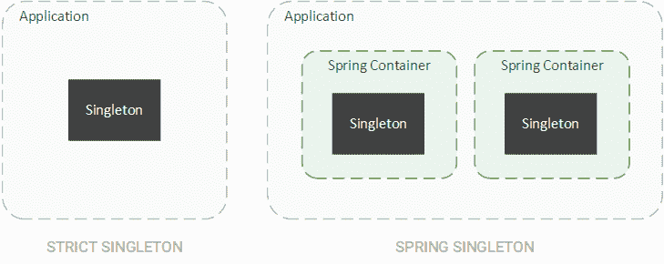
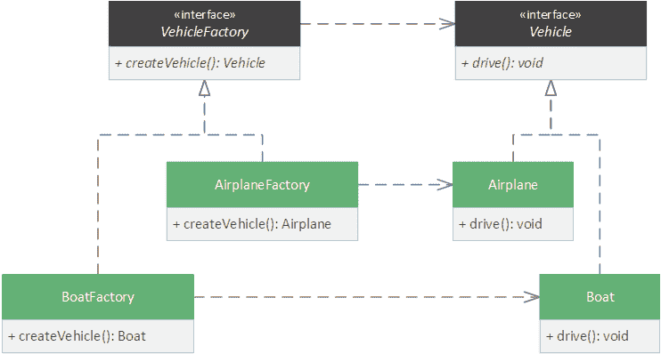
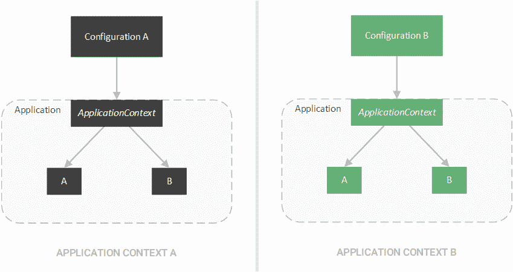
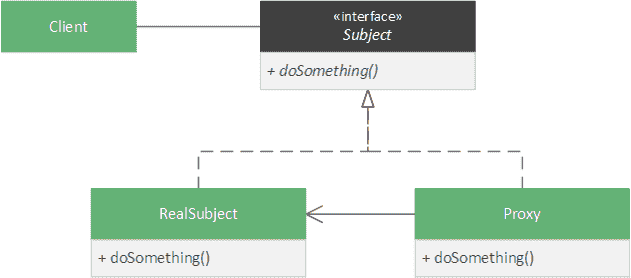
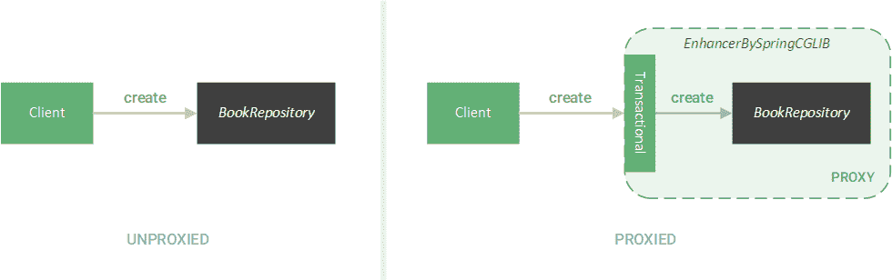
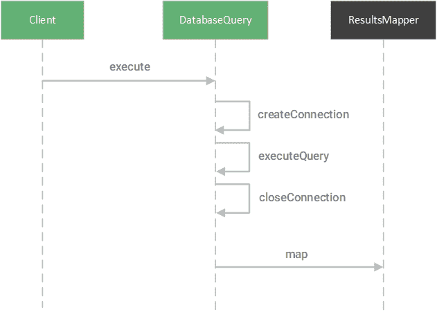

# Spring 框架中的设计模式

> 原文：<https://web.archive.org/web/20220930061024/https://www.baeldung.com/spring-framework-design-patterns>

## 1.介绍

设计模式是软件开发的重要组成部分。这些解决方案不仅解决了重复出现的问题，还通过识别常见模式来帮助开发人员理解框架的设计。

在本教程中，我们将研究 Spring 框架中使用的四种最常见的设计模式:

1.  单一模式
2.  工厂方法模式
3.  代理模式
4.  模板模式

我们还将了解 Spring 如何使用这些模式来减轻开发人员的负担，并帮助用户快速执行繁琐的任务。

## 2.单一模式

**[单例模式](/web/20221207170657/https://www.baeldung.com/java-singleton)是一种确保每个应用程序只存在一个对象实例的机制**。当管理共享资源或提供横切服务(如日志记录)时，这种模式会很有用。

### 2.1.单身豆

一般来说，单例对于一个应用程序来说是全局唯一的，但是在 Spring 中，这个约束被放宽了。相反， **Spring 将** **限制为每个 [Spring IoC 容器](/web/20221207170657/https://www.baeldung.com/inversion-control-and-dependency-injection-in-spring#the-spring-ioc-container)** 只能有一个对象。实际上，这意味着 Spring 将只为每个应用程序上下文的每种类型创建一个 bean。

Spring 的方法不同于严格定义的 singleton，因为一个应用程序可以有多个 Spring 容器。因此，如果我们有多个容器，同一个类的多个对象可以存在于单个应用程序中。

默认情况下，Spring 将所有 beans 创建为单例。

### 2.2.自动连线单件

例如，我们可以在单个应用程序上下文中创建两个控制器，并向每个控制器注入一个相同类型的 bean。

首先，我们创建一个管理我们的`Book`域对象的`BookRepository`。

接下来，我们创建`LibraryController`，它使用`BookRepository`返回图书馆中的图书数量:

[PRE0]

最后，我们创建一个`BookController`，它关注于`Book`特定的动作，比如通过 ID 查找一本书:

[PRE1]

然后，我们启动这个应用程序并在`/count`和`/book/1:`上执行 GET

[PRE2]

在应用程序输出中，我们看到两个`BookRepository`对象具有相同的对象 ID:

[PRE3]

`LibraryController`和`BookController`中的`BookRepository`对象 id 是相同的，证明 Spring 将同一个 bean 注入到两个控制器中。

**我们可以通过使用`@`** **`Scope(ConfigurableBeanFactory.SCOPE_PROTOTYPE)`** **注释**将 [bean 范围](/web/20221207170657/https://www.baeldung.com/spring-bean-scopes)从`singleton`更改为`prototype` 来创建`BookRepository` bean 的单独实例。

这样做指示 Spring 为它创建的每个`BookRepository`bean 创建单独的对象。因此，如果我们再次检查每个控制器中`BookRepository`的对象 ID，我们会发现它们不再相同。

## 3.工厂方法模式

工厂方法模式需要一个带有抽象方法的工厂类来创建所需的对象。

通常，我们希望基于特定的上下文创建不同的对象。

例如，我们的应用程序可能需要一个车辆对象。在航海环境中，我们想要制造船，但是在航空环境中，我们想要制造飞机:

为此，我们可以为每个所需的对象创建一个工厂实现，并从具体的工厂方法返回所需的对象。

### 3.1.应用程序上下文

Spring 在其[依赖注入(DI)框架](/web/20221207170657/https://www.baeldung.com/spring-dependency-injection)的基础上使用了这种技术。

从根本上来说， **Spring 把** **一个豆子容器当成了生产豆子的工厂。**

因此，Spring 将`BeanFactory`接口定义为 bean 容器的抽象:

[PRE4]

**每个`getBean`方法都被认为是一个工厂方法**，它返回一个与提供给该方法的标准相匹配的 bean，比如 bean 的类型和名称。

然后 Spring 用`ApplicationContext`接口扩展了`BeanFactory`，这引入了额外的应用程序配置。Spring 使用这种配置来启动基于一些外部配置的 bean 容器，比如 XML 文件或 Java 注释。

使用类似于`AnnotationConfigApplicationContext`的`ApplicationContext`类实现，我们可以通过从`BeanFactory`接口继承的各种工厂方法创建 beans。

首先，我们创建一个简单的应用程序配置:

[PRE5]

接下来，我们创建一个简单的类`Foo`，它不接受任何构造函数参数:

[PRE6]

然后创建另一个接受单个构造函数参数的类`Bar`:

[PRE7]

最后，我们通过`ApplicationContext`的`AnnotationConfigApplicationContext`实现来创建 beans:

[PRE8]

使用`getBean`工厂方法，我们可以只使用类类型和——在`Bar`的情况下——构造函数参数来创建已配置的 beans。

### 3.2.外部配置

这种模式是通用的，因为我们可以根据外部配置完全改变应用程序的行为。

如果我们希望改变应用程序中自动连接对象的实现，我们可以调整我们使用的`ApplicationContext`实现。

例如，我们可以将`AnnotationConfigApplicationContext`更改为基于 XML 的配置类，如 [`ClassPathXmlApplicationContext`](/web/20221207170657/https://www.baeldung.com/spring-classpathxmlapplicationcontext) :

[PRE9]

## 4.代理模式

在我们的数字世界中，代理是一个方便的工具，我们经常在软件之外使用它们(比如网络代理)。在代码中，**[代理模式](/web/20221207170657/https://www.baeldung.com/java-proxy-pattern)是一种允许一个对象——代理——控制对另一个对象——主体或服务**的访问的技术。

### 4.1.处理

为了创建代理，我们创建了一个对象，它实现了与我们的主题相同的接口，并包含了对主题的引用。

然后我们可以用代理来代替主语。

在 Spring 中，bean 被代理来控制对底层 bean 的访问。我们在使用事务时会看到这种方法:

[PRE10]

在我们的`BookManager`类中，我们用`@Transactional`注释来注释`create`方法。这个注释指示 Spring 自动执行我们的`create`方法。如果没有代理，Spring 将无法控制对我们的`BookRepository` bean 的访问并确保其事务一致性。

### 4.2.CGLib 代理

相反， **Spring 创建了一个代理，它包装了我们的`BookRepository` bean** ，并指示我们的 bean 自动执行我们的`create`方法。

当我们调用我们的`BookManager#create`方法时，我们可以看到输出:

[PRE11]

通常，我们希望看到一个标准的`BookRepository`对象 ID；相反，我们看到一个`EnhancerBySpringCGLIB`对象 ID。

在幕后， **Spring 已经把我们的`BookRepository`对象包裹在里面作为`EnhancerBySpringCGLIB`对象**。因此，Spring 控制对我们的`BookRepository`对象的访问(确保事务一致性)。

通常，Spring 使用两种类型的代理:

1.  [CGLib 代理](/web/20221207170657/https://www.baeldung.com/cglib)–代理类时使用
2.  JDK 动态代理–代理接口时使用

虽然我们使用事务来公开底层代理， **Spring 将在任何必须控制对 bean** 的访问的场景中使用代理。

## 5.模板方法模式

在许多框架中，很大一部分代码是样板代码。

例如，在数据库上执行查询时，必须完成相同的一系列步骤:

1.  建立联系
2.  执行查询
3.  执行清理
4.  关闭连接

这些步骤是[模板方法模式](/web/20221207170657/https://www.baeldung.com/java-template-method-pattern)的理想场景。

### 5.1.模板和回调

模板方法模式是一种技术，它定义了一些动作所需的步骤，实现了样板步骤，并将可定制的步骤抽象出来。子类可以实现这个抽象类，并为缺少的步骤提供一个具体的实现。

在数据库查询的情况下，我们可以创建一个模板:

[PRE12]

或者，我们可以通过提供回调方法来提供缺少的步骤。

**回调方法是一种允许主体向客户端发出信号，告知一些期望的动作已经完成的方法**。

在某些情况下，主体可以使用这个回调来执行操作——比如映射结果。

例如，我们可以为`execute`方法提供一个查询字符串和一个回调方法来处理结果，而不是使用一个`executeQuery`方法。

首先，我们创建回调方法，该方法接受一个`Results`对象并将其映射到一个类型为`T`的对象:

[PRE13]

然后我们修改我们的`DatabaseQuery`类来利用这个回调:

[PRE14]

这种回调机制正是 Spring 对 [`JdbcTemplate`类](/web/20221207170657/https://www.baeldung.com/spring-jdbc-jdbctemplate#the-jdbctemplate-and-running-queries)使用的方法。

### 5.2.`JdbcTemplate`

`JdbcTemplate`类提供了`query`方法，该方法接受查询`String`和`ResultSetExtractor`对象:

[PRE15]

`ResultSetExtractor`将代表查询结果的`ResultSet`对象转换为`T`类型的域对象:

[PRE16]

Spring 通过创建更具体的回调接口来进一步减少样板代码。

例如，`RowMapper`接口用于将一行 SQL 数据转换成类型为`T`的域对象。

[PRE17]

为了使`RowMapper`接口适应预期的`ResultSetExtractor`，Spring 创建了`RowMapperResultSetExtractor`类:

[PRE18]

我们可以提供如何转换单个行的逻辑，而不是提供转换整个`ResultSet`对象的逻辑，包括对行的迭代:

[PRE19]

有了这个转换器，我们就可以使用`JdbcTemplate`查询数据库并映射每个结果行:

[PRE20]

除了 JDBC 数据库管理，Spring 还使用模板来:

*   [Java 消息服务(JMS)](/web/20221207170657/https://www.baeldung.com/spring-jms)
*   [Java 持久性 API (JPA)](/web/20221207170657/https://www.baeldung.com/the-persistence-layer-with-spring-and-jpa)
*   [休眠](/web/20221207170657/https://www.baeldung.com/persistence-layer-with-spring-and-hibernate#no_template)(现已弃用)
*   [交易](/web/20221207170657/https://www.baeldung.com/spring-programmatic-transaction-management#transaction-template)

## 6.结论

在本教程中，我们研究了 Spring 框架中应用的四种最常见的设计模式。

我们还探索了 Spring 如何利用这些模式来提供丰富的特性，同时减轻开发人员的负担。

这篇文章的代码可以在 GitHub 上找到[。](https://web.archive.org/web/20221207170657/https://github.com/eugenp/tutorials/tree/master/spring-core-3)