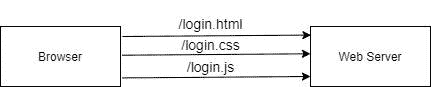
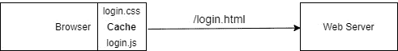

# Spring MVC 中的缓存头

> 原文:[https://web . archive . org/web/20220930061024/https://www . bael dung . com/spring-MVC-cache-headers](https://web.archive.org/web/20220930061024/https://www.baeldung.com/spring-mvc-cache-headers)

## 1.概观

在本教程中，我们将学习 HTTP 缓存。我们还将研究在客户机和 Spring MVC 应用程序之间实现这种机制的各种方法。

## 2.HTTP 缓存简介

当我们在浏览器上打开一个网页时，它通常会从 web 服务器上下载大量资源:

[](/web/20221129180415/https://www.baeldung.com/wp-content/uploads/2020/02/http-cache.jpg)

例如，在这个例子中，浏览器需要为一个`/login `页面下载三个资源。浏览器对每个网页发出多个 HTTP 请求是很常见的。**现在，如果我们非常频繁地请求这样的页面，会导致大量的网络流量，并且需要更长的时间来服务这些页面**。

为了减少网络负载，HTTP 协议允许浏览器[缓存](/web/20221129180415/https://www.baeldung.com/spring-cache-tutorial)这些资源中的一部分。如果启用，浏览器可以在本地缓存中保存资源的副本。因此，浏览器可以从本地存储提供这些页面，而不是通过网络请求:

[](/web/20221129180415/https://www.baeldung.com/wp-content/uploads/2020/02/http-cached-resources.jpg)

web 服务器可以通过在响应中添加一个`[Cache-Control](https://web.archive.org/web/20221129180415/https://www.w3.org/Protocols/rfc2616/rfc2616-sec13.html)`头来指示浏览器缓存特定的资源。

**由于资源被缓存为本地副本，** **存在从浏览器**提供陈旧内容的风险。因此，web 服务器通常会在`Cache-Control`头中添加一个到期时间。

在下面几节中，我们将在 Spring MVC 控制器的响应中添加这个头。稍后，我们还将看到 Spring APIs 根据到期时间来验证缓存的资源。

## 3.`Cache-Control`在控制器的响应中

### 3.1.使用`ResponseEntity`

**最直接的方法是** **使用 Spring** 提供的`CacheControl ` builder 类:

```
@GetMapping("/hello/{name}")
@ResponseBody
public ResponseEntity<String> hello(@PathVariable String name) {
    CacheControl cacheControl = CacheControl.maxAge(60, TimeUnit.SECONDS)
      .noTransform()
      .mustRevalidate();
    return ResponseEntity.ok()
      .cacheControl(cacheControl)
      .body("Hello " + name);
}
```

这将在响应中添加一个`Cache-Control`头:

```
@Test
void whenHome_thenReturnCacheHeader() throws Exception {
    this.mockMvc.perform(MockMvcRequestBuilders.get("/hello/baeldung"))
      .andDo(MockMvcResultHandlers.print())
      .andExpect(MockMvcResultMatchers.status().isOk())
      .andExpect(MockMvcResultMatchers.header()
        .string("Cache-Control","max-age=60, must-revalidate, no-transform"));
}
```

### 3.2.使用`HttpServletResponse`

通常，控制器需要从处理程序方法返回视图名称。**然而，** **`ResponseEntity`类不允许我们在返回视图名称的同时处理请求体**。

或者，对于这样的控制器，我们可以直接在`HttpServletResponse `中设置`Cache-Control`标题:

```
@GetMapping(value = "/home/{name}")
public String home(@PathVariable String name, final HttpServletResponse response) {
    response.addHeader("Cache-Control", "max-age=60, must-revalidate, no-transform");
    return "home";
}
```

这也将在 HTTP 响应中添加一个类似于上一节的`Cache-Control`头:

```
@Test
void whenHome_thenReturnCacheHeader() throws Exception {
    this.mockMvc.perform(MockMvcRequestBuilders.get("/home/baeldung"))
      .andDo(MockMvcResultHandlers.print())
      .andExpect(MockMvcResultMatchers.status().isOk())
      .andExpect(MockMvcResultMatchers.header()
        .string("Cache-Control","max-age=60, must-revalidate, no-transform"))
      .andExpect(MockMvcResultMatchers.view().name("home"));
}
```

## 4.`Cache-Control`对于静态资源

通常，我们的 Spring MVC 应用程序[提供了很多静态资源](/web/20221129180415/https://www.baeldung.com/spring-mvc-static-resources)，比如 HTML、CSS 和 JS 文件。因为这样的文件会消耗大量的网络带宽，所以浏览器缓存它们是很重要的。我们将在响应中使用`Cache-Control`头再次启用它。

Spring 允许我们在资源映射中控制这种缓存行为:

```
@Override
public void addResourceHandlers(final ResourceHandlerRegistry registry) {
    registry.addResourceHandler("/resources/**").addResourceLocations("/resources/")
      .setCacheControl(CacheControl.maxAge(60, TimeUnit.SECONDS)
        .noTransform()
        .mustRevalidate());
}
```

**这确保了在** **`/resources`下定义的所有资源** **在响应**中以`Cache-Control`标题返回。

## 5.`Cache-Control`在拦截器中

我们可以在 Spring MVC 应用程序中使用[拦截器为每个请求做一些预处理和后处理。这是另一个占位符，我们可以在其中控制应用程序的缓存行为。](/web/20221129180415/https://www.baeldung.com/spring-mvc-handlerinterceptor)

**现在，我们将使用 Spring** 提供的`WebContentInterceptor `，而不是实现一个定制的拦截器:

```
@Override
public void addInterceptors(InterceptorRegistry registry) {
    WebContentInterceptor interceptor = new WebContentInterceptor();
    interceptor.addCacheMapping(CacheControl.maxAge(60, TimeUnit.SECONDS)
      .noTransform()
      .mustRevalidate(), "/login/*");
    registry.addInterceptor(interceptor);
}
```

这里，我们注册了`WebContentInterceptor `并添加了类似于上几节的`Cache-Control`头。值得注意的是，我们可以为不同的 URL 模式添加不同的`Cache-Control`头。

在上面的例子中，对于所有以`/login`开始的请求，我们将添加这个头:

```
@Test
void whenInterceptor_thenReturnCacheHeader() throws Exception {
    this.mockMvc.perform(MockMvcRequestBuilders.get("/login/baeldung"))
      .andDo(MockMvcResultHandlers.print())
      .andExpect(MockMvcResultMatchers.status().isOk())
      .andExpect(MockMvcResultMatchers.header()
        .string("Cache-Control","max-age=60, must-revalidate, no-transform"));
}
```

## 6.Spring MVC 中的缓存验证

到目前为止，我们已经讨论了在响应中包含`Cache-Control`头的各种方法。这指示客户端或浏览器基于配置属性(如`max-age`)缓存资源。

通常为每个资源添加一个缓存到期时间**是一个好主意。因此，浏览器可以避免从缓存中提供过期的资源。**

尽管浏览器应该总是检查到期时间，但是没有必要每次都重新获取资源。如果浏览器可以验证服务器上的资源没有改变，它可以继续提供缓存版本的资源。为此，HTTP 为我们提供了两个响应头:

1.  `Etag`–存储唯一哈希值的 HTTP 响应头，用于确定服务器上的缓存资源是否已更改–相应的`If-None-Match`请求头必须携带最后一个 Etag 值
2.  `LastModified`–存储资源上次更新时间单位的 HTTP 响应头–相应的`If-Unmodified-Since`请求头必须携带上次修改日期

我们可以使用这两个头来检查是否需要重新获取过期的资源。**在验证报头之后，** **服务器可以重新发送资源或者发送 304 HTTP 代码以表示没有变化**。对于后一种情况，浏览器可以继续使用缓存的资源。

`LastModified `标题只能存储精确到秒的时间间隔。在需要更短的到期时间的情况下，这可能是一个限制。为此，建议改用`Etag` 。因为 [`Etag `头存储了一个哈希值](/web/20221129180415/https://www.baeldung.com/etags-for-rest-with-spring)，所以可以创建一个唯一的哈希值达到更精细的时间间隔，比如纳秒。

也就是说，让我们看看使用`LastModified.` 是什么样子

Spring 提供了一些实用方法来检查请求是否包含过期头:

```
@GetMapping(value = "/productInfo/{name}")
public ResponseEntity<String> validate(@PathVariable String name, WebRequest request) {

    ZoneId zoneId = ZoneId.of("GMT");
    long lastModifiedTimestamp = LocalDateTime.of(2020, 02, 4, 19, 57, 45)
      .atZone(zoneId).toInstant().toEpochMilli();

    if (request.checkNotModified(lastModifiedTimestamp)) {
        return ResponseEntity.status(304).build();
    }

    return ResponseEntity.ok().body("Hello " + name);
}
```

Spring 提供了`checkNotModified() `方法来检查自上次请求以来资源是否被修改过:

```
@Test
void whenValidate_thenReturnCacheHeader() throws Exception {
    HttpHeaders headers = new HttpHeaders();
    headers.add(IF_UNMODIFIED_SINCE, "Tue, 04 Feb 2020 19:57:25 GMT");
    this.mockMvc.perform(MockMvcRequestBuilders.get("/productInfo/baeldung").headers(headers))
      .andDo(MockMvcResultHandlers.print())
      .andExpect(MockMvcResultMatchers.status().is(304));
}
```

## 7.结论

在本文中，我们通过使用 Spring MVC 中的`Cache-Control`响应头了解了 HTTP 缓存。我们可以使用`ResponseEntity `类或者通过静态资源的资源映射在控制器的响应中添加头。

我们还可以使用 Spring 拦截器为特定的 URL 模式添加这个头。

和往常一样，代码可以在 GitHub 的[上获得。](https://web.archive.org/web/20221129180415/https://github.com/eugenp/tutorials/tree/master/spring-web-modules/spring-mvc-java-2)