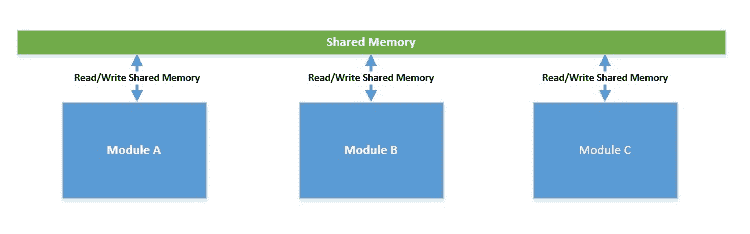
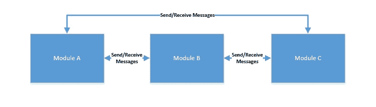
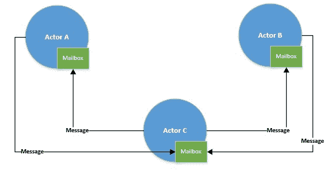
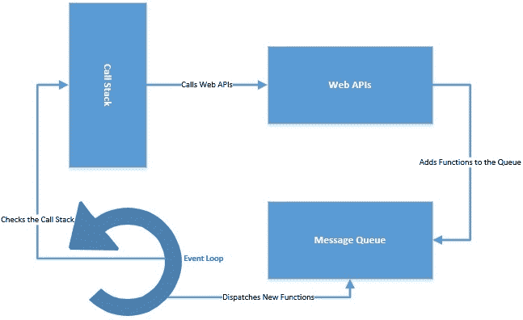

# 高度并发应用程序的设计原则和模式

> 原文：<https://web.archive.org/web/20220930061024/https://www.baeldung.com/concurrency-principles-patterns>

## 1.概观

在本教程中，我们将讨论一些设计原则和模式，它们是随着时间的推移建立起来的，用来构建高度并发的应用程序。

然而，值得注意的是，设计并发应用程序是一个广泛而复杂的主题，因此没有任何教程可以声称其内容详尽。我们将在这里介绍一些常用的技巧！

## 2.并发的基础

在我们继续下一步之前，让我们花点时间了解一下基础知识。首先，我们必须澄清我们对什么叫做并发程序的理解。如果多个计算同时发生，我们称之为程序并发**。**

现在，请注意，我们提到了同时发生的计算——也就是说，它们是同时进行的。但是，它们可能同时执行，也可能不同时执行。理解其中的区别很重要，因为同时执行计算的**被称为并行**。

### 2.1.如何创建并发模块？

理解如何创建并发模块很重要。有许多选择，但我们在这里将集中讨论两个流行的选择:

*   **进程**:进程是**一个正在运行的程序的实例，它与同一台机器上的其他进程**相隔离。机器上的每个进程都有自己独立的时间和空间。因此，通常不可能在进程之间共享内存，它们必须通过传递消息来进行通信。
*   **线程**:另一方面，线程**只是进程**的一部分。一个程序中可以有多个线程共享同一个内存空间。但是，每个线程都有唯一的堆栈和优先级。线程可以是本机的(由操作系统本机调度)或绿色的(由运行时库调度)。

### 2.2.并发模块是如何交互的？

如果并发模块不必通信，这是非常理想的，但事实往往并非如此。这就产生了两种并发编程模型:

*   **共享内存**:在该模型中，**并发模块通过读写内存**中的共享对象进行交互。这通常会导致并发计算的交错，从而导致竞争情况。因此，它会不确定地导致不正确的状态。

*   **消息传递**:在该模型中，**并发模块通过通信信道**相互传递消息进行交互。这里，每个模块按顺序处理传入的消息。因为没有共享状态，所以相对来说更容易编程，但是这仍然没有摆脱竞争条件！

### 2.3.并发模块如何执行？

摩尔定律在处理器的时钟速度方面碰壁已经有一段时间了。相反，由于我们必须增长，我们已经开始将多个处理器封装到同一个芯片上，通常称为多核处理器。但是，仍然很少听说处理器拥有超过 32 个内核。

现在，我们知道一个内核一次只能执行一个线程或一组指令。然而，进程和线程的数量可以分别是数百和数千。那么，它到底是如何工作的呢？这就是操作系统为我们模拟并发性的地方。操作系统通过**时间分片**来实现这一点——这实际上意味着处理器频繁地、不可预测地、不确定地在线程之间切换。

## 3.并发编程中的问题

当我们讨论设计并发应用程序的原则和模式时，明智的做法是首先理解典型的问题是什么。

在很大程度上，我们在并发编程方面的经验涉及到使用带有共享内存的本机线程。因此，我们将集中讨论由此产生的一些常见问题:

*   **互斥(同步原语)**:交错**线程需要独占访问共享状态或内存，以保证程序的正确性**。共享资源的同步是实现互斥的常用方法。有几种同步原语可供使用，例如，锁、监视器、信号量或互斥体。但是，互斥编程容易出错，并且经常会导致性能瓶颈。有几个讨论得很好的问题与此相关，如[死锁和活锁](/web/20220715114240/https://www.baeldung.com/cs/deadlock-livelock-starvation)。
*   **上下文切换(重量级线程)**:每个操作系统都有对进程和线程等并发模块的本地支持，尽管这种支持是多种多样的。如前所述，操作系统提供的一个基本服务是通过时间片调度线程在有限数量的处理器上执行。现在，这实际上意味着**线程在不同状态**之间频繁切换。在这个过程中，需要保存和恢复它们的当前状态。这是一项耗时的活动，会直接影响整体吞吐量。

## 4.高并发性的设计模式

现在，我们已经了解了并发编程的基础和其中的常见问题，是时候了解一些避免这些问题的常见模式了。我们必须重申，并发编程是一项需要大量经验的艰巨任务。因此，遵循一些既定的模式可以使任务变得更容易。

### 4.1.基于角色的并发

我们将讨论的关于并发编程的第一个设计称为参与者模型。这是**一个并发计算的数学模型，基本上把一切都当作一个演员**。行动者可以相互传递消息，并且作为对消息的响应，可以做出本地决策。这是由卡尔·休伊特首先提出的[，并且启发了许多编程语言。](https://web.archive.org/web/20220715114240/https://arxiv.org/vc/arxiv/papers/1008/1008.1459v8.pdf)

Scala 并发编程的主要构造是 actors。Actors 是 Scala 中的普通对象，我们可以通过实例化`Actor`类来创建。此外， [Scala Actors 库](https://web.archive.org/web/20220715114240/https://docs.scala-lang.org/overviews/core/actors.html)提供了许多有用的 actor 操作:

[PRE0]

在上面的例子中，在一个无限循环中调用`receive`方法会挂起 actor，直到消息到达。消息到达后，将从参与者的邮箱中删除，并采取必要的措施。

角色模型**消除了并发编程的一个基本问题——共享内存**。参与者通过消息进行通信，每个参与者按顺序处理来自其专用邮箱的消息。然而，我们通过线程池执行 actors。我们已经看到，本机线程可能是重量级的，因此数量有限。

当然，这里还有其他模式可以帮助我们——我们将在后面讨论这些！

### 4.2.基于事件的并发

基于事件的设计明确地解决了本地线程产生和运行成本高的问题。基于事件的设计之一是事件循环。事件循环使用事件提供程序和一组事件处理程序。在这个设置中，**事件循环阻塞事件提供程序，并在事件到达**时将事件分派给事件处理程序。

基本上，事件循环只不过是一个事件调度器！事件循环本身可以只在一个本机线程上运行。那么，事件循环中到底发生了什么？让我们看一个非常简单的事件循环的伪代码作为例子:

[PRE1]

基本上，我们的事件循环所做的就是不断地寻找事件，当找到事件时，处理它们。这种方法非常简单，但是它获得了事件驱动设计的好处。

使用这种设计构建并发应用程序给了应用程序更多的控制。此外，它还消除了多线程应用程序的一些典型问题，例如死锁。

**JavaScript 实现事件循环来提供异步编程**。它[维护一个调用栈来跟踪所有要执行的函数](https://web.archive.org/web/20220715114240/https://developer.mozilla.org/en-US/docs/Web/JavaScript/EventLoop)。它还维护一个事件队列，用于发送新函数进行处理。事件循环不断检查调用堆栈，并从事件队列中添加新函数。所有异步调用都被分派到 web APIs，通常由浏览器提供。

事件循环本身可以在单线程上运行，但是 web APIs 提供了单独的线程。

### 4.3.非阻塞算法

在非阻塞算法中，一个线程的挂起不会导致其他线程的挂起。我们已经看到，我们的应用程序中只能有有限数量的本机线程。现在，**阻塞一个线程的算法显然会显著降低吞吐量**，并阻止我们构建高度并发的应用程序。

非阻塞算法总是**利用底层硬件**提供的比较和交换原子原语。这意味着硬件会将内存位置的内容与一个给定值进行比较，只有当它们相同时，它才会将该值更新为一个新的给定值。这看起来很简单，但是它有效地为我们提供了一个原子操作，否则将需要同步。

这意味着我们必须编写新的数据结构和库来利用这种原子操作。这给了我们一个巨大的多种语言的无等待和无锁实现。Java 有几个[非阻塞数据结构](https://web.archive.org/web/20220715114240/https://docs.oracle.com/javase/tutorial/essential/concurrency/atomicvars.html)，比如`AtomicBoolean`、`AtomicInteger`、`AtomicLong`和`AtomicReference`。

考虑一个应用程序，其中多个线程试图访问相同的代码:

[PRE2]

显然，上面的代码不是线程安全的，它在多线程环境中的行为是不可预测的。这里我们的选择是要么用锁同步这段代码，要么使用原子操作:

[PRE3]

正如我们所见，使用像`AtomicBoolean`这样的非阻塞数据结构有助于我们编写线程安全的代码，而不会沉溺于锁的缺点！

## 5.编程语言支持

我们已经看到有多种方法可以构造一个并发模块。虽然编程语言确实有所不同，但主要是底层操作系统如何支持这个概念。然而，由于本地线程支持的基于线程的并发性在可伸缩性方面遇到了新的障碍，我们总是需要新的选择。

实现我们在上一节中讨论的一些设计实践被证明是有效的。然而，我们必须记住，这样做确实会使编程变得复杂。我们真正需要的是能够提供基于线程的并发能力，同时又不会带来不良影响的东西。

我们可用的一个解决方案是绿色线程。**绿色线程是由运行时库**调度的线程，而不是由底层操作系统原生调度的线程。虽然这并没有消除基于线程的并发性中的所有问题，但在某些情况下，它确实可以给我们带来更好的性能。

现在，使用绿色线程不是小事，除非我们选择使用的编程语言支持它。并不是每种编程语言都有这种内置的支持。此外，我们笼统地称之为绿色线程的东西可以由不同的编程语言以非常独特的方式实现。让我们看看这些选项中的一些。

### 5.1.围棋棋谱

[Go 编程语言](https://web.archive.org/web/20220715114240/https://golang.org/)中的 Goroutines 是轻量级线程。它们提供可以与其他函数或方法同时运行的函数或方法。Goroutines 非常便宜，因为它们在栈中只占几千字节，从 T3 开始。

最重要的是，goroutines 与更少数量的本地线程复用。此外，goroutines 使用通道相互通信，从而避免访问共享内存。我们几乎得到了我们需要的一切，猜猜是什么——什么都不用做！

### 5.2.Erlang 中的流程

在 [Erlang](https://web.archive.org/web/20220715114240/https://www.erlang.org/) 中，执行的每个线程都称为一个进程。但是，这不太像我们到目前为止讨论的过程！Erlang 进程是轻量级的**,内存占用少，创建和处理**速度快，调度开销低。

在幕后，Erlang 进程只不过是运行时处理调度的函数。此外，Erlang 进程不共享任何数据，它们通过消息传递相互通信。这就是我们首先称这些为“过程”的原因！

### 5.3.Java 中的纤程(提案)

Java 并发性的故事是一个不断发展的过程。Java 确实支持绿色线程，至少对于 Solaris 操作系统是这样。然而，由于超出本教程范围的障碍，这一部分已经停止。

从那时起，Java 中的并发性就完全是关于本机线程以及如何聪明地使用它们！但是由于显而易见的原因，我们可能很快就会在 Java 中有一个新的并发抽象，叫做纤程。Project Loom 提议**将延续和纤程一起引入，这可能会改变我们用 Java 编写并发应用**的方式！

这只是对不同编程语言中可用内容的一个初步了解。其他编程语言尝试用更有趣的方式来处理并发性。

此外，值得注意的是，在设计高度并发的应用程序时，上一节中讨论的设计模式的组合，以及对类似绿色线程的抽象的编程语言支持，会非常强大。

## 6.高并发应用

现实世界中的应用程序通常有多个组件通过网络相互交互。我们通常通过互联网访问它，它由多种服务组成，如代理服务、网关、web 服务、数据库、目录服务和文件系统。

在这种情况下，我们如何确保高并发性？让我们探索其中的一些层，以及我们可以用来构建高度并发应用程序的选项。

正如我们在上一节中看到的，构建高并发性应用程序的关键是使用这里讨论的一些设计概念。我们需要为这项工作选择正确的软件——那些已经结合了这些实践的软件。

### 6.1.Web 层

web 通常是用户请求到达的第一层，在这里提供高并发性是不可避免的。让我们看看有哪些选择:

*   [**Node**](https://web.archive.org/web/20220715114240/https://nodejs.org/en/) (也叫 NodeJS 或 Node.js)是**一个开源的、跨平台的 JavaScript 运行时**建立在 Chrome 的 V8 JavaScript 引擎上。Node 在处理异步 I/O 操作方面工作得非常好。Node 之所以做得这么好，是因为它在单线程上实现了一个事件循环。事件循环在回调的帮助下异步处理所有阻塞操作，如 I/O。
*   [**nginx**](https://web.archive.org/web/20220715114240/https://nginx.org/en/) 是**一个开源的 web 服务器，我们通常将其用作反向代理**以及其他用途。nginx 提供高并发性的原因是它使用异步的、事件驱动的方法。nginx 在单线程中运行主进程。主进程维护执行实际处理的工作进程。因此，工作进程同时处理每个请求。

### 6.2.应用层

在设计应用程序时，有几个工具可以帮助我们构建高并发性。让我们来看看这些可用的库和框架中的一些:

*   [**Akka**](https://web.archive.org/web/20220715114240/https://akka.io/) 是**一个用 Scala 编写的工具包，用于在 JVM 上构建高度并发和分布式的应用**。Akka 处理并发的方法是基于我们之前讨论过的 actor 模型的。Akka 在参与者和底层系统之间创建了一个层。该框架处理创建和调度线程、接收和发送消息的复杂性。
*   [**项目反应器**](https://web.archive.org/web/20220715114240/https://projectreactor.io/) 是**一个在 JVM 上构建非阻塞应用**的反应库。它基于反应流规范，关注于[高效的消息传递和需求管理](/web/20220715114240/https://www.baeldung.com/reactor-core)(背压)。反应器操作者和调度者可以维持消息的高吞吐率。一些流行的框架提供了 reactor 实现，包括 Spring WebFlux 和 RSocket。
*   [**Netty**](https://web.archive.org/web/20220715114240/https://netty.io/) 是一个异步的、事件驱动的网络应用框架。我们可以使用 Netty 开发[高并发协议服务器和客户端](/web/20220715114240/https://www.baeldung.com/netty)。Netty 利用了 [NIO](/web/20220715114240/https://www.baeldung.com/tag/java-nio/) ，它是 Java APIs 的集合，通过缓冲区和通道提供异步数据传输。它为我们提供了几个优势，如更好的吞吐量，更低的延迟，更少的资源消耗，以及最大限度地减少不必要的内存复制。

### 6.3.数据层

最后，没有数据的应用程序是不完整的，数据来自持久存储。当我们讨论关于数据库的高并发性时，大部分焦点仍然在 NoSQL 家族上。这主要是由于 NoSQL 数据库可以提供线性可伸缩性，但在关系型数据库中很难实现。让我们来看两个流行的数据层工具:

*   [**Cassandra**](https://web.archive.org/web/20220715114240/https://cassandra.apache.org/) **是一个免费开源的 NoSQL 分布式数据库**，在商用硬件上提供高可用性、高可伸缩性和容错性。但是，Cassandra 不提供跨多个表的 ACID 事务。因此，如果我们的应用程序不需要强一致性和事务，[我们可以受益于 Cassandra 的低延迟操作](/web/20220715114240/https://www.baeldung.com/cassandra-with-java)。
*   [**卡夫卡**](https://web.archive.org/web/20220715114240/https://kafka.apache.org/) **是分布式流媒体平台**。Kafka 按称为主题的类别存储记录流。它可以为记录的生产者和消费者提供线性水平可伸缩性，同时提供高可靠性和耐用性。分区、副本和代理是它提供大规模分布式并发的一些基本概念。

### 6.4.缓存层

在现代世界中，没有一个以高并发性为目标的 web 应用程序能够承受每次都访问数据库。这让我们选择一个缓存—最好是能够支持我们高度并发应用的内存缓存:

*   [**Hazelcast**](https://web.archive.org/web/20220715114240/https://hazelcast.org/) **是一个分布式、云友好的内存对象存储**和计算引擎，支持[各种各样的数据结构](/web/20220715114240/https://www.baeldung.com/java-hazelcast)，如`Map`、`Set`、`List`、`MultiMap`、`RingBuffer`和`HyperLogLog`。它具有内置复制功能，并提供高可用性和自动分区。
*   [**Redis**](https://web.archive.org/web/20220715114240/https://redis.io/) **是一个内存中的数据结构存储，我们主要将其用作缓存**。它提供了一个具有可选持久性的内存中键值数据库。支持的数据结构包括字符串、散列、列表和集合。Redis 具有内置的复制功能，并提供高可用性和自动分区。如果我们不需要持久性，Redis [可以为我们提供一个功能丰富、网络化、性能卓越的内存缓存](/web/20220715114240/https://www.baeldung.com/spring-data-redis-tutorial)。

当然，在构建高度并发的应用程序的过程中，我们仅仅触及了可用资源的皮毛。值得注意的是，除了可用的软件，我们的需求应该引导我们创建一个合适的设计。这些选项中有些可能合适，有些可能不合适。

此外，我们不要忘记，还有更多可能更适合我们需求的选项。

## 7.结论

在本文中，我们讨论了并发编程的基础。我们了解了并发性的一些基本方面以及它可能导致的问题。此外，我们研究了一些设计模式，它们可以帮助我们避免并发编程中的典型问题。

最后，我们研究了一些可用于构建高度并发的端到端应用程序的框架、库和软件。