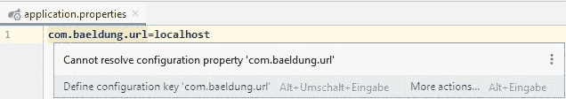

# IntelliJ–无法解析 Spring Boot 配置属性错误

> 原文：<https://web.archive.org/web/20220930061024/https://www.baeldung.com/intellij-resolve-spring-boot-configuration-properties>

## 1.概观

当我们将运行时属性注入到 Spring 应用程序中时，我们可能会[为自定义属性组](/web/20221208143837/https://www.baeldung.com/configuration-properties-in-spring-boot)定义 bean 类。

IntelliJ 为内置属性 beans 提供帮助和自动完成。然而，它需要一点帮助来为自定义属性提供这些。

在这个简短的教程中，我们将看看如何向 IntelliJ 公开这些属性，以简化开发过程。

## 2.自定义属性

让我们来看看 IntelliJ 可以为我们提供的关于应用程序属性的屏幕帮助:

[](/web/20221208143837/https://www.baeldung.com/wp-content/uploads/2020/03/IntelliJCannotResolveCustomPropertyAutoCompletion-1.jpg)

这里，属性`url`和`timeout-in-milliseconds`是自定义属性。我们可以看到描述、类型和可选的默认值。

但是，如果一个属性是未知的，IntelliJ 将向我们显示一个警告:

[](/web/20221208143837/https://www.baeldung.com/wp-content/uploads/2020/03/IntelliJCannotResolveCustomProperty-2.jpg)

这是因为，没有元数据，IntelliJ 无法帮助我们。

现在，让我们来看看我们必须做些什么来解决这个问题。

## 3.属国

首先，我们需要将 [`spring-boot-configuration-processor`](https://web.archive.org/web/20221208143837/https://search.maven.org/search?q=g:org.springframework.boot%20AND%20a:spring-boot-configuration-processor) 依赖项添加到我们的`pom.xml`中:

```
<dependency>
    <groupId>org.springframework.boot</groupId>
    <artifactId>spring-boot-configuration-processor</artifactId>
    <optional>true</optional>
</dependency>
```

每次我们构建项目时，都会调用 **`spring-boot-configuration-processor`。它将在`t` `arget/classes/META-INF/. `中创建元数据文件**

依赖项被标记为可选的，这意味着当有人使用我们的项目作为依赖项时，它不会被继承。

接下来，我们将看到`spring-boot-configuration-processor`从哪里获取用于创建元数据的信息。

## 4.带有`@ConfigurationProperties`的配置元数据

我们在用`@ConfigurationProperties`注释的类中定义我们的属性:

```
@Configuration
@ConfigurationProperties(prefix = "com.baeldung")
public class CustomProperties {

    /**
     * The url to connect to.
     */
    String url;

    /**
     * The time to wait for the connection.
     */
    private int timeoutInMilliSeconds = 1000;

    // Getters and Setters

}
```

这里，该类包含属性名、它们的类型以及初始化列表中提供的任何默认值。此外，Javadoc 提供了每个属性的描述。

在构建过程中，**注释处理器搜索所有用** `**@ConfigurationProperties.**` 注释的类，它为类的每个实例变量生成定制属性元数据。

## 5.配置元数据文件

### 5.1.元数据文件的格式

描述定制属性的[元数据文件驱动 IntelliJ 中的上下文帮助，例如:](/web/20221208143837/https://www.baeldung.com/spring-boot-configuration-metadata#generating-metadata)

```
{
  "groups": [
    {
      "name": "com.baeldung",
      "type": "com.baeldung.configuration.processor.CustomProperties",
      "sourceType": "com.baeldung.configuration.processor.CustomProperties"
    }
  ],
  "properties": [
    {
      "name": "com.baeldung.url",
      "type": "java.lang.String",
      "description": "The url to connect to.",
      "sourceType": "com.baeldung.configuration.processor.CustomProperties"
    },
    {
      "name": "com.baeldung.timeout-in-milli-seconds",
      "type": "java.lang.Integer",
      "description": "The time to wait for the connection.",
      "sourceType": "com.baeldung.configuration.processor.CustomProperties",
      "defaultValue": 1000
    }
  ],
  "hints": []
}
```

由于注释处理器从我们的代码中为我们生成了这个文件，因此**不需要直接查看或编辑这个文件**。

### 5.2.没有`ConfigurationProperties` Bean 的元数据

如果我们已经有了不是由`@ConfigurationProperties`引入的属性，但是仍然需要它们的元数据文件，那么 IntelliJ 可以提供帮助。

让我们仔细看看之前的警告信息:

[](/web/20221208143837/https://www.baeldung.com/wp-content/uploads/2020/03/IntelliJCannotResolveCustomProperty-2-1.jpg)

这里我们看到一个`Define configuration key`选项，我们可以用它来创建一个`additional-spring-configuration-metadata.json`文件。创建的文件将如下所示:

```
{
  "properties": [
    {
      "name": "com.baeldung.timeoutInMilliSeconds",
      "type": "java.lang.String",
      "description": "Description for com.baeldung.timeoutInMilliSeconds."
    }
  ]
}
```

由于没有来自任何其他地方的关于这个属性的信息，**我们将不得不手动编辑其中的元数据。**默认`type`总是`s String`。

让我们在文件中添加一些额外的信息:

```
{
  "properties": [
    {
      "name": "com.baeldung.timeout-in-milli-seconds",
      "type": "java.lang.Integer",
      "description": "The time to wait for the connection.",
      "sourceType": "com.baeldung.configuration.processor.CustomProperties",
      "defaultValue": 1000
    }
  ]
}
```

注意，我们需要**重新构建项目，以便在自动完成**中看到新的属性。

此外，我们应该注意，生成这个元数据文件的选项也可以通过 IntelliJ 的 Alt+ENTER 快捷方式在未知属性上使用。

## 6.结论

在本文中，我们研究了 IntelliJ 如何使用配置属性元数据为我们的属性文件提供帮助。

我们看到了如何使用 Spring 的注释处理器从定制类中生成元数据。然后，我们看到了如何在 IntelliJ 中使用快捷方式来创建元数据文件以进行手动编辑。

和往常一样，本文示例中的代码可以在 GitHub 上找到[。](https://web.archive.org/web/20221208143837/https://github.com/eugenp/tutorials/tree/master/spring-boot-modules/spring-boot-properties-3)