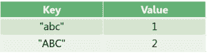

# 带有不区分大小写的键的 Java 映射

> 原文:[https://web . archive . org/web/20220930061024/https://www . bael dung . com/Java-map-with-case-insensitive-keys](https://web.archive.org/web/20220930061024/https://www.baeldung.com/java-map-with-case-insensitive-keys)

## 1.概观

`Map` 是 Java 中最常见的数据结构之一，`String` 是最常见的映射键类型之一。默认情况下，**这种类型的映射有区分大小写的键。**

在这个简短的教程中，我们将探索不同的`Map` 实现，其中**接受所有大小写变化的`String `作为同一个键**。

## 2.仔细看看不区分大小写的键`Map`

让我们更详细地检查一下我们试图解决的问题。

假设我们有一个只有一个条目的`Map<String, Integer> `:

[](/web/20221208143859/https://www.baeldung.com/wp-content/uploads/2020/04/firstEntry.png)

让我们添加下一个条目:

```
map.put("ABC", 2);
```

当使用带有区分大小写的键的`Map`时，我们将得到两个条目:

[](/web/20221208143859/https://www.baeldung.com/wp-content/uploads/2020/04/sensetiveKey-1.png)

但是当使用带有不区分大小写的键的`Map`时，内容将是:

[](/web/20221208143859/https://www.baeldung.com/wp-content/uploads/2020/04/insensetiveKey-1.png)

在接下来的例子中，我们将深入一些流行的`Map`实现的不区分大小写的实现:`TreeMap`、`HashMap`和`LinkedHashMap`。

## 3.`TreeMap`

`[TreeMap](/web/20221208143859/https://www.baeldung.com/java-treemap) `是`NavigableMap`的一个实现，这意味着它总是在插入后根据给定的`Comparator`对条目进行排序。另外，`TreeMap` 使用一个`Comparator`来检查插入的键是重复的还是新的。

因此，**如果我们提供一个不区分大小写的`String` `Comparator`，我们将得到一个不区分大小写的** `**TreeMap**.`

幸运的是，`String` 已经提供了这个静态的`Comparator`:

```
public static final Comparator <String> CASE_INSENSITIVE_ORDER
```

我们可以在构造函数中提供:

```
Map<String, Integer> treeMap = new TreeMap<>(String.CASE_INSENSITIVE_ORDER);
treeMap.put("abc", 1);
treeMap.put("ABC", 2);
```

现在，当我们运行测试时，我们可以看到`Map `的大小是 1:

```
assertEquals(1, treeMap.size());
```

并且该值被更新为 2:

```
assertEquals(2, treeMap.get("aBc").intValue());
assertEquals(2, treeMap.get("ABc").intValue());
```

现在让我们删除条目，使用相同的`String`，但是使用另一种情况:

```
treeMap.remove("aBC");
assertEquals(0, treeMap.size());
```

我们应该记住，与提供 O(1)插入和查找的`HashMap` 相比，像`put`和`get`这样的**函数对于 [`TreeMap`平均花费 O(log n)](/web/20221208143859/https://www.baeldung.com/java-treemap-vs-hashmap)** 的时间。

`TreeMap `不允许`null`键也是不值一提的。

## 4.阿帕奇的`CaseInsensitiveMap`

[Apache 的 Commons-Collections](https://web.archive.org/web/20221208143859/https://github.com/apache/commons-collections) 是一个非常流行的 Java 库，提供了大量有用的类，其中有 [`CaseInsensitiveMap`](https://web.archive.org/web/20221208143859/https://commons.apache.org/proper/commons-collections/apidocs/org/apache/commons/collections4/map/CaseInsensitiveMap.html) 。

**`CaseInsensitiveMap `是一个基于[散列的`Map`](/web/20221208143859/https://www.baeldung.com/java-hashmap) ，它在添加或检索键之前将其转换为小写。**与`TreeMap`不同，`CaseInsensitiveMap `允许`null`插入钥匙。

首先，我们需要添加`[commons-collections4](https://web.archive.org/web/20221208143859/https://search.maven.org/search?q=g:org.apache.commons%20a:commons-collections4)`[依赖](https://web.archive.org/web/20221208143859/https://search.maven.org/search?q=g:org.apache.commons%20a:commons-collections4):

```
<dependency>
    <groupId>org.apache.commons</groupId>
    <artifactId>commons-collections4</artifactId>
    <version>4.4</version>
</dependency>
```

现在，我们可以使用`CaseInsensitiveMap `并添加两个条目:

```
Map<String, Integer> commonsHashMap = new CaseInsensitiveMap<>();
commonsHashMap.put("abc", 1);
commonsHashMap.put("ABC", 2);
```

当我们测试它时，我们期望得到与之前看到的相同的结果:

```
assertEquals(1, commonsHashMap.size());
assertEquals(2, commonsHashMap.get("aBc").intValue());
assertEquals(2, commonsHashMap.get("ABc").intValue());

commonsHashMap.remove("aBC");
assertEquals(0, commonsHashMap.size());
```

## 5.春天的`LinkedCaseInsensitiveMap`

[Spring Core](https://web.archive.org/web/20221208143859/https://github.com/spring-projects/spring-framework/tree/master/spring-core) 是一个 Spring 框架模块，也提供了实用工具类，包括`LinkedCaseInsensitiveMap`。

`LinkedCaseInsensitiveMap`包装一个`[LinkedHashMap](/web/20221208143859/https://www.baeldung.com/java-linked-hashmap)`，T1 是一个基于哈希表和链表的`Map`。与`LinkedHashMap`不同，它不允许`null`键插入。 **`LinkedCaseInsensitiveMap`保留按键的原始顺序和原始大小写，同时允许以任何大小写调用`get``remove`等函数。**

首先，让我们添加[的`spring-core`依赖](https://web.archive.org/web/20221208143859/https://search.maven.org/search?q=g:org.springframework%20a:spring-core):

```
<dependency>
    <groupId>org.springframework</groupId>
    <artifactId>spring-core</artifactId>
    <version>5.2.5.RELEASE</version>
</dependency>
```

现在，我们可以初始化一个新的`LinkedCaseInsensitiveMap`:

```
Map<String, Integer> linkedHashMap = new LinkedCaseInsensitiveMap<>();
linkedHashMap.put("abc", 1);
linkedHashMap.put("ABC", 2);
```

添加测试它:

```
assertEquals(1, linkedHashMap.size());
assertEquals(2, linkedHashMap.get("aBc").intValue());
assertEquals(2, linkedHashMap.get("ABc").intValue());

linkedHashMap.remove("aBC");
assertEquals(0, linkedHashMap.size());
```

## 6.结论

在本教程中，我们已经看到了用不区分大小写的键创建 Java `Map`的不同方法，并使用了不同的类来实现这一点。

和往常一样，代码可以在 GitHub 的[上获得。](https://web.archive.org/web/20221208143859/https://github.com/eugenp/tutorials/tree/master/core-java-modules/core-java-collections-maps-5)