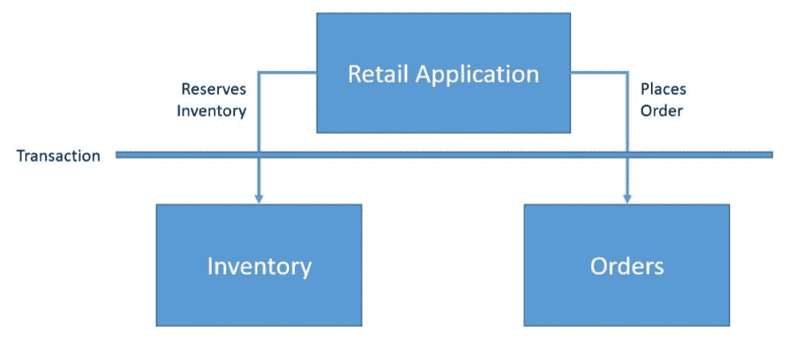
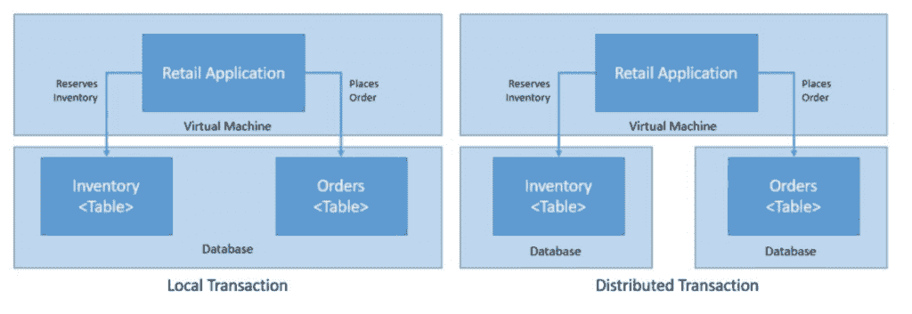
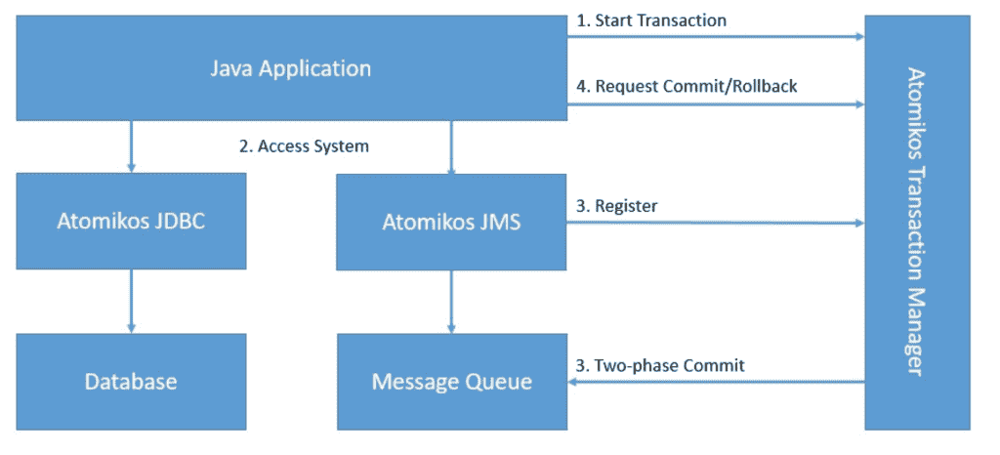

# A Guide to Atomikos

> 原文:[https://web . archive . org/web/20220930061024/https://www . bael dung . com/Java-atomikos](https://web.archive.org/web/20220930061024/https://www.baeldung.com/java-atomikos)

## 1.介绍

[Atomikos](https://web.archive.org/web/20220706112244/https://www.atomikos.com/) 是**一个 Java 应用**的事务库。在本教程中，我们将了解为什么以及如何使用 Atomikos。

在这个过程中，我们还将了解事务的基本知识以及我们为什么需要它们。

然后，我们将创建一个简单的应用程序，其中的事务利用来自 Atomikos 的不同 API。

## 2.了解基础知识

在我们讨论 Atomikos 之前，让我们了解一下事务到底是什么，以及一些与它们相关的概念。简而言之，**事务是一个逻辑工作单元，它的效果在事务之外是可见的，或者是完全可见的**。

让我们举个例子来更好地理解这一点。典型的零售应用程序保留库存，然后下订单:

[](/web/20220706112244/https://www.baeldung.com/wp-content/uploads/2020/04/Screenshot-2020-04-18-at-18.23.31.png)

在这里，我们希望这两个操作要么一起发生，要么根本不发生。我们可以通过将这些操作封装到一个事务中来实现这一点。

### 2.1.本地与分布式事务

一个事务可以涉及多个独立的操作。这些操作**可以在相同的资源或者不同的资源**上执行。在这里，我们将事务中的参与组件(如数据库)称为资源。

单个资源内的事务称为本地事务，而跨多个资源产生的事务称为分布式事务:

[](/web/20220706112244/https://www.baeldung.com/wp-content/uploads/2020/04/Screenshot-2020-04-18-at-18.24.53.png)

这里，库存和订单可以是同一个数据库中的两个表，也可以是两个不同的数据库——可能一起运行在不同的机器上。

### 2.2.XA 规范和 Java 事务 API

XA 指的是[扩展架构](https://web.archive.org/web/20220706112244/https://pubs.opengroup.org/onlinepubs/009680699/toc.pdf)，是分布式事务处理的规范。XA 的**目标是在涉及异构组件的全局事务中提供原子性**。

XA 规范通过一种称为两阶段提交的协议来提供完整性。两阶段提交是一种广泛使用的分布式算法，用于促进提交或回滚分布式事务的决策。

[Java 事务 API (JTA)](https://web.archive.org/web/20220706112244/https://www.oracle.com/technetwork/java/javaee/jta/index.html) 是在 Java 社区进程下开发的 Java 企业版 API。它**使 Java 应用程序和应用服务器能够跨 XA 资源执行分布式事务**。

JTA 是围绕 XA 架构建模的，利用两阶段提交。JTA 指定了分布式事务中事务管理器和其他方之间的标准 Java 接口。

## 3.Atomikos 简介

现在我们已经学习了事务的基础知识，我们准备学习 Atomikos。在这一节中，我们将了解 Atomikos 到底是什么，以及它与 XA 和 JTA 等概念的关系。我们还将了解 Atomikos 的架构，并浏览其产品。

### 3.1.什么是 Atomikos

正如我们所见，JTA 在 Java 中提供了接口，用于构建具有分布式事务的应用程序。现在，JTA 只是一个规范，不提供任何实现。对于我们来说**运行一个利用 JTA 的应用程序，我们需要一个 JTA** 的实现。这种实现称为事务管理器。

通常，应用服务器提供事务管理器的默认实现。例如，在企业 Java bean(EJB)的情况下，EJB 容器管理事务行为，无需应用程序开发人员的任何显式干预。然而，在许多情况下，这可能并不理想，我们可能需要独立于应用服务器直接控制事务。

Atomikos 是一个轻量级的 Java 事务管理器,它使得使用分布式事务的应用程序成为独立的。本质上，我们的应用程序不需要依赖像应用服务器这样的重量级组件来处理事务。这使得分布式事务的概念更接近云原生架构。

### 3.2.Atomikos 建筑

Atomikos 主要是作为 JTA 事务管理器构建的，因此，**使用两阶段提交协议**实现 XA 架构。让我们看看 Atomikos 的高层架构:

[](/web/20220706112244/https://www.baeldung.com/wp-content/uploads/2020/04/Screenshot-2020-04-18-at-18.25.56.png)

在这里，Atomikos 促进了跨越数据库和消息队列的基于两阶段提交的事务。

### 3.3.Atomikos 产品供应

Atomikos 是一个分布式事务管理器，提供了比 JTA/XA 要求更多的特性。它有一个开源产品和一个更加全面的商业产品:

*   transaction essentials:Atomikos '**开源产品，为 Java 应用程序提供 JTA/XA 事务管理器**处理数据库和消息队列。这对于测试和评估非常有用。
*   extreme transactions:**Atomikos 的商业产品，提供跨复合应用程序的分布式事务，**包括除数据库和消息队列之外的 REST 服务。这对于构建执行极端事务处理(XTP)的应用程序很有用。

在本教程中，我们将使用 TransactionsEssentials 库来构建和演示 Atomikos 的功能。

## 4.设置 Atomikos

正如我们之前看到的，Atomikos 的一个亮点是**它是一个嵌入式事务服务**。这意味着我们可以在与应用程序相同的 JVM 中运行它。因此，设置 Atomikos 非常简单。

### 4.1.属国

首先，我们需要设置依赖关系。在这里，我们所要做的就是在 Maven `pom.xml`文件中声明依赖关系:

```
<dependency>
    <groupId>com.atomikos</groupId>
    <artifactId>transactions-jdbc</artifactId>
    <version>5.0.6</version>
</dependency>
<dependency>
    <groupId>com.atomikos</groupId>
    <artifactId>transactions-jms</artifactId>
    <version>5.0.6</version>
</dependency>
```

在这种情况下，我们使用 Atomikos 对 [JDBC](https://web.archive.org/web/20220706112244/https://search.maven.org/artifact/com.atomikos/transactions-jdbc) 和 [JMS](https://web.archive.org/web/20220706112244/https://search.maven.org/artifact/com.atomikos/transactions-jms) 的依赖，但是类似的[依赖在 Maven Central](https://web.archive.org/web/20220706112244/https://search.maven.org/search?q=g:com.atomikos) 上对其他符合 XA 的资源可用。

### 4.2.配置

Atomikos 提供了几个配置参数，每个参数都有合理的默认值。覆盖这些参数最简单的方法是**在类路径**中提供一个`transactions.properties`文件。我们可以为事务服务的初始化和操作添加几个参数。让我们看一个简单的配置来覆盖创建日志文件的目录:

```
com.atomikos.icatch.file=path_to_your_file
```

类似地，我们可以使用其他参数来控制事务的超时，为我们的应用程序设置唯一的名称，或者定义关闭行为。

### 4.3.数据库

在我们的教程中，我们将构建一个简单的零售应用程序，就像我们前面描述的那样，它保留库存，然后下订单。为了简单起见，我们将使用关系数据库。此外，我们将使用多个数据库来演示分布式事务。然而，**这可以很好地扩展到其他遵从 XA 的资源，比如消息队列和主题**。

我们的库存数据库将有一个简单的表来存放产品库存:

```
CREATE TABLE INVENTORY (
    productId VARCHAR PRIMARY KEY,
    balance INT
);
```

此外，我们的订单数据库将有一个简单的表来存放下的订单:

```
CREATE TABLE ORDERS (
    orderId VARCHAR PRIMARY KEY,
    productId VARCHAR,
    amount INT NOT NULL CHECK (amount <= 5)
);
```

这是一个非常基本的数据库模式，只对演示有用。但是，需要注意的是，我们的模式约束不允许产品数量超过 5 的订单。

## 5.使用 Atomikos

现在，我们准备使用 Atomikos 库之一来构建我们的分布式事务应用程序。在接下来的小节中，我们将使用内置的 Atomikos 资源适配器来连接我们的后端数据库系统。这是开始使用 Atomikos 的最快捷、最简单的方式。

### 5.1.实例化`UserTransaction`

我们将利用 JTA 来划定交易界限。所有与交易服务相关的**其他步骤将自动由**处理。这包括在事务服务中登记和删除资源。

首先，我们需要从 Atomikos 实例化一个`UserTransaction`:

```
UserTransactionImp utx = new UserTransactionImp();
```

### 5.2.实例化`DataSource`

然后，我们需要从 Atomikos 实例化一个`DataSource`。Atomikos 提供了两个版本的`DataSource`**。**

 **第一个是`AtomikosDataSourceBean`，它知道一个底层的`XADataSource`:

```
AtomikosDataSourceBean dataSource = new AtomikosDataSourceBean();
```

而`AtomikosNonXADataSourceBean`使用任何常规的 JDBC 驱动程序类:

```
AtomikosNonXADataSourceBean dataSource = new AtomikosNonXADataSourceBean();
```

顾名思义，`AtomikosNonXADataSource`不是 XA 兼容的。因此，用这样的数据源执行的事务不能保证是原子的。那么我们为什么要用这个呢？我们可能有一些数据库不支持 XA 规范。Atomikos 并不禁止我们使用这样的数据源，如果事务中只有一个这样的数据源，我们仍然可以尝试提供原子性。这种技术类似于最后的资源策略，是两阶段提交过程的一种变体。

此外，我们需要根据数据库和驱动程序适当地配置`DataSource`。

### 5.3.执行数据库操作

配置完成后，在我们的应用程序中的事务上下文中使用`DataSource`相当容易:

```
public void placeOrder(String productId, int amount) throws Exception {
    String orderId = UUID.randomUUID().toString();
    boolean rollback = false;
    try {
        utx.begin();
        Connection inventoryConnection = inventoryDataSource.getConnection();
        Connection orderConnection = orderDataSource.getConnection();

        Statement s1 = inventoryConnection.createStatement();
        String q1 = "update Inventory set balance = balance - " + amount + " where productId ='" +
          productId + "'";
        s1.executeUpdate(q1);
        s1.close();

        Statement s2 = orderConnection.createStatement();
        String q2 = "insert into Orders values ( '" + orderId + "', '" + productId + "', " + amount + " )";
        s2.executeUpdate(q2);
        s2.close();

        inventoryConnection.close();
        orderConnection.close();
    } catch (Exception e) {
        rollback = true;
    } finally {
        if (!rollback)
            utx.commit();
        else
            utx.rollback();
    }
}
```

这里，我们在事务边界内更新库存和订单的数据库表。这自动提供了这些操作自动发生的好处。

### 5.4.测试交易行为

最后，我们必须能够用简单的单元测试来测试我们的应用程序，以验证事务行为是否符合预期:

```
@Test
public void testPlaceOrderSuccess() throws Exception {
    int amount = 1;
    long initialBalance = getBalance(inventoryDataSource, productId);
    Application application = new Application(inventoryDataSource, orderDataSource);

    application.placeOrder(productId, amount);

    long finalBalance = getBalance(inventoryDataSource, productId);
    assertEquals(initialBalance - amount, finalBalance);
}

@Test
public void testPlaceOrderFailure() throws Exception {
    int amount = 10;
    long initialBalance = getBalance(inventoryDataSource, productId);
    Application application = new Application(inventoryDataSource, orderDataSource);

    application.placeOrder(productId, amount);

    long finalBalance = getBalance(inventoryDataSource, productId);
    assertEquals(initialBalance, finalBalance);
}
```

这里，**我们期望一个有效的订单减少库存，而我们期望一个无效的订单保持库存不变**。请注意，根据我们的数据库限制，任何超过 5 件产品的订单都被视为无效订单。

### 5.5.高级 Atomikos 用法

上面的例子是使用 Atomikos 的最简单的方法，可能足以满足大多数需求。然而，我们可以通过其他方式使用 Atomikos 来构建我们的应用程序。虽然其中一些选项使 Atomikos 易于使用，但其他选项提供了更多的灵活性。选择取决于我们的要求。

当然，**没有必要总是为 JDBC/JMS** 使用 Atomikos 适配器。我们可以选择使用 Atomikos 事务管理器，同时直接使用`XAResource`。然而，在这种情况下，我们必须明确地用事务服务来登记和删除`XAResource`实例。

Atomikos 还可以通过专有接口`UserTransactionService` 使用**更多高级功能。使用这个接口，我们可以显式地注册要恢复的资源。这为我们提供了对应该恢复哪些资源、如何恢复以及何时恢复的细粒度控制。**

## 6.集成原子

虽然 Atomikos 为分布式事务提供了出色的支持，但使用这种低级 API 并不总是很方便。为了专注于业务领域并避免样板代码的混乱，我们通常需要不同框架和库的支持。 **Atomikos 支持大多数与后端集成相关的流行 Java 框架**。我们将在这里探索其中的几个。

### 6.1.带弹簧和`DataSource`的 Atomikos

Spring 是 Java 中流行的框架之一，它提供了一个控制反转(IoC)容器。值得注意的是，它对事务也有极好的支持。它使用面向方面编程(AOP)技术提供声明式事务管理。

Spring 支持几种事务 API，包括分布式事务的 JTA。我们可以在 Spring 中使用 **Atomikos 作为我们的 JTA 事务管理器，而不需要太多的努力**。最重要的是，多亏了 Spring，我们的应用程序对 Atomikos 几乎是不可知的。

让我们看看如何解决之前的问题，这次利用 Spring。我们将从重写`Application`类开始:

```
public class Application {
    private DataSource inventoryDataSource;
    private DataSource orderDataSource;

    public Application(DataSource inventoryDataSource, DataSource orderDataSource) {
        this.inventoryDataSource = inventoryDataSource;
        this.orderDataSource = orderDataSource;
    }

    @Transactional(rollbackFor = Exception.class)
    public void placeOrder(String productId, int amount) throws Exception {
        String orderId = UUID.randomUUID().toString();
        Connection inventoryConnection = inventoryDataSource.getConnection();
        Connection orderConnection = orderDataSource.getConnection();

        Statement s1 = inventoryConnection.createStatement();
        String q1 = "update Inventory set balance = balance - " + amount + " where productId ='" + 
          productId + "'";
        s1.executeUpdate(q1);
        s1.close();

        Statement s2 = orderConnection.createStatement();
        String q2 = "insert into Orders values ( '" + orderId + "', '" + productId + "', " + amount + " )";
        s2.executeUpdate(q2);
        s2.close();

        inventoryConnection.close();
        orderConnection.close();
    }
}
```

正如我们在这里看到的，**大多数与事务相关的样板代码已经被方法级的单个注释**所取代。此外，Spring 负责实例化和注入我们的应用程序所依赖的`DataSource,`。

当然，我们还得向 Spring 提供相关配置。我们可以使用一个简单的 Java 类来配置这些元素:

```
@Configuration
@EnableTransactionManagement
public class Config {
    @Bean(initMethod = "init", destroyMethod = "close")
    public AtomikosDataSourceBean inventoryDataSource() {
        AtomikosDataSourceBean dataSource = new AtomikosDataSourceBean();
        // Configure database holding order data
        return dataSource;
    }

    @Bean(initMethod = "init", destroyMethod = "close")
    public AtomikosDataSourceBean orderDataSource() {
        AtomikosDataSourceBean dataSource = new AtomikosDataSourceBean();
        // Configure database holding order data
        return dataSource;
    }

    @Bean(initMethod = "init", destroyMethod = "close")
    public UserTransactionManager userTransactionManager() throws SystemException {
        UserTransactionManager userTransactionManager = new UserTransactionManager();
        userTransactionManager.setTransactionTimeout(300);
        userTransactionManager.setForceShutdown(true);
        return userTransactionManager;
    }

    @Bean
    public JtaTransactionManager jtaTransactionManager() throws SystemException {
        JtaTransactionManager jtaTransactionManager = new JtaTransactionManager();
        jtaTransactionManager.setTransactionManager(userTransactionManager());
        jtaTransactionManager.setUserTransaction(userTransactionManager());
        return jtaTransactionManager;
    }

    @Bean
    public Application application() {
        return new Application(inventoryDataSource(), orderDataSource());
    }
}
```

这里，我们为保存库存和订单数据的两个不同的数据库配置`AtomikosDataSourceBean`。此外，我们还为 JTA 事务管理器提供了必要的配置。

现在，我们可以像以前一样测试我们的应用程序的事务行为。同样，我们应该验证有效订单会减少我们的库存余额，而无效订单不会改变库存余额。

### 6.2.带有 Spring、JPA 和 Hibernate 的 Atomikos

虽然 Spring 在一定程度上帮助我们减少了样板代码，但它仍然相当冗长。一些工具可以使在 Java 中使用关系数据库变得更加容易。Java 持久性 API (JPA)是描述 Java 应用程序中关系数据管理的规范。这在很大程度上简化了数据访问和操作代码。

Hibernate 是 JPA 规范最流行的实现之一。 **Atomikos 对几种 JPA 实现**有很好的支持，包括 Hibernate。和以前一样，由于 Spring 和 JPA，我们的应用程序对 Atomikos 和 Hibernate 保持不可知。

让我们看看 **Spring、JPA 和 Hibernate 如何使我们的应用程序更加简洁，同时通过 Atomikos** 提供分布式事务的好处。和以前一样，我们将从重写`Application`类开始:

```
public class Application {
    @Autowired
    private InventoryRepository inventoryRepository;
    @Autowired
    private OrderRepository orderRepository;

    @Transactional(rollbackFor = Exception.class)
    public void placeOrder(String productId, int amount) throws SQLException { 
        String orderId = UUID.randomUUID().toString();
        Inventory inventory = inventoryRepository.findOne(productId);
        inventory.setBalance(inventory.getBalance() - amount);
        inventoryRepository.save(inventory);
        Order order = new Order();
        order.setOrderId(orderId);
        order.setProductId(productId);
        order.setAmount(new Long(amount));
        orderRepository.save(order);
    }
}
```

正如我们所看到的，我们现在没有处理任何底层的数据库 API。然而，为了让这种魔力发挥作用，我们确实需要配置 Spring Data JPA 类和配置。我们将从定义我们的域实体开始:

```
@Entity
@Table(name = "INVENTORY")
public class Inventory {
    @Id
    private String productId;
    private Long balance;
    // Getters and Setters
}
```

```
@Entity
@Table(name = "ORDERS")
public class Order {
    @Id
    private String orderId;
    private String productId;
    @Max(5)
    private Long amount;
    // Getters and Setters
}
```

接下来，我们需要为这些实体提供存储库:

```
@Repository
public interface InventoryRepository extends JpaRepository<Inventory, String> {
}

@Repository
public interface OrderRepository extends JpaRepository<Order, String> {
}
```

这些都是非常简单的接口，Spring Data 会用实际代码来处理这些接口，以处理数据库实体。

最后，我们需要为库存和订单数据库以及事务管理器的数据源提供相关的配置:

```
@Configuration
@EnableJpaRepositories(basePackages = "com.baeldung.atomikos.spring.jpa.inventory",
  entityManagerFactoryRef = "inventoryEntityManager", transactionManagerRef = "transactionManager")
public class InventoryConfig {
    @Bean(initMethod = "init", destroyMethod = "close")
    public AtomikosDataSourceBean inventoryDataSource() {
        AtomikosDataSourceBean dataSource = new AtomikosDataSourceBean();
        // Configure the data source
        return dataSource;
    }

    @Bean
    public EntityManagerFactory inventoryEntityManager() {
        HibernateJpaVendorAdapter vendorAdapter = new HibernateJpaVendorAdapter();
        LocalContainerEntityManagerFactoryBean factory = new LocalContainerEntityManagerFactoryBean();
        factory.setJpaVendorAdapter(vendorAdapter);
        // Configure the entity manager factory
        return factory.getObject();
    }
}
```

```
@Configuration
@EnableJpaRepositories(basePackages = "com.baeldung.atomikos.spring.jpa.order", 
  entityManagerFactoryRef = "orderEntityManager", transactionManagerRef = "transactionManager")
public class OrderConfig {
    @Bean(initMethod = "init", destroyMethod = "close")
    public AtomikosDataSourceBean orderDataSource() {
        AtomikosDataSourceBean dataSource = new AtomikosDataSourceBean();
        // Configure the data source
        return dataSource;
    }

    @Bean
    public EntityManagerFactory orderEntityManager() {
        HibernateJpaVendorAdapter vendorAdapter = new HibernateJpaVendorAdapter();
        LocalContainerEntityManagerFactoryBean factory = new LocalContainerEntityManagerFactoryBean();
        factory.setJpaVendorAdapter(vendorAdapter);
        // Configure the entity manager factory
        return factory.getObject();
    }
}
```

```
@Configuration
@EnableTransactionManagement
public class Config {
    @Bean(initMethod = "init", destroyMethod = "close")
    public UserTransactionManager userTransactionManager() throws SystemException {
        UserTransactionManager userTransactionManager = new UserTransactionManager();
        userTransactionManager.setTransactionTimeout(300);
        userTransactionManager.setForceShutdown(true);
        return userTransactionManager;
    }

    @Bean
    public JtaTransactionManager transactionManager() throws SystemException {
        JtaTransactionManager jtaTransactionManager = new JtaTransactionManager();
        jtaTransactionManager.setTransactionManager(userTransactionManager());
        jtaTransactionManager.setUserTransaction(userTransactionManager());
        return jtaTransactionManager;
    }

    @Bean
    public Application application() {
        return new Application();
    }
}
```

这仍然是我们必须做的大量配置。这部分是因为我们为两个独立的数据库配置了 Spring JPA。此外，我们可以通过 [Spring Boot](/web/20220706112244/https://www.baeldung.com/spring-boot) 进一步减少这些配置，但这超出了本教程的范围。

和以前一样，我们可以测试我们的应用程序是否有相同的事务行为。这次没有什么新东西，除了我们现在使用 Spring Data JPA 和 Hibernate。

## 7\. Atomikos Beyond JTA

虽然 JTA 为分布式系统提供了出色的事务支持，但这些系统必须像大多数关系数据库或消息队列一样符合 XA 标准。然而，如果这些系统中有一个不支持两阶段提交协议的 XA 规范，那么 **JTA 就没有用了。有几种资源属于这一类别，尤其是在微服务架构中。**

几个替代协议支持分布式事务。其中之一是**一个利用补偿的两阶段提交协议的变体**。这种交易具有宽松的隔离保证，被称为基于补偿的交易。参与者在第一阶段提交事务的各个部分，为第二阶段可能的回滚提供补偿处理程序。

有几种设计模式和算法可以实现基于补偿的事务。例如，Sagas 就是这样一种流行的设计模式。然而，它们通常实现起来很复杂并且容易出错。

**Atomikos 提供了一种基于补偿的交易，称为 Try-Confirm/Cancel (TCC)** 。TCC 为事务下的实体提供了更好的业务语义。然而，这只有在参与者提供高级架构支持的情况下才有可能，并且 TCC 仅在 Atomikos 商业产品 ExtremeTransactions 下可用。

## 8.Atomikos 的替代品

我们已经经历了足够多的 Atomikos 来欣赏它所提供的东西。此外，Atomikos 还提供了一个功能更加强大的商业产品。然而，在选择 JTA 事务管理器时，Atomikos 并不是唯一的选择。还有一些其他可信的选项可供选择。让我们看看他们如何对付 Atomikos。

### 8.1.纳拉亚纳

Narayana 是**也许是最古老的开源分布式事务管理器**之一，目前由 Red Hat 管理。它在整个行业得到了广泛的应用，并在社区的支持下不断发展，影响了一些规范和标准。

Narayana 支持广泛的交易协议，例如 JTA、JTS、Web 服务和 REST 等等。此外，Narayana 可以嵌入多种容器中。

与 Atomikos 相比，Narayana 提供了分布式事务管理器的几乎所有特性。在许多情况下，Narayana 在应用程序中的集成和使用更加灵活。例如，Narayana 拥有 C/C++和 Java 的语言绑定。然而，这是以增加复杂性为代价的，Atomikos 相对来说更容易配置和使用。

### 8.2.Bitronix

Bitronix 是**一个完全工作的 XA 事务管理器，提供 JTA API** 所需的所有服务。重要的是，Bitronix 是一个可嵌入的事务库，提供广泛而有用的错误报告和日志记录。对于分布式事务，这使得调查故障更加容易。此外，它对 Spring 的事务处理能力有很好的支持，并且只需很少的配置就可以工作。

与 Atomikos 相比，Bitronix 是一个开源项目，没有带产品支持的商业产品。Atomikos 商业产品的关键特性是 Bitronix 所缺乏的，包括对微服务和声明性弹性伸缩能力的支持。

## 9.结论

总而言之，在本教程中，我们讨论了事务的基本细节。我们了解什么是分布式事务，以及像 Atomikos 这样的库如何帮助执行它们。在这个过程中，我们利用 Atomikos APIs 创建了一个带有分布式事务的简单应用程序。

我们还了解了 Atomikos 如何与其他流行的 Java 框架和库一起工作。最后，我们讨论了 Atomikos 的一些替代方案。

像往常一样，这篇文章的源代码可以在 GitHub 上找到[。](https://web.archive.org/web/20220706112244/https://github.com/eugenp/tutorials/tree/master/atomikos)**