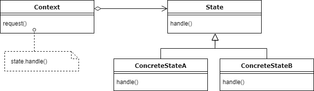

# Java 中的状态设计模式

> 原文：<https://web.archive.org/web/20220930061024/https://www.baeldung.com/java-state-design-pattern>

## **1。概述**

在本教程中，我们将介绍一种行为 GoF 设计模式——状态模式。

首先，我们将概述它的目的，并解释它试图解决的问题。然后，我们将看一下状态的 UML 图和实际例子的实现。

## **2。状态设计模式**

状态模式的主要思想是**允许对象在不改变其类的情况下改变其行为。此外，通过实现它，代码应该保持更干净，没有很多 if/else 语句。**

想象一下，我们有一个包裹被送到邮局，包裹本身可以被订购，然后被送到邮局，最后被客户收到。现在，根据实际状态，我们想打印它的交货状态。

最简单的方法是添加一些布尔标志，并在类的每个方法中应用简单的 if/else 语句。在一个简单的场景中，这不会使它变得很复杂。然而，当我们要处理更多的状态时，这可能会使我们的代码变得复杂和污染，这将导致更多的 if/else 语句。

此外，每种状态的所有逻辑将分布在所有方法中。现在，这就是可以考虑使用状态模式的地方。得益于状态设计模式，我们可以将逻辑封装在专用的类中，应用[单一责任原则](https://web.archive.org/web/20220930225241/https://en.wikipedia.org/wiki/Single_responsibility_principle)和[开/关原则，](https://web.archive.org/web/20220930225241/https://en.wikipedia.org/wiki/Open%E2%80%93closed_principle)拥有更干净、更易维护的代码。

## **3。UML 图**

在 UML 图中，我们看到`Context`类有一个关联的`State` ，它将在程序执行过程中发生变化。

我们的上下文将**将行为委托给状态实现。**换句话说，所有传入的请求都将由状态的具体实现来处理。

我们看到逻辑是分离的，添加新的状态很简单——如果需要，可以添加另一个`State`实现。

## **4。实施**

让我们设计我们的应用程序。正如已经提到的，包可以被订购、交付和接收，因此我们将有三个状态和上下文类。

首先，让我们定义我们的上下文，这将是一个`Package`类:

[PRE0]

正如我们所看到的，它包含了一个管理状态的引用，注意`previousState(), nextState() and ` `printStatus()`方法，在这里我们将任务委托给状态对象。这些状态将相互链接，并且**每个状态将基于传递给两个方法的`this`引用**设置另一个状态。

客户端将与`Package`类交互，但他不必处理设置状态，客户端所要做的就是进入下一个或前一个状态。

接下来，我们将有`PackageState`，它有三个带有以下签名的方法:

[PRE1]

这个接口将由每个具体的状态类来实现。

第一个具体状态将是`OrderedState`:

[PRE2]

这里，我们指出订购包后将出现的下一个状态。有序状态是我们的根状态，我们显式地标记它。我们可以在这两种方法中看到状态之间的转换是如何处理的。

让我们来看看`DeliveredState`类:

[PRE3]

我们再次看到了各州之间的联系。包裹的状态从已订购变为已交付，`printStatus()`中的消息也随之改变。

最后的状态是`ReceivedState`:

[PRE4]

这是我们到达最后一个状态的地方，我们只能回滚到以前的状态。

我们已经看到了一些收益，因为一个州知道另一个州。我们让它们紧密结合。

## **5。测试**

让我们看看实现是如何工作的。首先，让我们验证设置转换是否按预期工作:

[PRE5]

然后，快速检查我们的包是否能以其状态返回:

[PRE6]

之后，让我们验证更改状态，看看`printStatus()`方法的实现如何在运行时更改其实现:

[PRE7]

这将为我们提供以下输出:

[PRE8]

由于我们一直在改变上下文的状态，行为也在改变，但类保持不变。以及我们使用的 API。

此外，状态之间的转换已经发生，我们的类改变了它的状态，从而改变了它的行为。

## **6。不利因素**

状态模式的缺点是实现状态间转换的好处。这使得状态被硬编码，这通常是一种不好的做法。

但是，根据我们的需要和要求，这可能是也可能不是一个问题。

## 7 .**。国家与战略模式**

这两种设计模式非常相似，但是它们的 UML 图是相同的，只是背后的思想略有不同。

首先， **[策略模式](/web/20220930225241/https://www.baeldung.com/java-strategy-pattern)定义了一系列可互换的算法**。通常，它们实现相同的目标，但是实现方式不同，例如，排序或呈现算法。

**在状态模式中，基于实际状态，行为可能完全改变**。

接下来，**在策略中，客户必须意识到可能使用的策略，并明确地改变它们。**而在状态模式中，每个状态都链接到另一个状态，并像在有限状态机中一样创建流。

## **8。结论**

当我们想要**避免原始的 if/else 语句**时，状态设计模式非常有用。相反，我们**提取逻辑来分离类**，并让我们的**上下文对象将行为**委托给 state 类中实现的方法。此外，我们可以利用状态之间的转换，其中一个状态可以改变上下文的状态。

一般来说，这种设计模式对于相对简单的应用程序来说很棒，但是对于更高级的方法，我们可以看看 [Spring 的状态机教程](/web/20220930225241/https://www.baeldung.com/spring-state-machine)。

像往常一样，GitHub 项目的[上有完整的代码。](https://web.archive.org/web/20220930225241/https://github.com/eugenp/tutorials/tree/master/patterns-modules/design-patterns-behavioral)