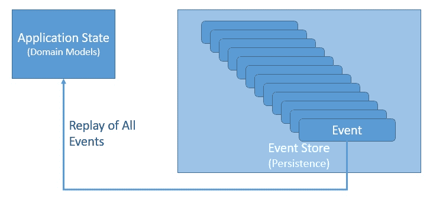
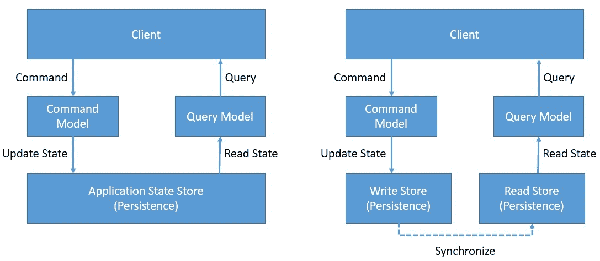
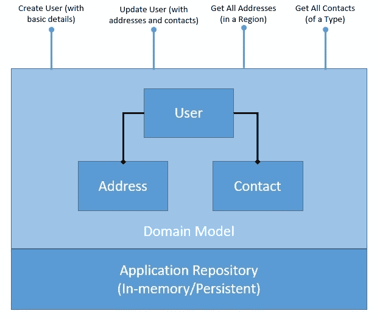
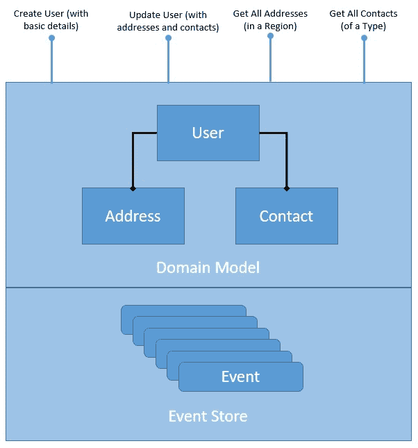
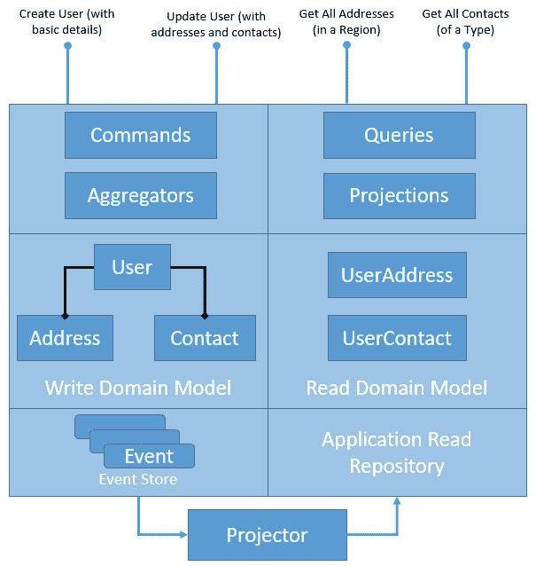

# Java 中的 CQRS 和事件源

> 原文:[https://web . archive . org/web/20220930061024/https://www . bael dung . com/cqrs-event-sourcing-Java](https://web.archive.org/web/20220930061024/https://www.baeldung.com/cqrs-event-sourcing-java)

## 1.介绍

在本教程中，我们将探索命令查询责任分离(CQRS)和事件源设计模式的基本概念。

虽然经常被引用为互补模式，但我们将尝试分别理解它们，并最终了解它们如何互补。有几个工具和框架，比如 [Axon](/web/20220926181430/https://www.baeldung.com/axon-cqrs-event-sourcing) ，可以帮助采用这些模式，但是我们将使用 Java 创建一个简单的应用程序来理解基础知识。

## 2.基本概念

在我们尝试实现它们之前，我们将首先从理论上理解这些模式。此外，由于它们很好地代表了独立的模式，我们将尝试在不混淆它们的情况下理解它们。

请注意，这些模式经常在企业应用程序中一起使用。在这方面，他们还受益于其他几种企业架构模式。我们将继续讨论其中的一些。

### 2.1.活动采购

事件源**为我们提供了一种将应用程序状态作为有序的事件序列**持久化的新方法。我们可以有选择地查询这些事件，并在任何时间点重建应用程序的状态。当然，要做到这一点，我们需要将应用程序状态的每一次更改重新映射为事件:

[](/web/20220926181430/https://www.baeldung.com/wp-content/uploads/2020/05/Event-Sourcing.jpg) [](/web/20220926181430/https://www.baeldung.com/wp-content/uploads/2020/05/Event-Sourcing.jpg)

这里的这些事件**是已经发生的事实，不能被改变**——换句话说，它们必须是不可改变的。重新创建应用程序状态只是重放所有事件的问题。

注意，这也打开了有选择地重放事件的可能性，反向重放一些事件，等等。因此，我们可以将应用程序状态本身视为次要公民，将事件日志作为我们的主要事实来源。

### 2.2.CQRS

简而言之，CQRS 是关于分离应用架构的命令和查询端的。CQRS 是基于 Bertrand Meyer 提出的命令查询分离(CQS)原则。CQS 建议我们将域对象上的操作分成两个不同的类别:查询和命令:

[](/web/20220926181430/https://www.baeldung.com/wp-content/uploads/2020/05/CQRS.jpg)

**查询返回结果，不改变系统的可观测状态**。**命令改变系统的状态，但不一定返回值**。

我们通过清晰地分离域模型的命令端和查询端来实现这一点。当然，我们可以更进一步，通过引入一种机制来保持数据存储的写和读同步，从而将它们分开。

## 3.一个简单的应用

我们将从描述一个构建领域模型的简单 Java 应用程序开始。

应用程序将[在域模型](/web/20220926181430/https://www.baeldung.com/spring-boot-crud-thymeleaf)上提供 CRUD 操作，并且还将为域对象提供持久性。 **CRUD 代表创建、读取、更新和删除，这是我们可以在域对象上执行的基本操作**。

在后面的章节中，我们将使用同一个应用程序来介绍事件源和 CQRS。

在这个过程中，我们将利用来自领域驱动设计(DDD)的一些概念。

**DDD 致力于软件的分析和设计，这些软件依赖于复杂的特定领域知识**。它建立在软件系统需要基于一个良好开发的领域模型的思想之上。DDD 最初是由 Eric Evans 作为模式目录提出的。我们将使用其中的一些模式来构建我们的示例。

### 3.1.应用概述

创建和管理用户配置文件是许多应用程序中的典型需求。我们将定义一个简单的域模型来捕获用户配置文件以及持久性:

[](/web/20220926181430/https://www.baeldung.com/wp-content/uploads/2020/05/CRUD-Application-3.jpg)

正如我们所看到的，我们的域模型是规范化的，并且公开了几个 CRUD 操作。这些操作**只是为了演示，根据需求**可以简单也可以复杂。此外，这里的持久性存储库可以在内存中，也可以使用数据库。

### 3.2.应用程序实现

首先，我们必须创建代表我们的领域模型的 Java 类。这是一个相当简单的领域模型，甚至可能不需要像事件源和 CQRS 这样复杂的设计模式。但是，我们将保持简单，专注于理解基础知识:

```
public class User {
private String userid;
    private String firstName;
    private String lastName;
    private Set<Contact> contacts;
    private Set<Address> addresses;
    // getters and setters
}

public class Contact {
    private String type;
    private String detail;
    // getters and setters
}

public class Address {
    private String city;
    private String state;
    private String postcode;
    // getters and setters
}
```

此外，我们将为应用程序状态的持久性定义一个简单的内存存储库。当然，这不会增加任何价值，但足以满足我们后面的演示:

```
public class UserRepository {
    private Map<String, User> store = new HashMap<>();
}
```

现在，我们将定义一个服务来公开我们的域模型上的典型 CRUD 操作:

```
public class UserService {
    private UserRepository repository;
    public UserService(UserRepository repository) {
        this.repository = repository;
    }

    public void createUser(String userId, String firstName, String lastName) {
        User user = new User(userId, firstName, lastName);
        repository.addUser(userId, user);
    }

    public void updateUser(String userId, Set<Contact> contacts, Set<Address> addresses) {
        User user = repository.getUser(userId);
        user.setContacts(contacts);
        user.setAddresses(addresses);
        repository.addUser(userId, user);
    }

    public Set<Contact> getContactByType(String userId, String contactType) {
        User user = repository.getUser(userId);
        Set<Contact> contacts = user.getContacts();
        return contacts.stream()
          .filter(c -> c.getType().equals(contactType))
          .collect(Collectors.toSet());
    }

    public Set<Address> getAddressByRegion(String userId, String state) {
        User user = repository.getUser(userId);
        Set<Address> addresses = user.getAddresses();
        return addresses.stream()
          .filter(a -> a.getState().equals(state))
          .collect(Collectors.toSet());
    }
}
```

这就是我们设置简单应用程序所要做的事情。这**远不是生产就绪的代码，但是它揭示了一些重要的点**，我们将在本教程的后面详细讨论。

### 3.3.该应用中的问题

在我们进一步讨论活动采购和 CQRS 之前，有必要讨论一下当前解决方案存在的问题。毕竟，我们将通过应用这些模式来解决同样的问题！

在我们可能会注意到的许多问题中，我们只想关注其中的两个:

*   `Domain Model`:读和写操作发生在同一个域模型上。虽然这对于像这样简单的领域模型来说不是问题，但是随着领域模型变得复杂，它可能会恶化。**我们可能需要优化我们的域模型和底层存储，以满足读写操作的个性化需求。**
*   我们对领域对象的持久化只存储领域模型的最新状态。虽然这对于大多数情况来说已经足够了，但是它使得一些任务变得具有挑战性。**例如，如果我们必须对域对象如何改变状态进行历史审计，这在**是不可能的。为此，我们必须用一些审计日志来补充我们的解决方案。

## 4.介绍 CQRS

我们将通过在应用程序中引入 CQRS 模式来解决上一节中讨论的第一个问题。作为其中的一部分，**我们将分离域模型及其持久性来处理写和读操作**。让我们看看 CQRS 模式如何重构我们的应用程序:

[](/web/20220926181430/https://www.baeldung.com/wp-content/uploads/2020/05/CQRS-in-Application-3.jpg)

这里的图表解释了我们打算如何将我们的应用程序架构清晰地分为写端和读端。然而，我们在这里引入了一些新的组件，我们必须更好地理解它们。请注意，这些并不完全与 CQRS 有关，但 CQRS 从中受益匪浅:

*   `Aggregate/Aggregator`:

Aggregate 是域驱动设计(DDD)中描述的一种模式，它通过将实体绑定到一个聚合根来对不同的实体进行逻辑分组。聚合模式提供了实体之间的事务一致性。

CQRS 自然受益于聚合模式，该模式将写域模型分组，提供事务性保证。为了获得更好的性能，聚合通常会保存一个缓存状态，但是没有缓存状态也能很好地工作。

*   `Projection/Projector`:

投影是另一个对 CQRS 大有裨益的重要模式。投影**本质上意味着用不同的形状和结构表示领域对象**。

这些原始数据的投影是只读的，并且经过高度优化，以提供增强的读取体验。我们可能会再次决定缓存投影以获得更好的性能，但这不是必须的。

### 4.1.实现应用程序的写入端

让我们首先实现应用程序的写入端。

我们将从定义所需的命令开始。一个**命令是为了改变域模型**的状态。成功与否取决于我们配置的业务规则。

让我们看看我们的命令:

```
public class CreateUserCommand {
    private String userId;
    private String firstName;
    private String lastName;
}

public class UpdateUserCommand {
    private String userId;
    private Set<Address> addresses;
    private Set<Contact> contacts;
}
```

这些都是非常简单的类，用来保存我们想要改变的数据。

接下来，我们定义一个负责接受和处理命令的集合。聚合可以接受或拒绝命令:

```
public class UserAggregate {
    private UserWriteRepository writeRepository;
    public UserAggregate(UserWriteRepository repository) {
        this.writeRepository = repository;
    }

    public User handleCreateUserCommand(CreateUserCommand command) {
        User user = new User(command.getUserId(), command.getFirstName(), command.getLastName());
        writeRepository.addUser(user.getUserid(), user);
        return user;
    }

    public User handleUpdateUserCommand(UpdateUserCommand command) {
        User user = writeRepository.getUser(command.getUserId());
        user.setAddresses(command.getAddresses());
        user.setContacts(command.getContacts());
        writeRepository.addUser(user.getUserid(), user);
        return user;
    }
}
```

聚合使用一个存储库来检索当前状态并保存对它的任何更改。此外，它可以在本地存储当前状态，以避免在处理每个命令时到存储库的往返成本。

最后，我们需要一个存储库来保存领域模型的状态。这通常是一个数据库或其他持久存储，但这里我们将简单地用内存中的数据结构来替换它们:

```
public class UserWriteRepository {
    private Map<String, User> store = new HashMap<>();
    // accessors and mutators
}
```

这就结束了我们应用程序的编写部分。

### 4.2.实现应用程序的读取端

现在让我们切换到应用程序的读取端。我们将从定义域模型的读取端开始:

```
public class UserAddress {
    private Map<String, Set<Address>> addressByRegion = new HashMap<>();
}

public class UserContact {
    private Map<String, Set<Contact>> contactByType = new HashMap<>();
}
```

如果我们回忆一下我们的读操作，不难看出这些类可以很好地处理它们。这就是创建以查询为中心的领域模型的美妙之处。

接下来，我们将定义读取存储库。同样，我们将只使用内存中的数据结构，尽管在实际应用程序中这将是更持久的数据存储:

```
public class UserReadRepository {
    private Map<String, UserAddress> userAddress = new HashMap<>();
    private Map<String, UserContact> userContact = new HashMap<>();
    // accessors and mutators
}
```

现在，我们将定义需要支持的查询。查询是一种获取数据的意图，它不一定会产生数据。

让我们看看我们的疑问:

```
public class ContactByTypeQuery {
    private String userId;
    private String contactType;
}

public class AddressByRegionQuery {
    private String userId;
    private String state;
}
```

同样，这些是简单的 Java 类，保存定义查询的数据。

我们现在需要的是能够处理这些查询的投影:

```
public class UserProjection {
    private UserReadRepository readRepository;
    public UserProjection(UserReadRepository readRepository) {
        this.readRepository = readRepository;
    }

    public Set<Contact> handle(ContactByTypeQuery query) {
        UserContact userContact = readRepository.getUserContact(query.getUserId());
        return userContact.getContactByType()
          .get(query.getContactType());
    }

    public Set<Address> handle(AddressByRegionQuery query) {
        UserAddress userAddress = readRepository.getUserAddress(query.getUserId());
        return userAddress.getAddressByRegion()
          .get(query.getState());
    }
}
```

这里的投影使用我们之前定义的读取存储库来处理我们的查询。这也基本上结束了我们应用程序的读取端。

### 4.3.同步读取和写入数据

这个难题的一部分仍然没有解决:没有什么东西可以**同步我们的写和读存储库**。

这就是我们需要投影仪的地方。**投影仪具有将写域模型投影到读域模型**的逻辑。

有更复杂的方法来处理这个问题，但是我们将保持它相对简单:

```
public class UserProjector {
    UserReadRepository readRepository = new UserReadRepository();
    public UserProjector(UserReadRepository readRepository) {
        this.readRepository = readRepository;
    }

    public void project(User user) {
        UserContact userContact = Optional.ofNullable(
          readRepository.getUserContact(user.getUserid()))
            .orElse(new UserContact());
        Map<String, Set<Contact>> contactByType = new HashMap<>();
        for (Contact contact : user.getContacts()) {
            Set<Contact> contacts = Optional.ofNullable(
              contactByType.get(contact.getType()))
                .orElse(new HashSet<>());
            contacts.add(contact);
            contactByType.put(contact.getType(), contacts);
        }
        userContact.setContactByType(contactByType);
        readRepository.addUserContact(user.getUserid(), userContact);

        UserAddress userAddress = Optional.ofNullable(
          readRepository.getUserAddress(user.getUserid()))
            .orElse(new UserAddress());
        Map<String, Set<Address>> addressByRegion = new HashMap<>();
        for (Address address : user.getAddresses()) {
            Set<Address> addresses = Optional.ofNullable(
              addressByRegion.get(address.getState()))
                .orElse(new HashSet<>());
            addresses.add(address);
            addressByRegion.put(address.getState(), addresses);
        }
        userAddress.setAddressByRegion(addressByRegion);
        readRepository.addUserAddress(user.getUserid(), userAddress);
    }
}
```

这是一种非常粗糙的方式，但让我们对 CQRS 运转所需的东西有了足够的了解。此外，没有必要将读写存储库放在不同的物理存储中。分布式系统有它自己的问题！

请注意，**不方便将写域的当前状态投射到不同的读域模型**中。我们在这里举的例子相当简单，因此，我们看不到问题。

然而，随着写和读模型变得越来越复杂，预测将变得越来越困难。**我们可以通过基于事件的预测来解决这个问题，而不是使用事件源的基于状态的预测**。我们将在教程的后面看到如何实现这一点。

### 4.4.CQRS 的利与弊

我们讨论了 CQRS 模式，并学习了如何在一个典型的应用程序中引入它。我们已经明确地试图解决与域模型在处理读和写时的刚性相关的问题。

现在让我们讨论一下 CQRS 给应用程序架构带来的其他一些好处:

*   CQRS 为我们提供了一种便捷的方式来选择适合读写操作的独立域模型；我们不需要创建一个复杂的领域模型来支持这两者
*   它帮助我们**选择单独适合**处理读写操作复杂性的存储库，比如高吞吐量的写操作和低延迟的读操作
*   通过提供关注点分离和更简单的领域模型，它自然地补充了分布式架构中基于事件的编程模型

然而，这不是免费的。从这个简单的例子可以明显看出，CQRS 给架构增加了相当大的复杂性。在许多情况下，它可能不适合或不值得这样做:

*   只有**一个复杂的领域模型才能从这个模式增加的复杂性中获益**;一个简单的领域模型不需要所有这些就可以管理
*   自然地**在某种程度上导致代码重复**，与它给我们带来的收益相比，这是一种可以接受的罪恶；但是，建议个人判断
*   独立的存储库**会导致一致性问题**，并且很难保持写和读存储库始终完美同步；我们常常不得不满足于最终的一致性

## 5.活动采购简介

接下来，我们将解决我们在简单应用程序中讨论的第二个问题。如果我们回想一下，这与我们的持久性存储库有关。

我们将引入事件源来解决这个问题。事件源极大地改变了我们对应用状态存储的看法。

让我们看看它如何改变我们的存储库:

[](/web/20220926181430/https://www.baeldung.com/wp-content/uploads/2020/05/ES-in-Application-3.jpg)

在这里，我们已经构建了**我们的存储库来存储域事件**的有序列表。对域对象的每次更改都被视为一个事件。一个事件应该有多粗或多细是一个领域设计的问题。这里要考虑的重要事情是**事件有一个时间顺序，并且是不可变的。**

### 5.1.实现事件和事件存储

事件驱动应用程序中的基本对象是事件，事件源也不例外。正如我们前面所看到的，**事件代表了在特定时间点**域模型状态的特定变化。因此，我们将从定义简单应用程序的基本事件开始:

```
public abstract class Event {
    public final UUID id = UUID.randomUUID();
    public final Date created = new Date();
}
```

这就确保了我们在应用程序中生成的每个事件都有唯一的标识和创建时间戳。这些是进一步处理它们所必需的。

当然，我们可能会对其他几个属性感兴趣，比如确定事件来源的属性。

接下来，让我们创建一些继承自这个基本事件的特定于域的事件:

```
public class UserCreatedEvent extends Event {
    private String userId;
    private String firstName;
    private String lastName;
}

public class UserContactAddedEvent extends Event {
    private String contactType;
    private String contactDetails;
}

public class UserContactRemovedEvent extends Event {
    private String contactType;
    private String contactDetails;
}

public class UserAddressAddedEvent extends Event {
    private String city;
    private String state;
    private String postCode;
}

public class UserAddressRemovedEvent extends Event {
    private String city;
    private String state;
    private String postCode;
}
```

这些是简单的 Java，包含域事件的细节。然而，这里需要注意的重要一点是事件的粒度。

我们本来可以为用户更新创建一个单独的事件，但是我们决定为地址和联系人的添加和删除创建单独的事件。该选择被映射到什么使得使用领域模型更有效。

现在，自然地，我们需要一个存储库来保存我们的领域事件:

```
public class EventStore {
    private Map<String, List<Event>> store = new HashMap<>();
}
```

这是一个简单的内存数据结构，用于保存我们的域事件。实际上，**有几个专门为处理事件数据而创建的解决方案，比如 Apache Druid** 。有许多通用分布式数据存储能够处理事件源，包括[卡夫卡](/web/20220926181430/https://www.baeldung.com/spring-kafka)和[卡珊德拉](/web/20220926181430/https://www.baeldung.com/cassandra-with-java)。

### 5.2.生成和消费事件

所以，现在我们处理所有 CRUD 操作的服务将会改变。现在，它将追加域事件，而不是更新移动的域状态。它还将使用相同的域事件来响应查询。

让我们看看如何实现这一点:

```
public class UserService {
    private EventStore repository;
    public UserService(EventStore repository) {
        this.repository = repository;
    }

    public void createUser(String userId, String firstName, String lastName) {
        repository.addEvent(userId, new UserCreatedEvent(userId, firstName, lastName));
    }

    public void updateUser(String userId, Set<Contact> contacts, Set<Address> addresses) {
        User user = UserUtility.recreateUserState(repository, userId);
        user.getContacts().stream()
          .filter(c -> !contacts.contains(c))
          .forEach(c -> repository.addEvent(
            userId, new UserContactRemovedEvent(c.getType(), c.getDetail())));
        contacts.stream()
          .filter(c -> !user.getContacts().contains(c))
          .forEach(c -> repository.addEvent(
            userId, new UserContactAddedEvent(c.getType(), c.getDetail())));
        user.getAddresses().stream()
          .filter(a -> !addresses.contains(a))
          .forEach(a -> repository.addEvent(
            userId, new UserAddressRemovedEvent(a.getCity(), a.getState(), a.getPostcode())));
        addresses.stream()
          .filter(a -> !user.getAddresses().contains(a))
          .forEach(a -> repository.addEvent(
            userId, new UserAddressAddedEvent(a.getCity(), a.getState(), a.getPostcode())));
    }

    public Set<Contact> getContactByType(String userId, String contactType) {
        User user = UserUtility.recreateUserState(repository, userId);
        return user.getContacts().stream()
          .filter(c -> c.getType().equals(contactType))
          .collect(Collectors.toSet());
    }

    public Set<Address> getAddressByRegion(String userId, String state) throws Exception {
        User user = UserUtility.recreateUserState(repository, userId);
        return user.getAddresses().stream()
          .filter(a -> a.getState().equals(state))
          .collect(Collectors.toSet());
    }
}
```

请注意，我们正在生成几个事件，作为处理更新用户操作的一部分。此外，有趣的是注意到我们如何通过重放到目前为止生成的所有域事件来生成域模型的当前状态。

当然，在实际的应用程序中，这不是一个可行的策略，我们必须维护一个本地缓存以避免每次都生成状态。事件存储库中还有快照和汇总等其他策略可以加快这个过程。

这就结束了我们在简单应用程序中引入事件源的工作。

### 5.3.事件来源的优点和缺点

现在，我们已经成功地采用了另一种使用事件源存储域对象的方法。事件源是一种强大的模式，如果使用得当，它会给应用程序架构带来很多好处:

*   使**写操作更快**，因为不需要读、更新和写；写只是将一个事件附加到日志中
*   **去除了对象关系阻抗**，因此不需要复杂的映射工具；当然，我们仍然需要重新创建这些对象
*   恰巧**提供了一个审计日志作为副产品**，完全可靠；我们可以准确地调试域模型的状态是如何改变的
*   它使得**支持时态查询和实现时间旅行**(过去某一点的域状态)成为可能！
*   这对于在微服务架构中设计松耦合的组件来说是很自然的**,这些组件通过交换消息来进行异步通信**

然而，和往常一样，即使是活动采购也不是万能的。它确实迫使我们采用一种截然不同的方式来存储数据。在以下几种情况下，这可能没有用:

*   相关的**有一个学习曲线，心态的转变需要**采用事件采购；首先，这并不直观
*   这使得处理典型查询变得相当困难，因为我们需要重新创建状态，除非我们将状态保存在本地缓存中
*   尽管它可以应用于任何领域模型，但它更适合事件驱动架构中基于事件的模型

## 6.活动采购的 CQRS

既然我们已经看到了如何将事件源和 CQRS 分别引入到我们的简单应用程序中，那么是时候将它们结合在一起了。现在应该很直观地看到，这些模式可以极大地相互受益。然而，我们将在本节中更清楚地说明这一点。

让我们先看看应用程序架构如何将它们结合在一起:

[](/web/20220926181430/https://www.baeldung.com/wp-content/uploads/2020/05/ES-CQRS-in-Application-3.jpg)

到现在为止，这不应该是什么意外。我们将存储库的写端替换为事件存储，而存储库的读端保持不变。

请注意，这不是在应用程序架构中使用事件源和 CQRS 的唯一方式。我们**可以很有创新性，将这些模式与其他模式**一起使用，并提出几个架构选项。

这里重要的是确保我们使用它们来管理复杂性，而不是简单地进一步增加复杂性！

### 6.1.将 CQRS 和活动采购结合在一起

已经分别实现了事件源和 CQRS，理解我们如何将它们结合在一起并不困难。

我们将**从引入 CQRS 的应用程序开始，只需进行相关的更改**就可以将事件源纳入进来。我们还将利用我们在引入事件源的应用程序中定义的相同事件和事件存储。

只有一些变化。我们首先将聚合改为**生成事件，而不是更新状态**:

```
public class UserAggregate {
    private EventStore writeRepository;
    public UserAggregate(EventStore repository) {
        this.writeRepository = repository;
    }

    public List<Event> handleCreateUserCommand(CreateUserCommand command) {
        UserCreatedEvent event = new UserCreatedEvent(command.getUserId(), 
          command.getFirstName(), command.getLastName());
        writeRepository.addEvent(command.getUserId(), event);
        return Arrays.asList(event);
    }

    public List<Event> handleUpdateUserCommand(UpdateUserCommand command) {
        User user = UserUtility.recreateUserState(writeRepository, command.getUserId());
        List<Event> events = new ArrayList<>();

        List<Contact> contactsToRemove = user.getContacts().stream()
          .filter(c -> !command.getContacts().contains(c))
          .collect(Collectors.toList());
        for (Contact contact : contactsToRemove) {
            UserContactRemovedEvent contactRemovedEvent = new UserContactRemovedEvent(contact.getType(), 
              contact.getDetail());
            events.add(contactRemovedEvent);
            writeRepository.addEvent(command.getUserId(), contactRemovedEvent);
        }
        List<Contact> contactsToAdd = command.getContacts().stream()
          .filter(c -> !user.getContacts().contains(c))
          .collect(Collectors.toList());
        for (Contact contact : contactsToAdd) {
            UserContactAddedEvent contactAddedEvent = new UserContactAddedEvent(contact.getType(), 
              contact.getDetail());
            events.add(contactAddedEvent);
            writeRepository.addEvent(command.getUserId(), contactAddedEvent);
        }

        // similarly process addressesToRemove
        // similarly process addressesToAdd

        return events;
    }
}
```

唯一需要的其他变化是投影仪，它现在需要**处理事件，而不是域对象状态**:

```
public class UserProjector {
    UserReadRepository readRepository = new UserReadRepository();
    public UserProjector(UserReadRepository readRepository) {
        this.readRepository = readRepository;
    }

    public void project(String userId, List<Event> events) {
        for (Event event : events) {
            if (event instanceof UserAddressAddedEvent)
                apply(userId, (UserAddressAddedEvent) event);
            if (event instanceof UserAddressRemovedEvent)
                apply(userId, (UserAddressRemovedEvent) event);
            if (event instanceof UserContactAddedEvent)
                apply(userId, (UserContactAddedEvent) event);
            if (event instanceof UserContactRemovedEvent)
                apply(userId, (UserContactRemovedEvent) event);
        }
    }

    public void apply(String userId, UserAddressAddedEvent event) {
        Address address = new Address(
          event.getCity(), event.getState(), event.getPostCode());
        UserAddress userAddress = Optional.ofNullable(
          readRepository.getUserAddress(userId))
            .orElse(new UserAddress());
        Set<Address> addresses = Optional.ofNullable(userAddress.getAddressByRegion()
          .get(address.getState()))
          .orElse(new HashSet<>());
        addresses.add(address);
        userAddress.getAddressByRegion()
          .put(address.getState(), addresses);
        readRepository.addUserAddress(userId, userAddress);
    }

    public void apply(String userId, UserAddressRemovedEvent event) {
        Address address = new Address(
          event.getCity(), event.getState(), event.getPostCode());
        UserAddress userAddress = readRepository.getUserAddress(userId);
        if (userAddress != null) {
            Set<Address> addresses = userAddress.getAddressByRegion()
              .get(address.getState());
            if (addresses != null)
                addresses.remove(address);
            readRepository.addUserAddress(userId, userAddress);
        }
    }

    public void apply(String userId, UserContactAddedEvent event) {
        // Similarly handle UserContactAddedEvent event
    }

    public void apply(String userId, UserContactRemovedEvent event) {
        // Similarly handle UserContactRemovedEvent event
    }
}
```

如果我们回想一下我们在处理基于状态的投影时讨论的问题，这是一个潜在的解决方案。

基于事件的投影相当方便，也更容易实现。我们所要做的就是处理所有发生的域事件，并将它们应用于所有读取的域模型。通常，在基于事件的应用程序中，投影仪会监听它感兴趣的领域事件，而不依赖于某人直接调用它。

这几乎是我们在简单的应用程序中将事件源和 CQRS 结合在一起所要做的全部工作。

## 7.结论

在本教程中，我们讨论了事件源和 CQRS 设计模式的基础。我们开发了一个简单的应用程序，并将这些模式分别应用于它。

在这个过程中，我们了解了它们带来的好处和存在的缺点。最后，我们理解了为什么以及如何在我们的应用程序中将这两种模式结合在一起。

我们在本教程中讨论的简单应用程序甚至无法证明 CQRS 和事件源的必要性。我们的重点是理解基本概念，因此，这个例子是琐碎的。但是如前所述，这些模式的好处只能在具有相当复杂的领域模型的应用程序中实现。

像往常一样，这篇文章的源代码可以在 GitHub 上找到[。](https://web.archive.org/web/20220926181430/https://github.com/eugenp/tutorials/tree/master/patterns-modules/cqrs-es)