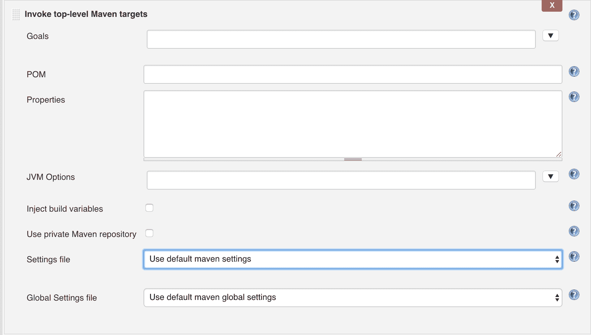
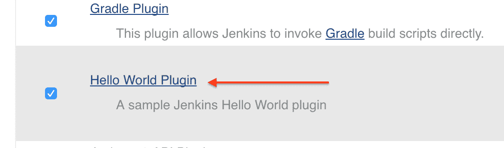
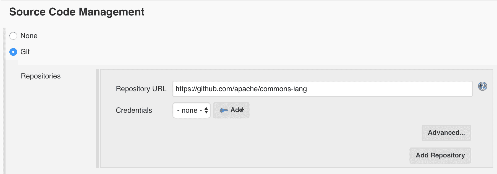
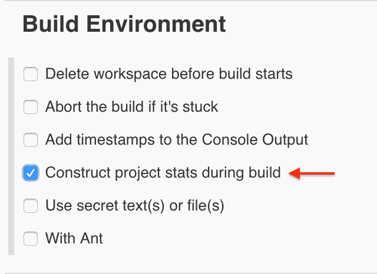
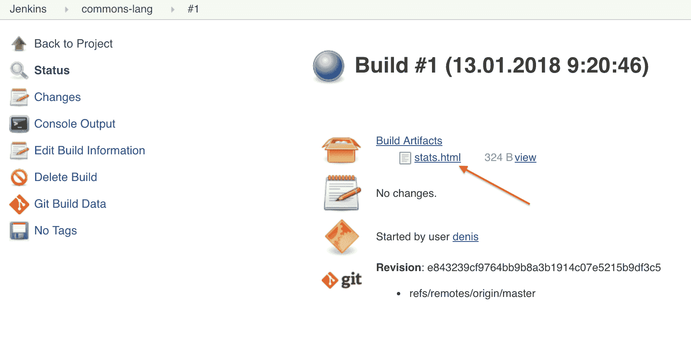
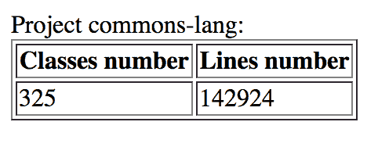

# 编写一个 Jenkins 插件

> 原文:[https://web . archive . org/web/20220930061024/https://www . bael dung . com/Jenkins-custom-plugin](https://web.archive.org/web/20220930061024/https://www.baeldung.com/jenkins-custom-plugin)

## **1。概述**

Jenkins 是一个开源的持续集成服务器，它能够为特定的任务/环境创建自定义插件。

在本文中，我们将介绍创建扩展的整个过程，该扩展向构建输出添加统计数据，即类和代码行数。

## **2。设置**

首先要做的是建立项目。幸运的是，Jenkins 为此提供了方便的 Maven 原型。

只需从 shell 中运行以下命令:

```
mvn archetype:generate -Dfilter=io.jenkins.archetypes:plugin
```

我们将得到以下输出:

```
[INFO] Generating project in Interactive mode
[INFO] No archetype defined. Using maven-archetype-quickstart
  (org.apache.maven.archetypes:maven-archetype-quickstart:1.0)
Choose archetype:
1: remote -> io.jenkins.archetypes:empty-plugin (Skeleton of
  a Jenkins plugin with a POM and an empty source tree.)
2: remote -> io.jenkins.archetypes:global-configuration-plugin
  (Skeleton of a Jenkins plugin with a POM and an example piece
  of global configuration.)
3: remote -> io.jenkins.archetypes:hello-world-plugin
  (Skeleton of a Jenkins plugin with a POM and an example build step.)
```

现在，选择第一个选项，并在交互模式下定义组/工件/包。之后，有必要对`pom.xml`进行改进——因为它包含像`<name>TODO Plugin</name>`这样的条目。

## **3。詹金斯插件设计**

### **3.1。扩展点**

Jenkins 提供了许多扩展点。这些是接口或抽象类，它们为特定用例定义契约，并允许其他插件实现它们。

例如，每个构建都由多个步骤组成，例如`“Checkout from VCS”`、`“Compile”`、`“Test”,`、`“Assemble”,`等。Jenkins 定义了`[hudson.tasks.BuildStep](https://web.archive.org/web/20220627080458/https://javadoc.jenkins.io/hudson/tasks/BuildStep.html)` 扩展点，所以我们可以实现它来提供一个可配置的自定义步骤。

另一个例子是`[hudson.tasks.BuildWrapper](https://web.archive.org/web/20220627080458/https://javadoc.jenkins.io/hudson/tasks/BuildWrapper.html)` –这允许我们定义前/后动作。

我们还有一个非核心的[电子邮件扩展](https://web.archive.org/web/20220627080458/https://plugins.jenkins.io/email-ext)插件，它定义了`hudson.plugins.emailext.plugins.RecipientProvider`扩展点，允许提供电子邮件收件人。这里有一个实现的例子: [`hudson.plugins.emailext.plugins.recipients.UpstreamComitterRecipientProvider`](https://web.archive.org/web/20220627080458/https://github.com/jenkinsci/email-ext-plugin/blob/64641f05edafd8157ed50fb64238aa22d9f342af/src/main/java/hudson/plugins/emailext/plugins/recipients/UpstreamComitterRecipientProvider.java) 。

注意:有一种遗留方法，插件类需要扩展 [`hudson.Plugin`](https://web.archive.org/web/20220627080458/http://javadoc.jenkins-ci.org/hudson/Plugin.html) 。但是，**现在推荐用扩展点代替。**

### **3.2。插件初始化**

有必要告诉 Jenkins 我们的扩展以及应该如何实例化它。

首先，我们在插件中定义一个静态内部类，并使用`hudson.Extension`注释对其进行标记:

```
class MyPlugin extends BuildWrapper {
    @Extension
    public static class DescriptorImpl 
      extends BuildWrapperDescriptor {

        @Override
        public boolean isApplicable(AbstractProject<?, ?> item) {
            return true;
        }

        @Override
        public String getDisplayName() {
            return "name to show in UI";
        }
    }
}
```

**其次，我们需要定义一个用于插件对象实例化的构造函数，并用`org.kohsuke.stapler.DataBoundConstructor`注释标记它。**

它可以使用参数。它们显示在 UI 中，并由 Jenkins 自动交付。

例如，考虑一下 [Maven 插件](https://web.archive.org/web/20220627080458/https://github.com/jenkinsci/jenkins/blob/master/core/src/main/java/hudson/tasks/Maven.java#L177):

```
@DataBoundConstructor
public Maven(
  String targets,
  String name,
  String pom,
  String properties,
  String jvmOptions,
  boolean usePrivateRepository,
  SettingsProvider settings,
  GlobalSettingsProvider globalSettings,
  boolean injectBuildVariables) { ... }
```

它映射到以下用户界面:

[](/web/20220627080458/https://www.baeldung.com/wp-content/uploads/2018/01/maven-settings.png)

也可以在 setters 中使用`org.kohsuke.stapler.DataBoundSetter`注释。

## **4。插件实现**

我们打算在构建期间收集基本的项目统计数据，所以，`hudson.tasks.BuildWrapper`是这里的正确方法。

让我们来实现它:

```
class ProjectStatsBuildWrapper extends BuildWrapper {

    @DataBoundConstructor
    public ProjectStatsBuildWrapper() {}

    @Override
    public Environment setUp(
      AbstractBuild build,
      Launcher launcher,
      BuildListener listener) {}

    @Extension
    public static class DescriptorImpl extends BuildWrapperDescriptor {

        @Override
        public boolean isApplicable(AbstractProject<?, ?> item) {
            return true;
        }

        @Nonnull
        @Override
        public String getDisplayName() {
            return "Construct project stats during build";
        }

    }
}
```

好了，现在我们需要实现实际的功能。

让我们为项目统计定义一个域类:

```
class ProjectStats {

    private int classesNumber;
    private int linesNumber;

    // standard constructors/getters
}
```

并编写构建数据的代码:

```
private ProjectStats buildStats(FilePath root)
  throws IOException, InterruptedException {

    int classesNumber = 0;
    int linesNumber = 0;
    Stack<FilePath> toProcess = new Stack<>();
    toProcess.push(root);
    while (!toProcess.isEmpty()) {
        FilePath path = toProcess.pop();
        if (path.isDirectory()) {
            toProcess.addAll(path.list());
        } else if (path.getName().endsWith(".java")) {
            classesNumber++;
            linesNumber += countLines(path);
        }
    }
    return new ProjectStats(classesNumber, linesNumber);
}
```

最后，我们需要向最终用户显示统计数据。让我们为此创建一个 HTML 模板:

```
<!DOCTYPE html>
<html lang="en">
<head>
    <meta charset="UTF-8">
    <title>$PROJECT_NAME$</title>
</head>
<body>
Project $PROJECT_NAME$:
<table border="1">
    <tr>
        <th>Classes number</th>
        <th>Lines number</th>
    </tr>
    <tr>
        <td>$CLASSES_NUMBER$</td>
        <td>$LINES_NUMBER$</td>
    </tr>
</table>
</body>
</html>
```

并在构建过程中填充它:

```
public class ProjectStatsBuildWrapper extends BuildWrapper {
    @Override
    public Environment setUp(
      AbstractBuild build,
      Launcher launcher,
      BuildListener listener) {
        return new Environment() {

            @Override
            public boolean tearDown(
              AbstractBuild build, BuildListener listener)
              throws IOException, InterruptedException {

                ProjectStats stats = buildStats(build.getWorkspace());
                String report = generateReport(
                  build.getProject().getDisplayName(),
                  stats);
                File artifactsDir = build.getArtifactsDir();
                String path = artifactsDir.getCanonicalPath() + REPORT_TEMPLATE_PATH;
                File reportFile = new File("path");
                // write report's text to the report's file
            }
        };
    }
}
```

## **5。用途**

是时候将我们迄今为止创造的一切结合起来，并看到它的实际效果了。

假设 Jenkins 已经在本地环境中启动并运行。否则请参考[安装细节](/web/20220627080458/https://www.baeldung.com/jenkins-pipelines)。

### **5.1。给詹金斯添加插件**

现在，让我们构建我们的插件:

```
mvn install
```

这将在`target`目录中创建一个`*.hpi`文件。我们需要将它复制到 Jenkins 插件目录中(默认为`~/.jenkins/plugin` ):

```
cp ./target/jenkins-hello-world.hpi ~/.jenkins/plugins/
```

最后，让我们重新启动服务器并确保插件已应用:

1.  在`http://localhost:8080`打开 CI 仪表板
2.  导航到`Manage Jenkins` | `Manage Plugins` | `Installed`
3.  找到我们的插件

[](/web/20220627080458/https://www.baeldung.com/wp-content/uploads/2018/01/plugin-enabled.png)

### 5.2。配置詹金斯作业

让我们为一个开源的 Apache commons-lang 项目创建一个新的作业，并在那里配置其 Git repo 的路径:

[](/web/20220627080458/https://www.baeldung.com/wp-content/uploads/2018/01/common-lang-git.png)

为此，我们还需要启用我们的插件:

[](/web/20220627080458/https://www.baeldung.com/wp-content/uploads/2018/01/enable-for-project.png)

### 5.3。检查结果

我们现在都准备好了，让我们检查一下它是如何工作的。

我们可以构建项目并导航到结果。我们可以看到这里有一个`stats.html`文件:

[](/web/20220627080458/https://www.baeldung.com/wp-content/uploads/2018/01/commons-lang-build-1.png)

让我们打开它:

[](/web/20220627080458/https://www.baeldung.com/wp-content/uploads/2018/01/commons-lang-result.png)

这就是我们所期望的——一个只有三行代码的类。

## **6。结论**

在本教程中，我们从头开始创建了一个`Jenkins`插件，并确保它能够工作。

当然，我们没有涵盖 CI 扩展开发的所有方面，我们只是提供了一个基本的概述、设计思想和初始设置。

和往常一样，源代码可以在 GitHub 上找到[。](https://web.archive.org/web/20220627080458/https://github.com/eugenp/tutorials/tree/master/jenkins/plugins)