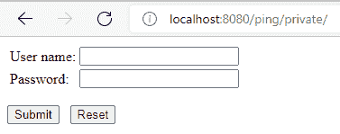
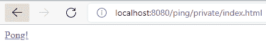
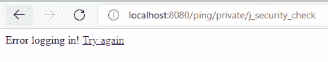
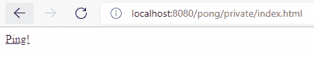

# 使用 Apache Tomcat 的单点登录

> 原文:[https://web . archive . org/web/20220930061024/https://www . bael dung . com/Apache-Tomcat-SSO](https://web.archive.org/web/20220930061024/https://www.baeldung.com/apache-tomcat-sso)

## 1.概观

在本文中，我们将了解 Tomcat 服务器的基础知识，它是如何工作的，以及如何启用 Tomcat 的单点登录( [SSO](https://web.archive.org/web/20220828140554/https://tomcat.apache.org/tomcat-10.0-doc/config/host.html#Single_Sign_On) )功能。我们将探索 Tomcat 服务器和 web 应用程序所需的配置。

## 2.Tomcat 架构

组成 Catalina servlet 容器的主要部分是服务器，它包含定义连接器的服务和由主机构建的引擎，最后，这些主机将包含上下文或 web 应用程序。

连接器侦听客户端的请求并发回响应。在 Tomcat 10 中，我们可以找到以下协议的连接器: [HTTP/1.1](https://web.archive.org/web/20220828140554/https://tomcat.apache.org/tomcat-10.0-doc/config/http.html) 、 [HTTP/2](https://web.archive.org/web/20220828140554/https://tomcat.apache.org/tomcat-10.0-doc/config/http2.html) 和 [AJP](https://web.archive.org/web/20220828140554/https://tomcat.apache.org/tomcat-10.0-doc/config/ajp.html) 。

引擎将处理连接器收到的请求并生成输出。它将包含一个[处理管道](https://web.archive.org/web/20220828140554/https://en.wikipedia.org/wiki/Pipeline_%28software%29)，这是一个流程链，每个请求都将被执行以产生响应。这些过程就是雄猫的[阀门](https://web.archive.org/web/20220828140554/https://tomcat.apache.org/tomcat-10.0-doc/config/valve.html#Introduction)。例如，Tomcat 上的 SSO 被实现为一个阀门。

之后，我们找到将定义虚拟主机的主机，这些主机将网络名称与服务器相关联。这是将定义 SSO 阀的级别，因此主机的所有上下文都将在 SSO 下。

最后，我们将拥有与主机相关联的上下文元素。这些上下文是将在服务器上运行的 web 应用程序。上下文必须遵循 servlet 规范 2.3 或更高版本。

## 3.Tomcat 上的单点登录

Tomcat 在必须在主机级别配置的 valve 中实现单点登录特性。它的工作方式是，SSO valve 将存储用户凭证，并在需要时传递它们，因此用户不需要再次登录。

**SSO 阀需要满足以下要求**:

*   虚拟主机下的所有 web 应用程序必须共享[领域](https://web.archive.org/web/20220828140554/https://tomcat.apache.org/tomcat-10.0-doc/config/realm.html#Introduction)或“用户数据库”。
*   Web apps 认证机制必须是标准认证者之一:[基本](https://web.archive.org/web/20220828140554/https://tomcat.apache.org/tomcat-10.0-doc/config/valve.html#Basic_Authenticator_Valve)、[摘要](https://web.archive.org/web/20220828140554/https://tomcat.apache.org/tomcat-10.0-doc/config/valve.html#Digest_Authenticator_Valve)、[表单](https://web.archive.org/web/20220828140554/https://tomcat.apache.org/tomcat-10.0-doc/config/valve.html#Form_Authenticator_Valve)、 [SSL](https://web.archive.org/web/20220828140554/https://tomcat.apache.org/tomcat-10.0-doc/config/valve.html#SSL_Authenticator_Valve) 或 [SPNEGO](https://web.archive.org/web/20220828140554/https://tomcat.apache.org/tomcat-10.0-doc/config/valve.html#SPNEGO_Valve) 。
*   当客户端请求受保护的资源时，服务器将执行 web 应用程序的身份验证机制。
*   服务器将使用经过身份验证的用户的角色来访问虚拟主机下的 web 应用程序的受保护资源，而无需再次登录。
*   当用户注销某个 web 应用程序时，服务器会使所有 web 应用程序中的用户会话无效。
*   客户端必须接受 cookies。cookies 存储将请求与用户凭证相关联的令牌。

### 3.1.Tomcat 服务器配置

**在服务器端，我们需要配置`SingleSignOn`阀门和领域或“用户数据库”**。这些配置位于 Tomcat 安装的 conf 文件夹下的 server.xml 文件中。要添加 SSO 阀，我们需要取消对以下行的注释:

```
<Valve className="org.apache.catalina.authenticator.SingleSignOn" />
```

对于本文的示例，**我们将依赖默认配置的领域，我们只需要将用户添加到数据库**。领域定义如下所示:

```
<Realm
  className="org.apache.catalina.realm.UserDatabaseRealm"
  resourceName="UserDatabase"/> 
```

此配置使用全局 JNDI 资源来定义用户数据库的源:

```
<Resource name="UserDatabase" auth="Container"
  type="org.apache.catalina.UserDatabase"
  description="User database that can be updated and saved"
  factory="org.apache.catalina.users.MemoryUserDatabaseFactory"
  pathname="conf/tomcat-users.xml" />
```

该资源将实例化一个类型为`org.apache.catalina.UserDatabase`的对象，并使用工厂类`org.apache.catalina.users.MemoryUserDatabaseFactory`从 tomcat-users.xml 文件中填充它。

最后，在这里我们将看到如何添加一个具有本文示例所需的管理员角色的用户。我们需要修改 tomcat-users.xml 文件:

```
<tomcat-users 
  xmlns:xsi="http://www.w3.org/2001/XMLSchema-instance"
  xsi:schemaLocation="http://tomcat.apache.org/xml tomcat-users.xsd"
  version="1.0">
    <role rolename="admin"/>
    <user username="demo" password="demo" roles="admin"/>
</tomcat-users> 
```

### 3.2.Web 应用程序配置

配置好服务器后，让我们通过每个 servlet 的 WEB-INF 文件夹中的 web.xml 配置文件来配置 servlet。

**所有需要 SSO 的 web 应用程序必须拥有受保护的资源，并使用其中一种 Tomcat 认证方法**。**根据 Servlet API 规范 2.3 的定义，web 应用的认证机制是在`web-app`元素**内的 login-config 元素中定义的。该元素将包含一个需要使用以下值之一的 auth-method 表单:BASIC、DIGEST、form 或 CLIENT-CERT。每种身份验证方法都有不同的配置，但是我们将在 [Tomcat Web Apps 配置](#Tomcat-Web-Apps-Configurations)一节中只讨论摘要和表单身份验证方法。

**要完成 web app 配置，我们需要设置保护区**。在 web.xml 文件中的 web-app 元素下，我们可以根据需要添加任意数量的`security-constraint`元素。每个安全约束定义了受保护资源的 URL 模式，并将设置允许的角色。此外，我们需要为所有角色定义安全角色元素，并且它们必须与 tomcat-users.xml 文件中的定义相匹配。我们将在下一节看到一个例子。

## 4.示例认证机制

现在我们知道了如何配置 web 应用程序，让我们看两个例子:Ping 和 Pong。**我们选择了不同的认证机制来展示 SSO 在不同的机制下都能很好地工作**。

### 4.1.Ping 认证机制

在 ping web 应用程序中，我们使用表单身份验证方法。**表单认证方式需要一个登录表单，而登录失败的网页**。例如，当我们希望将登录页面定制为 web 应用程序的外观时，这种方法会很有用，配置如下所示:

```
<login-config>
    <auth-method>FORM</auth-method>
    <form-login-config>
        <form-login-page>/logging.html</form-login-page>
        <form-error-page>/logging_error.html</form-error-page>       
    </form-login-config>
</login-config>
```

**登录页面必须遵循 servlet 规范 2.3** 的登录表单注释中定义的一些严格规则，因为我们既不能选择表单的名称，也不能选择输入字段。他们必须是`j_security_check`、`j_username`和`j_password`。这是为了实现登录表单与所有类型的资源一起工作，并消除在服务器中配置出站表单的操作字段的需要。在这里，我们可以看到一个示例:

```
<!DOCTYPE html>
<html>
<head>
    <title>Ping - Login</title>
</head>
<body>
    <form method="post" action="j_security_check">
        <table >
            <tr>
                <td>User name: </td>
                <td><input type="text" name="j_username" size="20"/></td>
            </tr>
            <tr>
                <td>Password: </td>
                <td><input type="password" name="j_password" size="20"/></td>
            </tr>
        </table>
        <p></p>
        <input type="submit" value="Submit"/>

        <input type="reset" value="Reset"/>
    </form>
</body>
</html>
```

为了理解当服务器接收到来自经过表单身份验证的 web 应用程序的受保护资源的请求时会发生什么，让我们总结一下这个身份验证机制的流程。

首先，客户端请求一个受保护的资源。如果服务器不包含有效的 SSO 会话 id，服务器会将客户端重定向到日志表单。在用户填写完表单并将其凭证发送到服务器后，身份验证机制将启动。

用户身份验证成功后，服务器将检查用户的角色，如果安全约束至少允许其中一个角色，服务器将把客户端重定向到请求的 URL。在另一种情况下，服务器会将客户端重定向到错误页面。

### 4.2.Pong 认证机制

在 Pong web 应用程序中，我们使用摘要认证机制，配置如下所示:

```
<login-config>
    <auth-method>DIGEST</auth-method>
</login-config>
```

**摘要式认证机制流程类似于基本认证:**当客户端请求受保护的资源时，服务器返回一个对话框请求用户凭证。如果认证成功，那么服务器返回请求的资源，但是在另一种情况下，服务器再次发送认证对话框。

虽然摘要认证和基本认证方法相似，但有一个重要的区别:密码保留在服务器中。

### 4.3.Web 应用程序安全约束配置

在这一点上，我们不打算区分乒乓球和乒乓。尽管它们的元素值不同，但配置的重要部分在两个应用程序中都是相同的:

```
<security-constraint>
    <display-name>Ping Login Auth</display-name>
    <web-resource-collection>
        <web-resource-name>PingRestrictedAccess</web-resource-name>
        <url-pattern>/private/*</url-pattern>
    </web-resource-collection>
    <auth-constraint>
        <role-name>admin</role-name>
    </auth-constraint>
    <user-data-constraint>
        <transport-guarantee>NONE</transport-guarantee>
    </user-data-constraint>
</security-constraint>
```

安全约束定义了私有文件夹下的所有内容都是受保护的资源，还定义了需要有管理员角色才能访问资源。

## 5.运行示例

现在我们需要安装一个 [Tomcat 10](https://web.archive.org/web/20220828140554/https://tomcat.apache.org/download-10.cgi) 服务器，按照本文前面所示调整配置，并将 Ping 和 Pong web 应用程序放在 Tomcat 的 web app 文件夹下。

一旦服务器启动并运行，并且两个应用程序都已部署，请求资源 http://localhost:8080/ping/private。服务器将显示登录验证，因为我们没有登录:

[](/web/20220828140554/https://www.baeldung.com/wp-content/uploads/2022/03/ping_app_login_request.png)

然后我们需要引入在 [Tomcat 服务器配置](#Tomcat-Server-Configurations)部分中配置的凭证，并提交表单。如果服务器验证了凭证，那么我们将看到一个网页，其中有一个链接指向 pong 的私有部分:

[](/web/20220828140554/https://www.baeldung.com/wp-content/uploads/2022/03/ping_app_private_page.png)

如果服务器没有验证访问，我们会看到登录错误页面。

[](/web/20220828140554/https://www.baeldung.com/wp-content/uploads/2022/03/ping_app_login_error.png)

成功登录 Ping 应用程序后，我们可以看到 SSO 机制在起作用，单击链接到 pong 的 private 部分。如果会话已经激活，服务器将发送 Pong 的受保护资源，而不需要我们再次登录。

[](/web/20220828140554/https://www.baeldung.com/wp-content/uploads/2022/03/pong_app_private_page.png)

最后，我们可以检查会话到期后，服务器将再次显示登录页面。我们可以等待几分钟，然后单击 ping 的私有部分的链接。

## 6.其他单点登录解决方案

在本文中，我们已经介绍了由 Tomcat 服务器实现的 Web-SSO。如果我们想探索其他 SSO 选项，这里有一些流行的选项:

*   [Spring Security 和 OpenID 连接](/web/20220828140554/https://www.baeldung.com/spring-security-openid-connect)
*   [春安与`KeyCloak`](/web/20220828140554/https://www.baeldung.com/sso-spring-security-oauth2)
*   [带 Spring 安全的 SAML】](/web/20220828140554/https://www.baeldung.com/spring-security-saml)
*   [Apereo 中央认证服务](/web/20220828140554/https://www.baeldung.com/spring-security-cas-sso)

## 7.结论

在本教程中，我们学习了 Tomcat 架构的基础知识。稍后，我们回顾了如何配置服务器。最后，我们回顾了必须包含在 SSO 下的 servlets 或 web 应用程序的配置。

和往常一样，完整的源代码可以在 GitHub 的[上找到。](https://web.archive.org/web/20220828140554/https://github.com/eugenp/tutorials/tree/master/apache-tomcat/sso)