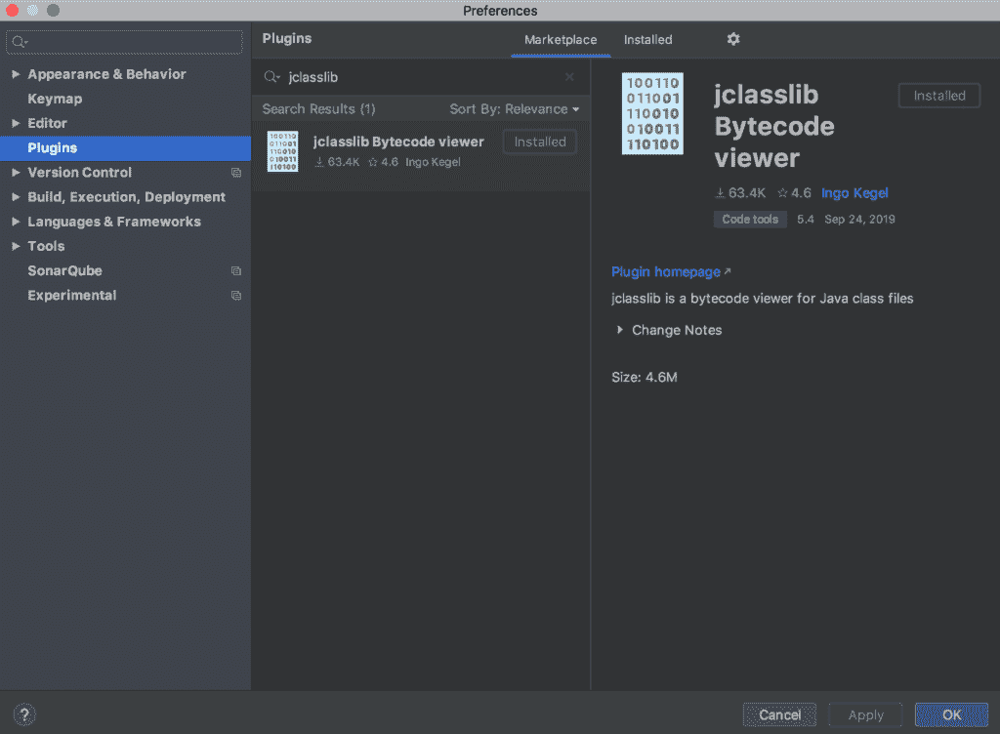
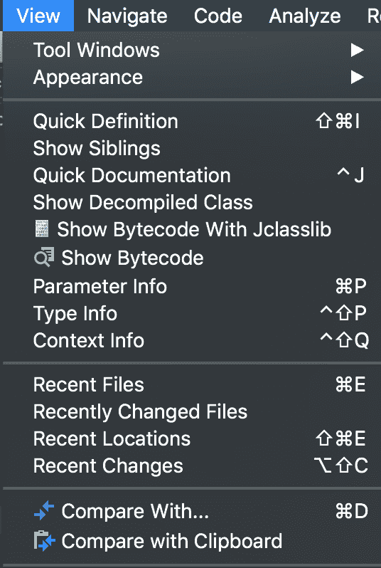
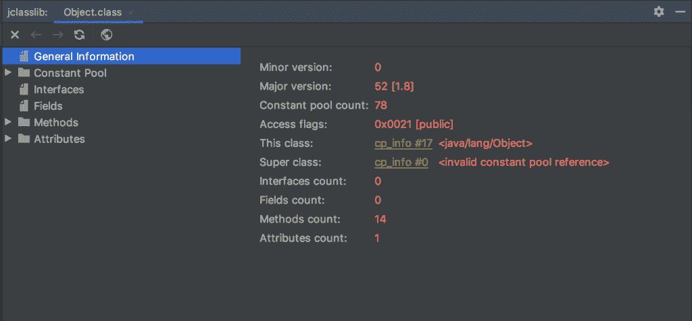
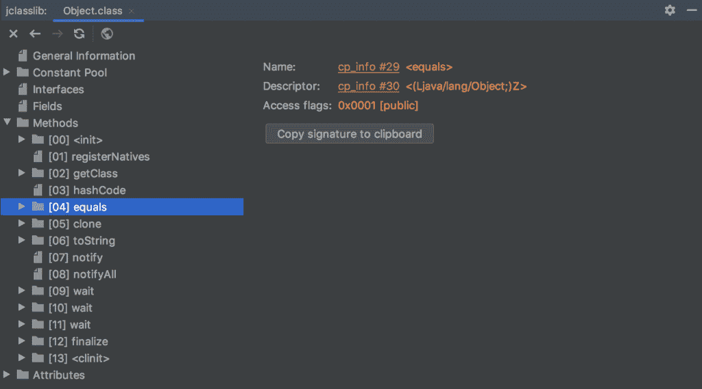

# 用 Java 查看类文件的字节码

> 原文：<https://web.archive.org/web/20220930061024/https://www.baeldung.com/java-class-view-bytecode>

## 1.概观

字节码分析在 Java 开发人员中是一种常见的实践，原因有很多，比如发现代码问题、代码剖析和搜索带有特定注释的类。

在本文中，我们将探索用 Java 查看类文件的字节码的方法。

## 2.字节码是什么？

字节码是 Java 程序的中间表示，允许 JVM 将程序翻译成[机器级汇编指令](/web/20221205181949/https://www.baeldung.com/cs/instructions-programs)。

编译 Java 程序时，字节码以`.class`文件的形式生成。这个`.class`文件包含不可运行的指令，并且依赖于 JVM 来解释。

## 3.使用`javap`

Java 命令行附带了 **`javap`工具，该工具显示关于类文件的字段、构造函数和方法的信息。**

根据所使用的选项，它可以反汇编一个类，并显示组成 Java 字节码的指令。

### 3.1.`javap`

让我们使用`javap`命令来查看最常见的`Object`类的字节码:

[PRE0]

该命令的输出将显示`Object`类的最小构造:

[PRE1]

默认情况下，字节码输出将不包含带有`a private` [访问修饰符](/web/20221205181949/https://www.baeldung.com/java-access-modifiers)的字段/方法。

### 3.2.`javap` `-p`

要查看所有的类和成员，我们可以使用`-p`参数:

[PRE2]

在这里，我们可以观察到一个`private`方法`registerNatives`也出现在`Object`类的字节码中。

### 3.3.`javap` `-v`

类似地，我们可以使用 **`-v`参数来查看详细信息，比如堆栈大小和`Object` 类**的方法参数:

[PRE3]

### 3.4.`javap` `-c`

另外， **`javap`命令允许使用`-c`参数**反汇编整个 Java 类:

[PRE4]

此外，`javap`命令允许我们使用各种参数检查系统信息、常量和内部类型签名。

我们可以通过使用`-help`参数来列出`javap`命令支持的所有参数。

现在我们已经看到了查看类文件的字节码的 Java 命令行解决方案，让我们研究几个字节码操作库。

## 4.使用 ASM

ASM 是一个流行的面向性能的低级 Java 字节码操作和分析框架。

### 4.1.设置

首先，让我们将最新的`[asm](https://web.archive.org/web/20221205181949/https://search.maven.org/search?q=g:org.ow2.asm%20a:asm)`和 [`asm-util`](https://web.archive.org/web/20221205181949/https://search.maven.org/search?q=g:org.ow2.asm%20a:asm-util) Maven 依赖项添加到我们的`pom.xml`中:

[PRE5]

### 4.2.查看字节码

然后，我们将使用 [`ClassReader`](https://web.archive.org/web/20221205181949/https://asm.ow2.io/javadoc/org/objectweb/asm/ClassReader.html) 和 [`TraceClassVisitor`](https://web.archive.org/web/20221205181949/https://asm.ow2.io/javadoc/org/objectweb/asm/util/TraceClassVisitor.html) 来查看`Object`类的字节码:

[PRE6]

这里，我们会注意到 [`TraceClassVisitor`对象需要`PrintWriter`对象](/web/20221205181949/https://www.baeldung.com/java-asm#1-using-the-traceclassvisitor)来提取和产生字节码:

[PRE7]

## 5.使用 BCEL

字节码工程库，俗称 [Apache Commons BCEL](https://web.archive.org/web/20221205181949/https://commons.apache.org/proper/commons-bcel/) ，提供了一种创建/操作 Java 类文件的便捷方式。

### 5.1.Maven 依赖性

像往常一样，让我们将最新的 [`bcel`](https://web.archive.org/web/20221205181949/https://search.maven.org/search?q=g:org.apache.bcel%20%20a:bcel) Maven 依赖添加到我们的`pom.xml`:

[PRE8]

### 5.2.反汇编类并查看字节码

然后，我们可以使用 [`Repository`](https://web.archive.org/web/20221205181949/https://commons.apache.org/proper/commons-bcel/apidocs/org/apache/bcel/Repository.html) 类来生成 [`JavaClass`](https://web.archive.org/web/20221205181949/https://commons.apache.org/proper/commons-bcel/apidocs/org/apache/bcel/classfile/JavaClass.html) 对象:

[PRE9]

这里，我们在`objectClazz`对象上使用了`toString` 方法，以简洁的格式查看字节码:

[PRE10]

此外， **`JavaClass`类提供了类似于`getConstantPool`、`getFields`和`getMethods` 的方法来查看被分解的类**的细节。

[PRE11]

类似地，`set*`方法也可用于字节码操作。

## 6.使用 Javassist

同样，我们可以使用提供高级 API 的 [`Javassist`](/web/20221205181949/https://www.baeldung.com/javassist) ( `Java Programming Assistant) `库来查看/操作 Java 字节码。

### 6.1.Maven 依赖性

首先，我们将最新的`[javassist](https://web.archive.org/web/20221205181949/https://search.maven.org/search?q=g:org.javassist%20a:javassist)` Maven 依赖项添加到我们的`pom.xml`中:

[PRE12]

### 6.2.生成`ClassFile`

然后，我们可以使用 [`ClassPool`](https://web.archive.org/web/20221205181949/http://www.javassist.org/html/javassist/ClassPool.html) 和 [`ClassFile`](https://web.archive.org/web/20221205181949/https://www.javassist.org/html/javassist/bytecode/ClassFile.html) 类[来生成一个 Java 类](/web/20221205181949/https://www.baeldung.com/javassist#generating-a-java-class):

[PRE13]

这里，我们使用了`write`方法，它允许我们使用`DataOutputStream`对象编写类文件:

[PRE14]

另外，`ClassFile`类的对象提供了对常量池、字段和方法的访问:

[PRE15]

## 7.Jclasslib

此外，我们可以使用基于 IDE 的插件来查看类文件的字节码。例如，让我们探索一下 IntelliJ IDEA 可用的`jclasslib Bytecode viewer`插件。

### 7.1.装置

首先，我们将使用设置/首选项对话框安装插件:

### 7.2.查看`Object`类的字节码

然后，我们可以选择 View 菜单下的“Show Bytecode With Jclasslib”选项来查看所选`Object`类的字节码:

接下来，将打开一个对话框，显示`Object` 类的字节码:

### 7.3.查看详细信息

此外，我们可以使用 Jclasslib 插件对话框查看字节码的各种细节，如常量池、字段和方法:

类似地，我们有`Bytecode Visualizer Plugin`来使用 Eclipse IDE 查看类文件的字节码。

## 8.结论

在本教程中，我们探索了用 Java 查看类文件的字节码的方法。

首先，我们研究了`javap`命令及其各种参数。然后，我们浏览了一些字节码操作库，它们提供了查看和操作字节码的特性。

最后，我们研究了一个基于 IDE 的插件`Jclasslib`，它允许我们在 IntelliJ IDEA 中查看字节码。

像往常一样，所有的代码实现都可以在 GitHub 上获得[。](https://web.archive.org/web/20221205181949/https://github.com/eugenp/tutorials/tree/master/core-java-modules/core-java-jvm)