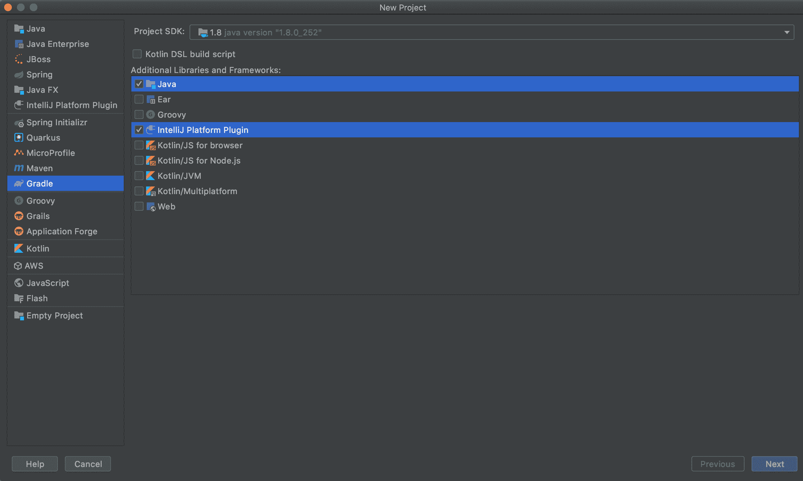
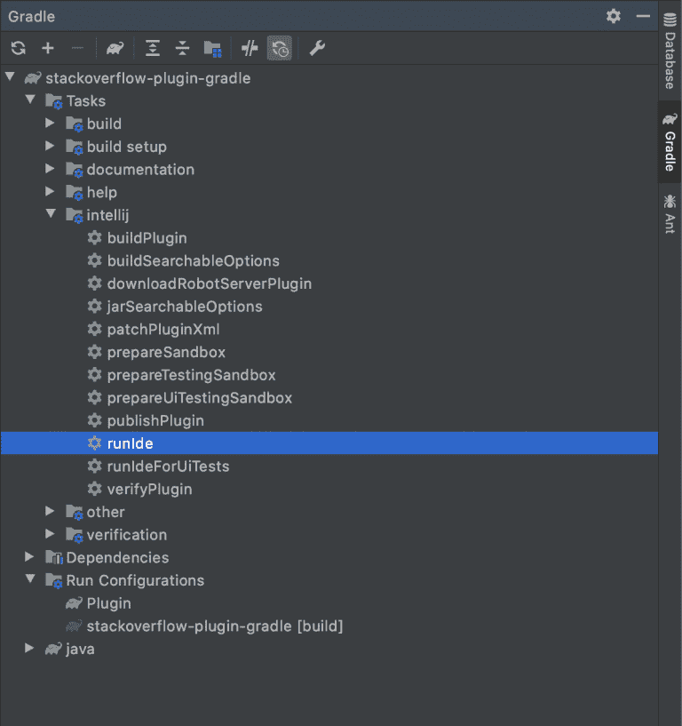
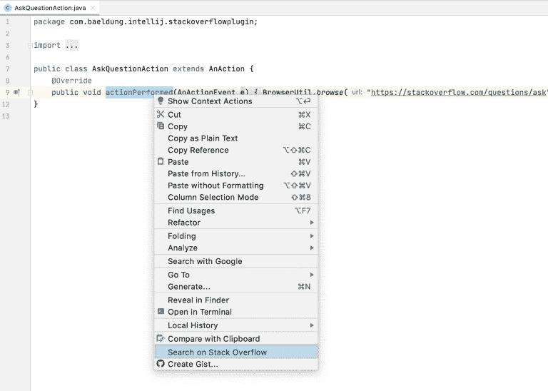

# 使用 Gradle 编写 IntelliJ IDEA 插件

> 原文:[https://web . archive . org/web/20220930061024/https://www . bael dung . com/intellij-idea-plugins-gradle](https://web.archive.org/web/20220930061024/https://www.baeldung.com/intellij-idea-plugins-gradle)

## 1.介绍

在过去的几年里，JetBrains 的 IntelliJ 已经迅速成为 Java 开发人员的顶级 IDE。在我们最近的[Java State of Java 报告](/web/20221226134629/https://www.baeldung.com/java-in-2019)中，IntelliJ 是 61%受访者的首选 IDE，高于去年的 55%。

IntelliJ 吸引 Java 开发人员的一个特性是使用插件扩展和创建新功能的能力。

在本教程中，我们将看看使用 Gradle 的新推荐方式编写 IntelliJ 插件，以演示我们可以扩展 IDE 的几种方式。这篇文章是前一篇文章的重新组合，前一篇文章描述了使用插件 Devkit 创建相同的插件。

## 2.插件的主要类型

最常见的插件类型包括以下功能:

*   用不同语言编写、解释和编译代码的能力
*   对 Spring 等第三方框架的支持
*   `Tool integration:`与 Gradle 等外部工具集成
*   新的菜单项、工具窗口、进度条等等

**插件通常会分为多个类别**。例如，IntelliJ 附带的 [Git 插件](https://web.archive.org/web/20221226134629/https://www.jetbrains.com/help/idea/using-git-integration.html)与系统上安装的`git`可执行文件交互。该插件提供了它的工具窗口和弹出式菜单项，同时还集成到项目创建工作流程，首选项窗口，等等。

## 3.创建插件

创建插件有两种受支持的方式。我们将使用推荐的方式为新项目提供 [Gradle](https://web.archive.org/web/20221226134629/https://www.jetbrains.org/intellij/sdk/docs/basics/getting_started.html#using-gradle) ，而不是使用他们的[插件 Devkit](https://web.archive.org/web/20221226134629/https://www.jetbrains.org/intellij/sdk/docs/basics/getting_started.html#using-devkit) 。

使用`New > Project`菜单创建一个基于 Gradle 的插件。

[](/web/20221226134629/https://www.baeldung.com/wp-content/uploads/2020/06/Bildschirmfoto-2020-05-23-um-10.24.04-1.png)

**注意，我们必须包含 Java 和 IntelliJ 平台插件**，以确保所需的插件类在类路径中可用。

截至本文撰写之时，**我们只能使用 JDK 8 来编写 IntelliJ 插件**。

## 4.示例插件

我们将创建一个插件，提供从 IDE 的多个区域快速访问流行的堆栈溢出网站。它将包括:

*   用于访问“提出问题”页面的工具菜单项
*   文本编辑器和控制台输出中的弹出菜单项，用于在堆栈溢出中搜索突出显示的文本

### 4.1.创建操作

**动作是访问插件**最常见的方式。动作由 IDE 中的事件触发，例如单击菜单项或工具栏按钮。

创建动作的第一步是创建一个扩展`AnAction`的 Java 类。对于堆栈溢出插件，我们将创建两个动作。

第一个操作在新的浏览器窗口中打开“提出问题”页面:

```
public class AskQuestionAction extends AnAction {
    @Override
    public void actionPerformed(AnActionEvent e) {
        BrowserUtil.browse("https://stackoverflow.com/questions/ask");
    }
}
```

我们使用内置的`BrowserUtil`类来处理在不同操作系统和浏览器上打开网页的所有细微差别。

我们需要两个参数来对 StackOverflow 执行搜索:语言标签和要搜索的文本。

为了获得语言标签，我们将使用[程序结构接口](https://web.archive.org/web/20221226134629/http://www.jetbrains.org/intellij/sdk/docs/basics/architectural_overview/psi.html) (PSI)。**这个 API 解析一个项目中的所有文件，并提供一个检查它们的编程方式。**

在这种情况下，我们使用 PSI 来确定文件的编程语言:

```
Optional<PsiFile> psiFile = Optional.ofNullable(e.getData(LangDataKeys.PSI_FILE));
String languageTag = psiFile.map(PsiFile::getLanguage)
  .map(Language::getDisplayName)
  .map(String::toLowerCase)
  .map(lang -> "[" + lang + "]")
  .orElse("");
```

为了获取要搜索的文本，我们将使用`Editor` API 来检索屏幕上高亮显示的文本:

```
Editor editor = e.getRequiredData(CommonDataKeys.EDITOR);
CaretModel caretModel = editor.getCaretModel();
String selectedText = caretModel.getCurrentCaret().getSelectedText();
```

尽管此操作对于编辑器和控制台窗口是相同的，但访问所选文本的方式是相同的。

现在，我们可以将所有这些放在一个`actionPerformed`声明中:

```
@Override
public void actionPerformed(@NotNull AnActionEvent e) {
    Optional<PsiFile> psiFile = Optional.ofNullable(e.getData(LangDataKeys.PSI_FILE));
    String languageTag = psiFile.map(PsiFile::getLanguage)
      .map(Language::getDisplayName)
      .map(String::toLowerCase)
      .map(lang -> "[" + lang + "]")
      .orElse("");

    Editor editor = e.getRequiredData(CommonDataKeys.EDITOR);
    CaretModel caretModel = editor.getCaretModel();
    String selectedText = caretModel.getCurrentCaret().getSelectedText();

    BrowserUtil.browse("https://stackoverflow.com/search?q=" + languageTag + selectedText);
}
```

这个动作还覆盖了另一个名为`update`的方法，它允许我们在不同的条件下启用或禁用这个动作。在这种情况下，如果没有选定的文本，我们将禁用搜索操作:

```
Editor editor = e.getRequiredData(CommonDataKeys.EDITOR);
CaretModel caretModel = editor.getCaretModel();
e.getPresentation().setEnabledAndVisible(caretModel.getCurrentCaret().hasSelection());
```

### 4.2.注册操作

一旦我们写好了动作，**我们需要在 IDE** 中注册它们。有两种方法可以做到这一点。

第一种方法是使用`plugin.xml`文件，它是在我们开始一个新项目时为我们创建的。

默认情况下，该文件将有一个空的`<actions>`元素，我们将在这里添加我们的操作:

```
<actions>
    <action
      id="StackOverflow.AskQuestion.ToolsMenu"
      class="com.baeldung.intellij.stackoverflowplugin.AskQuestionAction"
      text="Ask Question on Stack Overflow"
      description="Ask a Question on Stack Overflow">
        <add-to-group group-id="ToolsMenu" anchor="last"/>
    </action>
    <action
      id="StackOverflow.Search.Editor"
      class="com.baeldung.intellij.stackoverflowplugin.SearchAction"
      text="Search on Stack Overflow"
      description="Search on Stack Overflow">
        <add-to-group group-id="EditorPopupMenu" anchor="last"/>
    </action>
    <action
      id="StackOverflow.Search.Console"
      class="com.baeldung.intellij.stackoverflowplugin.SearchAction"
      text="Search on Stack Overflow"
      description="Search on Stack Overflow">
        <add-to-group group-id="ConsoleEditorPopupMenu" anchor="last"/>
    </action>
</actions>
```

使用 XML 文件注册操作将确保它们在 IDE 启动时注册，这通常是更可取的做法。

注册动作的第二种方式是以编程方式使用`ActionManager`类:

```
ActionManager.getInstance().registerAction("StackOverflow.SearchAction", new SearchAction());
```

这有利于我们动态注册动作。例如，如果我们编写一个插件来集成一个远程 API，我们可能希望根据我们调用的 API 版本注册一组不同的操作。

这种方法的缺点是动作不会在启动时注册。我们必须创建一个`ApplicationComponent`实例来管理动作，这需要更多的编码和 XML 配置。

## 5.测试插件

与任何程序一样，编写 IntelliJ 插件需要测试。对于一个像我们写的这样的小插件，它足以确保插件编译，并且当我们点击它们时，我们创建的动作按预期工作。

我们可以通过打开 Gradle 工具窗口并执行`runIde`任务来手动测试(和调试)我们的插件:

[](/web/20221226134629/https://www.baeldung.com/wp-content/uploads/2020/06/Bildschirmfoto-2020-05-25-um-16.21.15-768x817-1.png)

这将启动一个新的 IntelliJ 实例，并激活我们的插件。这样做允许我们单击我们创建的不同菜单项，并确保打开正确的堆栈溢出页面。

如果我们希望进行更传统的单元测试，IntelliJ 提供了一个[无头环境](https://web.archive.org/web/20221226134629/http://www.jetbrains.org/intellij/sdk/docs/basics/testing_plugins.html)来运行单元测试。我们可以使用任何我们想要的测试框架来编写测试，并且测试使用来自 IDE 的真实的、未被支持的组件来运行。

## 6.部署插件

Gradle 插件提供了一个简单的方法来打包插件，这样我们就可以安装和分发它们。只需打开 Gradle 工具窗口并执行`buildPlugin`任务。这将在`build/distributions`目录中生成一个 ZIP 文件。

生成的 ZIP 文件包含加载到 IntelliJ 所需的代码和配置文件。我们可以在本地安装它，或者将其发布到一个[插件库](https://web.archive.org/web/20221226134629/http://www.jetbrains.org/intellij/sdk/docs/plugin_repository/index.html)供其他人使用。

下面的屏幕截图显示了一个正在运行的新堆栈溢出菜单项:

[](/web/20221226134629/https://www.baeldung.com/wp-content/uploads/2020/06/Bildschirmfoto-2020-05-25-um-16.46.30-768x548-1.png)

## 7.结论

在本文中，我们开发了一个简单的插件，强调了如何增强 IntelliJ IDE。

虽然我们主要使用动作，但 IntelliJ 插件 SDK 提供了几种向 IDE 添加新功能的方法。如需进一步阅读，请查看他们的官方入门指南。

和往常一样，我们的示例插件的完整代码可以在 GitHub 上找到[。](https://web.archive.org/web/20221226134629/https://github.com/eugenp/tutorials/tree/master/intelliJ-modules)