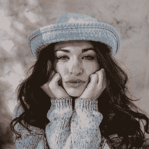
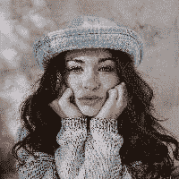
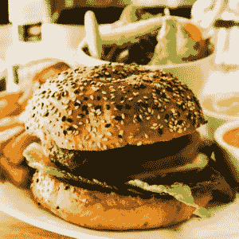
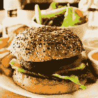
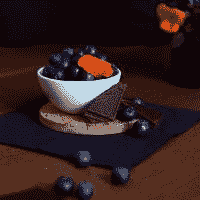
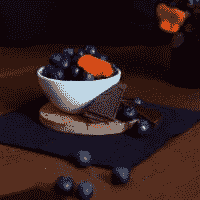
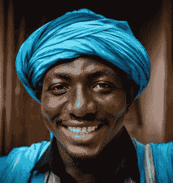
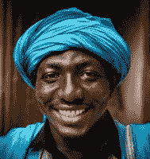
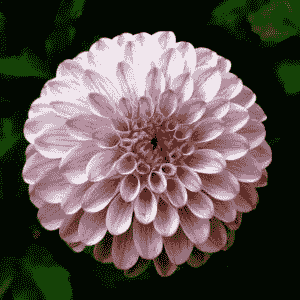
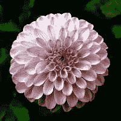

# 如何使用 Java 来调整图像的大小？

> 原文：<https://web.archive.org/web/20220930061024/https://www.baeldung.com/java-resize-image>

## 1.介绍

在本教程中，我们将学习如何使用 Java 调整(缩放)图像。我们将探索提供图像调整特性的核心 Java 和开源第三方库。

值得一提的是，我们可以放大和缩小图像。在本教程的代码示例中，我们将把图像调整到较小的尺寸，因为在实践中，这是最常见的情况。

## 2.使用核心 Java 调整图像大小

核心 Java 提供了以下调整图像大小的选项:

*   使用 [`java.awt.Graphics2D`](https://web.archive.org/web/20221207110757/https://docs.oracle.com/en/java/javase/11/docs/api/java.desktop/java/awt/Graphics2D.html) 调整大小
*   使用 [`Image#getScaledInstance`](https://web.archive.org/web/20221207110757/https://docs.oracle.com/en/java/javase/11/docs/api/java.desktop/java/awt/Image.html) 调整大小

### 2.1.`java.awt.Graphics2D`

`Graphics2D`是在 Java 平台上呈现二维形状、文本和图像的基本类。

让我们从使用`Graphics2D`调整图像大小开始:

[PRE0]

让我们看看调整大小前后的图像:

   

`BufferedImage.TYPE_INT_RGB`参数表示图像的颜色模型。可用值的完整列表可在[官方 Java `BufferedImage`文档](https://web.archive.org/web/20221207110757/https://docs.oracle.com/en/java/javase/11/docs/api/java.desktop/java/awt/image/BufferedImage.html)中找到。

`Graphics2D`接受名为`RenderingHints`的附加参数。**我们使用`RenderingHints`来影响不同的图像处理方面，最重要的是图像质量和处理时间。**

我们可以使用`setRenderingHint`方法添加一个`RenderingHint`:

[PRE1]

完整的`RenderingHints`列表可以在[这本甲骨文教程](https://web.archive.org/web/20221207110757/https://docs.oracle.com/javase/tutorial/2d/advanced/quality.html)中找到。

### 2.2.`Image.getScaledInstance()`

这种使用`Image` 的方法非常简单，它能产生令人满意的图像质量:

[PRE2]

让我们看看一些美味的图片会发生什么:

   

我们还可以通过为`getScaledInstance()`方法提供一个标志来指示缩放机制使用可用的方法之一，该标志指示用于图像重采样需求的算法类型:

[PRE3]

所有可用的标志都在[官方 Java 图像文档](https://web.archive.org/web/20221207110757/https://docs.oracle.com/en/java/javase/11/docs/api/java.desktop/java/awt/Image.html)中有描述。

## 3.Imgscalr

[Imgscalr](https://web.archive.org/web/20221207110757/https://github.com/rkalla/imgscalr) 在后台使用`Graphic2D`。它有一个简单的 API，有几种不同的方法来调整图像大小。

根据我们选择的缩放选项，Imgscalr 为我们提供了最好看的结果、最快的结果或平衡的结果。还提供其他图像处理功能，如裁剪和旋转功能。让我们用一个简单的例子来展示它是如何工作的。

我们将添加以下 Maven 依赖项:

[PRE4]

查看 [Maven Central](https://web.archive.org/web/20221207110757/https://search.maven.org/search?q=g:org.imgscalr) 获取最新版本。

使用 Imgscalr 最简单的方法是:

[PRE5]

其中`originalImage`是要调整大小的`BufferedImage`，而`targetWidth`是结果图像的宽度。这种方法将保持原始图像的比例，并使用默认参数——`Method.AUTOMATIC`和`Mode.AUTOMATIC`。

配上一张美味水果的图片怎么样？让我们看看:

   

该库还允许多种配置选项，并在后台处理图像透明度。

最重要的参数是:

*   `mode`–用于定义算法将使用的调整大小模式。例如，我们可以定义我们是否想要保持图像的比例(选项是`AUTOMATIC, FIT_EXACT, FIT_TO_HEIGHT, and FIT_TO_WIDTH`)
*   `method`–指示调整大小的过程，以便关注速度和/或质量。可能的值有`AUTOMATIC, BALANCED, QUALITY, SPEED, ULTRA_QUALITY`

还可以定义额外的 resize 属性，为我们提供日志记录或指导库对图像进行一些颜色修改(使其更亮、更暗、灰度等等)。

让我们使用完整的 `resize()`方法参数化:

[PRE6]

现在我们得到了:

   

Imgscalr 可以处理 Java Image IO 支持的所有文件——JPG、BMP、JPEG、WBMP、PNG 和 GIF。

## 4.拇指定位器

[Thumbnailator](https://web.archive.org/web/20221207110757/https://github.com/coobird/thumbnailator) 是一个用于 Java 的开源图像缩放库，它使用了渐进式双线性缩放。它支持 JPG，BMP，JPEG，WBMP，PNG 和 GIF。

我们将通过向我们的 `pom.xml`添加以下 Maven 依赖项来将它包含在我们的项目中:

[PRE7]

可用的依赖版本可以在 [Maven Central](https://web.archive.org/web/20221207110757/https://search.maven.org/search?q=a:thumbnailator) 上找到。

它有一个非常简单的 API，允许我们以百分比设置输出质量:

[PRE8]

让我们看看这张微笑的照片在调整大小前后的样子:

   

它还有一个批处理选项:

[PRE9]

作为 Imgscalr，Thumblinator 可以处理 Java Image IO 支持的所有文件——JPG、BMP、JPEG、WBMP、PNG 和 GIF。

## 5.马文

Marvin 是一款方便的图像处理工具，它提供了许多有用的基本(裁剪、旋转、倾斜、翻转、缩放)和高级(模糊、浮雕、纹理)功能。

和以前一样，我们将添加 Marvin 调整大小所需的 Maven 依赖项:

[PRE10]

可用的马文依赖版本可以在 [Maven Central](https://web.archive.org/web/20221207110757/https://search.maven.org/search?q=a:marvin) 上找到，还有[马文插件](https://web.archive.org/web/20221207110757/https://search.maven.org/search?q=a:MarvinPlugins)版本。

Marvin 的缺点是它没有提供额外的扩展配置。此外，缩放方法需要一个图像和图像克隆，这有点麻烦:

[PRE11]

现在让我们调整一朵花的图像的大小，看看效果如何:

   

## 6.最佳实践

**就资源而言，图像处理是一项昂贵的操作，**因此，当我们并不真正需要时，选择最高质量并不一定是最佳选择。

让我们看看所有方法的性能。我们拍摄了一张`1920×1920 px`图像，并将其缩放至`200×200 px.` ，得到的观察时间如下:

*   `java.awt.Graphics2D`–34 毫秒
*   `Image.getScaledInstance()`–235 毫秒
*   img scale–143 毫秒
*   拇指甲-547 毫秒
*   马文–361 毫秒

另外，在定义目标图像的宽度和高度时，**我们应该注意图像的长宽比。**这样图像将保持其原始比例，不会被拉伸。

## 7.结论

本文展示了几种在 Java 中调整图像大小的方法。我们还了解了有多少不同的因素会影响调整大小的过程。

GitHub 上的[提供了完整的代码示例。](https://web.archive.org/web/20221207110757/https://github.com/eugenp/tutorials/tree/master/image-processing)